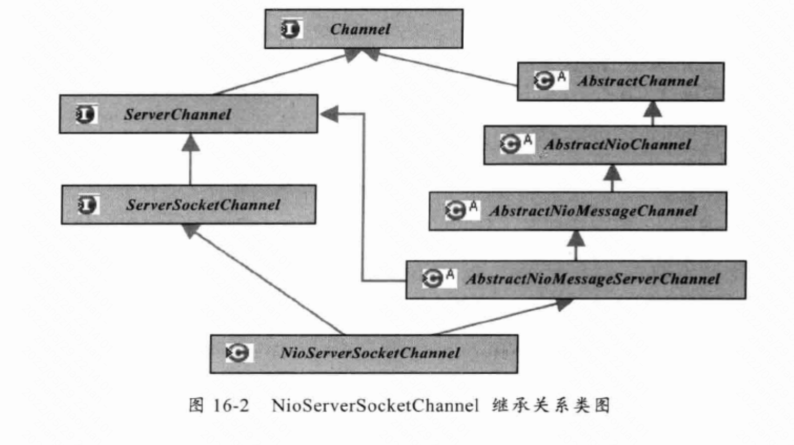
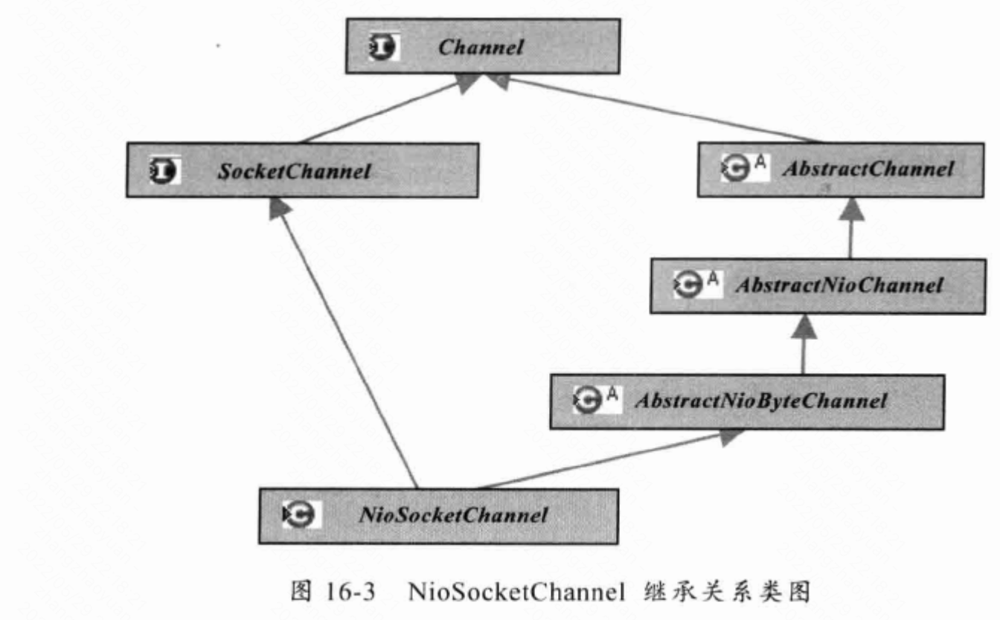

<!-- TOC -->

- [0 NIO 和 为什么Netty？](#0-nio-和-为什么netty)
    - [0.1 为什么Netty?](#01-为什么netty)
- [2 Netty 启动过程梳理](#2-netty-启动过程梳理)
- [2 Netty 接受请求过程梳理](#2-netty-接受请求过程梳理)
- [2 Pipeline Handler HandlerContext 创建过程梳理](#2-pipeline-handler-handlercontext-创建过程梳理)
- [3 hanler自己的线程池](#3-hanler自己的线程池)
- [4 JDK 空轮训bug](#4-jdk-空轮训bug)
- [5 总结](#5-总结)
- [6 pipeline的 事件传播](#6-pipeline的-事件传播)
    - [6.1 inBound](#61-inbound)
    - [6.2 outBound](#62-outbound)
    - [6.3 异常事件](#63-异常事件)
- [7 unsafe](#7-unsafe)
- [8 ByteBuf](#8-bytebuf)
    - [8.1 优点](#81-优点)
    - [8.2 通过复合缓冲区实现了零拷贝](#82-通过复合缓冲区实现了零拷贝)
    - [8.3 零拷贝总结](#83-零拷贝总结)
    - [8.4 引用计数](#84-引用计数)
- [9 Channel](#9-channel)
- [10 ChannelHandler](#10-channelhandler)
- [11 EventLoop](#11-eventloop)
    - [11.1 职责](#111-职责)
    - [11.2 实现细节](#112-实现细节)
- [12 Netty 架构总结](#12-netty-架构总结)
    - [12.1 Reactor 通信调度层](#121-reactor-通信调度层)
    - [12.2 职责链 ChannelPipeline](#122-职责链-channelpipeline)
    - [12.3 业务逻辑层编排 ChannelHandler](#123-业务逻辑层编排-channelhandler)
    - [13 FastThreadLocal](#13-fastthreadlocal)
    - [13.1 实现](#131-实现)
    - [13.2 优势](#132-优势)
- [14 无锁队列](#14-无锁队列)
    - [14.1 解决伪共享问题](#141-解决伪共享问题)
    - [14.2 lazySet](#142-lazyset)
    - [14.2 lazySet](#142-lazyset)
- [15 设计模式](#15-设计模式)

<!-- /TOC -->

---
[Netty](https://dongzl.github.io/netty-handbook)

---
[Netty源码阅读笔记](https://solthx.github.io/categories/Netty/)

---
[若地](https://learn.lianglianglee.com/%E4%B8%93%E6%A0%8F/Netty%20%E6%A0%B8%E5%BF%83%E5%8E%9F%E7%90%86%E5%89%96%E6%9E%90%E4%B8%8E%20RPC%20%E5%AE%9E%E8%B7%B5-%E5%AE%8C/00%20%E5%AD%A6%E5%A5%BD%20Netty%EF%BC%8C%E6%98%AF%E4%BD%A0%E4%BF%AE%E7%82%BC%20Java%20%E5%86%85%E5%8A%9F%E7%9A%84%E5%BF%85%E7%BB%8F%E4%B9%8B%E8%B7%AF.md)

# 0 NIO 和 为什么Netty？
- Java非阻塞的缺点：并发数和线程数1:1，浪费资源，并发量有限
-  Channel和流的区别：Channel是全双工的，读写同时进行，可以更好映射底层操作系统的API
## 0.1 为什么Netty?
1. NIO 的类库和 API 复杂，使用麻烦，我们需要熟练掌握 Selector、ServerSockerChannel、SocketChannel、ByteBuffer 等。
2. 可靠性能力补齐，工作量和难度都非常大，例如客户端面临断连重连、网络闪断、半包读写、失败缓存、网络拥塞和异常码流的处理等问题，NIO 编程的特点是功能开发相对容易，但是可靠性能力补齐的工作量和难度都非常大。
3. JDK NIO 的 BUG，例如臭名昭著的epoll bug，他会导致 Selector 空轮询，最终导致 CPU 100%，官方声称在 JDK 1.6 版本的update18 修复了该问题，但是直到 JDK 1.7 版本该问题仍旧存在，只不过该 BUG 发生概率低了一些而已，他并没有得到根本性解决。
# 2 Netty 启动过程梳理
1. 创建 2 个 EventLoopGroup 线程池数组。数组默认大小 CPU * 2，方便 chooser 选择线程池时提高性能
2. BootStrap 将 boss 设置为 group 属性，将 worker 设置为 childer 属性
3. 通过 bind 方法启动，内部重要方法为 initAndRegister 和 dobind 方法
4. initAndRegister 方法
    1. 会反射创建 NioServerSocketChannel 及其相关的 NIO 的对象，pipeline，unsafe，同时也为 pipeline 初始了 head 节点和 tail 节点。
    2. 并在register方法中将cahnnel注册到Selector中
5. 在 initAndRegister 方法成功以后，在 dobind 方法中调用 doBind0 方法，最终调用unsafe.bind 方法对 JDK 的 channel 和端口进行绑定，完成 Netty 服务器的所有启动，并开始监听连接事件。

> 为什么注册的是0而不是16（accept）？  
1)注册方法是**多态**的，可以被NioServerSocketChannel注册accept，也可以被NioSocketChannel用来注册读写  
2)通过SelectionKey的interestOps(int ops)方法可以修改监听。所以此处把SelectionKey赋值给AbstractNioChannel

```java
// AbstractNioChannel
protected void doRegister() throws Exception {
    boolean selected = false;
    for (;;) {
        try {
            selectionKey = javaChannel().register(eventLoop().unwrappedSelector(), 0, this);
            return;
        } catch (CancelledKeyException e) {
            if (!selected) {
                // Force the Selector to select now as the "canceled" SelectionKey may still be
                // cached and not removed because no Select.select(..) operation was called yet.
                eventLoop().selectNow();
                selected = true;
            } else {
                // We forced a select operation on the selector before but the SelectionKey is still cached
                // for whatever reason. JDK bug ?
                throw e;
            }
        }
    }
}
```
6. 在unsafe.bind中，bind完成后会回调Channel的ChannelActive()方法，注册真正的accept事件
```java
@Override
public final void bind(final SocketAddress localAddress, final ChannelPromise promise) {
    ....
    ....

    boolean wasActive = isActive();
    try {
        doBind(localAddress); // 在这里做真正的绑定
    } catch (Throwable t) {
        ...
    }
    //绑定后，才开始激活
    if (!wasActive && isActive()) {
        invokeLater(new Runnable() {
            @Override
            public void run() {
                // 回调ChannelActive方法
                pipeline.fireChannelActive();
            }
        });
    }
    safeSetSuccess(promise);
}
```

创建NioSocketChannel -> 初始化 -> 注册 -> bind -> 注册accept事件
# 2 Netty 接受请求过程梳理
[Netty源码阅读笔记（三）Netty的两种Channel](https://solthx.github.io/2020/10/15/Netty%E6%BA%90%E7%A0%81%E9%98%85%E8%AF%BB%E7%AC%94%E8%AE%B0%EF%BC%88%E4%B8%89%EF%BC%89Netty%E7%9A%84%E4%B8%A4%E7%A7%8DChannel/)

```java
private void processSelectedKey(SelectionKey k, AbstractNioChannel ch) {
    final AbstractNioChannel.NioUnsafe unsafe = ch.unsafe();
    ...
        // Also check for readOps of 0 to workaround possible JDK bug which may otherwise lead
        // to a spin loop
        if ((readyOps & (SelectionKey.OP_READ | SelectionKey.OP_ACCEPT)) != 0 || readyOps == 0) {
            unsafe.read();
        }
    ...
}
```

1. 服务器轮询 select，获取事件后调用 unsafe 的 read 方法，这个 unsafe 是 ServerSocket 的内部类，有两个实现见[7 unsafe](#7-unsafe)，该方法内部由 2 部分组成
2. 对于NioServerSocketChannel，doReadMessages 调用javaCannel.accept()，并根据其创建 NioSocketChannel 对象。该方法会像创建 ServerSocketChanel 类似创建相关的 pipeline，unsafe，config
3. 随后执行执行 pipeline.fireChannelRead 方法，实际执行ServerBootstrapAcceptor的channelRead()，**并将自己注册到一个 chooser 选择器选择的 workerGroup 中的一个 EventLoop**。并且注册一个 0，表示注册成功，但并没有注册读事件
4. 最后调用pipeline.fireChannelReadComplete();注册读事件

总体流程：接受连接 --> 创建一个新的 NioSocketChannel --> 注册到一个 workerEventLoop 上 --> 注册 read 事件。
# 2 Pipeline Handler HandlerContext 创建过程梳理
1. 每当创建 ChannelSocket 的时候都会创建一个绑定的 pipeline，一对一的关系，创建 pipeline 的时候也会创建 tail 节点和 head 节点，形成最初的链表。
2. 在调用 pipeline 的 addLast 方法的时候，会根据给定的 handler 创建一个 Context，然后，将这个 Context 插入到链表的尾端（tail 前面）。
3. Context 包装 handler，多个 Context 在 pipeline 中形成了双向链表
4. 入站方向叫 inbound，由 head 节点开始，出站方法叫 outbound，由 tail 节点开始

# 3 hanler自己的线程池
[ handler 中加入线程池和 Context 中添加线程池的源码剖析](https://dongzl.github.io/netty-handbook/#/_content/chapter10?id=_108-handler-%e4%b8%ad%e5%8a%a0%e5%85%a5%e7%ba%bf%e7%a8%8b%e6%b1%a0%e5%92%8c-context-%e4%b8%ad%e6%b7%bb%e5%8a%a0%e7%ba%bf%e7%a8%8b%e6%b1%a0%e7%9a%84%e6%ba%90%e7%a0%81%e5%89%96%e6%9e%90)

# 4 JDK 空轮训bug
[JDK空轮询Bug及出现原因](https://solthx.github.io/2020/10/15/JDK%E7%A9%BA%E8%BD%AE%E8%AF%A2Bug%E5%8F%8A%E5%87%BA%E7%8E%B0%E5%8E%9F%E5%9B%A0/)

[当 Thrift 遇到 JDK Epoll Bug](https://blog.csdn.net/xiao_hao_ge/article/details/77123764)

[JDK空轮询Bug出现原因及解决方法](https://solthx.github.io/2020/10/15/JDK%E7%A9%BA%E8%BD%AE%E8%AF%A2Bug%E5%8F%8A%E5%87%BA%E7%8E%B0%E5%8E%9F%E5%9B%A0/)
# 5 总结
thrift 里 selectionKey attach的是 frameBuffer，frameBuffer持有SocketChannel

netty 里 selectionKey attach的是 nioSocketChannel

# 6 pipeline的 事件传播
```java
protected DefaultChannelPipeline(Channel channel) {
    this.channel = ObjectUtil.checkNotNull(channel, "channel");
    succeededFuture = new SucceededChannelFuture(channel, null);
    voidPromise =  new VoidChannelPromise(channel, true);

    // 在初始的时候创建tail，head这两个节点
    tail = new TailContext(this);
    head = new HeadContext(this);

    head.next = tail;
    tail.prev = head;
}
```
责任链模式
## 6.1 inBound
- head -> tail
## 6.2 outBound
- tail -> head
- Pipline的fireXxx是从Tail节点开始，向Head方向传播， 当传播到Head节点的时候，会基于Unsafe对象来处理最终的出站操作
## 6.3 异常事件
- 触发异常的当前节点 -> Tail
- 不管是InBound节点还是OutBound节点，都会进入（不像InBound传播只会进入InBound，OutBound只会进入OutBound）

# 7 unsafe
Unsafe定义了实际IO处理的接口，它的含义不是说它的方法是不安全的，而是说它的接口是给框架本身调用的，不要暴露给业务层调用。

Unsafe的最底层实现类采用了模板方法模式
- NioMessageUnsafe绑定到了NioServerSocketChannel
- NioByteUnsafe绑定到NioSocketChannel

最终的IO读写方法实现在NioServerSocketChannel和NioByteUnsafe中，调用了Java的ServerSocketChannel和SocketChannel来实现。

# 8 ByteBuf
## 8.1 优点
1. 通过复合缓冲区实现了零拷贝
2. write时校验剩余容量，并动态扩展
3. bytebuffer只有一个position指针，ByteBuf有readIndex和writeIndex。不需要flip
4. 支持引用计数
5. 可以使用堆内存（底层byte[]）或直接内存
6. 支持池化
## 8.2 通过复合缓冲区实现了零拷贝
CompositeByteBuf 在多个buffer合并时，不需要copy，而是组合成一个**逻辑**的ByteBuf，对外提供统一的readindex和writerindex。
- 读取的时候，就是根据入参的读取位置，查找相应的component，然后开始顺序读取各个buffer中的可读字节。
- 新增的时候，就会根据动态扩容的结果，向现有的compoennt中padding一个新的buffer，利用新的buffer进行读写，从而不影响原有buffer。
- 扩容，超过16个buffer，就申请一个大buffer，将以前的数据复制过来。

## 8.3 零拷贝总结
[CompositeByteBuf](https://notebook.grayson.top/project-49/doc-845/)
1. 堆外内存，避免 JVM 堆内存到堆外内存的数据拷贝。
2. CompositeByteBuf 类，可以组合多个 Buffer 对象合并成一个逻辑上的对象，避免通过传统内存拷贝的方式将几个 Buffer 合并成一个大的 Buffer。
3. 通过 Unpooled.wrappedBuffer() 可以将 byte 数组包装成 ByteBuf 对象，包装过程中不会产生内存拷贝。
4. ByteBuf.slice()操作与 Unpooled.wrappedBuffer() 相反，slice()操作可以将一个 ByteBuf 对象切分成多个 ByteBuf 对象，切分过程中不会产生内存拷贝，底层共享一个 byte 数组的存储空间。
5. Netty 使用 FileRegion 实现文件传输，FileRegion 底层封装了 FileChannel.transferTo() 方法，可以将文件缓冲区的数据直接传输到目标 Channel，避免内核缓冲区和用户缓冲区之间的数据拷贝，这属于操作系统级别的零拷贝。

## 8.4 引用计数
[Netty ByteBuf引用计数器及内存泄漏检查方法](https://blog.csdn.net/u013202238/article/details/93383887)

# 9 Channel




# 10 ChannelHandler

# 11 EventLoop
## 11.1 职责
除了io，还负责两类任务：
1. 系统task：通过调用EventLoop的execute(Runnable task)：当I/O线程和用户线程同时操作网络资源时，为了防止并发操作导致的锁竞争，将用户线程的操作封装成Task放入消息队列中，由I/O线程负责执行，实现了局部无锁化
2. 定时任务：通过调用schedule。
    - 举例：注册一个客户端连接5分钟后需要触发的任务
## 11.2 实现细节

1. 判定当前执行的线程是不是分配给channel的那一个select线程(EventLoop.inEventLoop(Thread))
2. 如果是直接执行，否则放入队列
3. 另外一个channel整个生命周期都在一个eventLoop内

以上实现确保任何线程可以与channel直接交互而无需在ChannelHandler中额外进行同步（实现无锁化）

# 12 Netty 架构总结

分层的架构设计理念实现了NIO框架各层之间的解耦，便于上层业务协议栈的开发和业务逻辑的定制。基于Netty的各种应用服务器和协议栈开发也得到快速发展。

## 12.1 Reactor 通信调度层
- 组成
    - NioEventLoop
    - NioSocketChannel/NioServerSocketChannel
    - ByteBuffer
    - Unsafe
- 职责
    1. 监听网络连接读写
    2. 读取数据到内存缓冲区中
    3. 触发网络事件：连接创建、激活，读写事件
    4. 将这些事件发到pipeline
## 12.2 职责链 ChannelPipeline
负责事件传播

## 12.3 业务逻辑层编排 ChannelHandler
业务逻辑编排和应用层协议插件

## 13 FastThreadLocal
[20 技巧篇：Netty 的 FastThreadLocal 究竟比 ThreadLocal 快在哪儿？](https://learn.lianglianglee.com/%E4%B8%93%E6%A0%8F/Netty%20%E6%A0%B8%E5%BF%83%E5%8E%9F%E7%90%86%E5%89%96%E6%9E%90%E4%B8%8E%20RPC%20%E5%AE%9E%E8%B7%B5-%E5%AE%8C/20%20%20%E6%8A%80%E5%B7%A7%E7%AF%87%EF%BC%9ANetty%20%E7%9A%84%20FastThreadLocal%20%E7%A9%B6%E7%AB%9F%E6%AF%94%20ThreadLocal%20%E5%BF%AB%E5%9C%A8%E5%93%AA%E5%84%BF%EF%BC%9F.md)
## 13.1 实现
每个FastTheadLocal对象有一个全局唯一的index，FastTheadLocalThread的InternalThreadLocalMap 存储的是Object数组（默认大小32），通过index查找
## 13.2 优势
1. 高效查找。FastThreadLocal 在定位数据的时候可以直接根据数组下标 index 获取，时间复杂度 O(1)。而 JDK 原生的 ThreadLocal 在数据较多时哈希表很容易发生 Hash 冲突，线性探测法在解决 Hash 冲突时需要不停地向下寻找，效率较低。此外，FastThreadLocal 相比 ThreadLocal 数据扩容更加简单高效，FastThreadLocal **以 index 为基准向上取整到 2 的次幂作为扩容后容量**，然后把原数据拷贝到新数组。而 ThreadLocal 由于采用的哈希表，所以在扩容后需要再做一轮 rehash。
2. 安全性更高。JDK 原生的 ThreadLocal 使用不当可能造成内存泄漏，只能等待线程销毁。在使用线程池的场景下，ThreadLocal 只能通过主动检测的方式防止内存泄漏，从而造成了一定的开销。然而 FastThreadLocal 不仅提供了 remove() 主动清除对象的方法，而且在线程池场景中 Netty 还封装了 FastThreadLocalRunnable，FastThreadLocalRunnable**在run()执行后，在finally中执行 FastThreadLocal.removeAll()** 将 Set 集合中所有 FastThreadLocal 对象都清理掉

```java
final class FastThreadLocalRunnable implements Runnable {
    private final Runnable runnable;

    private FastThreadLocalRunnable(Runnable runnable) {
        this.runnable = ObjectUtil.checkNotNull(runnable, "runnable");
    }

    @Override
    public void run() {
        try {
            runnable.run();
        } finally {
            FastThreadLocal.removeAll();
        }
    }

    static Runnable wrap(Runnable runnable) {
        return runnable instanceof FastThreadLocalRunnable ? runnable : new FastThreadLocalRunnable(runnable);
    }
}
```

# 14 无锁队列
taskQueue使用的队列

[高性能队列——Disruptor](https://tech.meituan.com/2016/11/18/disruptor.html)
## 14.1 解决伪共享问题
>伪共享：缓存系统中是以缓存行（cache line）为单位存储的，当多线程修改互相独立的变量时，如果这些**变量共享同一个缓存行**，每个处理器会将整个缓存行锁定，就会无意中影响彼此的性能，这就是伪共享。

>缓存行：缓存系统中是以缓存行（cache line）为单位存储的。缓存行通常是 64 字节，并且它有效地引用主内存中的一块地址。一个 Java 的 long 类型是 8 字节，因此在一个缓存行中可以存 8 个 long 类型的变量。所以，如果你访问一个 long 数组，当数组中的一个值被加载到缓存中，它会额外加载另外 7 个，以致你能非常快地遍历这个数组。事实上，你可以非常快速的遍历在连续的内存块中分配的任意数据结构。而如果你在数据结构中的项在内存中不是彼此相邻的（如链表），你将得不到免费缓存加载所带来的优势，并且在这些数据结构中的每一个项都可能会出现缓存未命中

解决方法：填充
```java
public class FalseSharingPadding {

    protected long p1, p2, p3, p4, p5, p6, p7;

    protected volatile long value = 0L;

    protected long p9, p10, p11, p12, p13, p14, p15;

}

```
## 14.2 lazySet
[Java中的无锁并发设计](https://zhuanlan.zhihu.com/p/476210914)

lazySet使用Unsafe.putOrderedObject方法，对低延迟代码是很有用的。因为它使用快速的存储-存储(store-store) barrier（x86架构不需要，相当于没有开销）, 而不是较慢的存储-加载(store-load) barrier。因此写后结果并不会被其他线程看到，甚至是自己的线程，通常是几纳秒后被其他线程看到，这个时间比较短，所以代价可以忍受。

[Java内存访问重排序的研究](https://tech.meituan.com/2014/09/23/java-memory-reordering.html)

# 15 设计模式

