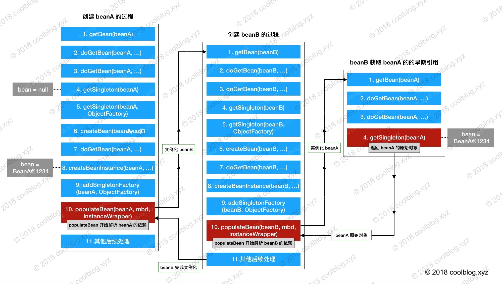

<!-- TOC -->

- [1 Spring体系结构？](#1-spring体系结构)
- [2 Bean作用域？](#2-bean作用域)
- [3 事务属性](#3-事务属性)
    - [3.1 事务传播行为？](#31-事务传播行为)
        - [3.1.1 支持当前事务的情况](#311-支持当前事务的情况)
        - [3.1.2 不支持当前事务的情况](#312-不支持当前事务的情况)
        - [3.1.3 嵌套事务](#313-嵌套事务)
    - [3.2 其他](#32-其他)
- [4 IOC](#4-ioc)
    - [4.1 IOC是什么？](#41-ioc是什么)
    - [4.2 BeanFactory和ApplicationContext区别?](#42-beanfactory和applicationcontext区别)
    - [4.3 IOC容器初始化过程](#43-ioc容器初始化过程)
        - [4.3.1 refresh](#431-refresh)
        - [4.3.2 obtainFreshBeanFactory()](#432-obtainfreshbeanfactory)
        - [4.3.3 finishBeanFactoryInitialization(beanFactory)](#433-finishbeanfactoryinitializationbeanfactory)
    - [4.4 Bean生命周期](#44-bean生命周期)
        - [4.4.1 销毁Bean](#441-销毁bean)
        - [4.4.1 Spring如何解决循环依赖？](#441-spring如何解决循环依赖)
        - [4.4.2 Bean对IoC容器的感知](#442-bean对ioc容器的感知)
        - [4.4.3 Spring中提供了3种自定义init和destroy](#443-spring中提供了3种自定义init和destroy)
    - [4.5 其他](#45-其他)
        - [4.5.1 FactoryBean是什么？](#451-factorybean是什么)
- [5 AOP](#5-aop)
    - [5.1 AOP的作用和优点](#51-aop的作用和优点)
    - [5.2 代理](#52-代理)
    - [5.3 AOP基本概念](#53-aop基本概念)
    - [5.4 使用](#54-使用)
    - [5.5 Proceedingjoinpoint和Joinpoint](#55-proceedingjoinpoint和joinpoint)
    - [5.6 原理](#56-原理)
- [6 @Autowired @Resource @Qualifier区别](#6-autowired-resource-qualifier区别)
- [7 Spring MVC？](#7-spring-mvc)
    - [7.1 MVC模式](#71-mvc模式)
    - [7.2 ApplicationContext启动](#72-applicationcontext启动)
    - [7.3 初始化DispatcherServlet](#73-初始化dispatcherservlet)
    - [7.4 处理请求](#74-处理请求)
    - [7.5 拦截器](#75-拦截器)
- [8 \<context:annotation-config/> 和 \<context:component-scan/>](#8-\contextannotation-config-和-\contextcomponent-scan)
    - [8.1 \<context:annotation-config/>](#81-\contextannotation-config)
    - [8.2 \<context:component-scan/>](#82-\contextcomponent-scan)
    - [8.3 AnnotationConfigApplicationContext](#83-annotationconfigapplicationcontext)
- [9 Import注解？](#9-import注解)
    - [9.1 ImportSelector](#91-importselector)
    - [9.2 ImportBeanDefinitionRegistrar](#92-importbeandefinitionregistrar)
- [10 Spring扩展点?](#10-spring扩展点)
- [11 spring事件与监听器](#11-spring事件与监听器)
- [12 @RequestMapping实现？](#12-requestmapping实现)
- [13 构造注入和属性注入？](#13-构造注入和属性注入)

<!-- /TOC -->
# 1 Spring体系结构？
 
[Spring 体系结构](https://www.w3cschool.cn/wkspring/dcu91icn.html)
# 2 Bean作用域？
|SCOPE|描述|
|:-:|:-|
|singleton|spring IoC容器存在一个bean对象实例。|
|prototype|与单例相反，**每次请求bean**时，它都会创建一个新实例。|
|request(Web)|在HTTP请求(Request) 的完整生命周期中，将创建并使用单个实例。|
|session(Web)|在HTTP会话(Session) 的完整生命周期中，将创建并使用单个实例。 |
|application(Web)|将在**ServletContext**的完整生命周期中创建并使用单个实例。|
|websocket(Web)|在WebSocket的完整生命周期中，将创建并使用单个实例。 |
# 3 事务属性
## 3.1 事务传播行为？
[事务传播行为](https://www.cnblogs.com/YuyuanNo1/p/11400638.html)
### 3.1.1 支持当前事务的情况
- TransactionDefinition.PROPAGATION_REQUIRED： 如果当前存在事务，则加入该事务；如果当前没有事务，则创建一个新的事务。
- PROPAGATION_SUPPORTS： 如果当前存在事务，则加入该事务；如果当前没有事务，则以非事务的方式继续运行。
- PROPAGATION_MANDATORY： 如果当前存在事务，则加入该事务；如果当前没有事务，则抛出异常。（mandatory：强制性）
### 3.1.2 不支持当前事务的情况
- PROPAGATION_REQUIRES_NEW： 创建一个新的事务，如果当前存在事务，则把当前事务挂起。内层和外层事务互不影响
- PROPAGATION_NOT_SUPPORTED： 以非事务方式运行，如果当前存在事务，则把当前事务挂起。
- PROPAGATION_NEVER： 以非事务方式运行，如果当前存在事务，则抛出异常。
### 3.1.3 嵌套事务
- PROPAGATION_NESTED： 如果当前存在事务，则创建一个事务作为当前事务的**嵌套事务**来运行；如果当前没有事务，则按TransactionDefinition.PROPAGATION_REQUIRED 属性执行。
    >嵌套事务：**内层事务依赖外层事务**。外层事务的回滚可以引起内层事务的回滚（利用Savepoint保存内层事务执行结果）。而内层事务的异常并不会导致外层事务的回滚。
## 3.2 其他
事务超时属性、只读属性、回滚规则  
默认情况下，事务只有遇到**运行期异常**时才会回滚，而在遇到检查型异常时不会回滚（这一行为与EJB的回滚行为是一致的）。
# 4 IOC
[Spring IOC 容器源码分析系列文章导读](http://www.tianxiaobo.com/2018/05/30/Spring-IOC-%E5%AE%B9%E5%99%A8%E6%BA%90%E7%A0%81%E5%88%86%E6%9E%90%E7%B3%BB%E5%88%97%E6%96%87%E7%AB%A0%E5%AF%BC%E8%AF%BB/)
## 4.1 IOC是什么？
对象依赖关系的管理被反转
## 4.2 BeanFactory和ApplicationContext区别?

- ApplicationContext

   - 继承关系：子容器可以访问父容器bean，反之不行
## 4.3 IOC容器初始化过程
通过refresh()启动，不包括依赖注入过程。依赖注入发生在第一次getBean时
### 4.3.1 refresh
```Java
@Override
public void refresh() throws BeansException, IllegalStateException {
   // 加锁
   synchronized (this.startupShutdownMonitor) {

      /*
         刷新上下文环境
         初始化上下文环境，对系统的环境变量或者系统属性进行准备和校验
         如环境变量中必须设置某个值才能运行，否则不能运行，这个时候可以在这里加这个校验，
         重写initPropertySources方法就好了
         */
      prepareRefresh();

      // 创建 BeanFactory，加载并注册 Bean
      // 见下文
      ConfigurableListableBeanFactory beanFactory = obtainFreshBeanFactory();

      /*
         1 配置工厂的标准上下文特征，即对BeanFactory的各种功能进行填充，例如上下文的ClassLoader和后处理器
         2 设置SPEL表达式#{key}的解析器
         3 添加ApplicationContextAwareProcessor处理器，并调用beanFactory.ignoreDependencyInterface(*Aware)，如EnvironmentAware、ApplicationEventPublisherAware等
         4 调用beanFactory.registerResolvableDependency指定某个类要注入的对象
         */
      prepareBeanFactory(beanFactory);

      try {
            // 钩子
            // 在beanFactory标准初始化后，对其进行修改。也可以在某些ApplicationContext实现中注册特殊的BeanPostProcessor等
            postProcessBeanFactory(beanFactory);
            
            // 调用 BeanFactoryPostProcessor 各个实现类的 postProcessBeanFactory(factory) 方法
            // 比如ConfigurationClassPostProcessor，实现component scan扫描、自动配置、@Conditional解析
            invokeBeanFactoryPostProcessors(beanFactory);

            // 向beanFactory 注册 BeanPostProcessor 的实现类
            registerBeanPostProcessors(beanFactory);

            // 初始化上下文中的资源文件，如国际化文件的处理等
            initMessageSource();

            // 初始化ApplicationEventMulticaster，其持有ApplicationListener，用于发布事件
            initApplicationEventMulticaster();

            // 钩子
            // 具体的子类可以在这里初始化一些特殊的 Bean（在初始化 singleton beans 之前）
            onRefresh();

            // 向ApplicationEventMulticaster注册事件监听器，监听器需要实现 ApplicationListener 接口
            // 有两种方式，一种是普通bean（在此只注册beanName），一种直接context.addApplicationListener
            registerListeners();

            /*
            1 设置转换器
            2 注册一个默认的属性值解析器
            3 冻结所有的bean定义，说明注册的bean定义将不能被修改或进一步的处理
            4 初始化所有的 singleton beans（lazy-init（@lazy注解） 的除外）
            */
            finishBeanFactoryInitialization(beanFactory);

            /*
            1 初始化生命周期处理器DefaultLifecycleProcessor，并调用其onRefresh()
            2 通过spring的事件发布机制发布ContextRefreshedEvent事件
            */
            finishRefresh();
      } catch (BeansException ex) {
            if (logger.isWarnEnabled()) {
               logger.warn("Exception encountered during context initialization - " +
                        "cancelling refresh attempt: " + ex);
            }

            // Destroy already created singletons to avoid dangling resources.
            // 销毁已经初始化的 singleton 的 Beans，以免有些 bean 会一直占用资源
            destroyBeans();

            // Reset 'active' flag.
            cancelRefresh(ex);

            // 把异常往外抛
            throw ex;
      } finally {
            // Reset common introspection caches in Spring's core, since we
            // might not ever need metadata for singleton beans anymore...
            resetCommonCaches();
      }
   }
}
```
### 4.3.2 obtainFreshBeanFactory()
创建DefaultListableBeanFactory，其包含IOC的所有重要功能
- Resource定位  
Resource定位指的是BeanDefinition的资源定位，它由ResourceLoader通过统一的Resource接口来完成，这个Resource对各种形式的BeanDefinition的使用提供了统一接口。比如FileSystemResource、ClassPathResource
- BeanDefinition载入  
载入过程把用户定义好的Bean表示成IoC容器内部的数据结构，BeanDefinition。
- 注册Definition  
这个注册过程通过调用BeanDefinitionRegistry接口的实现来完成，把载入过程中解析得到的BeanDefinition向IoC容器进行注册。在IoC容器内部将BeanDefinition注入到一个**HashMap**中去，Ioc容器是通过这个HashMap来持有这些BeanDefinition数据的
### 4.3.3 finishBeanFactoryInitialization(beanFactory)
初始化所有的 singleton beans，lazy-init 的除外
## 4.4 Bean生命周期

```java
   //doCreateBean节选
   // ...
   // 通过反射或cglib创建Bean
   instanceWrapper = createBeanInstance(beanName, mbd, args);
   // ...
   // 依赖注入
   populateBean(beanName, mbd, instanceWrapper);
   // 执行以下3~6各过程的方法入口
   exposedObject = initializeBean(beanName, exposedObject, mbd);
   // ...
```
1. 实例化Bean
   - 如果beanDefinition.getMethodOverrides()为空，即采用反射实例化，否则cglib
      > lookup-method：方法查找，可以对指定的bean的方法进行拦截，然后从容器中查找指定的bean作为被拦截方法的返回值，可用于单例bean中使用多例bean
      
      > replaced-method：方法替换
   - getBean->doGetBean->CreateBean->doCreateBean
2. 为bean实例设置属性
   ```java
   populateBean(beanName, mbd, instanceWrapper);
   ```
3. 调用bean的初始化方法
   ```java
   protected Object initializeBean(String beanName, Object bean, @Nullable RootBeanDefinition mbd) {
      if (System.getSecurityManager() != null) {
         AccessController.doPrivileged((PrivilegedAction<Object>) () -> {
            invokeAwareMethods(beanName, bean);
            return null;
         }, getAccessControlContext());
      }
      else {
         invokeAwareMethods(beanName, bean);
      }

      Object wrappedBean = bean;
      if (mbd == null || !mbd.isSynthetic()) {
         wrappedBean = applyBeanPostProcessorsBeforeInitialization(wrappedBean, beanName);
      }

      try {
         invokeInitMethods(beanName, wrappedBean, mbd);
      }
      catch (Throwable ex) {
         throw new BeanCreationException(
               (mbd != null ? mbd.getResourceDescription() : null),
               beanName, "Invocation of init method failed", ex);
      }
      if (mbd == null || !mbd.isSynthetic()) {
         wrappedBean = applyBeanPostProcessorsAfterInitialization(wrappedBean, beanName);
      }

      return wrappedBean;
   }
   ```
   1. invokeAwareMethods
      - 如果 Bean 实现了 BeanNameAware 接口，调用 setBeanName()方法，传入Bean的名字。
      - 如果 Bean 实现了 BeanClassLoaderAware 接口，调用 setBeanClassLoader()方法，传入 ClassLoader对象的实例。
      - 如果Bean实现了 BeanFactoryAware 接口，调用 setBeanFactory()方法，传入 BeanFactory对象的实例。
   2. BeanPostProcessor  
   执行BeanPostProcessor的postProcessBeforeInitialization() 方法
   3. invokeInitMethods
      - 如果Bean实现了InitializingBean接口，执行afterPropertiesSet()方法
      - 如果@Bean 包含 init-method 属性，执行指定的方法
   4. BeanPostProcessor  
   执行BeanPostProcessor的postProcessAfterInitialization() 方法
4. 使用bean
5. 销毁
   - 当要销毁 Bean 的时候，如果 Bean 实现了 DisposableBean 接口，执行 destroy() 方法。
   - 当要销毁 Bean 的时候，如果 @Bean 包含 destroy-method 属性，执行指定的方法。
### 4.4.1 销毁Bean
- 在doCreateBean() 中调用 registerDisposableBeanIfNecessary() 判断当前bean是否需要放入到disposableBeans中
- 判断条件除了上述两种还有下文将提到的@preDestroy，还有实现了AutoCloseable也可以。共四种
- Spring目前是先加载的bean后销毁
### 4.4.1 Spring如何解决循环依赖？
[烂大街的Spring循环依赖问题](https://juejin.cn/post/6859189194837721102)
- 只能解决单例、非构造器（双方都是构造器注入）注入
   - 构造器注入可以通过@Lazy注解解决，注入的是一个代理对象
- 三级缓存
   |cache|说明|
   |-|-|
   |singletonObjects|第一级缓存，存放可用的成品Bean|
   |earlySingletonObjects|第二级缓存，存放半成品的Bean，半成品的Bean是已创建对象，但是未注入属性和初始化。|
   |singletonFactories|第三级缓存，存的是Bean工厂对象，用来生成半成品的Bean并放入到二级缓存中|
- 调用过程

- 为什么需要ObjectFactory三级缓存?
   - 如果创建的Bean有AOP代理，那其他对象注入时，**注入的应该是对应的代理对象**；正常情况下（没有循环依赖情况），Spring是在是通过AspectJAutoProxyCreator这个后置处理器的postProcessAfterInitialization方法中对初始化后的Bean完成AOP代理
   - 三级缓存的ObjectFactory是为了延迟AOP代理，只有真正发生循环依赖时，才去提前生成代理对象
   - 这样在没有循环依赖的情况下，代理就可以按着**Spring设计原则的步骤，即在AspectJAutoProxyCreator中创建**
   - 同时为了防止多次生成代理，加入二级缓存
### 4.4.2 Bean对IoC容器的感知
一部分通过上述invokeAwareMethods()实现，另一部分
通过ApplicationContextAwareProcessor实现
### 4.4.3 Spring中提供了3种自定义init和destroy
- 通过@Bean指定init-method和destroy-method属性
- Bean实现InitializingBean（定义初始化逻辑），DisposableBean（定义销毁逻辑）;
- @PostConstruct：在bean创建完成并且属性赋值完成；来执行初始化方法，@PreDestroy：在容器销毁bean之前通知我们进行清理工作
   - 通过InitDestroyAnnotationBeanPostProcessor实现
## 4.5 其他
### 4.5.1 FactoryBean是什么？
- 是对工厂模式的一种支持，用于创建复杂对象。
- Spring自身就提供了70多个FactoryBean的实现。它们隐藏了实例化一些复杂Bean的细节，给上层应用带来了便利。
- 从Spring3.0开始，FactoryBean开始支持泛型，即接口声明改为FactoryBean<T>的形式。以Bean结尾，表示它是一个Bean，不同于普通Bean的是：它是实现了FactoryBean<T>接口的Bean，**根据该Bean的ID从BeanFactory中获取的实际上是FactoryBean的getObject()返回的对象**，而不是FactoryBean本身，如果要获取FactoryBean对象，**请在id前面加一个&符号来获取**。
# 5 AOP
## 5.1 AOP的作用和优点
- 作用  
面向切面——Spring提供了面向切面编程的丰富支持，允许通过**分离应用的业务逻辑与系统级服务**（例如审计（auditing）和事务（transaction）管理）进行内聚性的开发。 
- 优点
   - 降低模块之间的耦合度
   - 使系统容易扩展
   - 更好的代码复用
## 5.2 代理
AOP思想的实现一般都是基于代理模式
- 如果目标对象实现了接口， JDK 动态代理
- 如果目标对象没有实现接口， CGLIB
- 区别
   - CGLib所创建的动态代理对象的性能比JDK所创建的代理对象**性能高**不少，但CGLib在创建代理对象时所**花费的时间却比JDK动态代理多**很多，所以对于singleton的代理对象或者具有实例池的代理，因为无需频繁的创建新的实例，所以比较适合CGLib动态代理技术，反之则适用于JDK动态代理技术。
   - 另外，由于CGLib采用动态创建子类的方式生成代理对象，所以**不能对目标类中的final，private等方法**进行处理。所以，大家需要根据实际的情况选择使用什么样的代理了
## 5.3 AOP基本概念
- 通知(Adivce)（增强）
   - Before 在方法被调用之前调用
   - After 在方法完成后调用通知，无论方法是否执行成功
   - returning 在方法成功执行之后调用通知
   - After-throwing 在方法抛出异常后调用通知
   - Around 在被通知的方法调用之前和调用之后执行自定义的行为
- 连接点（Join Point）：可以调用Advice通知的地方即被称作Join Point连接点。比如：方法调用、方法执行、字段设置/获取、异常处理执行、类初始化、甚至是 for 循环中的某个点
- 切点（Pointcut）：真正被插入了系统服务的连接点即被称作为Pointcut切点。
- 切面（Aspect）：切面是切点和通知的集合，一般单独作为一个类。通知和切点共同定义了关于切面的全部内容，它是什么时候，在何时和何处完成功能。
- 引入（Introduction）：向现有类添加新方法、属性(DeclareParents)
- 织入（Weaving）：织入指把切面应用到目标对象并创建新的代理对象的过程，切面会在指定的连接点(即切点)织入到目标对象中。在目标对象的生命周期中有多个阶段可以进行织入
## 5.4 使用 
[Spring AOP切点表达式详解](https://my.oschina.net/zhangxufeng/blog/1824275)
```Java
@Slf4j
@Aspect
@Component
public class StopWatchAdvice {

    @Around("@annotation(com.xiaomi.miui.ad.dpa.annotations.WatchTime)")
    public Object interceptor(ProceedingJoinPoint pjp) throws Throwable {
        long start = System.currentTimeMillis();
        Object result = pjp.proceed();

        MethodSignature signature = (MethodSignature) pjp.getSignature();
        Method method = signature.getMethod();
        WatchTime watchTime = method.getAnnotation(WatchTime.class);
        String name = StringUtils.isNotEmpty(watchTime.value()) ? watchTime.value() : method.getName();
        PerfCounter.countDuration("dpa.getAds.timing." + name, System.currentTimeMillis() - start);
        return result;
    }
}

```
## 5.5 Proceedingjoinpoint和Joinpoint
- Joinpoint
   - java.lang.Object[] getArgs()：获取连接点方法运行时的入参列表； 
   - Signature getSignature() ：获取连接点的方法签名对象； 
   - java.lang.Object getTarget() ：获取连接点所在的目标对象； 
   - java.lang.Object getThis() ：获取代理对象本身； 
- Proceedingjoinpoint
   - java.lang.Object proceed() throws java.lang.Throwable：通过反射执行目标对象的连接点处的方法； 
   - java.lang.Object proceed(java.lang.Object[] args) throws java.lang.Throwable：通过反射执行目标对象连接点处的方法，不过使用新的入参替换原来的入参。 
## 5.6 原理
[spring源码剖析（六）AOP实现原理剖析](https://blog.csdn.net/fighterandknight/article/details/51209822)  
[Spring AOP 源码分析系列文章导读](http://www.tianxiaobo.com/2018/06/17/Spring-AOP-%E6%BA%90%E7%A0%81%E5%88%86%E6%9E%90%E7%B3%BB%E5%88%97%E6%96%87%E7%AB%A0%E5%AF%BC%E8%AF%BB/)

- AbstractAutoProxyCreator.postProcessAfterInitialization中，从配置文件和@Aspect注解中获取匹配的增强，然后生成代理对象
- 拦截器链  
   - Advice通过AdvisorAdapter转化为MethodInterceptor
      ```java
      public class AspectJAfterAdvice extends AbstractAspectJAdvice
		implements MethodInterceptor, AfterAdvice, Serializable {

         public AspectJAfterAdvice(
               Method aspectJBeforeAdviceMethod, AspectJExpressionPointcut pointcut, AspectInstanceFactory aif) {

            super(aspectJBeforeAdviceMethod, pointcut, aif);
         }


         @Override
         public Object invoke(MethodInvocation mi) throws Throwable {
            try {
               return mi.proceed();
            }
            finally {
               invokeAdviceMethod(getJoinPointMatch(), null, null);
            }
         }

         @Override
         public boolean isBeforeAdvice() {
            return false;
         }

         @Override
         public boolean isAfterAdvice() {
            return true;
         }

      }
      ```
      注意mi.proceed()会返回到ReflectiveMethodInvocation去执行下一个拦截器
   - 在proceed方法中逐个运行拦截器链的方法，在运行拦截器链方法前先对代理方法进行匹配。如果已经到链末尾，执行目标对象的方法，否则调用下一个拦截器
      ```java
      if (dm.methodMatcher.matches(this.method, targetClass, this.arguments)) {
               return dm.interceptor.invoke(this);
      }
      else {
         // Dynamic matching failed.
         // Skip this interceptor and invoke the next in the chain.
         return proceed();
      }
      ```
# 6 @Autowired @Resource @Qualifier区别
- @Autowired
只能按类型，按名称和@Qualifier搭配使用
- @Resource
默认按名称，可以指定按名称和类型
- @Primary注解是加在bean上的
# 7 Spring MVC？
配置DispatcherServlet和ContextLoaderListener
```xml
<servlet>
    <servlet-name>sample</servlet-name>
    <servlet-class>org.springframework.web.servlet.DispatcherServlet</servlet-class>
    <load-on-startup>1</load-on-startup>
    <init-param>
        <param-name>contextConfigLocation</param-name>
        <param-value>/WEB-INF/spring-servlet.xml</param-value>
    </init-param>
</servlet>
<servlet-mapping>
    <servlet-name>sample</servlet-name>
    <url-pattern>/*</url-pattern>
</servlet-mapping>
  
<listener>
   <listenerclass>
     org.springframework.web.context.ContextLoaderListener
   </listener-class>
</listener>
<context-param>
    <param-name>contextConfigLocation</param-name>
    <param-value>classpath:config/applicationContext.xml</param-value>
</context-param>
```
## 7.1 MVC模式
- Model **管理应用程序的数据和逻辑**，从Controller接收用户输入
- Controller 接收用户输入并处理验证，然后交给model。
- View **负责对从model获取的数据进行展示**，这个部分多为前端应用，而 Controller 会有一个机制将处理的结果 (可能是 Model, 集合或是状态等) 交给 View，然后由 View 来决定怎么显示。例如 Spring Framework 使用 JSP 或相应技术。
## 7.2 ApplicationContext启动

- 服务器启动时，ContextLoaderListener.contextInitialized()被调用，调用initWebApplicationContext
- 如果初始化过程中发现已经有根上下文被创建抛异常，否则创建成功后保存在ServletContext中
## 7.3 初始化DispatcherServlet

- Servlet的init方法里最终会调用到initWebApplicationContext，会设置根上下文为父上下文，根上下文也可以不要
- 持有一个以自己名称命名的WebApplicationContext，是根上下文的子上下文，保存controller、MVC组件。意味着DispatcherServlet有自己的Bean定义空间，类似于双亲委派，用于有多个DispatcherServlet的情况
- 对MVC模块的其他部分初始化，比如handlerMapping、ViewResolver
## 7.4 处理请求
- doDispatch()


   1. 用户发送请求到DispatcherServlet
   2. DispatcherServlet遍历HandlerMapping查找 Handler，返回HandlerExecutionChain
   3. 匹配合适的handlerAdapter（实际上是遍历所有的HandlerAdapter，使用instanceof方法匹配）
   4. 调用HandlerExecutionChain.applyPreHandle（拦截器前置方法）
   5. 调用handlerAdapter的handle返回ModelAndView，填充viewName
   6. 调用HandlerExecutionChain.applyPostHandle（拦截器后置方法）
   7. 解析视图（根据逻辑视图名解析获得View对象）
   8. 调用view.render渲染视图，填充到respongse
   9. 响应结果
- HandlerMapping
   - 初始化完成时HandlerMapping都已经被加载，存储URL到controller name(handler)的映射
   - 请求时从容器中找到controller，并和interceptorList组成HandlerExecutionChain
## 7.5 拦截器
[拦截器使用](https://blog.csdn.net/zhangzhaoyuan30/article/details/88577350)

# 8 \<context:annotation-config/> 和 \<context:component-scan/>
## 8.1 \<context:annotation-config/>
\<context:annotation-config>是用于激活那些已经在spring容器里注册过的bean上面的注解，也就是显式的向Spring注册
- AutowiredAnnotationBeanPostProcessor
- CommonAnnotationBeanPostProcessor
- PersistenceAnnotationBeanPostProcessor
- RequiredAnnotationBeanPostProcessor

上述都实现了MergedBeanDefinitionPostProcessor，在doCreateBean时调用
## 8.2 \<context:component-scan/>
ConfigurationClassPostProcessor，在**invokeBeanFactoryPostProcessors**时调用
## 8.3 AnnotationConfigApplicationContext 
AnnotationConfigApplicationContext 初始化时会注册上述Processor

# 9 Import注解？
[Spring Import 三种用法与源码解读](https://cloud.tencent.com/developer/article/1334255)
- 引入其他的@Configuration
- 向容器注册类
- 指定实现ImportSelector(以及DefferredServiceImportSelector)的类，用于个性化加载
- 指定实现ImportBeanDefinitionRegistrar的类，用于个性化加载
## 9.1 ImportSelector
```java
public interface ImportSelector {

	String[] selectImports(AnnotationMetadata importingClassMetadata);
   // ...
}
```
- 通过AnnotationMetadata里面的属性选择可以被import的类
- AnnotationMetadata是Import注解所在的类的注解信息（如果所在类是注解类，则延伸至应用这个注解类的非注解类为止）
   - 可用于注解在Eable注解上，就可以获得Eable注解的属性，根据其选择导入Bean
- DeferredImportSelector返回的类是最后加载，而ImportSelector是最先加载
## 9.2 ImportBeanDefinitionRegistrar
```java
default void registerBeanDefinitions(AnnotationMetadata importingClassMetadata, BeanDefinitionRegistry registry) {
}
```
可以根据importingClassMetadata属性向容器注册BeanDefinition
# 10 Spring扩展点?
[Spring IOC 流程中核心扩展接口的12个扩展点源码分析](https://blog.csdn.net/woshilijiuyi/article/details/85396492)

# 11 spring事件与监听器
[spring事件与监听器](https://blog.csdn.net/zhangzhaoyuan30/article/details/95759538)
- ApplicationEventPublisher是Spring的事件发布接口，ApplicationContext实现了该接口。代码中注入ApplicationEventPublisher，可发布事件
- 监听事件采用@EventListener注解
# 12 @RequestMapping实现？
- 注解驱动会为我们注册RequestMappingHandlerMapping等Bean定义
- 而RequestMappingHandlerMapping实现了InitializingBean接口，因此在初始化并装配该Bean实例时，便会执行他的afterPropertySet方法，注册handler

# 13 构造注入和属性注入？
通过ConstructorResolver#resolveAutowiredArgument解析构造器的参数，解析的含义是：根据构造器参数类型从IoC中找到(或者生成)对应的实例。该类本身并不具备解析依赖的能力，本质上还是依靠AutowireCapableBeanFactory#resolveDependency来进行依赖的解析。此处有一点需要注意的是，AutowireCapableBeanFactory#resolveDependency的第一个入参是new DependencyDescriptor(param, true)，其中的'true'代表的含义是：**该依赖项是强依赖，即required，如果找不到，会抛出NoSuchBeanDefinitionException**。这也是Spring4以后官方推荐使用构造器注入的原因之一：表明强依赖