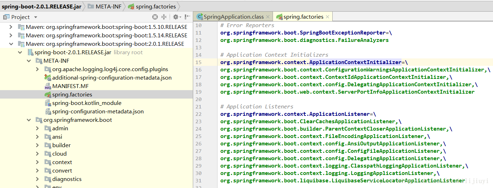

<!-- TOC -->

- [1 SpringBoot核心](#1-springboot核心)
- [2 SpringBootApplication注解](#2-springbootapplication注解)
- [3 启动过程](#3-启动过程)
    - [3.1 SpringApplication初始化](#31-springapplication初始化)
        - [3.1.1 构造方法](#311-构造方法)
        - [3.1.2 SpringApplicationBuilder](#312-springapplicationbuilder)
    - [3.2 run()](#32-run)
        - [3.2.1 获取run方法的监听器EventPublishingRunListener](#321-获取run方法的监听器eventpublishingrunlistener)
        - [3.2.1 获取run方法的监听器EventPublishingRunListener](#321-获取run方法的监听器eventpublishingrunlistener)
        - [3.2.2 准备环境：prepareEnvironment()](#322-准备环境prepareenvironment)
        - [3.2.2 准备环境：prepareEnvironment()](#322-准备环境prepareenvironment)
        - [3.2.3 **创建容器**：createApplicationContext()](#323-创建容器createapplicationcontext)
        - [3.2.4 获取SpringBootExceptionReporter](#324-获取springbootexceptionreporter)
        - [3.2.4 获取SpringBootExceptionReporter](#324-获取springbootexceptionreporter)
        - [3.2.5 准备容器prepareContext()](#325-准备容器preparecontext)
        - [3.2.6 refresh](#326-refresh)
        - [3.3.7 总结](#337-总结)
- [4 自动配置原理](#4-自动配置原理)
    - [4.1 加载AutoConfigurationImportSelector](#41-加载autoconfigurationimportselector)
    - [4.2 加载自动配置类](#42-加载自动配置类)
    - [4.3 过滤自动配置类](#43-过滤自动配置类)
- [5 自定义Starter](#5-自定义starter)
    - [5.1 spring.factories](#51-springfactories)
- [6 Tomcat启动？](#6-tomcat启动)

<!-- /TOC -->
# 1 SpringBoot核心
- 自动配置
- 起步依赖：其实就是特殊的Maven依赖，利用了依赖传递解析，把常用库聚合在一起，组成了几个为特定功能而定制的依赖
- 命令行界面
- Actuator
# 2 SpringBootApplication注解

# 3 启动过程
[SpringBoot启动流程源码分析](https://blog.csdn.net/woshilijiuyi/article/details/82219585)
## 3.1 SpringApplication初始化
### 3.1.1 构造方法
```java
public SpringApplication(ResourceLoader resourceLoader, Class<?>... primarySources) {
    this.resourceLoader = resourceLoader;
    Assert.notNull(primarySources, "PrimarySources must not be null");
    this.primarySources = new LinkedHashSet<>(Arrays.asList(primarySources));
    //判断web环境：NONE、SERVLET、REACTIVE
    this.webApplicationType = WebApplicationType.deduceFromClasspath();
    //从Spring.factories加载Initializer
    setInitializers((Collection) getSpringFactoriesInstances(
            ApplicationContextInitializer.class));
    //从Spring.factories加载监听器
    setListeners((Collection) getSpringFactoriesInstances(ApplicationListener.class));
    //获取主类
    this.mainApplicationClass = deduceMainApplicationClass();
}
```
- Spring.factories
- ApplicationListener  

### 3.1.2 SpringApplicationBuilder
指定web、profile、shutdownhook
## 3.2 run()
```java
public ConfigurableApplicationContext run(String... args) {
    StopWatch stopWatch = new StopWatch();
    stopWatch.start();
    ConfigurableApplicationContext context = null;
    Collection<SpringBootExceptionReporter> exceptionReporters = new ArrayList<>();
    configureHeadlessProperty();

        // 第一步：获取run方法的监听器EventPublishingRunListener，负责发布run方法中的事件
    SpringApplicationRunListeners listeners = getRunListeners(args);

        // 发布starting事件
    listeners.starting();
    try {
        ApplicationArguments applicationArguments = new DefaultApplicationArguments(
                args);
        // 第二步：构造容器环境
        ConfigurableEnvironment environment = prepareEnvironment(listeners,
                applicationArguments);
        // 设置需要忽略的bean
        configureIgnoreBeanInfo(environment);
        // 打印banner
        Banner printedBanner = printBanner(environment);
        // 第三步：创建容器
        context = createApplicationContext();
        // 第四步：实例化SpringBootExceptionReporter.class，用来支持报告关于启动的错误
        exceptionReporters = getSpringFactoriesInstances(
                SpringBootExceptionReporter.class,
                new Class[] { ConfigurableApplicationContext.class }, context);
        // 第五步：准备容器
        prepareContext(context, environment, listeners, applicationArguments,
                printedBanner);
        // 第六步：刷新容器
        refreshContext(context);
        // 第七步：刷新容器后的扩展接口
        afterRefresh(context, applicationArguments);
        stopWatch.stop();
        if (this.logStartupInfo) {
            new StartupInfoLogger(this.mainApplicationClass)
                    .logStarted(getApplicationLog(), stopWatch);
        }
        listeners.started(context);
        callRunners(context, applicationArguments);
    }
    catch (Throwable ex) {
        handleRunFailure(context, ex, exceptionReporters, listeners);
        throw new IllegalStateException(ex);
    }

    try {
        listeners.running(context);
    }
    catch (Throwable ex) {
        handleRunFailure(context, ex, exceptionReporters, null);
        throw new IllegalStateException(ex);
    }
    return context;
}
```
### 3.2.1 获取run方法的监听器EventPublishingRunListener
[SpringBoot监听器源码分析](https://blog.csdn.net/woshilijiuyi/article/details/82805649)
- 从spring.factories获取SpringApplicationRunListener的实现类EventPublishingRunListener，负责发布run方法中的事件，在run方法执行过程中触发监听器执行相应逻辑。
- 把之前SpringApplication初始化时获得的ApplicationListener放入EventPublishingRunListener持有的SimpleApplicationEventMulticaster
- EventPublishingRunListener通过持有**SimpleApplicationEventMulticaster**对象，广播事件，**遍历ApplicationListener监听器**执行相应方法。（利用Spring的监听机制）
```java
public interface SpringApplicationRunListener {

    void starting();

    void environmentPrepared(ConfigurableEnvironment environment);

    void contextPrepared(ConfigurableApplicationContext context);

    void contextLoaded(ConfigurableApplicationContext context);

    void started(ConfigurableApplicationContext context);

    void running(ConfigurableApplicationContext context);

    void failed(ConfigurableApplicationContext context, Throwable exception);

}
```
### 3.2.2 准备环境：prepareEnvironment()
[SpringBoot Environment源码分析](https://blog.csdn.net/woshilijiuyi/article/details/82720478)  
加载外部化配置资源到environment，包括命令行参数、servletConfigInitParams、servletContextInitParams、systemProperties、sytemEnvironment、random、application.yml(.yaml/.xml/.properties)等；初始化日志系统。
- 这一步listeners.environmentPrepared(environment)**会被ConfigFileApplicationListener**监听，加载**properties 和yml文件**
### 3.2.3 **创建容器**：createApplicationContext()
根据webApplicationType进行判断，创建对应类型容器。
```java
protected ConfigurableApplicationContext createApplicationContext() {
    Class<?> contextClass = this.applicationContextClass;
    if (contextClass == null) {
        try {
            switch (this.webApplicationType) {
            case SERVLET:
                contextClass = Class.forName(DEFAULT_SERVLET_WEB_CONTEXT_CLASS);
                break;
            case REACTIVE:
                contextClass = Class.forName(DEFAULT_REACTIVE_WEB_CONTEXT_CLASS);
                break;
            default:
                contextClass = Class.forName(DEFAULT_CONTEXT_CLASS);
            }
        }
        catch (ClassNotFoundException ex) {
            throw new IllegalStateException(
                    "Unable create a default ApplicationContext, "
                            + "please specify an ApplicationContextClass",
                    ex);
        }
    }
    return (ConfigurableApplicationContext) BeanUtils.instantiateClass(contextClass);
}
```
### 3.2.4 获取SpringBootExceptionReporter
- 从spring.factories获取，用来支持报告关于启动的错误
- 该类主要是在项目启动失败之后，打印log
### 3.2.5 准备容器prepareContext()
- 这一步主要是在refresh()之前的准备动作。包含一个非常关键的操作：将启动类注入容器，为后续开启自动化配置奠定基础。
```java
private void prepareContext(ConfigurableApplicationContext context,
            ConfigurableEnvironment environment, SpringApplicationRunListeners listeners,
            ApplicationArguments applicationArguments, Banner printedBanner) {
    //设置容器环境，包括各种变量
    context.setEnvironment(environment);
    //执行容器后置处理
    postProcessApplicationContext(context);
    //执行容器中的ApplicationContextInitializer（包括 spring.factories和自定义的实例）
    applyInitializers(context);
    //发送容器已经准备好的事件，通知各监听器
    listeners.contextPrepared(context);
    //打印log
    if (this.logStartupInfo) {
        logStartupInfo(context.getParent() == null);
        logStartupProfileInfo(context);
    }
    // Add boot specific singleton beans
    //注册启动参数bean，这里将容器指定的参数封装成bean，注入容器
    context.getBeanFactory().registerSingleton("springApplicationArguments",
            applicationArguments);
    //设置banner
    if (printedBanner != null) {
        context.getBeanFactory().registerSingleton("springBootBanner", printedBanner);
    }
    // Load the sources
    //获取我们的启动类指定的参数，可以是多个
    Set<Object> sources = getAllSources();
    Assert.notEmpty(sources, "Sources must not be empty");
    //加载我们的启动类，将启动类注入容器
    load(context, sources.toArray(new Object[0]));
    //发布容器已加载事件。
    listeners.contextLoaded(context);
}
```
- applyInitializers(context)  
    ApplicationContextInitializer是Spring框架原有的概念, 这个类的主要目的就是在 **ConfigurableApplicationContext**类型（或者子类型）的ApplicationContext做**refresh之前**，允许我们对ConfigurableApplicationContext的实例做进一步的设置或者处理（加入**BeanFactoryPostProcessor**、向context添加监听器等）。  
    - 举例：  
    context.addBeanFactoryPostProcessor( new ConfigurationWarningsPostProcessor(getChecks()));
- **加载启动指定类**
    ```java
    load(context, sources.toArray(new Object[0])):  
    ```
    这里会将我们的启动类加载到spring容器beanDefinitionMap中，为后续springBoot **自动化配置奠定基础**，springBoot为我们提供的各种注解配置也与此有关。
### 3.2.6 refresh  
参考spring文章中的源码分析
### 3.3.7 总结
比Spring 容器初始化之前，做了
- new SpringApplication
    1. 从spring.factories加载 EventPublishingRunListener、ApplicationListener，发布SpringBoot启动过程中的事件(借此过程加载 properties 和 yml 文件)
    2. 从spring.factories加载ApplicationContextInitializer
- run 方法（过程中会发布事件）
    1. 创建容器 
    2. prepareContext
        - applyInitializers
        - 将启动类注册到容器中
    3. refresh
# 4 自动配置原理
[SpringBoot是如何实现自动配置的？](https://juejin.cn/post/6844904080872046599)
[3自动配置流程源码](https://blog.csdn.net/zhangzhaoyuan30/article/details/96134707)
## 4.1 加载AutoConfigurationImportSelector
1. @SpringBootApplication含有@EnableAutoConfiguration
2. @EnableAutoConfiguration含有@Import(AutoConfigurationImportSelector.class)
3. AutoConfigurationImportSelector会在
    ```java
    invokeBeanFactoryPostProcessors(beanFactory);
    ```
    时被ConfigurationClassPostProcessor**所依赖的**ConfigurationClassParser解析
## 4.2 加载自动配置类
ConfigurationClassPostProcessor的ConfigurationClassParser执行selectImports，调用getAutoConfigurationEntry
最终解析spring.factories文件：
```java
protected AutoConfigurationEntry getAutoConfigurationEntry(AnnotationMetadata annotationMetadata) {
    if (!isEnabled(annotationMetadata)) {
        return EMPTY_ENTRY;
    }
    AnnotationAttributes attributes = getAttributes(annotationMetadata);
    List<String> configurations = getCandidateConfigurations(annotationMetadata, attributes);
    configurations = removeDuplicates(configurations);
    Set<String> exclusions = getExclusions(annotationMetadata, attributes);
    checkExcludedClasses(configurations, exclusions);
    configurations.removeAll(exclusions);
    configurations = getConfigurationClassFilter().filter(configurations);
    fireAutoConfigurationImportEvents(configurations, exclusions);
    return new AutoConfigurationEntry(configurations, exclusions);
}
```

## 4.3 过滤自动配置类
```java
configurations = getConfigurationClassFilter().filter(configurations);
```
getAutoConfigurationImportFilters()从spring.factories中加载
```java
protected List<AutoConfigurationImportFilter> getAutoConfigurationImportFilters() {
    return SpringFactoriesLoader.loadFactories(AutoConfigurationImportFilter.class, this.beanClassLoader);
}
```

使用以上三个OnConditionxxx过滤器，根据@ConditionalOnxxx注解过滤出需要被加载进容器的Configuration。

其他的条件注解在ConfigurationClassParser的processConfigurationClass方法解析
# 5 自定义Starter
1. 定义一个Configuration
2. 加上条件注解
3. 在META-INF下面创建 spring.factories(如果你想要被 Spring 容器管理的 bean 不在 Spring Boot 包扫描路径下)添加
    ```properties
    org.springframework.boot.autoconfigure.EnableAutoConfiguration=\
    spring.study.startup.bean.MyAutoConfiguration
    ```
4. 打包
## 5.1 spring.factories
如果你想要被 Spring 容器管理的 bean 不在 Spring Boot 包扫描路径下
> 简单的总结下 java SPI 机制的思想。我们系统里抽象的各个模块，往往有很多不同的实现方案，比如日志模块的方案，xml解析模块、jdbc模块的方案等。面向的对象的设计里，我们一般推荐模块之间基于接口编程，模块之间不对实现类进行硬编码。一旦代码里涉及具体的实现类，就违反了可拔插的原则，如果需要替换一种实现，就需要修改代码。为了实现在模块装配的时候能不在程序里动态指明，这就需要一种服务发现机制。    
java SPI 就是提供这样的一个机制：为某个接口寻找服务实现的机制。有点类似IOC的思想，就是将装配的控制权移到程序之外，在模块化设计中这个机制尤其重要。
# 6 Tomcat启动？
ServletWebServerApplicationContext的onfresh方法