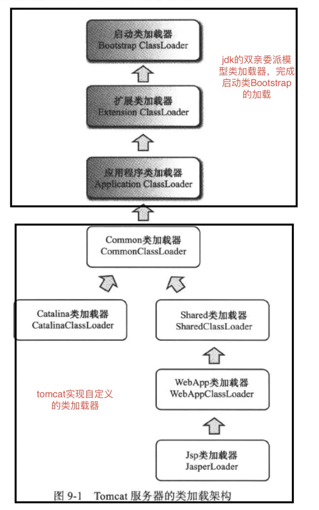
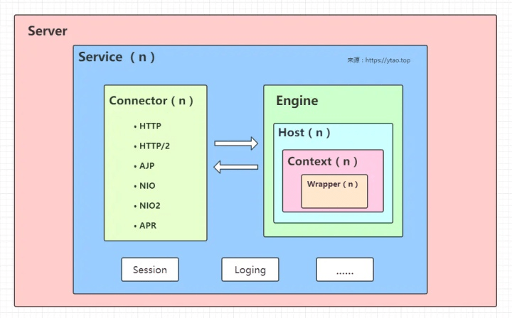
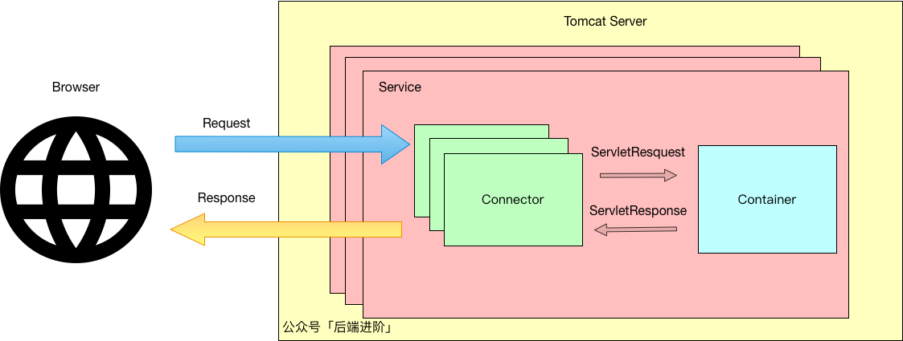
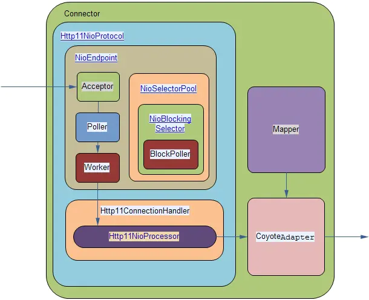
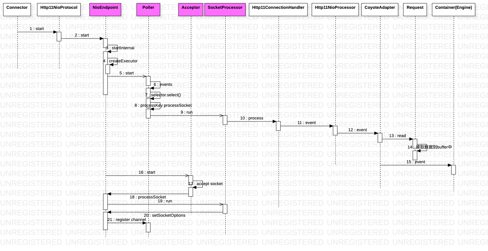
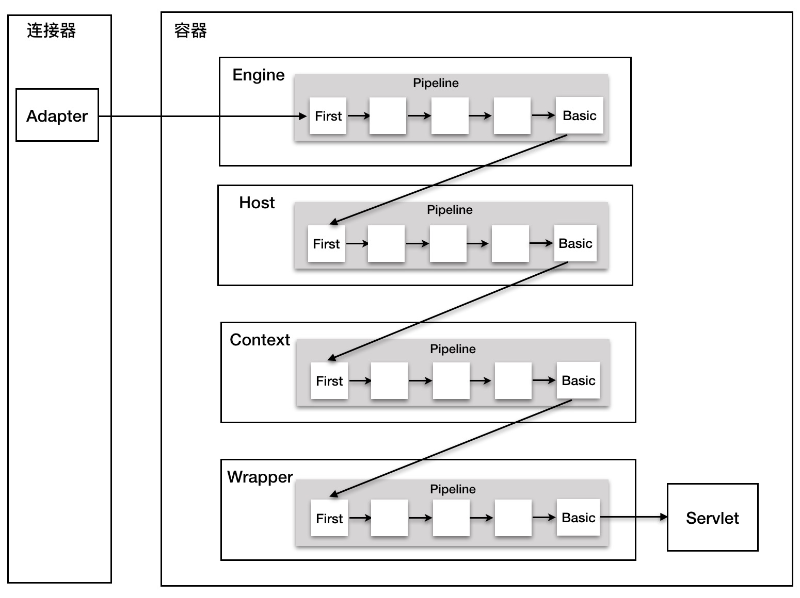

<!-- TOC -->

- [1 类加载器](#1-类加载器)
    - [1.1 commonLoader](#11-commonloader)
    - [1.2 WebAppClassLoader违反双亲委派原则](#12-webappclassloader违反双亲委派原则)
    - [1.3 JasperClassLoader](#13-jasperclassloader)
- [2 架构](#2-架构)
    - [2.1 Connector](#21-connector)
    - [2.2 Container](#22-container)
    - [2.2.1 4种容器](#221-4种容器)
        - [2.2.2 如何用 URL 定位到一个 Servlet？](#222-如何用-url-定位到一个-servlet)
        - [2.2.3 Container流程](#223-container流程)
        - [2.2.4 valve](#224-valve)
- [3 tomcat的线程模型](#3-tomcat的线程模型)
- [4 Servlet](#4-servlet)
    - [4.1 什么是Servlet?](#41-什么是servlet)
        - [4.1.1 Servelt生命周期？](#411-servelt生命周期)
    - [4.2 什么是Servlet容器?](#42-什么是servlet容器)

<!-- /TOC -->
# 1 类加载器 

## 1.1 commonLoader
在Tomcat6之后，commonLoader，catalinaLoader 和 sharedLoader 其实指向的是同一个 URLClassLoader 对象，而在之前:
```properties
common.loader="${catalina.base}/lib","${catalina.base}/lib/*.jar","${catalina.home}/lib","${catalina.home}/lib/*.jar"
server.loader=${catalina.home}/server/classes,${catalina.home}/server/lib/*.jar
shared.loader=${catalina.base}/shared/classes,${catalina.base}/shared/lib/*.jar
```
- commonLoader：Tomcat最基本的类加载器，加载路径中的class可以被Tomcat容器本身以及各个Webapp访问；
- catalinaLoader：Tomcat**容器私有**的类加载器，加载路径中的class对于Webapp不可见；
- sharedLoader：各个**Webapp共享**的类加载器，加载路径中的class对于所有Webapp可见，但是对于Tomcat容器不可见；
- WebappClassLoader：各个**Webapp私有**的类加载器，加载路径中的class只对当前Webapp可见；
## 1.2 WebAppClassLoader违反双亲委派原则
tomcat的类加载机制是**违反了双亲委派原则**的，目的是优先加载Web应用定义的类，体现在WebAppClassLoaderBase.loadClass()方法：
1. 先在本地缓存中查找是否已经加载过该类
2. 让**系统类加载器**(AppClassLoader)尝试加载该类，主要是为了防止一些JavaSE类会被覆盖
3. **自行加载**
4. 委托**父类加载器**(Common ClassLoader)去加载。
## 1.3 JasperClassLoader
JasperLoader的加载范围仅仅是这个JSP文件所编译出来的那**一个.Class文件**，它出现的目的就是为了被**丢弃**：  
当Web容器检测到JSP文件被修改时，会卸载当前的JasperLoader的实例，并通过重建一个Jsp类加载器来实现JSP文件的HotSwap功能
# 2 架构
Tomcat 要实现 2 个核心功能：
- 处理 Socket 连接，负责网络字节流与 Request 和 Response 对象的转化。
- 加载和管理 Servlet，以及具体处理 Request 请求。


- Server 是 tomcat 服务器，server -> n个service
- service有n个连接器和1个 Servlet 引擎 Engine。
    - Tomcat 默认的 Service 服务是 Catalina
    - 而一个 Service 服务可以包含多个连接器，因为 Tomcat 支持多种网络协议，包括 HTTP/1.1、HTTP/2、AJP 等等
    - Service：在Connector和Engine外面包了一层，把它们组装在一起，对外提供服务。一个Service可以**包含多个Connector**，但是只能包含一个Engine；Connector接收请求，Engine处理请求。
## 2.1 Connector
[](https://qiankunli.github.io/2019/11/26/tomcat_source.html)
连接器负责将各种网络协议封装起来，对外部屏蔽了网络连接与 IO 处理的细节，**将处理得到的 Request 对象传递给容器处理**
- protocolHandler：每一个Connector对应了一个protocolHandler，比如Http11NioProtocol
- Endpoint：Http11NioProtocol创建一个org.apache.tomcat.util.net.NioEndpoint实例，然后将监听端口并解析请求的工作全被委托给NioEndpoint实现
- NioEndpoint内部有三种线程（主从Reactor多工作线程），分别为Acceptor，Poller和Worker（SocketProcessor）

- Adapter用于连接Connector和Container
    - 根据coyote框架的request和response对象，生成connector的request和response对象（是HttpServletRequest和HttpServletResponse的封装）
    - 调用Engine容器下pipeline的阀门

## 2.2 Container
Tomcat 设计了 4 种容器，分别是 Engine、Host、Context 和 Wrapper。这 4 种容器是父子关系，形成一个树形结构。Tomcat 是用**组合模式**来管理这些容器的，具体实现方法是，所有容器组件都实现了 Container 接口，Container 接口继承Lifecycle。
```java
public interface Container extends Lifecycle {
    public void setName(String name);
    public Container getParent();
    public void setParent(Container container);
    public void addChild(Container child);
    public void removeChild(Container child);
    public Container findChild(String name);
}
```
## 2.2.1 4种容器
- Engine：
    - 一个Service只有一个，代表整个Catalina Servlet引擎，和Connector组成Service，是Service中的请求处理组件
    - 选出Host，交给Host处理
    - 可以有多个Host
- Host：表示虚拟主机，可以运行多个Context
- Context：代表一个ServletContext，包含多个Wrappers。代表在特定虚拟主机上运行的一个Web应用，对应一个WAR
- Wrapper：生成FilterChain，管理Servlet池加载Servlet
    - 在loadServlet方法中如果singleThreadModel=false，返回单例 Servlet
    - Servlet实现了**SingleThreadModel**接口，就会有多个实例，为了保证线程安全。但是对于静态变量也是不安全的。
### 2.2.2 如何用 URL 定位到一个 Servlet？
用 Mapper 组件
1. 根据协议和端口号选定 Service 和 Engine。
2. 根据域名选定 Host。
3. 根据 URL 路径找到 Context 组件。
4. 根据 URL 路径找到 Wrapper（Servlet）。
### 2.2.3 Container流程
Engine、Context、Wrapter 和Host 作为容器，并不亲自“干活”，而是交给对应的pipeline
```java
public class CoyoteAdapter implements Adapter {
    // 有读事件时会触发该操作
    public boolean event(org.apache.coyote.Request req,
        org.apache.coyote.Response res, SocketStatus status) {
        ...
        // 将读取的数据写入到 request inputbuffer 
        request.read();
        ...
        // 触发filter、servlet的执行
        connector.getService().getContainer().getPipeline().getFirst().event(request, response, request.getEvent());
        ...
    }
}
```
### 2.2.4 valve
- Pipeline-Valve 是责任链模式。Valve 表示一个处理点，比如权限认证和记录日志。
- 每一个容器都有一个 Pipeline 对象，只要触发这个 Pipeline 的第一个 Valve，这个容器里 Pipeline 中的 Valve 就都会被调用到。
- 不同容器的 Pipeline 是怎么链式触发的呢？Pipeline 中还有个 getBasic 方法。这个 BasicValve 处于 Valve 链表的末端，它是 Pipeline 中必不可少的一个 Valve，负责调用下层容器的 Pipeline 里的第一个 Valve。
- Wrapper 容器的最后一个 Valve 会创建一个 Filter 链，并调用 doFilter 方法，最终会调到 Servlet 的 service 方法

# 3 tomcat的线程模型
Tomcat支持四种接收请求的处理方式：BIO、NIO、APR和AIO
- NIO
主从Reactor多线程模型，tomcat 8.0 后默认采用该模型。
- BIO
阻塞式IO，tomcat7之前默认，采用传统的java IO进行操作，该模型下每个请求都会创建一个线程，适用于并发量小的场景。
- APR
tomcat 以JNI形式调用http服务器的核心动态链接库来处理文件读取或网络传输操作，需要编译安装APR库。
使用方法(配置server.xml)：protocol ="org.apache.coyote.http11.Http11AprProtocol"
- AIO
异步 (NIO2)，tomcat8.0后支持。多用于连接数目多且连接比较长（重操作）的架构，比如相册服务器，充分调用OS参与并发操作，编程比较复杂，JDK7开始支持。采用AsynchronousServerSocketChannel
# 4 Servlet
## 4.1 什么是Servlet?
Servlet 是基于 Java 技术的 web 组件，容器托管的，用于**生成动态Web内容**。  
客户端通过 Servlet 容器实现的请求/应答模型与 Servlet 交互。  
- Servlet 接口是 Java Servlet API 的核心抽象。所有 Servlet 类必须直接或间接的实现该接口，或者更通常做法是通过继承一个实现了该接口的类从而复用许多共性功能。目前有 **GenericServlet 和HttpServlet** 这两个类实现了 Servlet 接口。大多数情况下，开发者只需要**继承 HttpServlet** 去实现自己的 Servlet 即可。
### 4.1.1 Servelt生命周期？
生命周期规定了 Servlet 如何被加载、实例化、初始化、处理客户端请求，以及何时结束服务。该声明周期可以通过 javax.servlet.Servlet 接口中的 **init、service 和 destroy** 这些 API 来表示
- 加载和实例化
    - Servlet 容器负责加载和实例化 Servlet。加载和实例化可**以发生在容器启动时，或者延迟初始化直到容器决定有请求需要处理时**。
    - 当 Servlet 引擎启动后，servlet 容器必须定位所需要的 Servlet 类。
    - Servlet 容器使用**普通的 Java 类加载器**加载 Servlet 类。可以从本地文件系统或远程文件系统或者其他网络服务加载。加载完 Servlet 类后，容器就可以实例化它并使用了。
- init
    - ServletConfig参数：Servle容器可以通过其传递信息
    - ServletContext：通过ServletConfig获得，可以访问修改容器
- 其他方法待补充
## 4.2 什么是Servlet容器?
Servlet 容器是 web server 或 application server 的一部分，**负责管理 Servlet 生命周期**。