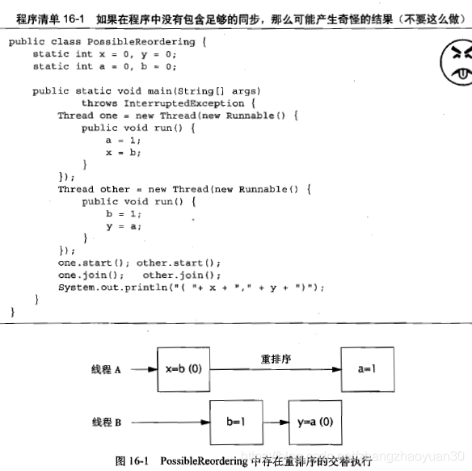
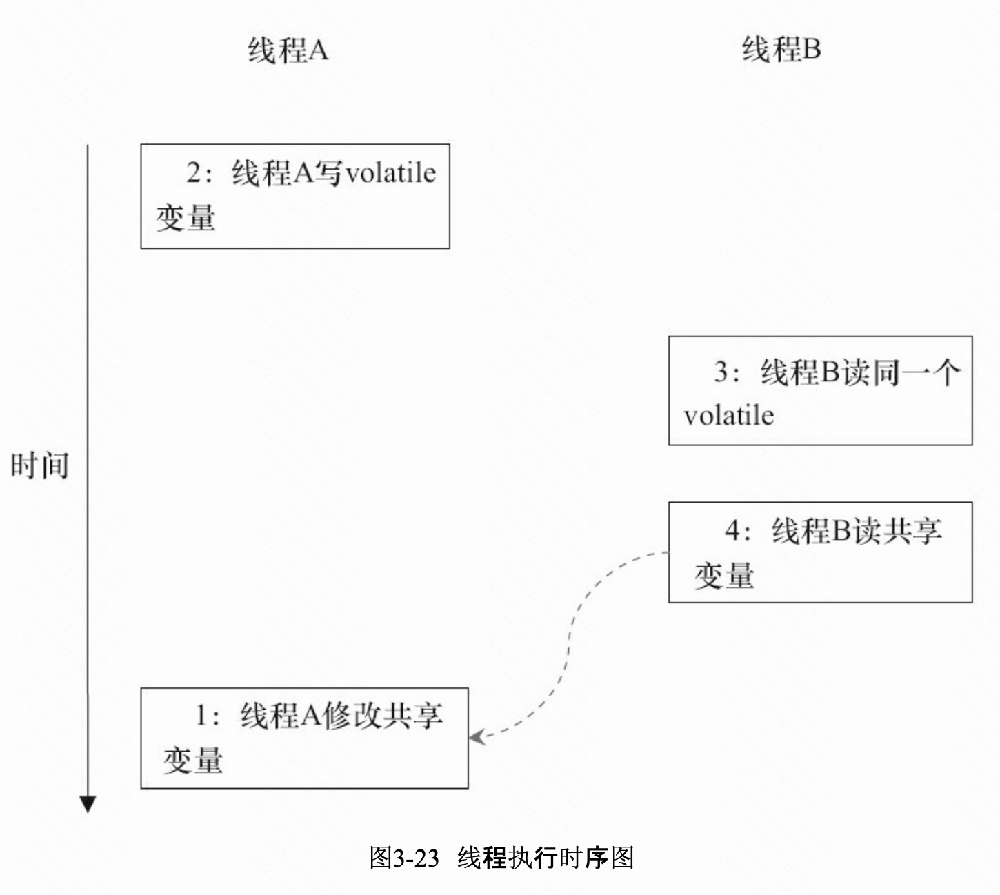
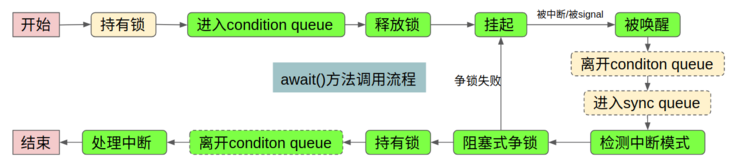
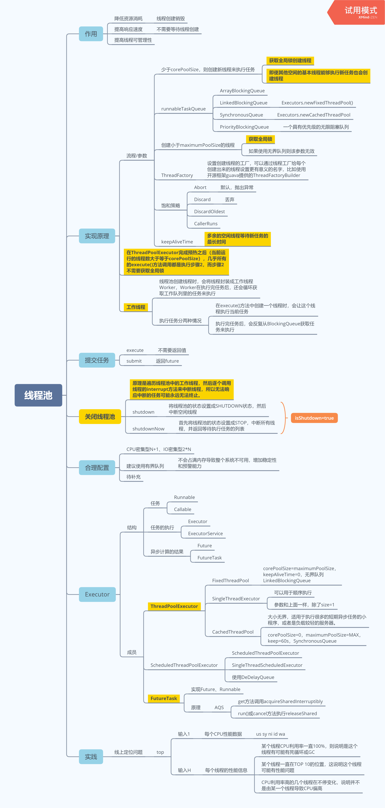
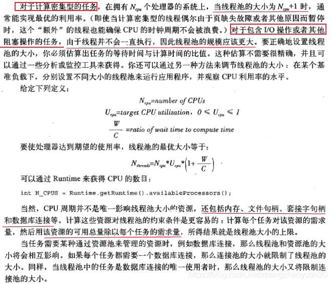
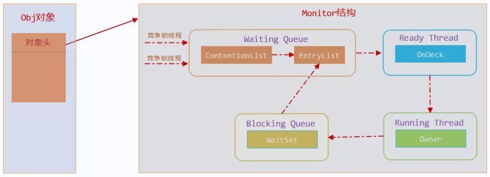
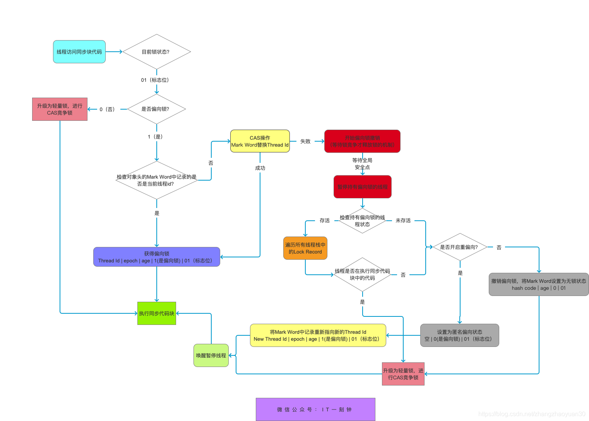
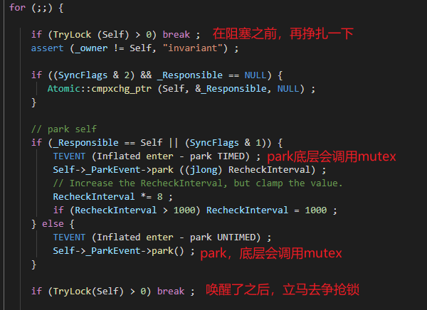
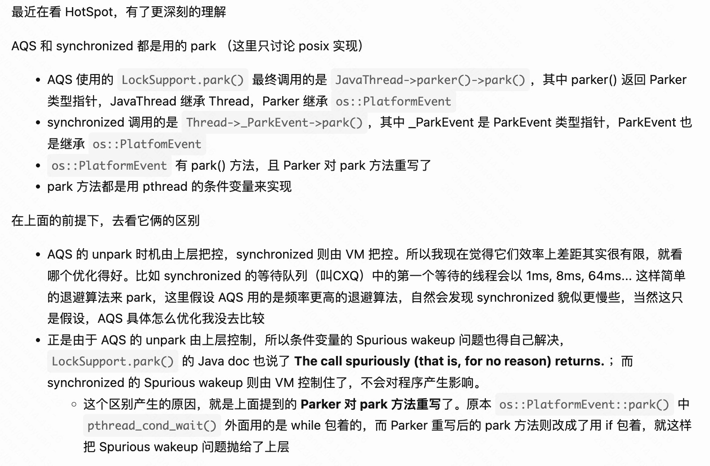

<!-- TOC -->

- [1.Reentrantlock怎么实现？](#1reentrantlock怎么实现)
- [2.AQS原理？](#2aqs原理)
  - [2.1 独占锁](#21-独占锁)
  - [2.2 共享锁](#22-共享锁)
- [3.ReentrantLock优势？](#3reentrantlock优势)
- [4.ConcurrentHashMap原理？](#4concurrenthashmap原理)
  - [4.1 JDK7](#41-jdk7)
  - [4.2 JDK8：](#42-jdk8)
    - [4.2.1 扩容](#421-扩容)
  - [4.3 迭代](#43-迭代)
- [5.内存模型？](#5内存模型)
  - [5.1 JMM：共享内存模型？](#51-jmm共享内存模型)
  - [5.2 Hapens-Before是什么？](#52-hapens-before是什么)
  - [5.3 重排序是什么？](#53-重排序是什么)
    - [5.3.1 重排序分类](#531-重排序分类)
    - [5.3.2 处理器重排序和内存屏障](#532-处理器重排序和内存屏障)
    - [5.3.3 as-if-serial语义](#533-as-if-serial语义)
  - [5.4 顺序一致性](#54-顺序一致性)
  - [5.5 JMM 如何支持顺序一致性？](#55-jmm-如何支持顺序一致性)
- [6.volatile有什么用？](#6volatile有什么用)
  - [6.1 内存语义](#61-内存语义)
  - [6.2 内存语义的实现](#62-内存语义的实现)
    - [6.2.3 指令层面](#623-指令层面)
    - [6.2.1 禁止编译重排序](#621-禁止编译重排序)
    - [6.2.2 禁止指令重排序](#622-禁止指令重排序)
  - [6.3 JSR-133为什么要增强volatile的内存语义](#63-jsr-133为什么要增强volatile的内存语义)
  - [6.4 优化](#64-优化)
  - [6.5 线程安全的单例？](#65-线程安全的单例)
- [7.final如何保证初始化安全性？](#7final如何保证初始化安全性)
- [8.wait/notify](#8waitnotify)
  - [8.1 wait和condition区别？](#81-wait和condition区别)
  - [8.2 wait实现方式？](#82-wait实现方式)
  - [8.2 condition实现方式？](#82-condition实现方式)
- [10.ThreadLocal原理？](#10threadlocal原理)
- [11.阻塞队列有哪些？](#11阻塞队列有哪些)
- [12.Fork/join是什么？原理是？](#12forkjoin是什么原理是)
- [13.原子类有哪些？](#13原子类有哪些)
  - [13.1 原理](#131-原理)
  - [13.2 ABA问题？](#132-aba问题)
- [14.并发工具类了解哪些？](#14并发工具类了解哪些)
  - [14.1 CyclicBarrier VS CountDownLatch](#141-cyclicbarrier-vs-countdownlatch)
- [15.线程池用法？](#15线程池用法)
- [15.CompletableFuture?](#15completablefuture)
- [16 Synchronized实现](#16-synchronized实现)
- [17 锁优化](#17-锁优化)
  - [17.1 偏向锁](#171-偏向锁)
  - [17.2 轻量级锁](#172-轻量级锁)
  - [17.3 重量级锁](#173-重量级锁)

<!-- /TOC -->
# 1.Reentrantlock怎么实现？
CAS（Compare And Swap）是一种无锁算法，它的实现是通过CPU原语来实现的，不需要进行系统调用

- Sync:
  - nonfairTryAcquire  
   如果stat=0，cas操作设置stat为1，设置持锁线程  
   否则，如果重入则加1
   - tryRelease
   先判断是否是持锁线程，然后设置stat为getStat-1
- NonfairSync:
    - tryAcquire调用nonfairTryAcquire
- FairSync:  
    - tryAcquire    
    如果stat=0，**先判断队列中是否有其他线程等待**，如果没有cas操作设置stat为1，设置持锁线程  
    否则stat=1，如果重入则加1

# 2.AQS原理？
- 状态：
    ```java 
    private volatile int state;
    ```
- 基于模板方法模式
    - 模板方法分为三类
        - 独占式获取与释放同步状态 acquire
        - 共享式获取与释放同步状态 acquireShared
        - 查询同步队列中的等待线程情况
    - 步骤
        1. 使用者需要**继承**同步器并**重写**指定的方法    
        2. 将同步器**组合**在自定义同步组件的实现中
        3. 调用同步器提供的模板方法：模板方法将会调用使用者重写的方法
    - 可重写方法  
    tryAcquire、tryRelease、tryAcquireShared、tryReleaseShared、isHeldExclusively
- 队列
    - head节点是空节点
    - waitStatus属性：
        - CANCELLED 1 ：超时或者中断，节点已取消
        - SIGNAL -1：表示下一个节点是通过park阻塞的，需要通过unpark唤醒
        - CONDITION -2：在条件队列中
        - PROPAGATE：共享模式下状态需要向后传播
## 2.1 独占锁
- acquire:

    ```JAVA
    public final void acquire(int arg) {
        //获取stat
        if (!tryAcquire(arg) &&
        //不成功则加入队列尾部
        acquireQueued(addWaiter(Node.EXCLUSIVE), arg))
        selfInterrupt();
    }
    ```
    acquireQueued()中循环判断前驱是否头结点：
    - 是，tryAcquire，成功后当前节点设为头结点
    - 否，进入等待
- release：
    ```JAVA
    public final boolean release(int arg) {
        if (tryRelease(arg)) {
        Node h = head;
        if (h != null && h.waitStatus != 0)
            unparkSuccessor(h);
        return true;
        }
        return false;
    }
    ```
    unparkSuccessor()的作用是**唤醒当前线程的后继线程**
## 2.2 共享锁
- acquireShared：
    ```java
    public final void acquireShared(int arg) {
        if (tryAcquireShared(arg) < 0)
            doAcquireShared(arg);
    }
    ```
    - tryAcquireShared() 返回值语义：
        - 负值代表失败
        - 0代表成功但没有剩余资源
        - 正数代表剩余资源
    - doAcquireShared 和 独占的acquireQueued基本一致，不同点：
        - 如果还有剩余量，继续唤醒下一个邻居线程
        - 会调用**doReleaseShared**：因为在共享锁模式下，锁可以被多个线程所共同持有，既然当前线程已经拿到共享锁了，那么就可以直接通知后继节点来拿锁，而不必等待锁被释放的时候再通知
- releaseShared：在tryReleaseShared后也会调用doReleaseShared
- doReleaseShared：
    - [共享锁的获取与释放](https://segmentfault.com/a/1190000016447307)
- 应用：CountDownLatch、Semaphore
- 读写锁需要在tryXXX方法中判断读节点和写节点
# 3.ReentrantLock优势？
公平性，可超时，可中断，尝试获取
# 4.ConcurrentHashMap原理？  
- 参考
    - [JDK8原理](https://www.cnblogs.com/yangming1996/p/8031199.html)
- get不加锁
## 4.1 JDK7
包含一个Segment数组。Segment的结构和HashMap类似，是一种数组和链表结构。所以每一个 HashMap 的内部可以进行扩容。但是 Segment 的个数一旦初始化就不能改变，默认 Segment 的个数是 16 个，你也可以认为 ConcurrentHashMap 默认支持最多 16 个线程并发
- segments数组的长度*ssize*是2的N次方，大于或等于**concurrencyLevel**的最小的2的N次方值
- cap=initialCapacity除以ssize  
## 4.2 JDK8：
[ConcurrentHashMap之扩容实现（基于JDK1.8）](https://www.jianshu.com/p/fc72281e529f)
- sizeCtl:
    - 0：默认值
    - -1：代表哈希表正在进行初始化
    - 大于0：相当于 HashMap 中的 threshold，表示阈值
    - 小于-1：-(1 + 扩容线程数)
- put:  
    - 如果未初始化先初始化initTable()
    - 当前 key 定位出的 Node，如果为空表示当前位置可以写入数据，利用 CAS 尝试写入
    - 如果当前位置的 hashcode == MOVED == -1,则需要进行扩容，使用helpTransfer()方法帮助正在进行resize操作
    - 如果都不满足，则利用 synchronized 锁当前Node，写入数据
    - 如果数量大于 TREEIFY_THRESHOLD 则要转换为红黑树
    - 执行addCount方法，CAS 式更新baseCount，并判断是否需要扩容
- initTable：
    只允许一个线程对表进行初始化，如果不巧有其他线程进来了，那么会让其他线程yield()交出 CPU 等待下次系统调度
### 4.2.1 扩容
触发（和HashMap一致）：
- 往map中添加元素的时候，在某一个节点的数目已经超过了8个，同时数组的长度又小于64的时候，才会触发数组的扩容。
- 当数组中元素达到了sizeCtl的数量的时候

过程：
1. 线程执行put操作，发现容量已经达到扩容阈值，需要进行扩容操作，此时transferindex=tab.length=32
2. 扩容线程A **以CAS的方式修改transferindex=31-16=16** ,然后按照降序迁移table[31]至table[16]这个区间的hash桶
3. 迁移hash桶时，会将桶内的链表或者红黑树，按照一定算法，拆分成2份，将其插入nextTable[i]和nextTable[i+n]（n是table数组的长度）。 迁移完毕的hash桶,会被设置成ForwardingNode节点，以此告知访问此桶的其他线程，此节点已经迁移完毕。
4. 此时线程2访问到了ForwardingNode节点，如果线程2执行的put或remove等写操作，那么就会先帮其扩容。如果线程2执行的是get等读方法，则会调用ForwardingNode的find方法，去nextTable里面查找相关元素，而不会帮忙扩容。
## 4.3 迭代
不是快速失败，而是弱一致迭代器，确保可遍历迭代器**构造时存在的元素**，此外还可能（但并不保证）反映构造后的所有修改
# 5.内存模型？
## 5.1 JMM：共享内存模型？
- 线程之间的通信机制有两种：共享内存和消息传递，Java采用共享内存
- JMM 定义了线程和主内存之间的抽象关系
    - 共享变量（被各个线程共享的变量，区别于局部变量）存储在主内存
    - 本地内存存储共享变量的**副本**。本地内存是一个**抽象概念**，涵盖了缓存、寄存器等
    - 两个线程**通信需要经过主内存**
## 5.2 Hapens-Before是什么？
- 定义：JSR-133使用happens-before的概念来**阐述操作之间的内存可见性**。在JMM中，如果**一个操作执行的结果需要对另一个操作可见**，那么这两个操作之间必须要存在happens-before关系。此外，如果重排序之后的执行结果，与按happens-before关系来执行的结果一致，那么这种重排序并不非法。
- 一个happens-before规则对应于一个或多个编译器和处理器**重排序规则**。对于Java程序员来说，happens-before规则简单易懂，它**避免**Java程序员为了理解JMM提供的内存可见性保证而去学习复杂的**重排序规则**以及这些规则的具体实现方法

- 包含：程序顺序、synchronized、volatile、传递性
## 5.3 重排序是什么？
重排序是指编译器和处理器为了优化程序性能而对指令序列进行重新排序的一种手段
### 5.3.1 重排序分类
1. 编译器重排序
2. 指令级并行
3. 内存系统的重排序


上述的1属于编译器重排序，2和3属于处理器重排序。这些重排序可能会导致多线程程序出现内存可见性问题。
- 对于编译器，JMM的编译器重排序规则会禁止特定类型的编译器重排序(不是所有的编译器重排序都要禁止)。
- 对于处理器重排序，JMM的处理器重排序规则会要求Java编译器在生成指令序列时，插入特定类型的内存屏障(Memory Barriers，Intel称之为 Memory Fence)指令，**通过内存屏障指令来禁止特定类型的处理器重排序**。

### 5.3.2 处理器重排序和内存屏障


### 5.3.3 as-if-serial语义
不管怎么重排序（编译器和处理器为了提高并行度），（单线程）程序的执行结果不能被改变。**编译器、runtime和处理器**都必须遵守as-if-serial语义。

为了遵守as-if-serial语义，编译器和处理器**不会对存在数据依赖关系的操作做重排序**，因 为这种重排序会改变执行结果。
## 5.4 顺序一致性
与单线程的as-if-serial不同，在多线程程序中，对存在**控制依赖的操作**重排序，可能会改变程序的执行结果。  
JMM对正确同步的多线程程序的内存一致性做了如下保证：如果程序是正确同步的，程序的执行将具有**顺序一致性**（Sequentially Consistent）——即程序的执行结果与该程序在**顺序一致性内存模型**中的执行结果相同。

- 顺序一致性内存模型（ZK读）
    - 一个线程中的所有操作必须按照程序顺序来执行
    - （不管程序是否同步）**所有线程都只能看到一个单一的操作执行顺序**（而不是不同线程看到的顺序不一样，所以**一个线程看另一个线程的执行顺序也是顺序**的），**因为**在顺序一致性内存模型中，每个操作都必须原子执行且立刻对所有线程可见。
- 线性一致性（ZK写）：读操作应当返回最近的写操作所写入的结果。如果A的完成时间小于B的开始时间，那么B一定可以看到A的结果。一旦客户端的写操作成功执行了，所有客户端都能读取到最新的值。
- 不同点：顺序一致性对另一个线程执行的实时性没有要求
## 5.5 JMM 如何支持顺序一致性？
- 同步程序：JMM对临界区内（同步措施内）会进行重排序，虽然不符合顺序一致性模型的要求（所有操作完全按**程序的顺序串行**执行），但JMM会在**退出临界区和进入临界区**进行同步措施，使得线程在这两个时间点具有与顺序一致性模型相同的内存视图（具体细节后文会说明）。而且由于监视器互斥执行的特性，**线程B根本无法“观察”到线程A在临界区内的重排序**。**这种重排序既提高了执行效率，又没有改变程序的执行结果。**
- 未同步程序：提供最小安全性：线程执行时读取到的值，**要么是之前某个线程写入的值，要么是默认值（0，Null，False）**。为了实现最小安全性，JVM在堆上分配对象时，首先会对内存空间进行清零，然后才会在上面分配对象（JVM内部会同步这两个操作）。
# 6.volatile有什么用？
- 特性：
    - 可见性。对一个volatile变量的读，总是能看到(任意线程)对这个volatile变量最后的写入。
    - 原子性:对任意单个volatile变量的读/写具有原子性，但类似于volatile++这种复合操作不 具有原子性。
- 根据volatile原则和传递性原则，建立的happens-before关系  
## 6.1 特性
理解volatile特性的一个好方法是把对volatile变量的单个读/写，看成是使用同一个锁对这些单个读/写操作做了同步。下面通过具体的示例来说明，示例代码如下。
```java
class VolatileFeaturesExample {
    volatile long vl = 0L;

    public void set(long l) { 
        vl=l;
    }
    public void getAndIncrement () {
        vl++;
    }
    public long get() {
        return vl;
    } 
}
```
```java
class VolatileFeaturesExample {
       long vl = 0L;
    public synchronized void set(long l) {
        vl = l;
    }
    public void getAndIncrement () {
        long temp = get();
        temp += 1L;
        set(temp);
    }
    public synchronized long get() {
        return vl; 
    }
}
```
如上面示例程序所示，一个volatile变量的单个读/写操作，**与一个普通变量的读/写操作都 是使用同一个锁来同步**，它们之间的执行效果相同。
- 锁的happens-before规则保证释放锁和获取锁的两个线程之间的内存可见性，这意味着对一个volatile变量的读，总是能看到(任意线程)对这个volatile变量最后的写入。
- 锁的语义决定了临界区代码的执行具有原子性。这意味着，即使是64位的long型和double 型变量，只要它是volatile变量，对该变量的读/写就具有原子性。如果是多个volatile操作或类 似于volatile++这种复合操作，这些操作整体上不具有原子性。
- 简而言之，volatile变量自身具有下列特性。
    - 可见性。对一个volatile变量的读，总是能看到(任意线程)对这个volatile变量最后的写
入。
    - 原子性:对任意单个volatile变量的读/写具有原子性，但类似于volatile++这种复合操作不 具有原子性。
## 6.2 JSR-133内存语义和实现
[深入理解java内存屏障(volatile实现原理)](https://blog.csdn.net/u013291050/article/details/117335477)

内存模型，主要是以下三个准则：
1. 所有volatile读写之间相互串行化。volatile属性进行写操作后，其他CPU能马上读到最新值。
2. volatile读取操作之后发生的非volatile读写不能乱序到其之前。
3. volatile写操作之前发生的非volatile读写不能乱序到其之后。

怎么看待以上三句话呢？
1. 第一点很好理解，就是volatile的可见性要求。
2. 第二点是为了维护happens-before准则。给个具体场景进行理解：比如我要在进行volatile读后，根据读到的值进行一些代码逻辑操作，如果这些逻辑重排到了volatile读之前，则可以理解这些逻辑代码都是基于一个旧 volatile 值做的，即逻辑上不满足volatile是最新的值。
3. 第三点和第二点类似，也是为了维护happens-before准则。比如我先进行一段代码逻辑，再进行volatile写，如果这些逻辑重排到volatile写之后，当其他cpu看到volatile写操作时，就无法确实volatile写操作之前的操作是否已经确实地发生了。
实现:禁止编译器和处理器重排序
### 6.2.0 指令层面
有volatile变量修饰的共享变量进行写操作的时候会多出lock前缀的指令：在旧处理器上是锁总线，在新处理器上是锁缓存
1. Lock前缀指令会引起处理器缓存行回写到内存
2. 一个处理器的缓存回写到内存会导致其他处理器的缓存无效
### 6.2.1 禁止编译重排序
[Java内存访问重排序的研究](https://tech.meituan.com/2014/09/23/java-memory-reordering.html)
```java
  class VolatileExample {
        int                    a = 0;
        volatile boolean flag = false;
        public void writer() {
            a = 1;      // 1
            flag = true;    // 2 
        }
        public void reader() {
            if (flag) {    // 3
                sout(a);// 4
            }
        }
   }
```

1. 当第二个操作是volatile写时，不管第一个操作是什么，都不能重排序。这个规则确保
volatile写之前的操作不会被**编译器**重排序到volatile写之后。
2. 当第一个操作是volatile读时，不管第二个操作是什么，都不能重排序。这个规则确保volatile读之后的操作不会被**编译器**重排序到volatile读之前。
3. 当第一个操作是volatile写，第二个操作是volatile读时，不能重排序。
### 6.2.2 禁止指令重排序
为了实现volatile的内存语义，编译器在生成字节码时，会在指令序列中**插入内存屏障**来禁止特定类型的处理器重排序。对于编译器来说，发现一个最优布置来最小化插入屏障的总数几乎不可能。为此，JMM采取保守策略。下面是基于保守策略的JMM内存屏障插入策略。
1. 在每个volatile写操作的前面插入一个StoreStore屏障。  
volatile 写
2. 在每个volatile写操作的后面插入一个StoreLoad屏障。  
volatile 读
3. 在每个volatile读操作的后面插入一个LoadLoad屏障。
4. 在每个volatile读操作的后面插入一个LoadStore屏障。

上述内存屏障插入策略非常保守，但它可以保证在任意处理器平台，任意的程序中都能 得到正确的volatile内存语义。

X86不会对读-读、读-写和写-写操作 做重排序，因此在X86处理器中会省略掉这3种操作类型对应的**处理器内存屏障（编译器重排序依然存在）**。在X86中，JMM仅需 在volatile写后面插入一个StoreLoad屏障即可正确实现volatile写-读的内存语义。这意味着在 X86处理器中，volatile写的开销比volatile读的开销会大很多(因为执行StoreLoad屏障开销会比 较大)。
## 6.3 JSR-133为什么要增强volatile的内存语义
在JSR-133之前的旧Java内存模型中，虽然不允许volatile变量之间重排序，但旧的Java内 存模型允许volatile变量与普通变量重排序。

在旧的内存模型中，当1和2之间没有数据依赖关系时，1和2之间就可能被重排序(3和4类 似)。其结果就是:读线程B执行4时，不一定能看到写线程A在执行1时对共享变量的修改。

因此，在旧的内存模型中，volatile的写-读没有锁的释放-获所具有的内存语义。

为了提供一种**比锁更轻量级的线程之间通信的机制**，JSR-133专家组决定增强volatile的内存语义:严格限制编译器和处理器对volatile变量与普通变量的重排序，确保**volatile的写-读和锁的释放-获取具有相同的内存语义**。从编译器重排序规则和处理器内存屏障插入策略来看，**只要volatile 变量与普通变量之间的重排序可能会破坏volatile的内存语义**，这种重排序就会被编译器重排序规则和处理器内存屏障插入策略禁止。

## 6.4 优化
伪共享优化，见Netty
## 6.5 线程安全的单例？
双检锁为什么volatile？
1. 分配对象的内存空间
2. 初始化对象
3. 变量赋值
# 7.final如何保证初始化安全性？
之所以要保证final域的初始化安全性，是因为final域本身就是初始化之后不可变的
- 两个final域重排序规则
    - 写  
    在构造函数内对一个final域的写入，与随后把这个被构造对象的引用赋值给一个引用变量，这两个操作之间不能重排序。（写final域的重排序规则可以确保：在对象引用为任意线程可见之前，对象的final域已经被正确初始化过了）
    - 读  
    初次读一个包含final域的对象的引用，与随后初次读这个final域，这两个操作之间不能重排序
    - 原理禁止编译器重排序和内存屏障
- final域为引用类型  
在构造函数内对一个final对象的**成员域**的写入，与随后在构造函数外把这个被构造对象的引用赋值给一个引用变量
- this溢出（自己保证）
    - 不能在构造函数内把this赋值给其他变量  
    - 在构造函数返回前，被构造对象的引用不能为其他线程所见，因为此时的final域可能还没有被初始化。在构造函数返回后，任意线程都将保证能看到final域正确初始化之后的值

# 8.wait/notify
- 等待/通知机制**依托于同步机制**，其目的就是确保等待线程从wait()方法返回时能够感知到通知线程对变量做出的修改
- 经典范式  
加锁、条件循环、处理逻辑
    ```JAVA
    //  等待方
    synchronized(对象) {
        while(条件不满足) {
            对象.wait();
        }
        // 对应的处理逻辑
    }
    // 通知方
    synchronized(对象) {
        改变条件
        对象.notifyAll();
    }
    ```    
- 原理
    - notify()方法将等待队列中的一个等待线程从**等待队列**中移到**同步队列**中
    - 而notifyAll()
    方法则是将等待队列中所有的线程全部移到同步队列，被移动的线程状态由WAITING变为BLOCKED
## 8.1 wait和condition区别？
- 区别
    - 支持在等待中不响应中断
    - 支持等待到将来某个时间
## 8.2 wait实现方式？
- wait
    1. 将当前线程封装成ObjectWaiter对象node
    2. 通过ObjectMonitor::AddWaiter方法将node添加到_WaitSet列表中
    3. 通过ObjectMonitor::exit方法释放当前的ObjectMonitor对象，这样其它竞争线程就可以获取该ObjectMonitor对象
    4. 最终底层的park方法会挂起线程
- notify
    1. 如果当前_WaitSet为空，即没有正在等待的线程，则直接返回；
    2. 通过ObjectMonitor::DequeueWaiter方法，获取_WaitSet列表中的第一个ObjectWaiter节点
    3. 根据不同的策略，将取出来的ObjectWaiter节点，加入到_EntryList或则通过 Atomic::cmpxchg_ptr指令进行自旋操作cxq
## 8.2 condition实现方式？
- 每一个Condition对象对应一个Conditon队列
- 调用await(), 则当前线程就会被包装成Node加到Condition队列的末尾
- condition queue是一个单向链表，在该链表中我们使用**nextWaiter**属性来串联链表。但是，就像在sync queue中不会使用nextWaiter属性来串联链表一样，在condition queue中，也**并不会用到prev, next属性**，它们的值都为null
- 只会用到3个属性
    - thread
    - waitStatus：如果不是CANCELLED=1，就出队
    - nextWaiter

# 10.ThreadLocal原理？
- 每个线程持有一个ThreadLocalMap
- ThreadLocalMap的key为当前ThreadLocal
- 可以继承ThreadLocal，覆写initialValue()方法
```JAVA
public void set(T value) {
    Thread t = Thread.currentThread();
    // 每个线程持有一个ThreadLocalMap
    ThreadLocalMap map = getMap(t);
    if (map != null) {
        // key为当前ThreadLocal
        map.set(this, value);
    } else {
        createMap(t, value);
    }        
}

ThreadLocalMap getMap(Thread t) {
    return t.threadLocals;
}

public T get() {
    Thread t = Thread.currentThread();
    ThreadLocalMap map = getMap(t);
    if (map != null) {
        ThreadLocalMap.Entry e = map.getEntry(this);
        if (e != null) {
            @SuppressWarnings("unchecked")
            T result = (T)e.value;
            return result;
        }
    }
    // 可以继承ThreadLocal，覆写initialValue()方法
    return setInitialValue();
}
```
- ThreadLocal和WeakReference
    ```java
    static class Entry extends WeakReference<ThreadLocal<?>> {
        /** The value associated with this ThreadLocal. */
        Object value;

        Entry(ThreadLocal<?> k, Object v) {
            super(k);
            value = v;
        }
    }
    ```
    WeakReference对引用的对象threadLocal是弱引用，不会影响到threadLocal的GC
    >被弱引用引用的对象只能存活到下次GC之前
    - **如果是强引用**的话，在线程运行过程中，我们不再使用threadLocal了，将threadLocal置为null，但threadLocal**在ThreadLocalMap里还有引用**，导致其无法被GC回收
    - 而Entry声明为WeakReference，threadLocal置为null后，就可以被GC回收了。对于value，ThreadLocal 在执行 **ThreadLocal.set()/get() 方法时，会清除 ThreadLocalMap 中 key 为 NULL 的 Entry 对象**，让它还能够被 GC 回收。
    - 除此之外，当线程中某个 ThreadLocal 对象不再使用时，应该立即调用 remove() 方法删除 Entry 对象。如果是在异常的场景中，记得在 finally 代码块中进行清理，保持良好的编码意识。
- InheritableThreadLocal
[ThreadLocal父子线程数据传递方案](https://cloud.tencent.com/developer/article/1162226)
    - InheritableThreadLocal会在new线城时从父线程拷贝一份
    - 对于线程池，因为重用线程，所以前面的任务会把父线程的数据覆盖掉。使用阿里的TransmittableThreadLocal，配合TtlRunnable包装Runnable，在任务执行前重新从父线程拷贝数据，在任务结束后清除数据。
# 11.阻塞队列有哪些？

- 有界
    - ArrayBlockingQueue

- 无界
    - LinkedBlockingQueue
    - PriorityBlockingQueue
    - DelayQueue  
    延时获取元素
        - 应用场景
            - 缓存系统
            - 定时任务调度
- 其他
    - SynchronousQueue
    不存储元素的阻塞队列。每一个put操作必须等待一个take操作，否则不能继续添加元素。
# 12.Fork/join是什么？原理是？
[Java 并发编程笔记：如何使用 ForkJoinPool 以及原理](http://blog.dyngr.com/blog/2016/09/15/java-forkjoinpool-internals/)
```JAVA
public class ForkJoinCalculator implements Calculator {
    private ForkJoinPool pool;

    private static class SumTask extends RecursiveTask<Long> {
        private long[] numbers;
        private int from;
        private int to;

        public SumTask(long[] numbers, int from, int to) {
            this.numbers = numbers;
            this.from = from;
            this.to = to;
        }

        @Override
        protected Long compute() {
            // 当需要计算的数字小于6时，直接计算结果
            if (to - from < 6) {
                long total = 0;
                for (int i = from; i <= to; i++) {
                    total += numbers[i];
                }
                return total;
            // 否则，把任务一分为二，递归计算
            } else {
                int middle = (from + to) / 2;
                SumTask taskLeft = new SumTask(numbers, from, middle);
                SumTask taskRight = new SumTask(numbers, middle+1, to);
                taskLeft.fork();
                taskRight.fork();
                return taskLeft.join() + taskRight.join();
            }
        }
    }

    public ForkJoinCalculator() {
        // 也可以使用公用的 ForkJoinPool：
        // pool = ForkJoinPool.commonPool()
        pool = new ForkJoinPool();
    }

    @Override
    public long sumUp(long[] numbers) {
        return pool.invoke(new SumTask(numbers, 0, numbers.length-1));
    }
}
```
- 工作窃取算法  
被窃取任务线程永远从双端队列的头部拿任务执行，而窃取任务的线程永远从双端队列的尾部拿任务执行。
- ForkJoinTask
    - fork：把任务推入当前工作线程的工作队列
    - join：
        1. 检查调用 join() 的线程是否是 ForkJoinThread 线程。如果不是（例如 main 线程），则阻塞当前线程，等待任务完成。如果是，则不阻塞。
        2. 查看任务的完成状态，如果已经完成，直接返回结果。
        3. 如果任务尚未完成，但处于自己的工作队列内，则完成它。
        4. 如果任务已经被其他的工作线程偷走，则窃取这个小偷的工作队列内的任务（以 FIFO 方式），执行，以期帮助它早日完成欲 join 的任务。
        5. 如果偷走任务的小偷也已经把自己的任务全部做完，正在等待需要 join 的任务时，则找到小偷的小偷，帮助它完成它的任务。
        6. 递归地执行第5步。
    - compute
        - 任务是否足够小就直接执行任务
        - 如果不足够小，就必须分割成两个子任务，join方法获取执行结果后合并
    - 实现类
        - RecursiveAction：无返回结果
        - RecursiveTask：有返回结果
- ForkJoinPool
    -  Async mode
        - true：FIFO
        - false：LIFO
    - 可以提交非fork/join型任务，随便不能拆解但是可以使用工作窃取（避免一个队列加锁？）
    - ：为什么工作线程总是从自己的头部获取任务？为什么要这样设计？首先处理队列中等待时间较长的任务难道不是更有意义吗？
        1. 通过始终选择最近提交的任务，可以增加资源仍分配在 CPU 缓存中的机会，这样 CPU 处理起来要快一些。而窃取者之所以从尾部获取任务，则是为了降低线程之间的竞争可能，毕竟大家都从一个部分拿任务，竞争的可能要大很多。
        2. 此外，这样的设计还有一种考虑。由于任务是可分割的，那队列中较旧的任务最有可能粒度较大，因为它们可能还没有被分割，而空闲的线程则相对更有“精力”来完成这些粒度较大的任务。

# 13.原子类有哪些？
基本、数组、引用
## 13.1 原理
volatile+cas
## 13.2 ABA问题？
- AtomicStampedReference：标志
# 14.并发工具类了解哪些？
- CountdownLatch
    - await: sync.acquireSharedInterruptibly(1)
    - countDown: sync.releaseShared(1)
- CyclicBarrier
    - await
    - reset()重置
- Semaphore
    - 控制同时访问特定资源的线程数量
    - acquire
    - release
- Exchanger
    - exchange方法交换数据  
    用于校对
## 14.1 CyclicBarrier VS CountDownLatch
- CyclicBarrier：N个线程互相等待，可重用
- CountDownLatch：1个线程等N个线程
# 15.线程池用法？
[面试题-关于Java线程池一篇文章就够了](https://blog.csdn.net/wo541075754/article/details/103570466)

- 线程池的几个参数  
见xmind  
- shutdown、shutdownNow
- 线程池大小
    
- keepAliveTime 参数通常与 allowCoreThreadTimeOut 参数一起使用。allowCoreThreadTimeOut 参数表示是否允许核心线程在空闲一定时间后被终止。如果 allowCoreThreadTimeOut 为 true，则核心线程在空闲时间超过 keepAliveTime 时也会被终止。
# 15.CompletableFuture?
[CompletableFuture 详解（一）：基本概念及用法](https://blog.csdn.net/tongtest/article/details/107549749)
# 16 Synchronized实现
- [Synchronized 轻量级锁会自旋？好像并不是这样的。](https://www.cnblogs.com/yescode/p/14474104.html)
- 偏向锁：无竞争的情况下，只有一个线程进入临界区，采用偏向锁
- 轻量级锁：多个线程可以交替进入临界区，采用轻量级锁
- 重量级锁：多线程同时进入临界区，交给操作系统互斥量来处理
```c++
ObjectMonitor() {
    _header       = NULL;
    _count        = 0; //记录个数
    _waiters      = 0,
    _recursions   = 0;
    _object       = NULL;
    _owner        = NULL;
    _WaitSet      = NULL; //处于wait状态的线程，会被加入到_WaitSet
    _WaitSetLock  = 0 ;
    _Responsible  = NULL ;
    _succ         = NULL ;
    _cxq          = NULL ;
    FreeNext      = NULL ;
    _EntryList    = NULL ; //处于等待锁block状态的线程，会被加入到该列表
    _SpinFreq     = 0 ;
    _SpinClock    = 0 ;
    OwnerIsThread = 0 ;
  }
```

- 重量级锁的状态下，对象的mark word为指向一个monitor对象的指针
- 当一个线程尝试获得锁时，如果该锁已经被占用，则会将该线程封装成一个ObjectWaiter对象**通过CAS**插入到cxq的队列尾部（在这之前会尝试自旋），然后挂起当前线程。当持有锁的线程释放锁前，会将cxq中的所有元素移动到EntryList中去，并唤醒EntryList的队首线程
- 当线程释放锁时，会从cxq或EntryList中挑选一个线程唤醒（默认是EntryList非空就取队首唤醒，为空就将cxq的所有元素顺序放入到EntryList中唤醒队首），被选中的线程叫做Heir presumptive即假定继承人（应该是这样翻译），就是图中的Ready Thread，假定继承人被唤醒后会尝试获得锁，但synchronized是非公平的，所以假定继承人不一定能获得锁（这也是它叫”假定”继承人的原因）。
- 如果线程获得锁后调用Object#wait方法，则会将线程加入到WaitSet中，当被Object#notify唤醒后，会将线程从WaitSet移动到cxq或EntryList中去。需要注意的是，当调用一个锁对象的wait或notify方法时，如当前锁的状态是偏向锁或轻量级锁则会先膨胀成重量级锁。
> 为什么会有_cxq 和 _EntryList 两个列表来放线程？  
因为会有多个线程会同时竞争锁，所以搞了个 _cxq 这个单向链表基于 CAS 来 hold 住这些并发，然后另外搞一个 _EntryList 这个双向链表，来在每次唤醒的时候搬迁一些线程节点，降低 _cxq 的尾部竞争。
# 17 锁优化

偏向锁是只能偏向一次，适用于自始至终只有一个线程执行的场景；当有两个（及以上）线程交替执行时，需要升级到轻量级锁；而当有两个（及以上）线程同时执行时，会进一步升级为重量级锁。

[锁升级](https://bbs.huaweicloud.com/blogs/345926)

在上一篇文章中，我们提到过 jvm会有4秒的偏向锁开启的延迟时间，在这个偏向延迟内对象处于为无锁态(001)。如果关闭偏向锁启动延迟、或是经过4秒且没有线程竞争对象的锁，那么对象会进入无锁可偏向状态。

> 在无锁状态下，为什么要存在一个不可偏向状态呢？通过查阅资料得到的解释是：JVM内部的代码有很多地方也用到了synchronized，明确在这些地方存在线程的竞争，如果还需要从偏向状态再逐步升级，会带来额外的性能损耗，所以JVM设置了一个偏向锁的启动延迟，来降低性能损耗

也就是说，在无锁不可偏向状态下，如果有线程试图获取锁，那么将跳过升级偏向锁的过程，直接使用轻量级锁。使用代码进行验证：

准确来说，无锁可偏向状态应该叫做匿名偏向(Anonymously biased)状态，因为这时对象的mark word中后三位已经是101，但是threadId指针部分仍然全部为0，它还没有向任何线程偏向。综上所述，对象在刚被创建时，**根据jvm的配置对象可能会处于 无锁 或 匿名偏向 两个状态**。
## 17.1 偏向锁
匿名偏向状态是偏向锁的初始状态，在这个状态下第一个试图获取该对象的锁的线程，会使用CAS操作（汇编命令CMPXCHG）尝试将自己的threadID写入对象头的mark word中，使匿名偏向状态升级为已偏向（Biased）的偏向锁状态。在已偏向状态下，线程指针threadID非空，且偏向锁的时间戳epoch为有效值。

如果之后有线程再次尝试获取锁时，需要检查mark word中存储的threadID是否与自己相同即可，如果相同那么表示当前线程已经获得了对象的锁，不需要再使用CAS操作来进行加锁。

如果mark word中存储的threadID与当前线程不同，那么将执行CAS操作，试图将当前线程的ID替换mark word中的threadID。只有当对象处于下面两种状态中时，才可以执行成功：
- 对象处于匿名偏向状态
- 对象处于可重偏向（Rebiasable）状态（有次数阈值控制），新线程可使用CAS将threadID指向自己

如果对象不处于上面两个状态，说明锁存在线程竞争，在CAS替换失败后会执行偏向锁撤销操作。偏向锁的撤销需要等待全局安全点Safe Point（安全点是 jvm为了保证在垃圾回收的过程中引用关系不会发生变化设置的安全状态，在这个状态上会暂停所有线程工作），在这个安全点会挂起获得偏向锁的线程。

在暂停线程后，会通过遍历当前jvm的所有线程的方式，检查持有偏向锁的线程状态是否存活：
- 如果线程还存活，且线程正在执行同步代码块中的代码，则升级为轻量级锁
- 如果持有偏向锁的线程未存活，或者持有偏向锁的线程未在执行同步代码块中的代码，则进行校验是否允许重偏向：
  - 不允许重偏向，则撤销偏向锁，将mark word升级为轻量级锁，进行CAS竞争锁
  - 允许重偏向，设置为匿名偏向锁状态，CAS将偏向锁重新指向新线程

完成上面的操作后，唤醒暂停的线程，从安全点继续执行代码。
## 17.2 轻量级锁
- 在代码进入同步块的时候，如果同步对象锁状态为无锁状态（锁标志位为“01”状态，是否为偏向锁为“0”）
- 虚拟机首先将在当前线程的栈帧中建立一个名为锁记录（Lock Record）的空间，用于存储锁对象目前的**Mark Word的拷贝**，然后拷贝对象头中的Mark Word复制到锁记录中
- 拷贝成功后，虚拟机将使用**CAS操作尝试将对象Mark Word中的Lock Word更新为指向当前线程Lock Record的指针**，并将Lock record里的owner指针指向锁对象的 mark word
- 对象Mark Word的锁标志位设置为“00”，表示此对象处于轻量级锁定状态
- 轻量级锁CAS失败升级为重量级锁（**轻量级锁不会自旋，升级为重量级锁会自旋。所以偏向锁适合只有一个线程争锁，锁只加一次且不释放，轻量级锁适合交替加锁，所以每次都需要加锁和解锁**）
## 17.3 重量级锁

自旋锁

在jdk1.6以前，默认自旋次数是10次，如果超过这个次数或自旋线程数超过CPU核数的一半，就会升级为重量级锁。这时因为如果自旋次数过多，或过多线程进入自旋，会导致消耗过多cpu资源，重量级锁情况下线程进入等待队列可以降低cpu资源的消耗。

jdk1.6以后加入了自适应自旋锁 （Adapative Self Spinning），自旋的次数不再固定，由jvm自己控制，由前一次在同一个锁上的自旋时间及锁的拥有者的状态来决定：
- 对于某个锁对象，如果自旋等待刚刚成功获得过锁，并且持有锁的线程正在运行中，那么虚拟机就会认为这次自旋也是很有可能再次成功，进而允许自旋等待持续相对更长时间
- 对于某个锁对象，如果自旋很少成功获得过锁，那在以后尝试获取这个锁时将可能省略掉自旋过程，直接阻塞线程，避免浪费处理器资源。

- [深入分析Synchronized](https://www.cnblogs.com/aspirant/p/11470858.html)

- [Java锁与线程的那些事](https://tech.youzan.com/javasuo-yu-xian-cheng-de-na-xie-shi/)

## 17.4 synchronized和Reentrantlock

在 J2SE 6 中几乎没有区别——在大多数情况下两者都应该足够了。ReentrantLock 可能会更方便，如果你需要实现一个交接锁定协议。递交递交锁定的一个经典示例是遍历链表的线程，锁定下一个节点，然后解锁当前节点。这很难用 Java 的词法平衡同步构造来表达。然而， Synchronized是一种成熟的一流语言特性。

关于性能，这两种机制都能胜任这项任务。（值得注意的是，现代 JVM 中的同步原语提供的延迟和吞吐量性能通常优于本机 pthreads_mutex 构造）。内置的synchronized结构目前有一些优点，例如**锁粗化、偏向锁（见下文）和通过逃逸分析可能出现的锁省略**。目前尚未为 ReentrantLock 和朋友实施这些优化。然而，没有根本原因可以解释为什么 JVM 最终不能将此类优化应用于 ReentrantLock。

同步的实现还提供自适应旋转，而 ReentantLock 目前不提供。自适应旋转采用两阶段旋转然后阻塞策略。简而言之，在多处理器系统上，争用的同步输入尝试将在阻塞之前短暂旋转以避免上下文切换。