<!-- TOC -->

- [1.内存区域](#1内存区域)
    - [1.1线程私有](#11线程私有)
    - [1.2共享](#12共享)
        - [1.2.1 堆：存储对象实例和数组](#121-堆存储对象实例和数组)
        - [1.2.1 方法区（逻辑区域）](#121-方法区逻辑区域)
        - [1.2.1 运行时常量池Runtime Constant Pool](#121-运行时常量池runtime-constant-pool)
        - [1.2.1 直接内存](#121-直接内存)
- [2.虚拟机对象？](#2虚拟机对象)
- [3.垃圾收集](#3垃圾收集)
    - [3.1确定对象是否死亡](#31确定对象是否死亡)
    - [3.2垃圾收集算法](#32垃圾收集算法)
    - [3.3算法实现](#33算法实现)
    - [3.4垃圾收集器](#34垃圾收集器)
    - [3.5**G1**](#35g1)
    - [3.6ZGC](#36zgc)
- [4 性能监控与故障处理工具](#4-性能监控与故障处理工具)
- [5类文件结构](#5类文件结构)
- [6.字节码指令？](#6字节码指令)
- [7.类加载机制](#7类加载机制)
    - [7.1类加载时机？](#71类加载时机)
    - [7.2类加载过程？](#72类加载过程)
    - [7.3类加载器](#73类加载器)
- [8.虚拟机字节码执行引擎](#8虚拟机字节码执行引擎)
    - [8.1运行时栈帧](#81运行时栈帧)
    - [8.2方法调用](#82方法调用)
    - [8.3基于栈的字节码执行引擎](#83基于栈的字节码执行引擎)
- [9编译与代码优化](#9编译与代码优化)
    - [9.1编译期优化](#91编译期优化)
    - [9.2运行期优化](#92运行期优化)
- [10 创建了几个对象？](#10-创建了几个对象)
- [11](#11)

<!-- /TOC -->
# 1.内存区域
## 1.1线程私有
- 程序计数器
    - 当前线程所执行字节码的行号指示器
    - 字节码解释器通过改变它选取下一条需要执行的指令，分支、循环、跳转、异常处理、线程恢复
    - 线程切换后恢复到正确的执行位置
- 虚拟机栈（栈帧）
    - -Xss
    - 局部变量表
        - 存放编译期可知的**基本数据类型**、**引用类型**
        - 按Slot存储
        - 所需内存空间在**编译器完成分配**，当进入一个方法时，所需空间完全确定，运行期不会改变局部变量表大小
    - 操作数栈
    - 动态链接
    - 方法出口    
## 1.2共享
### 1.2.1 堆：存储对象实例和数组
- -XMS、-Xmx
### 1.2.1 方法区（逻辑区域）
- 永久代：类信息、常量、静态变量、即时编译器编译后的代码，Full GC
    - jdk7
        - 符号引用(Symbols Reference)->native
        - 字面量(interned strings)->堆
        - 静态变量(class statics)->堆（class对象末尾）
        - SymbolTable / StringTable，在native memory里，JDK7是把SymbolTable引用的Symbol移动到了native memory，而StringTable引用的java.lang.String实例则从PermGen移动到了普通Java heap
- 为什么用元数据区替代方法区？
    - 更容易遇到内存溢出的问题（永久代有-XX：MaxPermSize的上限，即使不设置也有默认大小，而J9和JRockit只要没有触碰到进程可用内存的上限
    - 要把JRockit中的优秀功能移植到HotSpot虚拟机时，因为两者对方法区实现的差异而面临诸多困难
    - interned-strings存储在永久代，会导致大量的性能问题和OOM错误    
- 元数据区（使用本地内存）
    - Klass MetaSpace：Class 文件在 JVM 里的运行时数据结构
    - NoKlass MetaSpace：Klass 相关的其他的内容，runtime constant pool
- 参数
    - -XX:MetaspaceSize，初始空间大小，达到该值就会触发垃圾收集进行类型卸载，同时GC会对该值进行调整：如果释放了大量的空间，就适当降低该值；如果释放了很少的空间，那么在不超过MaxMetaspaceSize时，适当提高该值。
    - -XX:MaxMetaspaceSize，最大空间，默认是没有限制。    
　　        除了上面两个指定大小的选项以外，还有两个与 GC 相关的属性：
    - -XX:MinMetaspaceFreeRatio，在GC之后，最小的Metaspace剩余空间容量的百分比
    - -XX:MaxMetaspaceFreeRatio，在GC之后，最大的Metaspace剩余空间容量的百分比 
- 其他
[Metaspace引起的FullGC问题排查过程及解决方案](https://zhuanlan.zhihu.com/p/70418841) 
### 1.2.1 运行时常量池Runtime Constant Pool
（方法区的一部分），每个类一个，其中的引用类型常量（例如CONSTANT_String、CONSTANT_Class、CONSTANT_MethodHandle、CONSTANT_MethodType之类）都存的是引用。
### 1.2.1 直接内存
- 作用
    - 减轻垃圾收集器的压力
    - 减少将数据从堆内内存拷贝到堆外内存的步骤，提升程序I/O性能
- 内存回收
    - Cleaner extends PhantomReference\<Object\>
    - DirectByteBuffer构造函数中会调用Cleaner.create(this,new Deallocator(base, size, cap))，使自己被虚引用引用，并注册一个回调函数Deallocator
    - 回调函数中会释放内存
    ```JAVA
    private static class Deallocator implements Runnable  { 
        //。。。省略 
        public void run() { 
            if (address ==0) { 
            // Paranoia 
                return; 
            } 
            unsafe.freeMemory(address); 
            address =0; 
            Bits.unreserveMemory(size,capacity); 
        } 
    }
    ```
- gc过程中如果发现某个对象只有PhantomReference引用，在gc完毕的时候会回调Cleaner.clean()，在clean方法中回调Deallocator的run方法
# 2.虚拟机对象？
- 创建
    - 加载  
    虚拟机在执行new指令时，先检查这个指令的参数是否能在**常量池中定位到一个类的符号引用**，并检查这个符号引用代表的类是否已被加载、解析、初始化过，如果没有，先执行类加载过程
    - 分配内存
    - 初始化  
    将分配到的内存初始化为零值
    - 设置对象头
    - <init>初始化
        1. 父类变量初始化 
        2. 父类代码块 
        3. 父类构造函数 
        4. 子类变量初始化 
        5. 子类代码块 
        6. 子类构造函数
- 对象内存布局
    - 对象头
        - Markword  
        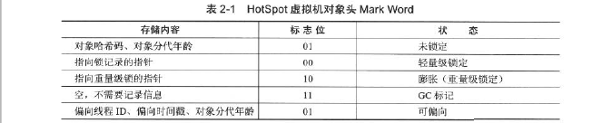
        - 类型指针  
        对象指向它的类元数据的指针，虚拟机通过这个指针来确定这个对象是那个类的实例
    - 实例数据  
    实例数据部分是对象真正存储的有效信息，也是在程序中所定义的各种类型的字段内容
    - 对齐填充  
    要求对象起始地址必须是 8 字节的整数倍，换句话说就是对象的大小必须是 8 字节的整数倍
# 3.垃圾收集
## 3.1确定对象是否死亡
- 引用计数法  
缺点：很难解决循环引用
- 可达性分析算法
    - GC roots  
    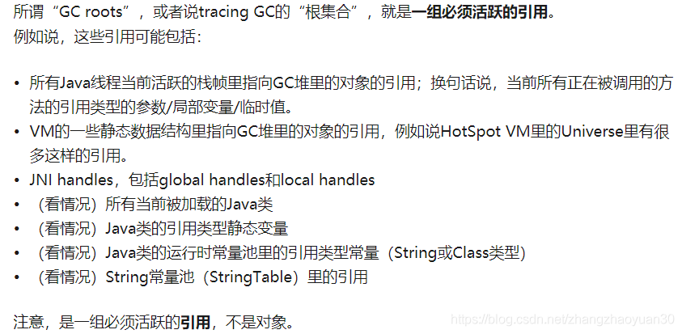
- 应用分类  
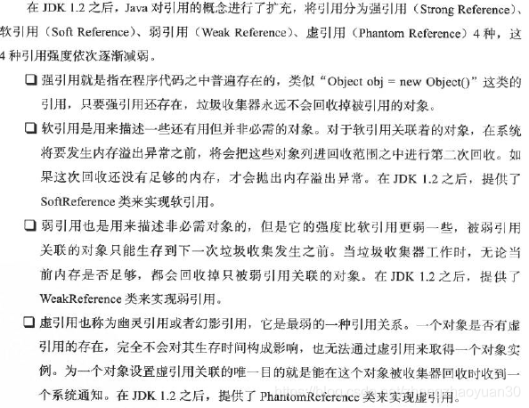
- 对象死亡过程与拯救    
    - 第一次标记：  
        - 对象经过可达性分析后发现没有与GC Roots相连接的引用链，会被第一次标记和筛选。
        - 筛选条件：对象覆盖了finalize()方法且finalize()方法未被虚拟机调用
        - 经过筛选后会被放置在F-Queue队列，并在稍后被Finalizer线程执行。
    - 第二次标记：
        - 如果对象在finalize()方法中拯救自己（重新与引用链上的任何一个对象建立关联），第二次标记时将被移除，否则面临被回收。
        - 实际中避免finalize()方法使用。
- 回收方法区
    - 废弃常量
    - 无用的类  
        - 所有类的实例已被回收
        - 加载类的类加载器已经被回收
        - Class对象没有在任何地方被引用，无法在任何地方通过反射访问该类
## 3.2垃圾收集算法
- 分代收集理论
    -内容
        - 弱分代假说：绝大多数对象朝生夕死
        - 强分代假说：熬过越多次垃圾收集过程的对象就越难以消亡
        - 跨代引用假说：跨代引用占极少数  
        在新生代建立一个记忆集，把老年代分成若干小块，标识出哪一块会存在跨代引用
    - 缺点
- 标记清楚算法  
标记和清除效率都不高、内存碎片
- 复制算法
    - 在对象存活率高时要进行较多复制操作，效率变低
    - 需要担保
    - 老年代不采用这种算法
- 标记整理算法
- **总结**
    - 移动对象
        - 回收更复杂
        - **停顿时间长、但吞吐量高**
    - 不移动
        - 分类更复杂
## 3.3算法实现
- 枚举根节点  
可达性分析会消耗很多时间，且要在一致性的快照中进行，导致GC进行时必须停顿所有Java执行线程（STW）
- 安全点
    - 程序执行至Safepoint（安全点）才能暂停执行GC
    - Safepoint以“让程序长时间执行”为标准选定，例如**方法调用、循环跳转、异常跳转**
    - 中断方式
        - 抢占式中断：GC发生时中断所有线程，若线程不在安全点恢复，使其继续运行至安全点
        - 主动中断：设置标志，线程主动轮询  
        当GC需要中断线程的时候，不直接对线程操作，仅仅简单地设置一个标志，各个线程执行时主动去轮循这个标志，发现中断标志为真时就自己中断挂起。轮循标志的地方和安全点是重合的【这个很关键，这样通过标志来中断刚好是在安全点上发生的】，另外再加上创建对象需要分配内存的地方。注意：现在几乎没有虚拟机采用抢占式中断来暂停线程从而响应GC事件
- 安全区域
    - 程序不执行时（未分配CPU时间，sleep或blocked），无法执行至安全点
    - 安全区域指能确保在某一段代码片段之中，引用关系不发生变化。可以看作是延伸的安全点
- 记忆集和卡表  
    - 解决跨代引用和部分区域收集的问题
    - 从非收集区域指向收集区域的指针集合，可以表示为一个数组
    - 卡页内有一个对象的字段存在跨代指针，就将对应卡表的数组元素值标为1，否则标为0。标为1的元素对应的卡页内存加入GC Roots
- 写屏障  
通过写屏障维护卡表状态，写屏障可以看作在虚拟机层面对“引用类型字段赋值”这个动作的AOP切面
- 并发可达性分析  
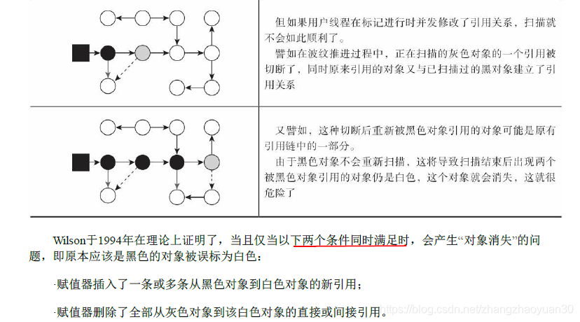  
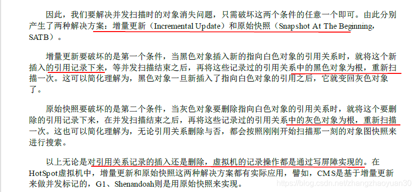
## 3.4垃圾收集器
- Serial
    - 单线程，且要暂停工作线程
    - 用于client模式
- ParNew
    - 多线程版本Serial收集器
    - 能与CMS配合
- Parallel Scavenge
    - -XX:MaxGCPauseMillis 控制最大垃圾收集停顿时间
    - -XX:GCTimeRatio 垃圾收集时间占比
    - -XX:+UseAdaptiveSizePolicy 不需要配置一些参数和上述俩参数
- CMS
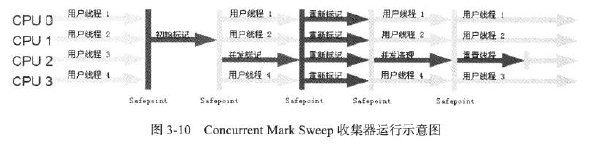  
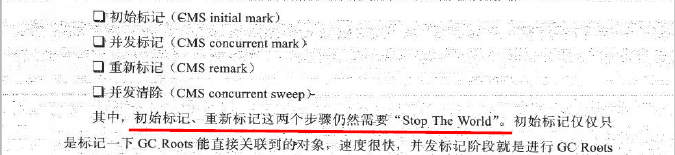  
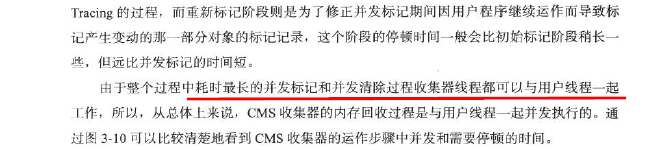 
    - 缺点
        - 并发导致占用一部分线程，总吞吐量降低
        - 无法处理浮动垃圾，需要预留一部分空间
        - 有碎片产生
            - -XX:+UseCMSCompactAtFullCollection  
            在进行FullGC时开启碎片整理
            - -XX:+CMSFullGCsBeforeCompaction  
            执行n次不压缩的Full GC后，执行一次压缩的
## 3.5**G1**
- 设计目标和实现方式  
    - 基于Region的堆内存布局
        - 把连续的Java堆划分为多个大小相等的独立区域Region，大小从 1 MB 到 32 MB 不等，具体取决于堆大小。目标是产生不超过 2048 个区域
        - 每个Region可以扮演Eden、Survivor、老年代
        - Humongous Region存储大对象，超过Region一半大小的对象都被视为“巨型对象”，被分配到老年代中的“Humongous regions”。在Cleanup phase或Full GC时会清理死亡的巨型对象
        - **每次收集的空间是Region大小的整数倍**
        - 跟踪每个Region里面垃圾价值（回收所获得的空间大小及回收所需时间的经验值）大小，维护一个优先级列表，优先处理收益最大的，即 Garbage First
    - 力求达到的暂停时间目标（软实时）  
        - 在young GC期间，G1 GC 会调整其年轻代空间（eden 和survivor 大小）以满足软实时目标。
        - 在mixed GC期间，G1 GC 会根据mixed GC的
        -XX:G1MixedGCCountTarget、-XX:G1HeapWastePercent、-XX:InitiatingHeapOccupancyPercent 调整所回收的老年代 region数量
    - 减少碎片，尽可能回收更多的堆空间，同时尽可能不超出暂停时间目标
        - 将一组或多组Region（称为Collection Set (CSet)）中的存活对象以增量、并行的方式复制到新区域来实现压缩
    - 每个Region都维护自己的记忆集RSet，记录别的Region指向自己的指针。独立的 RSet 可以并行、独立地回收Region，因为只需要对Region（而不是整个堆）的 RSet 进行扫描获取指向该Region的引用。G1 GC 使用写后屏障记录堆的更改并更新 RSet。
- 难点
    - 跨Region引用对象  
    每个Region都维护自己的记忆集RSet，记录别的Region指向自己的指针。本质是一个哈希表，Key是**别的Region的起始地址**，Value是一个集合，里面存储的元素是**卡表的索引号**
    卡表实现更复杂，且由于Region数量比传统收集器的分代数量要多，因此更占内存，耗费大约10%~20%堆容量
    - 并发标记阶段如何保证收集线程与用户线程互不干扰  
        - SATB原始快照（CMS是增量更新）
        - 把Region的一部分空间划分出来用于并发回收过程中新对象分配
        - 如果内存回收速度赶不上内存分配速度，需要冻结用户线程，导致Full GC而长时间“Stop The World”
    - 可靠的停顿预测模型
        - 衰减均值
        - 记录每个Region回收耗时，每个Region脏卡数量等
        - 通过这些信息预测有哪些Region组成的回收机可以在不超期望停顿时间约束下获得最高收益
- 运行过程
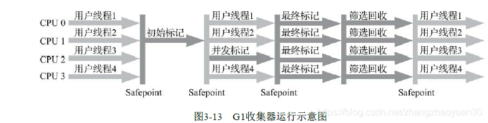 
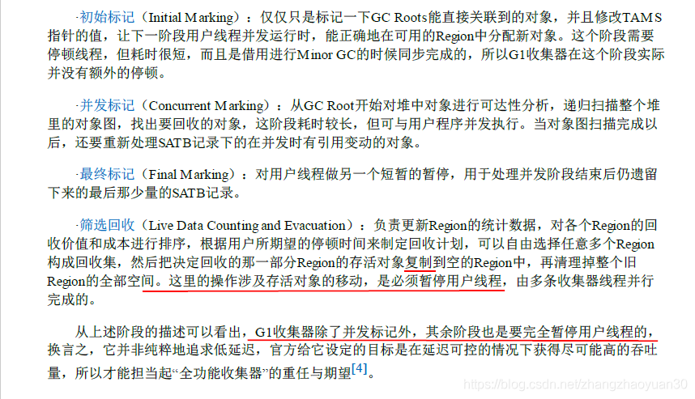
- GC模式
    - Young GC：选定所有年轻代里的Region。通过控制年轻代的region个数，即年轻代内存大小，来控制young GC的时间开销
    - Mixed GC：选定所有年轻代里的Region，外加根据global concurrent marking统计得出收集收益高的若干老年代Region。在用户指定的开销目标范围内尽可能选择收益高的老年代Region。
    - 什么时候开启Mixed GC
    **global concurrent marking结束后，开启Mixed GC**
    - 什么时候开启并发周期？
        - 每次Young GC结束的时候，当young gc结束，堆内存已经达到了 -XX:InitiatingHeapOccupancyPercent，开启global concurrent marking
        - 在分配任何Humongous region（巨型区域）之前，会检查标记阈值，可能会启动一个并发周期
    因为老年代空间中的使用内存发生变化只有一个情形：Young GC的时候。所以在这个时候判断是最合理的
    - Full GC：如果mixed GC实在无法跟上程序分配内存的速度，导致老年代填满无法继续进行Mixed GC，就会使用serial old GC（full GC）来收集整个GC heap
    - global concurrent marking  
        - initial mark(**STW**)（初始标记）       
        找到GC Roots直接引用的Region。其实是**Young GC的一部分**
        - root region scaning（并发进行）（根区域扫描）  
        在initial mark的**新生代survivor 区扫描对老年代的引用**（因为Eden区已经清空了），并标记被引用的对象。该阶段与应用程序同时运行，并且只有完成该阶段后，才能开始下一次 STW 年轻代垃圾回收
        - Concurrent marking phase（并发标记）    
        可达性分析，该阶段与应用程序并发运行，**可以被 STW 年轻代垃圾回收中断**
        - Remark phase（重新标记）  
        会**STW**
        - Cleanup phase（清理） 
            - cleanup（**STW**）  
                - 统计得出收集收益高的若干老年代Region并发标记，提供给接下来的Mixed GC回收。
                - 清空没有存活对象的Region，不用等待GC阶段
                - 更新Rset
            - concurrent-cleanup（并发）  
            返回空Region给free list
- 缺点
    - 内存占用，见上
    - 负载  
    为实现原始快照，写前屏障跟踪并发时的指针变化
- G1参数
    - -XX:+UseG1GC：启用 G1
    - -XX:MaxGCPauseMillis=200：设置允许的最大GC停顿时间(GC pause time)，这只是一个期望值，实际可能会超出，可以和年轻代大小调整一起并用来实现。默认是200ms
    - **-XX:G1NewSizePercent**：新生代最小的堆空间占比，默认是5%
    - -XX:G1MaxNewSizePercent：新生代最大的堆空间占比，默认是60%
    - **-XX:G1HeapRegionSize=n**：每个分区的大小，默认值是会根据整个堆区的大小计算出来，范围是1M~32M，取值是2的幂，计算的倾向是尽量有2048个分区数。比如如果是2G的heap，那region=1M。16Gheap,region=8M
    - -XX:ParallelGCThreads=n  
    **设置 STW 工作线程数的值**。将 n 的值设置为逻辑处理器的数量。n 的值与逻辑处理器的数量相同，最多为 8。
    如果逻辑处理器不止八个，则将 n 的值设置为逻辑处理器数的 5/8 左右。这适用于大多数情况，除非是较大的 SPARC 系统，其中 n 的值可以是逻辑处理器数的 5/16 左右
    - -XX:ConcGCThreads=n  
    并发标记并发执行的线程数，默认值接近整个应用线程数的1/4
    - -XX:MaxTenuringThreshold=n：晋升到老年代的“年龄”阀值，默认值为 15
    - **-XX:InitiatingHeapOccupancyPercent=45**：一般会简写IHOP，默认是45%，设置触发标记周期的 Java 堆占用率阈值，包括old+humongous。如果经常出现FullGC，可以调低该值，尽早的回收可以减少FullGC的触发，但如果过低，则并发阶段会更加频繁，降低应用的吞吐
    - -XX:G1HeapWastePercent：允许的浪费堆空间的占比，默认是5%。如果并发标记可回收的空间小于5%，则不会触发MixedGC
    - -XX:G1MixedGCCountTarget：当占用内存超过InitiatingHeapOccupancyPercent阈值时, 最多通过多少次Mixed GC来将内存控制在阀值之下。默认值是8
    - 参数建议
        - 年轻代大小：避免使用 -Xmn 选项或 -XX:NewRatio 等其他相关选项显式设置年轻代大小。固定年轻代的大小会覆盖MaxGCPauseMillis目标。
        - MaxGCPauseMillis：G1 GC 的吞吐量目标是 **90% 的应用程序时间和 10%的垃圾回收时间**。如果将其与 Java HotSpot VM 的吞吐量回收器相比较，目标则是 99% 的应用程序时间和 1% 的垃圾回收时间。因此，当您评估 G1 GC 的吞吐量时，暂停时间目标不要太严苛。目标太过严苛表示您愿意承受更多的垃圾回收开销，而这会**直接影响到吞吐量**。当您评估 G1 GC 的延迟时，请设置所需的（软）实时目标，G1 GC 会尽量满足。副作用是，吞吐量可能会受到影响。

## 3.6ZGC  
# 4 性能监控与故障处理工具
[虚拟机性能监控与故障处理工具](https://blog.csdn.net/zhangzhaoyuan30/article/details/89644918)
- jps
    - -l：类全名/Jar包路径
    - -v：JVM启动参数
- jstat(JVM Statistics Monitoring Tool)
    - -class：类加载卸载数量、总空间、加载耗时
    - -gc：各个垃圾收集区容量、已用空间、GC时间合计
- jmap
    - -dump：堆快照
- jhat  
快照分析
- jstack  
线程快照
    - -l 锁的附加信息
# 5类文件结构
- 两数据类型
    - 无符号数
    - 表
- 组成
    - 魔术
    - 版本号
    - 常量池
        - 字面量
            - 需要使用ldc的基本数据类型的值
                - 只存int,long,float,double（使用ldc命令从常量池中推送至栈顶，关于ldcx详见Q11），因为短整型直接用字节码指令iconst_0,lconst_0,fconst_0,d_const_0,bipush,sipush[JVM指令集整理](https://juejin.cn/post/6844903461339807757)
                - 基本类型的包装类的大部分都实现了常量池技术，Byte,Short,Integer,Long,Character,Boolean，另外两种**浮点**数类型的包装类则没有实现。**-128~127**
            - final常量的值
            - 字符串
        - 符号引用
            - 类和接口全限定名
            - 字段、方法的名称和描述符
    - 访问标志
    - 类索引、父类索引、方法索引
    - 字段表、方发表、属性表
        - 包含
            - 访问标志
            - 名称索引
            - 描述符索引   
            方法按先参数列表后返回值  
            例：([CI)I表示  
            int indexOf(char[] ch,int index)        
            - 属性表
        - **重载**
            - Java代码层面：方法名称、参数顺序、参数类型
            - 字节码层面：还包括返回值、受检查异常表
- 属性表是什么？
    - Code（方法表）
        - 栈深度
        - 局部变量表大小
        - 代码
        - 异常表
    - LineNumberTable（Code属性）
    源码和字节码行号对应关系
    - LocalVariableTable（Code属性）
    局部变量表中变量和源码中定义的变量的关系
    - ConstantValue属性（字段表）
        - 作用是通知虚拟机在类加载的准备阶段自动为static final 赋值
        - static变量赋值有两种方法
            - 基本或String型常量使用ConstantValue
            - 其他用\<cinit>()方法赋值
# 6.字节码指令？
- 同步指令
    - 方法级  
    方发表的访问标志
    - 代码块  
    monitorenter和monitorexit        
# 7.类加载机制
## 7.1类加载时机？
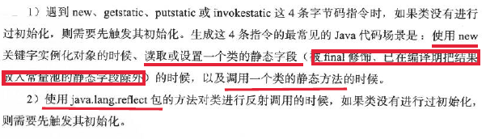
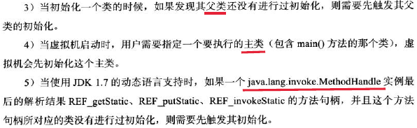
## 7.2类加载过程？
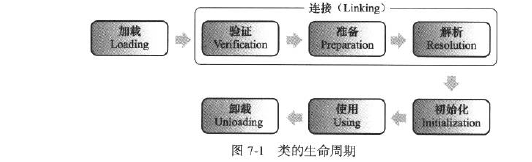
- 加载
    - 通过全限定名获取类的二进制字节流
    - 将类的静态存储结构转化为方法区的运行时数据结构
    - 生成类的Class对象，作为方法区这个类的各种数据的访问入口
- 验证
- 准备  
类变量设置初始值
- 解析  
符号引用替换为直接引用  
    - 直接引用可以是
        - 直接指向目标的指针（比如，指向“类型”【Class对象】、类变量、类方法的直接引用可能是指向方法区的指针）
        - 相对偏移量（比如，指向实例变量、实例方法的直接引用都是偏移量）
        - 一个能间接定位到目标的句柄   
    - 直接引用是和虚拟机的布局相关的，同一个符号引用在不同的虚拟机实例上翻译出来的直接引用一般不会相同。如果有了直接引用，那引用的目标必定已经被加载入内存中了。
- 初始化\<cinit>  
    - 是什么？
        - \<cinit>方法收集顺序由在源文件中出现顺序决定
        - 收集类变量赋值动作和static代码块
        - 静态语句块中只能访问定义在之前的变量，之后的变量在静态语句块中可以赋值，但不能访问
    - ps?  
        - 和\<init>方法不同无须调用父类构造器，虚拟机会保证父类\<cinit>已经执行。接口同样
        - 虚拟机会保证\<cinit>方法在多线程环境中被正确加锁、同步。要避免\<cinit>方法由耗时操作，可能造成阻塞
## 7.3类加载器
- 类的唯一性  
由加载器和类本身一起确立
- 类加载器
    - 启动类加载器：C++实现，是虚拟机的一部分
    - 其他类加载器：Java实现，独立于虚拟机。继承自ClassLoader
        - 扩展类加载器：sun.misc.Launcher$ExtClassLoader，负责加载**\<JAVA_HOME>\lib\ext**目录，或者java.ext.dirs系统变量指定的路径
        - 应用程序类加载器：sun.misc.Launcher$AppClassLoader，ClassLoder.getSystemClassLoder()返回值。负责加载ClassPath上的类
- 双亲委派模型：父加载器无法加载才由子加载器加载
    - 作用：双亲委派模型保证了Java程序的稳定运行，可以**避免类的重复加载，也保证了 Java 的核心 API 不被篡改**，比如我们编写一个称为 java.lang.Object 类的话，那么程序运行的时候，系统就会出现多个不同的 Object 类。
    - 实现方式  
    ```JAVA
    protected Class<?> loadClass(String name, boolean resolve)
        throws ClassNotFoundException
    {
        synchronized (getClassLoadingLock(name)) {
            // First, check if the class has already been loaded
            Class<?> c = findLoadedClass(name);
            if (c == null) {
                long t0 = System.nanoTime();
                try {
                    if (parent != null) {
                        c = parent.loadClass(name, false);
                    } else {
                        c = findBootstrapClassOrNull(name);
                    }
                } catch (ClassNotFoundException e) {
                    // ClassNotFoundException thrown if class not found
                    // from the non-null parent class loader
                }
 
                if (c == null) {
                    // If still not found, then invoke findClass in order
                    // to find the class.
                    long t1 = System.nanoTime();
                    c = findClass(name);
 
                    // this is the defining class loader; record the stats
                    sun.misc.PerfCounter.getParentDelegationTime().addTime(t1 - t0);
                    sun.misc.PerfCounter.getFindClassTime().addElapsedTimeFrom(t1);
                    sun.misc.PerfCounter.getFindClasses().increment();
                }
            }
            if (resolve) {
                resolveClass(c);
            }
            return c;
        }
    }
    ```
    - 三次破坏
        - 1.2之前没有双亲委派模型，1.2之后为了兼容添加了一个findClass方法
        - JNDI  
        加载类D的类加载器Dload，在解析过程中，如果要将D中符号引用N解析为类或者接口C的直接引用，C又未被类加载器加载，那么使用Dload对C进行加载。然而由于JDNI是使用启动类加载器加载的，而JNDI类中符号引用代表的类是第三方的代码，所以无法使用启动类加载器进行加载，所以需要调用应用程序类加载器加载  
        例如：  
        [JDBC、Tomcat为什么要破坏双亲委派模型](https://www.javazhiyin.com/44347.html)
        - 第三次  
        代码热替换（HotSwap） 
    - 模块化下类加载器
        - 扩展类加载器被平台类加载器取代，因为模块化已经满足了可扩展要求
        - 平台类加载器和应用程序类加载器不再派生自java.net.URLClassLoader，包括启动类加载器均继承jdk.internal.loader.BuiltinClassLoader
        - 第四次破坏：在平台/应用类加载器收到请求时，先判断是否能归属到某个系统模块，优先委派给该模块的加载器完成
        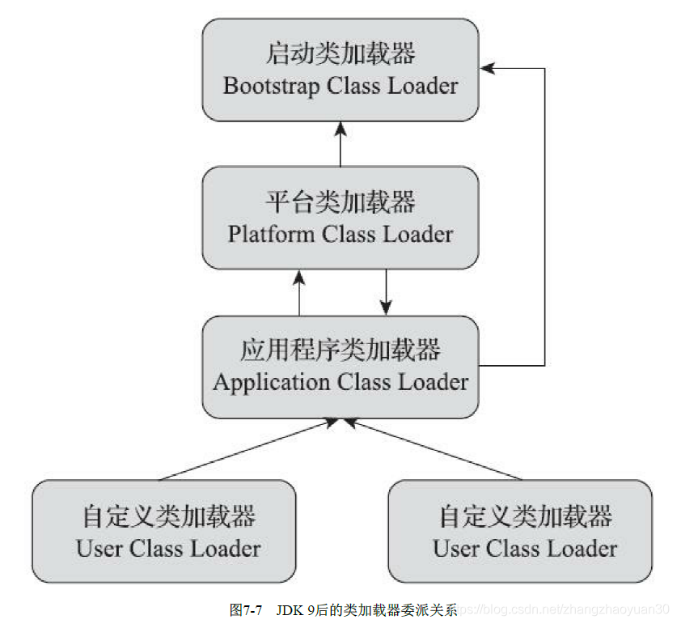
# 8.虚拟机字节码执行引擎
## 8.1运行时栈帧
- 局部变量表
存放方法参数和方法内部定义的局部变量
    - this
    如果执行实例方法，那局部变量表中**第0位**索引默认用于传递this
    - 参数，局部变量
- 操作数栈
- 动态连接  
栈帧中包含一个指向**运行时常量池**中该帧所属方法的引用，持有该引用是为了支持动态连接。
    - 静态解析：Class文件中的符号应用一部分会在类加载阶段转化为直接引用
    - 动态连接：运行期间转化为直接引用
- 方法出口（方法返回地址）  
方法退出的两个方式：
    - 正常完成出口：遇到方法返回的字节码指令
    - 异常完成出口：方法执行过程中遇到异常，且未在方法内部处理
## 8.2方法调用  
确定被调用方法的版本  
- 解析
    - 调用目标在程序代码写好、**编译器进行编译**那一刻就已经确定下来，即**编译期可知，运行期不可变**。这类方法的调用被称为解析（Resolution）。
    - 类加载的解析阶段，会将一部分符号引用转化为直接引用，这种转化成功的前提是：方法在运行之前就有一个可确定的调用版本，且这个调用版本在运行期不可变。 对应的方法为非虚方法。
    - 非虚方法
        - invokestatic：调用静态方法
        - invokespecial：调用实例构造器\<init>方法、私有方法、父类方法
        - 包括静态方法、私有方法、实例构造器、父类方法
        - final方法是非虚方法，虽然由invokevirtual调用
    - 虚方法
        - invokevirtual：调用虚方法
        - invokeinterface：调用接口方法
        - invokedynamic：先在运行时动态解析出调用点限定符所引用的方法，然后再执行该方法。前面4条调用指令，分派逻辑都固化在Java虚拟机内部，而invokedynamic指令的分派逻辑是由用户设定的引导方法来决定的
    - 静态分派（重载）：依据**静态类型**来定位方法执行版本（符号引用）  
        - 举例：编译器在重载时通过参数的静态类型选择方法执行版本
        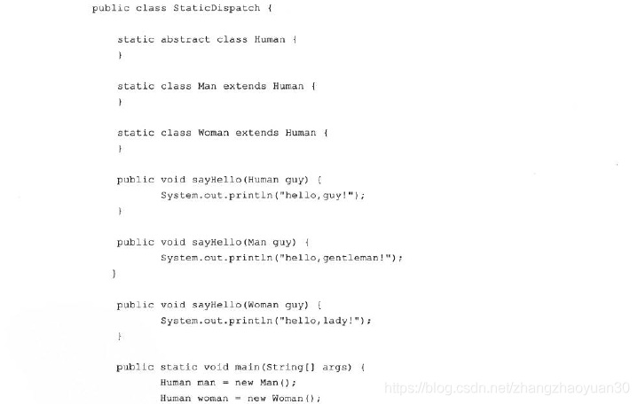
- 动态分派（重写）：选择实际类型作为方法执行版本
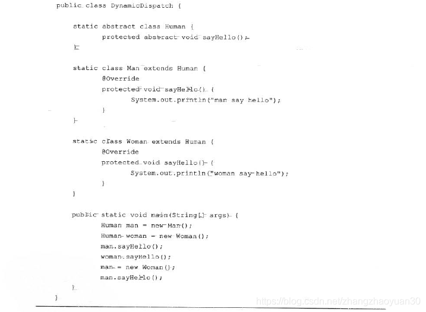
    - 实现原理：invokevirtual指令的多态查找过程
    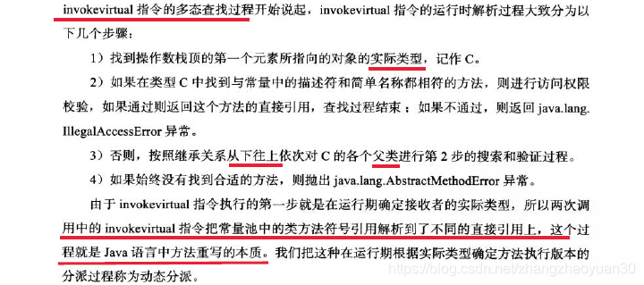
- 单分派与多分派
    - 方法的宗量：方法的接收者（实际执行者）与方法的参数
    - 根据分派基于多少种宗量，分为单分派和多分派
    - 静态多分派
    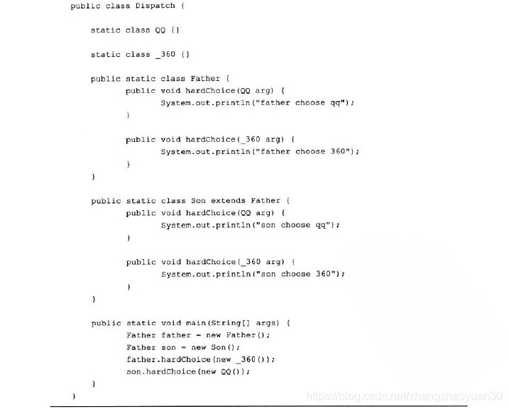
    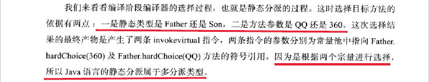
    - 动态单分派
    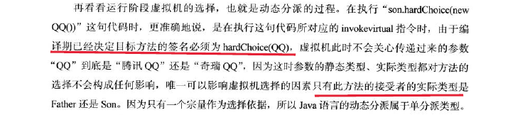
    - 个人理解：编译时看左边（有没有对应的方法），运行时看右边。编译看左边是因为静态分派发生在编译阶段，运行看右边是因为运行时是动态分派。
## 8.3基于栈的字节码执行引擎
- 编译过程
    - 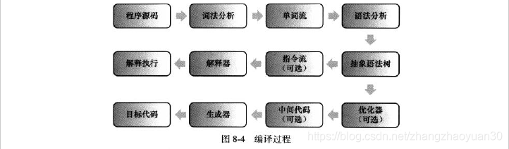  
    - C/C++编译器走下方路径，词法分析、语法分析、优化器及目标代码生成器独立于执行引擎，形成完整的编译器。
    - Javac编译器完成了字节码指令流之前的过程，解释器在虚拟机内部。
- 基于栈的指令集和基于寄存器的指令集
    - 指令流中的指令大部分都是零地址指令，依赖操作数栈进行工作  
    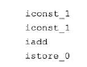  
        - 优点：可移植
        - 缺点：速度慢（栈实现在内存中，频繁内存访问。以及出入栈操作产生更多指令）
    - 基于寄存器  
    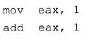  
- 基于栈的解释器执行过程
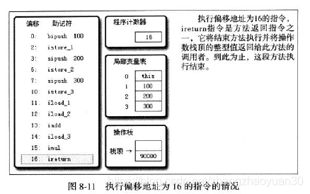
# 9编译与代码优化
## 9.1编译期优化
- 编译器
    - 前端编译器：Javac、ECJ(Eclipse)
    - JIT（just-in-time compilation）：HotSpot VM的C1、C2编译器
    - AOT（Ahead-of-Time Compilation）
- \<cinit>和\<init>：在字节码生成阶段，编译期会将实例构造器\<init>和类构造器\<cinit>方法添加到语法树中。
    - \<cinit>收敛顺序为：（参考类加载的初始化阶段）源文件中出现的顺序。  
    ps：静态语句块只能访问定义在它之前的变量，之后的变量不能访问但能赋值。
    - \<init>收敛顺序为：
        1. 父类变量初始化 
        2. 父类代码块 
        3. 父类构造函数 
        4. 子类变量初始化 
        5. 子类代码块 
        6. 子类构造函数
## 9.2运行期优化
- 即时编译对象和触发条件：
    - 热点代码：
        - 被多次调用的方法
        - 被多次执行的循环体
    - 热点探测方式：
        - 基于采样：周期性检查各线程栈顶，优点是实现简单，容易获取方法调用关系
        - 基于计数器（HotSpot采用）：为每个方法（代码块）建立计数器，优点是精确
    - 编译优化：（虚拟机团队把所有对代码的优化技术集中在了即时编译器中）
        - 公共子表达式消除
        - 数组边界检查消除
        - 方法内联
        >编译器将指定的函数体插入并取代每一处调用该函数的地方（上下文），从而节省了每次调用函数带来的额外时间开支。  
        - 逃逸分析：方法内部定义的对象被其他方法应用，称为方法逃逸。如果被其他线程访问，称为线程逃逸
            - 栈上分配：减少GC压力，可能被分配到告诉寄存器存储
            - 同步消除：如果不会发生线程逃逸
            - 标量替换
                - 标量（Scalar）：不可进一步分解的数据，比如基本数据类型，否则称为聚合量
                - 如果一个对象不会逃逸，那么可以不用创建对象，而是用成员变量代替，称为标量替换
                - 优点：可以栈上分配
# 10 创建了几个对象？
[从字符串到常量池，一文看懂String类设计](https://zhuanlan.zhihu.com/p/149055800)  
String s1 = new String("aaa");
- 字符串常量池Interned String Pool，存的是引用。字符串常量池用StringTable实现
- ldc：
    >StringTable在每个HotSpot VM的实例里只有一份，被所有的类共享。类的运行时常量池里的CONSTANT_String类型的常量，经过**解析（resolve）**之后，同样存的是字符串的引用；解析的过程会去查询StringTable，以保证**运行时常量池所引用的字符串与StringTable**所引用的是一致的
- JDK6和JDK7
    ```JAVA
    String s3 = new String("1") + new String("1");// 创建了一个堆上的对象
    s3.intern();// JDK6：复制到永久代，JDK7：不复制 共同点：保存引用到StringTable
    String s4 = "11"; //从StringTable获取引用 
    System.out.println(s3 == s4);// JDK6：false，JDK7：true
    ```
    - JDK6：被StringTable引用的字符串实例存在永久代上
    - JDK7：被StringTable引用的字符串实例存在堆上，因此intern方法不用复制
# 11