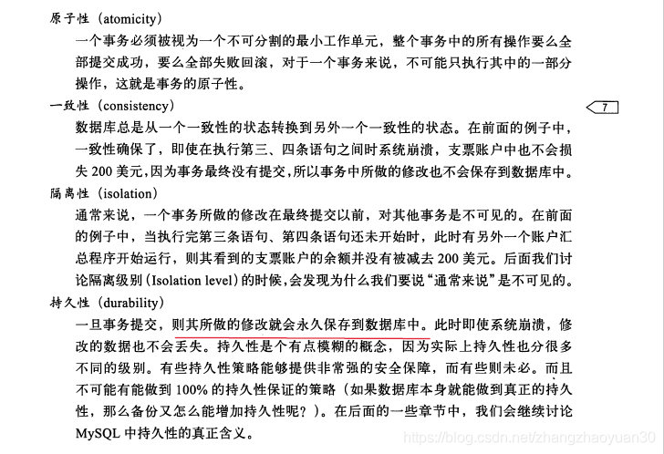
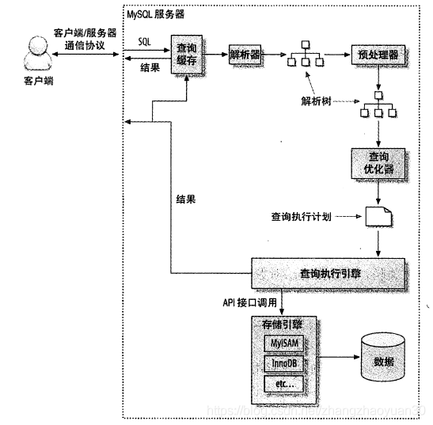
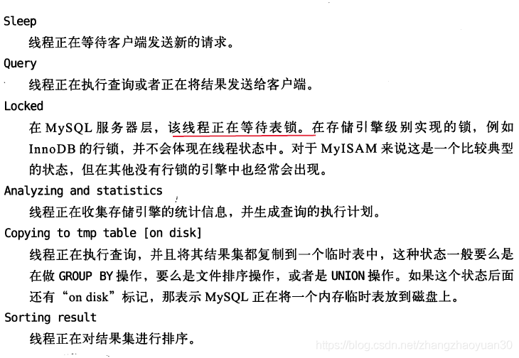
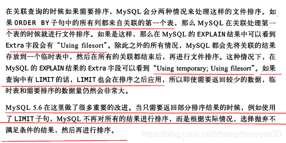
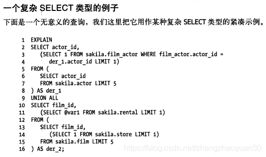
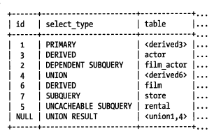
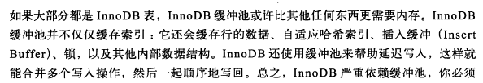

<!-- TOC -->

- [1.事务属性有哪些，怎么实现的？](#1事务属性有哪些怎么实现的)
- [2.事务隔离级别有哪些，怎么实现的？](#2事务隔离级别有哪些怎么实现的)
- [3.MVCC是什么？怎么实现的？](#3mvcc是什么怎么实现的)
- [4.行锁的算法？](#4行锁的算法)
- [5.Mysql中有哪些锁？](#5mysql中有哪些锁)
- [6.两阶段锁？](#6两阶段锁)
- [7.死锁？](#7死锁)
- [8.InnoDB索引为什么采用B+树？](#8innodb索引为什么采用b树)
- [9.计算B+树能存多少条记录？](#9计算b树能存多少条记录)
- [10.索引的使用](#10索引的使用)
- [11.聚簇索引？](#11聚簇索引)
- [12.覆盖索引？](#12覆盖索引)
- [13.优化索引？](#13优化索引)
- [14.Mysql架构？](#14mysql架构)
- [15.SQL优化？](#15sql优化)
- [16.剖析sql查询?](#16剖析sql查询)
- [17.MySQL配置优化？](#17mysql配置优化)
- [18.Mysql的几种log？](#18mysql的几种log)

<!-- /TOC -->
# 1.事务属性有哪些，怎么实现的？

- 隔离性  
通过锁实现见2  
- 原子性和持久性  
redo log  
    - 事务提交时必须先将事务的所有日志写入redo log
- 一致性
undo log
# 2.事务隔离级别有哪些，怎么实现的？
[MySQL事务隔离级别、数据一致性与加锁处理分析](https://zhuanlan.zhihu.com/p/165365896)  
- READ UNCOMMITED
    - 读不加锁
    - 写加排他锁
- READ COMMITED
    - 读使用MVCC，每次select生成快照
    - 写使用记录锁
- REPETABLE READ
    - 读使用MVCC，第一次select时生成快照
    - 写使用Next-Key locks 
    - RR隔离级别的防止幻象主要是针对写操作的，即只保证写操作的可串行化，因为只有写操作影响Binlog；而读操作是通过MVCC来保证一致性读（无幻象）。然而，可串行化隔离级别要求读写可串行化
- SERIALISABLE 
    - 读加共享锁
    - 写加排他锁
- begin/start transaction 命令并不是一个事务的起点，在执行到它们之后的第一个操作 InnoDB 表的语句，事务才真正启动。如果你想要马上启动一个事务，可以使用 start transaction with consistent snapshot 这个命令。
- 解决丢失更新加锁
# 3.MVCC是什么？怎么实现的？
- 作用
减少锁的使用
- 原理
    - 在MySQL中建表时，每个表都会有三列隐藏记录，其中和MVCC有关系的有两列
        - 数据行的版本号（DB_TRX_ID）
        - 删除版本号(DB_ROLL_PT) 
    - 用法
        - SELECT时，读取创建版本号<=当前事务版本号，删除版本号为空或>当前事务版本号。
        - INSERT时，保存当前事务版本号为行的创建版本号
        - DELETE时，保存当前事务版本号为行的删除版本号
        - UPDATE时，插入一条新纪录，保存当前事务版本号为行创建版本号，同时保存当前事务版本号到原来删除的行
- 只在read committed和rr生效
    - 能解决幻读的**读问题**，不能解决写问题（写是当前读）
- 当前读 
    - update、delete、insert数据时都是先读后写的，MVCC在此时读数据时，只能读当前的值，而不采用上述select的方式。称为“当前读”（也由此引发丢失更新问题）
    - select语句加显式锁，也是当前读
# 4.行锁的算法？
[锁分类和行锁算法](https://juejin.im/post/6844903778026520584)  
- 行锁（Record Lock）  
锁直接加在索引记录上面。
- 间隙锁（Gap Lock）  
锁加在不存在的空闲空间，可以是两个索引记录之间，也可能是第一个索引记录之前或最后一个索引之后的空间。
- Next-Key Lock  
行锁与间隙锁组合起来用就叫做Next-Key Lock。  
    - 默认情况下，InnoDB工作在可重复读隔离级别下，并且以Next-Key Lock的方式对数据行进行加锁，这样可以有效防止幻读的发生。  
    - Next-Key Lock是行锁与间隙锁的组合，当InnoDB扫描索引记录的时候，会首先对选中的索引记录加上行锁（Record Lock），再对索引记录两边的间隙（向左扫描扫到第一个比给定参数小的值， 向右扫描扫描到第一个比给定参数大的值， 然后以此为界，构建一个区间）加上间隙锁（Gap Lock）。  
    - 如果是索引有唯一性，**降级为记录锁**
# 5.Mysql中有哪些锁？
- 全局锁  
    [全局锁](https://blog.csdn.net/zhangzhaoyuan30/article/details/88184010)  
    Flush tables with read lock(FTWRL)
- 表级锁
    - 表锁
        - lock tables ... read/write，可以用unlock tables主动释放锁，也可以在客户端断开的时候自动释放。
        - lock tables语法除了会限制别的线程的读写外，也限定了本线程接下来的操作对象。 对于InnoDB这种支持行锁的引擎，一般不使用lock tables命令来控制并发，毕竟锁住整个表的影响面还是太大。
    - MDL（Meta Data Lock）
        - 在对一个表做增删改查操作的时候，加MDL读锁；
        - 当要对表做结构变更操作的时候，加MDL写锁。
- 行锁
    共享锁
    排它锁
- 表锁
    - 意向共享  
    加共享锁前必须先取得该表的 IS 锁
    - 意向排它  
    加排他锁前必须先取得该表的 IX 锁
    - 意向锁只对普通表锁有用，对其他意向锁无效
- 加锁方法
    - 对于 UPDATE、 DELETE 和 INSERT 语句， InnoDB
会自动给涉及数据集加排他锁（X)；
    - 显式锁  
    lock in share mode、for update
- 实现方式
    - 对索引加锁
# 6.两阶段锁？
两阶段锁（two-phase locking，2PL）是数据库事务处理时的并发控制方法，以保证**可串行化**。  
- 这种方法使用数据库锁在两个阶段：    
    - 扩张阶段：不断上锁，没有锁被释放
    - 收缩阶段：锁被陆续释放，没有新的加锁（只有提交(commit)或者回滚(rollback)时才是解锁阶段）
- 2PL可能会导致死锁
    - 一次封锁法
    一次封锁法要求事务必须一次性将所有要使用的数据全部加锁，否则就不能继续执行。
- 可串行化调度
    - 如果一并行调度的结果等价于某一串行调度的结果，那么这个并行调度称为可串行化的
    - 若所有事务均遵守两段锁协议，则这些事务的所有交叉调度都是可串行化的。
# 7.死锁？
- innodb_deadlock_detect（默认开启）  
InnoDB 引擎采取的是 wait-for graph 等待图的方法来自动检测死锁，如果发现死锁会回滚undo量最少的事务
- innodb_lock_wait_timeout  
    超时默认会回滚当前语句  
    - innodb_rollback_on_timeout  
    回滚当前事务
# 8.InnoDB索引为什么采用B+树？
- [B树、B+树详解](https://www.cnblogs.com/lianzhilei/p/11250589.html)
- B+树索引能找到的只是被查找数据行所在的页，然后数据库把页读入内存，再在内存中查找
- 二叉查找树->平衡二叉树->B+树
- 什么是m阶B+树？
    - 每个节点最多可以有 m 个子节点
    - 除了根节点外，每个节点最少有 (m/2) 个子节点。如果根节点不是叶节点，则至少有 2 个子节点
    - 有k个子节点必有k个元素（区别1）
    - **所有的中间节点元素都同时存在于子节点，在子节点元素中是最大（或最小）元素**
    - **所有的叶子节点都在同一层，记录只存放在叶子节点中，非叶子节点只存放关键字和指向下一个孩子节点的索引**
        - B+树的磁盘读写代价更低（区别2）：内存页中能够存放更多的key，数据存放的更加紧密，如果把所有同一内部节点的关键字存放在同一盘块中，那么盘块所能容纳的关键字数量也越多，一次性读入内存的需要查找的关键字也就越多，相对IO读写次数就降低了
        - B+树的查询效率更加稳定（区别3）：由于非终结点并不是最终指向文件内容的结点，而只是叶子结点中关键字的索引。所以任何关键字的查找必须走一条从根结点到叶子结点的路
    - **相邻的叶子节点之间用双向链表相连**
        - 便于**范围查找**和**遍历**（区别4）
- B+树插入
    - 如果左右兄弟节点没满先移到兄弟节点
    - 小于中间节点放左边，大于中间节点放右边
    - 中间节点放index page
- B+树删除
    - 小于填充因子合并节点
- 和B树区别
见上
# 9.计算B+树能存多少条记录？
[InnoDB一棵B+树可以存放多少行数据？](https://www.cnblogs.com/leefreeman/p/8315844.html)
- 总记录数为：根节点指针数*单个叶子节点记录行数
- 单个叶子节点（页）中的记录数=16K/1K=16(假设一行记录的数据大小为1k)
- 假设主键ID为bigint类型，长度为8字节，而指针大小在InnoDB源码中设置为6字节，这样一共14字节，我们一个页中能存放多少这样的单元，其实就代表有多少指针，即16384/14=1170
- 一棵高度为2的B+树，能存放1170*16=18720条这样的数据记录。根据同样的原理我们可以算出一个高度为3的B+树可以存放：1170*1170*16=21902400条这样的记录。
# 10.索引的使用
- 最左前缀
联合索引的最左N个字段，或字符串索引的最左M个字符
    - InnoDB 引擎单一字段索引的长度最大为 767 字节
- 匹配范围值
- 精确匹配前N列，范围匹配最后一列
- 联合索引不能跳过某一列
- 如何可以按照索引查到值，也可以按照这种方式order by 
- 哈希索引
    - 必须精确匹配索引所有列
    - 对于每一行数据，存储引擎会对所有索引列计算一个哈希码。哈希索引将哈希码存储在索引中，同时在哈希表中保存每个数据行的指针
    - InnoDB引擎支持自适应哈希索引
- 索引的优点
    - 减少服务器需要扫描的数据量
    - 避免排序和临时表
    - 将随机I/O变为顺序I/O
- 索引的选择性
    - 概念：基数/记录总数
    - select count(distinct left(city,3))/count(*) from table;
    - 缺点：无法使用前缀索引做order by 和 group by ，也无法覆盖索引
- 不使用索引的情况  
当访问的数据占整个表中数据的很大一部分（20%左右），且没有覆盖索引，优化器可能会选择通过聚簇索引查找，因为二级索引后回表导致随机IO
# 11.聚簇索引？
- 概念：数据行存在索引的叶子页中
- 通过主键聚集数据，如果没有则选择一个唯一非空索引代替
- 优点
    - 可以把相关数据保存在一起，减少磁盘IO
    - 覆盖索引可以直接使用叶节点中的主键值
- 缺点
    - 插入速度严重依赖于插入顺序
        - 如果没有需要聚集的数据可以定义一个自增主键，避免随机
    - 更新聚簇索引列的代价高。需要将行移动到新位置
    - 全表扫描慢，尤其是数据稀疏或页分裂导致数据存储不连续时
    - 二级索引大，因为叶子节点包含了主键
    - 二级索引需要两次索引查找
- 与MyISAM比较
    - 按数据插入顺序存储在磁盘
    - 二级索引存储行指针
# 12.覆盖索引？
- 索引覆盖所需查询的字段，Extra列有Using index
- 优点
    - 避免二级查询回表
    - 索引按顺序存储，对于范围查找避免随机IO
# 13.优化索引？
- INDEX HINT
    - USE INDEX
    - FORCE INDEX
- Multi-Range Read(MRR)  
减少磁盘随机访问，将随机访问转化为顺序访问。用于range、ref、eq_ref类型的查询。
    - 二级索引查询的主键进行排序，再按照主键进行书签查找
    - 减少了缓冲池中页被替换的次数  
    如果缓冲池不够大放不下一张表的数据，频繁的离散读导致缓存的页被替换出缓冲池
    - 将范围查询拆分为键值对，避免读出无用数据  
    where a > 1000 and a < 2000 and b=1000 转化为(1000,1000),(1001,1000)...
- Index Condition Pushdown(ICP)  
where过滤操作放在存储引擎层，Extra可以看到Using index condition
    - WHERE 可以过滤的条件是该索引可以覆盖到的范围
    - 适用条件
        - 查询走索引，explain中的访问方式为range，ref，eq_ref，ref_or_null，并且需要回表查询
        - 二级索引  
        因为InnDB的聚簇索引会将整行数据读到InnDB的缓冲区，这样一来索引条件下推的主要目的减少IO次数就失去了意义。因为数据已经在内存中了，不再需要去读取了。 
- 索引总结
    - 单行访问慢。读取的数据块尽可能包含更多行。
    - 顺序访问快。一是不需要多次寻址，二是避免额外排序
    - 覆盖查询很快
# 14.Mysql架构？

- 连接器
    - 通信协议  
    半双工。客户端发送一个单独数据包给服务器（大小由max_allowed_packet控制）。服务器返回多个数据包
    - show full processlist  
    
- 优化器
    - 功能
        - count()、min()、max()  
            - 查B-Tree最左端或最右端，EXPLAIN会有“Select tables optimized away”，表示优化器已经从执行计划中移除该表，以一个常数取代
            - MyISAM维护了count变量
        - 预估并转化为常数表达式
            - const  
            该表最多有一个匹配行, 在查询开始时读取。由于只有一行, 因此该行中**列的值可以被优化器的其余部分视为常量**，被优化器从联接中移除。
        - 覆盖索引扫描
        - 提前终止查询
            - LIMIT
            - 发现一个不成立的条件
        - 等值传播
        两个列的值通过等式连接（join on t1.id=t2.id）,可以把一个列的where条件传递到另一个列上
        - in()
        in()中数据先排序，然后通过二分查找确定是否满足条件（O(n)复杂度）。而不是转化为多个OR条件子句
        - 关联查询  
        嵌套循环关联、子查询放到临时表
            - 关联查询优化器
        - 排序优化  
            - 不能使用索引时，使用文件排序。group by 除了文件排序还会创建临时表  
            - innodb_sort_buffer_size  
                需要排序数据量小于此参数，使用**内存快速排序**。否则会先数据分块，每个块快速排序，将各个块放在磁盘中，最后合并
            - max_length_for_sort_data
            查询中所有需要的列和ORDER BY的列总大小小于此参数或者列中包含BLOB或TEXT，采用two-pass
                - single-pass:读取行指针和所需排序字段，排序完成之后再读取所需数据行
                    - 优点：排序时存储尽可能少数据，使“排序缓冲区”容纳更多行
                    - 缺点：需两次数据传输，且第二次大量随机IO
                - two-pass:读取所有列排序。
                    - 优点：无需随机IO
                    - 缺点：占用空间大，可能有更多排序块需要合并
            - 关联  
            
        - 返回结果  
        增量逐步返回。例如，处理完最后一个关联表，开始生成第一条结果，就可以向客户端返回结果集。好处是服务端无须存储太多结果降低内存，同时客户端第一时间获得结果
    - 局限性  
    [查询优化器的局限性和提示（hint）](https://blog.csdn.net/zhangzhaoyuan30/article/details/88379826)
# 15.SQL优化？
- 关联查询  
    - **确保on或using语句上有第二个表的索引**
    - group by 和order by表达式只涉及一个表中的列，否则不能使用索引
- group by 和distinct
    - SQL_SMALL_RESULT  
    结果集很小，可以将结果集放在内存中的索引临时表避免排序
    - SQL_BIG_RESULT
    结果集很大，建议使用磁盘临时表
- LIMIT分页
    - 尽可能使用索引覆盖扫描，并根据需要做一次关联操作再返回所需要的列
- 优化 union
    - 执行方式：创建临时表
    - WHERE、LIMIT、ORDER BY 字句需要手工下推到子句
    - 默认会DISTINCT，如果不需要就**UNION ALL**
- BLOG和TEXT  
    - 如果总行长大于8KB存储768字节在行内，在行外分配一个16KB的页，超过32个页会一次性分配64个
# 16.剖析sql查询?
- 慢查询
    - show_query_log=on
    - log_long_query_time  慢查询阈值
    - 日志分析工具mysqldumpslow
    - [MySQL慢查询日志总结](https://www.cnblogs.com/saneri/p/6656161.html)
- show status  
计数器
    - show global status  
    服务器级别
    - show status  
    会话级别+服务器级别
- **EXPLAIN**
    - [MySQL执行计划](https://www.cnblogs.com/wanbin/p/9565799.html)
    - id  
    编号，复杂查询select语句顺序编号（子查询从内到外）。
    - select_type
        - 最外层 PRIMARY
        - SUBQUERY  
        SELECT 列表中的子查询
        - DERIVED  
        FROM子句中的子查询（会将结果放在临时表）
        - UNION
        UNION语句中第二个之后的被标记为UNION
        - UNION RESULT
    - table  
        - **正在访问的表**
        - 当 FROM子句有子查询时，table列是\<derivedN>，N是子查询Id
          
        
    - **type**
        - ALL  
        全表扫描
        - **index**  
        按索引次序全表扫描
            - 由于是按随机次序访问行，开销很大
            - 如果Extra中有"Using index"，使用覆盖索引，开销小
        - range  
        有限制的索引扫描
        - ref  
        索引访问，返回匹配某个单个值的行
            - **非唯一索引或唯一索引的非唯一性前缀**
        - eq_ref
        最多只返回一条符合条件的记录
            - **主键或唯一索引**
        - const,system  
        该表最多有一个匹配行, 在查询开始时读取。由于只有一行, 因此该行中**列的值可以被优化器的其余部分视为常量**，被优化器从联接中移除。
        - NULL
        在优化器阶段分解查询语句，在执行阶段不再访问表或索引。比如从索引列中选取最小值
    - possible_keys  
    可以使用哪些索引
        - 基于访问的列和比较操作符判断
        - 优化器阶段创建
    - key  
    最终选择的索引
    - ken_len  
    索引使用的**字节数**，可以算出使用的是索引的哪些列
        - 通过查找**字段的定义**算出而不是实际数据
        - **前缀模式匹配会显示为完全宽度**
    - ref  
    显示哪些列或常量与key列中指定的索引进行比较，以从表中选择行显示哪些列或常量与key列中指定的索引进行比较，以从表中选择行
        - Using filesort (JSON property: using_filesort)  
        表示 MySQL 会对结果使用一个外部索引排序，而不是从表里按索引次序读到相关内容。可能在内存或者磁盘上进行排序。**MySQL 中无法利用索引完成的排序操作称为“文件排序”**
        - Using index (JSON property: using_index)  
        覆盖索引
        - Using index condition (JSON property: using_index_condition)  
        会先条件过滤索引，过滤完索引后找到所有符合索引条件的数据行，随后用 WHERE 子句中的其他条件去过滤这些数据行。
        - Using temporary (JSON property: using_temporary_table)  
        表示 MySQL 在对查询结果排序时使用临时表。常见于排序 **order by和group by**
        - Using where (JSON property: attached_condition)
        通常是进行了全表引扫描后再用WHERE子句完成结果过滤，需要添加合适的索引
# 17.MySQL配置优化？
- 缓冲池和日志文件是必须配置的
    - InnoDB缓冲池
    
# 18.Mysql的几种log？
- Redo Log  
物理日志，记录页的物理修改操作
    - 功能  
    把随机I/O变为顺序I/O，无须在事务提交时把缓冲池的脏块刷新到磁盘中。
    - 组成
        - redo log buffer
            - 缓冲大小  
            innodb_log_buffer_size
            - 刷盘策略innodb_flush_log_at_trx_commit
            
        - redo log file
    - 写入方式
    环形写入，后台线程刷新到数据文件
    - 参数配置
        - innodb_log_file_size
        - innodb_log_giles_in_group
        - 权衡  
        数据变更的开销和崩溃恢复时间
    - 数据页刷盘
        - checkpoint
        checkpoint触发后，会将buffer中脏数据页和脏日志页都刷到磁盘
            - sharp checkpoint：在重用redo log文件(例如切换日志文件)的时候，将所有已记录到redo log中对应的脏数据刷到磁盘。
            - fuzzy checkpoint：一次只刷一小部分的日志到磁盘，而非将所有脏日志刷盘。有以下几种情况会触发该检查点：
                - master thread checkpoint：由master线程控制，**每秒或每10秒**刷入一定比例的脏页到磁盘。
                - flush_lru_list checkpoint：从MySQL5.6开始可通过 innodb_page_cleaners 变量指定专门负责脏页刷盘的page cleaner线程的个数，该线程的目的是为了保证lru列表有可用的空闲页。
                - async/sync flush checkpoint：同步刷盘还是异步刷盘。例如还有非常多的脏页没刷到磁盘(非常多是多少，有比例控制)，这时候会选择同步刷到磁盘，但这很少出现；如果脏页不是很多，可以选择异步刷到磁盘，如果脏页很少，可以暂时不刷脏页到磁盘
                - dirty page too much checkpoint：脏页太多时强制触发检查点，目的是为了保证缓存有足够的空闲空间。too much的比例由变量 innodb_max_dirty_pages_pct 控制，MySQL 5.6默认的值为75，**即当脏页占缓冲池的百分之75**后，就强制刷一部分脏页到磁盘。
    - LSN
    日志的逻辑序列号(log sequence number)，表示事务写入redo log的字节总量
        - 记录
            - 数据页的版本信息
            - redo log写入的总量，通过LSN开始号码和结束号码可以计算出写入的日志量
            - 可知道检查点的位置
        -  用处
            - LSN不仅存在于**redo log**中，还存在于**数据页**中
            - 通过数据页中的LSN值和redo log中的LSN值比较，如果页中的LSN值小于redo log中LSN值，则表示数据丢失了一部分，这时候可以通过redo log的记录来恢复到redo log中记录的LSN值时的状态。
    - InnoDB恢复
        - checkpoint表示已经完整刷到磁盘上data page上的LSN，因此恢复时仅需要恢复从checkpoint开始的日志部分
        - 如果数据页的LSN小于日志中的LSN，则会从检查点开始恢复
        - 如果数据页中记录的LSN就会大于日志页中的LSN，将不会重做
- undo log  
逻辑日志，根据每行记录进行记录，需要随机读写
    - 作用
        - 回滚
        - MVCC
    - 存在undo 段，位于共享表空间
        - insert undo log  
        insert操作只对事务本身可见，对其他事物不可见，故**insert undo log**可在提交后直接删除。**todo**
        - update undo log  
        需要提供MVCC机制，需要等待该行记录不被任何事务引用时，**purge**线程删除
- binlog
POINT-IN-TIME恢复和主从复制环境的建立
    - 和redo log区别
        - bin log服务器层产生，redo log innoDB产生
        - redo log记录每个页的修改，它具有**幂等性**；bin log是逻辑日志，记录SQL语句