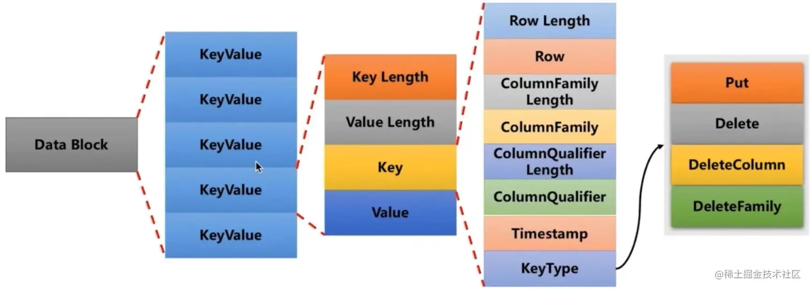

<!-- TOC -->

- [1 结构](#1-结构)
- [2 写入](#2-写入)
- [3 读取](#3-读取)
- [4 合并](#4-合并)
- [5 Hbase](#5-hbase)

<!-- /TOC -->
[数据分析与处理之二（Leveldb 实现原理）
](https://www.cnblogs.com/haippy/archive/2011/12/04/2276064.html)
# 1 结构

memtable是跳表结构。sstable种Data block根据记录的Key由小到大排列，并有Index Block进行索引

# 2 写入
先写入顺序log，再入memtable。当Memtable写入的数据占用内存到达指定数量，则自动转换为Immutable Memtable，等待Dump到磁盘中

更新就是直接插入新纪录

删除就是插入一条\{key:删除标记}

# 3 读取
先读 memtable，immutable memtable，在读sstable

# 4 合并
- Minor compaction ：按照immutable memtable中记录由小到大遍历，并依次写入一个level 0 的新建SSTable文件中，写完后建立文件的index 数据
- major compaction： 当某个level下的SSTable文件数目超过一定设置值后，levelDb会从这个level的SSTable中选择一个文件A（level>0，level=0不只选一个文件），将其和高一层级的level+1的SSTable文件（和A有重叠的所有文件）合并（多路归并排序）
    - 但是对于level 0来说，指定某个文件后，本level中很可能有其他SSTable文件的key范围和这个文件有重叠（因为level 0 没有进行合并过，是原始immutable memtable dump的），这种情况下，要找出所有有重叠的文件和level 1的文件进行合并，即level 0在进行文件选择的时候，可能会有多个文件参与major compaction。
- ？合并是为了减少冗余数据，分层合并是为了每次只合并一部分
# 5 Hbase
[HBase 存储原理](https://juejin.cn/post/6911885877408956429)

- RegionServer 包含多个 Region 和 一个 HLog
- Region : 也称为 HRegin ，它是存储用户数据的最小单元，它对应一张表的部分行数据。一张HBase 表可能会根据行键分成多段存储在不同的 RegionServer 中的不同 Region 上，以实现负载均衡。
- HLog : HLog 文件存储在硬盘上，用于实现 WAL(预写日志)。当用户数据进入到 RegionServer 后最先会被保存在 HLog 中，以实现高可用。当服务当机等情况发生后。可用通过回放日志恢复到之前的状态。
- 一个 RegionServer 可以包含多个 Region ，一个 Region 又包含多个 store ，**store 对应表中的列族**。在物理上，一个的列族成员在文件系统上都是存储在一起。store  由一个 MemStore  和多个 storeFile组成
    - MemStore : 它是存储在**内存**中的数据结构，当用户数据已经保存到 HLog  后，数据才会进入到 region ，然后先会刷新到对应 store 的 MemStore  中，MemStore  达到阈值之后，才会刷新到 storeFile中
    - storeFile/HFile  : storeFile 是 MemStore  中数据达到阈值之后刷写出来的文件。存储表数据的文件。storeFile 文件最终会被转换成 HFile 格式存储在 HDFS 上

