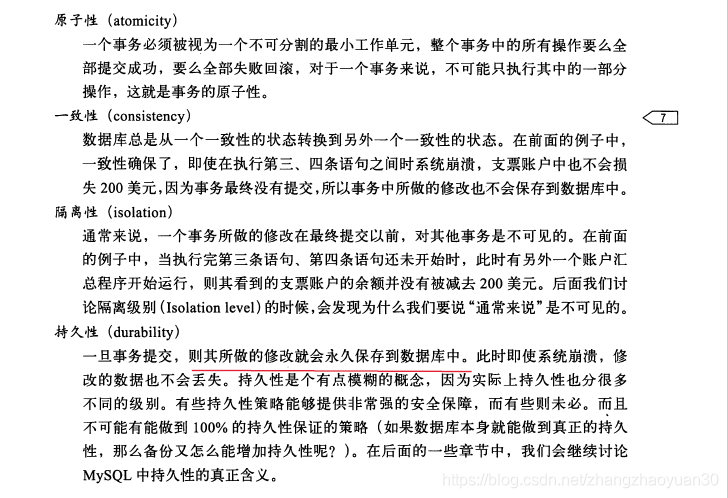
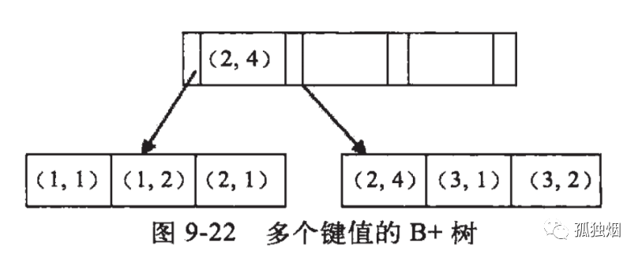
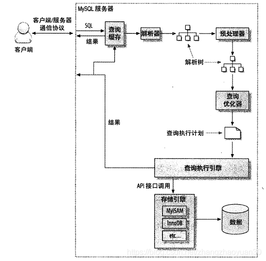
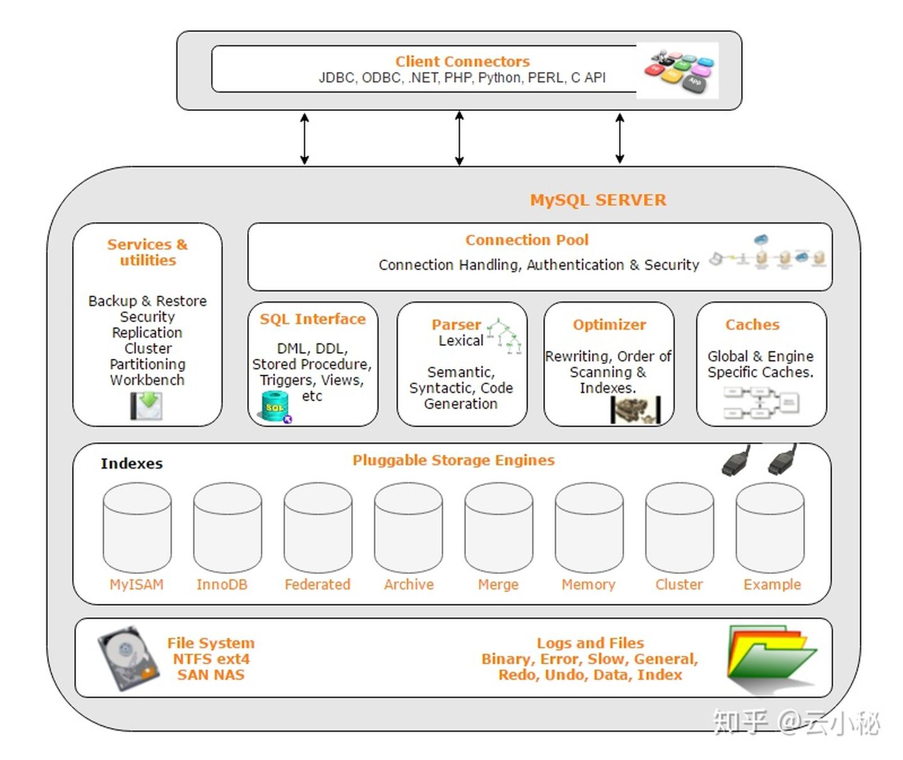
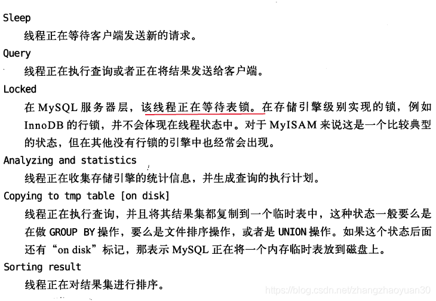
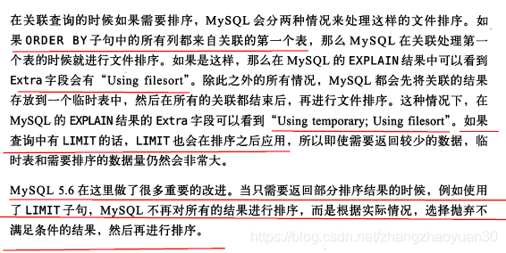
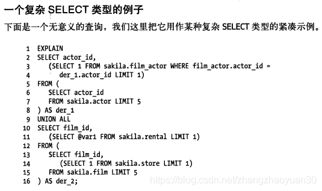
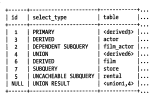
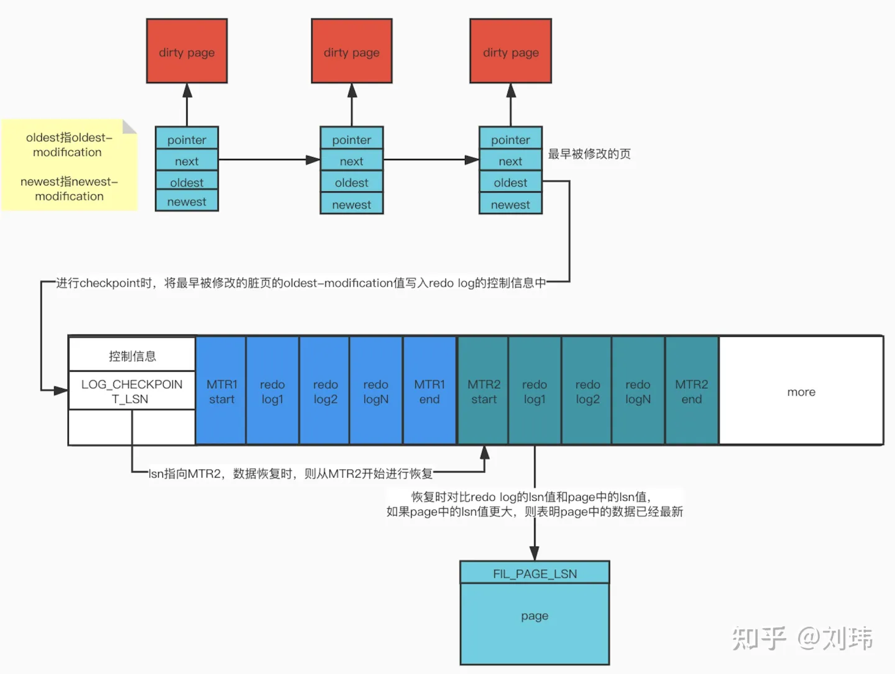

<!-- TOC -->

- [1 事务属性有哪些，怎么实现的？](#1-事务属性有哪些怎么实现的)
- [2 事务隔离级别有哪些，怎么实现的？](#2-事务隔离级别有哪些怎么实现的)
- [3 MVCC是什么？怎么实现的？](#3-mvcc是什么怎么实现的)
    - [3.1 隐藏列](#31-隐藏列)
    - [3.2 Read View](#32-read-view)
    - [3.3 注意事项](#33-注意事项)
- [4 行锁的算法？](#4-行锁的算法)
- [5 Mysql中有哪些锁？](#5-mysql中有哪些锁)
- [6 两阶段锁？](#6-两阶段锁)
- [7 死锁？](#7-死锁)
- [8 InnoDB索引为什么采用B+树？](#8-innodb索引为什么采用b树)
    - [8.1 为什么用b+树？](#81-为什么用b树)
- [9 计算B+树能存多少条记录？](#9-计算b树能存多少条记录)
- [10 索引的使用](#10-索引的使用)
- [11 聚簇索引？](#11-聚簇索引)
- [12 覆盖索引？](#12-覆盖索引)
- [13 优化索引？](#13-优化索引)
- [14 Mysql架构？](#14-mysql架构)
    - [14.1 应用层](#141-应用层)
    - [14.2 服务层](#142-服务层)
    - [14.2.1 优化器](#1421-优化器)
    - [14.3 存储引擎层](#143-存储引擎层)
- [15 SQL优化？](#15-sql优化)
- [16 剖析sql查询?](#16-剖析sql查询)
- [17 MySQL配置优化？](#17-mysql配置优化)
- [18 Redo Log](#18-redo-log)
    - [18.1 MTR](#181-mtr)
    - [18.2 LSN](#182-lsn)
    - [18.3 checkpoint](#183-checkpoint)
- [19 undo log](#19-undo-log)
- [20 binlog](#20-binlog)
    - [20.1 流程](#201-流程)
    - [20.2 格式](#202-格式)
    - [20.3 Mysql高可用](#203-mysql高可用)
    - [20.4 读写分离](#204-读写分离)
    - [20.5 semi-sync（半同步复制）](#205-semi-sync半同步复制)
- [19 Mysql数据写入过程](#19-mysql数据写入过程)
    - [19.1 双写是什么？](#191-双写是什么)
- [20 分库分表？](#20-分库分表)
    - [20.1 双写迁移](#201-双写迁移)
    - [20.2 唯一ID](#202-唯一id)
    - [20.3 分库VS分表](#203-分库vs分表)
- [21 分布式事务？](#21-分布式事务)
    - [21.1 XA/两阶段提交](#211-xa两阶段提交)
    - [21.2 TCC(Try Confirm Cancel)](#212-tcctry-confirm-cancel)
    - [21.3 本地消息表](#213-本地消息表)
    - [21.4 事务消息](#214-事务消息)
    - [21.5 尽最大努力通知](#215-尽最大努力通知)
- [22 数据存储](#22-数据存储)
    - [22.1 NULL值怎么存的](#221-null值怎么存的)
    - [22.2 varchar(n) 中 n 最大取值为多少？](#222-varcharn-中-n-最大取值为多少)
    - [22.3 行溢出后，MySQL 是怎么处理的？](#223-行溢出后mysql-是怎么处理的)
    - [22.4 B+树怎么存的？](#224-b树怎么存的)
- [23 数据库三范式](#23-数据库三范式)
- [24 为什么不用外键？](#24-为什么不用外键)

<!-- /TOC -->
[MySQL实战45讲](http://learn.lianglianglee.com/%E6%9E%81%E5%AE%A2%E6%97%B6%E9%97%B4/MySQL%E5%AE%9E%E6%88%9845%E8%AE%B2.md)
# 1 事务属性有哪些，怎么实现的？

- 原子性:uodo log
- 隔离性：通过锁实现见2  
- 持久性：redo log  
    - 事务提交时必须先将事务的所有日志写入redo log
- 一致性：acd实现
# 2 事务隔离级别有哪些，怎么实现的？
[MySQL事务隔离级别、数据一致性与加锁处理分析](https://zhuanlan.zhihu.com/p/165365896)  
- READ UNCOMMITED
    - 读不加锁
    - 写加排他锁
- READ COMMITED
    - 读使用MVCC，每次select生成快照
    - 写使用记录锁
- REPETABLE READ
    - 读使用MVCC，第一次select时生成快照
    - 写使用Next-Key locks 
    - RR隔离级别的防止幻读主要是针对写操作的，即只保证写操作的可串行化，因为只有写操作影响Binlog；而读操作是通过MVCC来保证一致性读（无幻象）。然而，可串行化隔离级别要求读写可串行化
- SERIALISABLE 
    - 读加共享锁
    - 写加排他锁
- begin/start transaction 命令并不是一个事务的起点，在执行到它们之后的第一个操作 InnoDB 表的语句，事务才真正启动。如果你想要马上启动一个事务，可以使用 start transaction with consistent snapshot 这个命令。
- 解决丢失更新加锁
# 3 MVCC是什么？怎么实现的？
- 作用：减少锁的使用
[MySQL MVCC实现原理](https://www.51cto.com/article/745321.html)
## 3.1 隐藏列
在MySQL中建表时，每个表都会有三列隐藏记录，其中和MVCC有关系的有两列
- 操作该数据行的事务ID(DB_TRX_ID）
- 指向上一个版本数据在undo log 里的位置指针(DB_ROLL_PTR) 
- DB_ROW_ID: 隐藏ID，当创建表没有合适的索引作为聚集索引时，会用该隐藏ID创建聚集索引
## 3.2 Read View
- 属性
    - trx_ids: 当前系统活跃(未提交)事务版本号集合。
    - low_limit_id: 表示生成ReadView时系统中应该分配给下一个事务的 id 值。low_limit_id并不是trx_ids中的最大值。(**我理解快照生成有个过程可能在这个过程中有更新事务提交**)
    - up_limit_id: 活跃的事务中最小的事务 ID
- 匹配
    1. 数据事务ID < up_limit_id 则可见
    2. 数据事务ID >= low_limit_id 则不可见，需要根据 Undo Log 链找到前一个版本，然后根据该版本的 DB_TRX_ID 重新判断可见性
    3. up_limit_id <= 数据事务ID < low_limit_id 则与活跃事务集合trx_ids里匹配（这个数据有可能是在当前事务开始的时候还没有提交）
        - 事务ID不存在于trx_ids 集合，表示事务已提交，可见
        - 如果等于creator_trx_id，可见
        - 否则不看见
    4. 此时已经得到了这条记录相对 ReadView 来说的可见结果。此时，如果这条记录的 delete_flag 为 true，说明这条记录已被删除，不返回。否则说明此记录可以安全返回给客户端
## 3.3 注意事项        
- 只在read committed和rr生效
    - 能解决幻读的**读问题**，不能解决写问题（写是当前读）
- 当前读 
    - update、delete、insert数据时都是先读后写的，MVCC在此时读数据时，只能读当前的值，而不采用上述select的方式。称为“当前读”（也由此引发丢失更新问题）
    - select语句加显式锁，也是当前读
# 4 行锁的算法？
[锁分类和行锁算法](https://juejin.im/post/6844903778026520584)  
- 行锁（Record Lock）  
锁直接加在索引记录上面。
- 间隙锁（Gap Lock）  
锁加在不存在的空闲空间，可以是两个索引记录之间，也可能是第一个索引记录之前或最后一个索引之后的空间。
- Next-Key Lock  
行锁与间隙锁组合起来用就叫做Next-Key Lock。  
    - 默认情况下，InnoDB工作在可重复读隔离级别下，并且以Next-Key Lock的方式对数据行进行加锁，这样可以有效防止幻读的发生。  
    - Next-Key Lock是行锁与间隙锁的组合，当InnoDB扫描索引记录的时候，会首先对选中的索引记录加上行锁（Record Lock），再对索引记录两边的间隙（向左扫描扫到第一个比给定参数小的值， 向右扫描扫描到第一个比给定参数大的值， 然后以此为界，构建一个区间）加上间隙锁（Gap Lock）。  
    - 如果是索引有唯一性，**降级为记录锁**
    - **RR级别下幻读的读问题由MVCC保证，当前读（比如先进行当前读，再进行普通读或当前读）由间隙锁保证，但是先普通读后当前读还是会出现幻行**
# 5 Mysql中有哪些锁？
- 全局锁  
    [全局锁](https://blog.csdn.net/zhangzhaoyuan30/article/details/88184010)  
    Flush tables with read lock(FTWRL)
- 表级锁
    - 表锁
        - lock tables ... read/write，可以用unlock tables主动释放锁，也可以在客户端断开的时候自动释放。
        - lock tables语法除了会限制别的线程的读写外，也限定了本线程接下来的操作对象。 对于InnoDB这种支持行锁的引擎，一般不使用lock tables命令来控制并发，毕竟锁住整个表的影响面还是太大。
    - MDL（Meta Data Lock）
        - 在对一个表做增删改查操作的时候，加MDL读锁；
        - 当要对表做结构变更操作的时候，加MDL写锁。
- 行锁
    - 共享锁
    - 排它锁
- 表锁
    - 意向锁：为了防止加表锁时遍历所有行锁，只对表级锁生效，且意向锁之间不互斥[详解 MySql InnoDB 中意向锁的作用](https://juejin.cn/post/6844903666332368909)
    - 意向共享  
    加行共享锁前必须先取得该表的 IS 锁
    - 意向排它  
    加行排他锁前必须先取得该表的 IX 锁
- 加锁方法
    - 对于 UPDATE、 DELETE 和 INSERT 语句， InnoDB
会自动给涉及数据集加排他锁（X)；
    - 显式锁  
    lock in share mode、for update
- 实现方式
    - 对索引加锁
# 6 两阶段锁？
两阶段锁（two-phase locking，2PL）是数据库事务处理时的并发控制方法，以保证**可串行化**。  
- 这种方法使用数据库锁在两个阶段：    
    - 扩张阶段：不断上锁，没有锁被释放
    - 收缩阶段：锁被陆续释放，没有新的加锁（只有提交(commit)或者回滚(rollback)时才是解锁阶段）
- 2PL可能会导致死锁
    - 一次封锁法：一次封锁法要求事务必须一次性将所有要使用的数据全部加锁，否则就不能继续执行。
- 可串行化调度
    - 如果一并行调度的结果等价于某一串行调度的结果，那么这个并行调度称为可串行化的
    - 若所有事务均遵守两段锁协议，则这些事务的所有交叉调度都是可串行化的。
# 7 死锁？
- innodb_deadlock_detect（默认开启）  
InnoDB 引擎采取的是 wait-for graph 等待图的方法来自动检测死锁，如果发现死锁会回滚undo量最少的事务
- innodb_lock_wait_timeout  
    超时默认会回滚当前语句  
- innodb_rollback_on_timeout  
    回滚当前事务
# 8 InnoDB索引为什么采用B+树？
- 参考
    - [B树、B+树详解](https://www.cnblogs.com/lianzhilei/p/11250589.html)
    - [B+树看这一篇就够了（B+树查找、插入、删除全上）](https://zhuanlan.zhihu.com/p/149287061)
- B+树索引能找到的只是被查找数据行所在的页，然后数据库把页读入内存，再在内存中查找
- 二叉查找树->平衡二叉树->B+树
- 什么是m阶B+树？
    - **每个节点最多可以有 m 个子节点，除了根节点外，每个节点最少有 (m/2) 个子节点**。如果根节点不是叶节点，则至少有 2 个子节点
    - 有k个子节点必有k个元素（区别1）
    - **所有的中间节点元素都同时存在于子节点，在子节点元素中是最大（或最小）元素**
    - **所有的叶子节点都在同一层，记录只存放在叶子节点中，非叶子节点只存放关键字和指向下一个孩子节点的索引**
        - B+树的磁盘读写代价更低（区别2）：内存页中能够存放更多的key，数据存放的更加紧密，如果把所有同一内部节点的关键字存放在同一盘块中，那么盘块所能容纳的关键字数量也越多，一次性读入内存的需要查找的关键字也就越多，相对IO读写次数就降低了
        - B+树的查询效率更加稳定（区别3）：由于非终结点并不是最终指向文件内容的结点，而只是叶子结点中关键字的索引。所以任何关键字的查找必须走一条从根结点到叶子结点的路
    - **相邻的叶子节点之间用双向链表相连**
        - 便于**范围查找**和**遍历**（区别4）
- B+树插入
    - 如果左右兄弟节点没满先移到兄弟节点（旋转）
    - 拆分成两个节点，小于中间节点放左边，大于中间节点放右边，中间节点放上一层
- B+树删除
    - 如果同时是上层节点，用该节点右节点代替
    - 小于填充因子合并节点
- 和B树区别：见上
- 联合索引
      
    b+树是按照从左到右的顺序来建立搜索树的，比如当(a=? and b=? and c=?)这样的数据来检索的时候，b+树会优先比较a列来确定下一步的所搜方向，**如果a列相同再依次比较b列和c列**，最后得到检索的数据；但**当(b=? and c=?)这样的没有a列的数据来的时候，b+树就不知道下一步该查哪个节点**
## 8.1 为什么用b+树？
1. 平衡二叉树树高太高，IO次数多
2. 平衡二叉树，物理实现是数组。所以在逻辑相近的节点上，其物理位置可能相差会很远。因此不能充分利用每次读取到的磁盘页数据
3. B树的每个节点可以存储多个关键字，~~它将节点大小设置为磁盘页的大小，充分利用了磁盘预读的功能。每次读取磁盘页时就会读取一整个节点。~~ 也正因每个节点存储着非常多个关键字，树的深度就会非常的小。进而要执行的磁盘读取操作次数就会非常少，更多的是在内存中对读取进来的数据进行查找。
4. 上面B+想对于B的优点

# 9 计算B+树能存多少条记录？
[InnoDB一棵B+树可以存放多少行数据？](https://www.cnblogs.com/leefreeman/p/8315844.html)
- 总记录数为：根节点指针数*单个叶子节点记录行数
- 单个叶子节点（页）中的记录数=16K/1K=16(假设一行记录的数据大小为1k)
- 假设主键ID为bigint类型，长度为8字节，而指针大小在InnoDB源码中设置为6字节，这样一共14字节，我们一个页中能存放多少这样的单元，其实就代表有多少指针，即16384/14=1170
- 一棵高度为2的B+树，能存放1170\*16=18720条这样的数据记录。根据同样的原理我们可以算出一个高度为3的B+树可以存放：1170\*1170\*16=21902400条这样的记录。
# 10 索引的使用
- 最左前缀：联合索引的最左N个字段，或字符串索引的最左M个字符
    - InnoDB 引擎单一字段索引的长度最大为 767 字节
- 匹配范围值
- 精确匹配前N列，范围匹配最后一列
- 联合索引不能跳过某一列
- 如果可以按照索引查到值，也可以按照这种方式order by 
- 哈希索引
    - 必须精确匹配索引所有列
    - 对于每一行数据，存储引擎会对所有索引列计算一个哈希码。哈希索引将哈希码存储在索引中，同时在哈希表中保存每个数据行的指针
    - InnoDB引擎支持自适应哈希索引
- 索引的优点
    - 减少服务器需要扫描的数据量
    - 避免排序和临时表
    - 将随机I/O变为顺序I/O
- 索引的选择性
    - 概念：基数/记录总数
    - select count(distinct left(city,3))/count(*) from table;
    - 缺点：无法使用前缀索引做order by 和 group by ，也无法覆盖索引
- 不使用索引的情况  
当访问的数据占整个表中数据的很大一部分（20%左右），且没有覆盖索引，优化器可能会选择通过聚簇索引查找，因为二级索引后回表导致随机IO
# 11 聚簇索引？
- 概念：数据行存在索引的叶子页中
- 通过主键聚集数据，如果没有则选择一个唯一非空索引代替
- 优点
    - **可以把相关数据保存在一起，可能在同一个页，减少磁盘IO，按主键查询（扫描）时效率高**
    - 二级索引使用主键而不是行指针，减少了当出现行移动时二级索引的维护工作
    - 覆盖索引可以直接使用叶节点中的主键值
- 缺点
    - 插入速度严重依赖于插入顺序
        - 使用随机主键比如UUID会导致新记录插到之前记录中间 ，导致需要移动之前的记录
        - 如果没有需要聚集的数据可以定义一个自增主键，避免随机
    - 更新聚簇索引列的代价高。需要将行移动到新位置
    - 全表扫描慢，尤其是数据稀疏或页分裂导致数据存储不连续时
    - 二级索引大，因为叶子节点包含了主键
    - 二级索引需要两次索引查找
- 与MyISAM比较
    - 按数据插入顺序存储在磁盘
    - 二级索引存储行指针
# 12 覆盖索引？
- 索引覆盖所需查询的字段，Extra列有Using index
- 优点
    - 避免二级查询回表
    - 索引按顺序存储，对于范围查找避免随机IO
# 13 优化索引？
- INDEX HINT
    - USE INDEX
    - FORCE INDEX
- Multi-Range Read(MRR)  
    - 二级索引查询的主键进行排序，再按照主键进行书签查找。减少了缓冲池中页被替换的次数。
        - 减少磁盘随机访问，将随机访问转化为顺序访问。用于range、ref、eq_ref类型的查询。
        - 如果缓冲池不够大放不下一张表的数据，频繁的离散读导致缓存的页被替换出缓冲池。
    - 将范围查询拆分为键值对，避免读出无用数据  
    where a > 1000 and a < 2000 and b=1000 转化为(1000,1000),(1001,1000)...
- Index Condition Pushdown(ICP)  
where过滤操作放在存储引擎层，Extra可以看到Using index condition
    - WHERE：可以过滤的条件是该索引可以覆盖到的范围（比如联合索引第一个索引用了范围查询，那么本来不能用第二个索引，要在服务器层过滤）
    - 适用条件
        - 查询走索引，explain中的访问方式为range，ref，eq_ref，ref_or_null，并且需要回表查询
        - 二级索引  
        因为InnDB的聚簇索引会将整行数据读到InnDB的缓冲区，这样一来索引条件下推的主要目的减少IO次数就失去了意义。因为数据已经在内存中了，不再需要去读取了。 
- 索引总结
    - 单行访问慢。读取的数据块尽可能包含更多行。
    - 顺序访问快。一是不需要多次寻址，二是避免额外排序
    - 覆盖查询很快
# 14 Mysql架构？
[MySQL体系架构简介](https://zhuanlan.zhihu.com/p/43736857)

## 14.1 应用层
连接处理、用户鉴权、安全管理
- 连接器
    - 通信协议  
    半双工。客户端发送一个单独数据包给服务器（大小由max_allowed_packet控制）。服务器返回多个数据包
    - show full processlist  
    
## 14.2 服务层
- MySQL Management Server & utilities(系统管理)
- SQL Interface(SQL 接口)
- SQL Parser(SQL 解析器)
- Optimizer (查询优化器)
- Caches & buffers(缓存)
## 14.2.1 优化器
- 功能
    - count()、min()、max()  
        - 查B-Tree最左端或最右端，EXPLAIN会有“Select tables optimized away”，表示优化器已经从执行计划中移除该表，以一个常数取代
        - MyISAM维护了count变量
    - 预估并转化为常数表达式
        - const  
        该表最多有一个匹配行, 在查询开始时读取。由于只有一行, 因此该行中**列的值可以被优化器的其余部分视为常量**，被优化器从联接中移除。
    - 覆盖索引扫描
    - 提前终止查询
        - LIMIT
        - 发现一个不成立的条件
    - 等值传播
    两个列的值通过等式连接（join on t1.id=t2.id）,可以把一个列的where条件传递到另一个列上
    - in()
    in()中数据先排序，然后通过二分查找确定是否满足条件（O(n)复杂度）。而不是转化为多个OR条件子句
    - 关联查询  
    嵌套循环关联、子查询放到临时表
        - 关联查询优化器
    - 排序优化  
        - 不能使用索引时，使用文件排序。group by 除了文件排序还会创建临时表  
        - innodb_sort_buffer_size  
            需要排序数据量小于此参数，使用**内存快速排序**。否则会先数据分块，每个块快速排序，将各个块放在磁盘中，最后合并
        - max_length_for_sort_data：查询中所有需要的列和ORDER BY的列总大小小于此参数或者列中包含BLOB或TEXT，采用single-pass
            - two-pass:读取行指针和所需排序字段，排序完成之后再读取所需数据行
                - 优点：排序时存储尽可能少数据，使“排序缓冲区”容纳更多行
                - 缺点：需两次数据传输，且第二次大量随机IO
            - single-pass:读取所有列排序。
                - 优点：无需随机IO
                - 缺点：占用空间大，可能有更多排序块需要合并
        - 关联  
        
    - 返回结果  
    增量逐步返回。例如，处理完最后一个关联表，开始生成第一条结果，就可以向客户端返回结果集。好处是服务端无须存储太多结果降低内存，同时客户端第一时间获得结果
- 局限性  
[查询优化器的局限性和提示（hint）](https://blog.csdn.net/zhangzhaoyuan30/article/details/88379826)
## 14.3 存储引擎层
- 存储引擎
- 物理文件：redolog、undolog、binlog、errorlog、querylog、slowlog、data、index等
# 15 SQL优化？
- 关联查询  
    - **确保on或using语句上有第二个表的索引**
    - group by 和order by表达式只涉及一个表中的列，否则不能使用索引
- group by 和distinct
    - SQL_SMALL_RESULT：结果集很小，可以将结果集放在内存中的索引临时表避免排序
    - SQL_BIG_RESULT：结果集很大，建议使用磁盘临时表
- LIMIT分页
    - 尽可能使用索引覆盖扫描，并根据需要做一次关联操作再返回所需要的列
- 优化 union
    - 执行方式：创建临时表
    - WHERE、LIMIT、ORDER BY 字句需要手工下推到子句
    - 默认会DISTINCT，如果不需要就**UNION ALL**
- BLOG和TEXT  
    - 如果总行长大于8KB存储768字节在行内，在行外分配一个16KB的页，超过32个页会一次性分配64个
# 16 剖析sql查询?
- 慢查询
    - show_query_log=on
    - log_long_query_time：慢查询阈值
    - 日志分析工具mysqldumpslow
    - [MySQL慢查询日志总结](https://www.cnblogs.com/saneri/p/6656161.html)
- show status  
计数器
    - show global status  
    服务器级别
    - show status  
    会话级别+服务器级别
- **EXPLAIN**
    - [MySQL执行计划](https://www.cnblogs.com/wanbin/p/9565799.html)
    - id  
    编号，复杂查询select语句顺序编号（子查询从内到外）。
    - select_type
        - 最外层：PRIMARY
        - SUBQUERY：SELECT 列表中的子查询
        - DERIVED：FROM子句中的子查询（会将结果放在临时表）
        - UNION：UNION语句中第二个之后的被标记为UNION
        - UNION RESULT
    - table  
        - **正在访问的表**
        - 当 FROM子句有子查询时，table列是\<derivedN>，N是子查询Id
          
        
    - **type**
        - ALL：全表扫描
        - **index**：按索引次序全表扫描
            - 由于是按随机次序访问行，开销很大
            - 如果Extra中有"Using index"，使用覆盖索引，开销小
        - range：有限制的索引扫描
        - ref：索引访问，返回匹配某个单个值的行
            - **非唯一索引或唯一索引的非唯一性前缀**
        - eq_ref：最多只返回一条符合条件的记录
            - **主键或唯一索引**，和关联表的行等值比较
        - const：该表最多有一个匹配行, 在查询开始时读取。由于只有一行, 因此该行中**列的值可以被优化器的其余部分视为常量**，被优化器从联接中移除。
            - 用于PRIMARY KEY或UNIQUE索引的所有部分与常量值进行比较时
        - system：表只有一行。特殊的const
        - NULL：在优化器阶段分解查询语句，在执行阶段不再访问表或索引。比如从索引列中选取最小值
    - possible_keys  
    可以使用哪些索引
        - 基于访问的列和比较操作符判断
        - 优化器阶段创建
    - key  
    最终选择的索引
    - ken_len  
    索引使用的**字节数**，可以算出使用的是索引的哪些列
        - 通过查找**字段的定义**算出而不是实际数据
        - **前缀模式匹配会显示为完全宽度**
    - ref  
    显示哪些列或常量与key列中指定的索引进行比较，以从表中选择行
    - Extra
        - Using filesort (JSON property: using_filesort)  
        表示 MySQL 会对结果使用一个外部索引排序，而不是从表里按索引次序读到相关内容。可能在内存或者磁盘上进行排序。**MySQL 中无法利用索引完成的排序操作称为“文件排序”**
        - Using index (JSON property: using_index)  
        覆盖索引
        - Using index condition (JSON property: using_index_condition)  
        会先条件过滤索引，过滤完索引后找到所有符合索引条件的数据行，随后用 WHERE 子句中的其他条件去过滤这些数据行。
        - Using temporary (JSON property: using_temporary_table)  
        表示 MySQL 在对查询结果排序时使用临时表。常见于排序 **order by和group by**
        - Using where (JSON property: attached_condition)
        通常是进行了全表引扫描后再用WHERE子句完成结果过滤，需要添加合适的索引
# 17 MySQL配置优化？
- 缓冲池和日志文件是必须配置的
    - InnoDB缓冲池
    
# 18 Redo Log  
[详细分析MySQL事务日志(redo log和undo log) ](https://www.cnblogs.com/f-ck-need-u/p/9010872.html)
物理日志，记录页的物理修改操作。数据库系统普遍采用Write Ahead Log，当**事务提交时**，先写重做日志，再修改（磁盘）数据页
- 功能：**把随机I/O变为顺序I/O，无须在事务提交时把缓冲池的脏块刷新到磁盘中**
- 组成
    - redo log buffer
        - 缓冲大小：innodb_log_buffer_size
        - 刷盘策略：innodb_flush_log_at_trx_commit（默认1）
            
    - redo log file
- 写入方式：环形写入，后台线程刷新到数据文件
- 参数配置
    - innodb_log_file_size
    - innodb_log_giles_in_group
    - 权衡：数据变更的开销和崩溃恢复时间
- 数据页刷盘
    - checkpoint：checkpoint触发后，会将buffer中脏数据页刷到磁盘。
        - 作用：
            1. 缩短数据库恢复时间
            2. 缓冲池不够用时，将脏页刷到磁盘
            3. 重做日志不可用时，刷新脏页
        - sharp checkpoint：在数据库关闭时，将所有已记录到redo log中对应的脏数据刷到磁盘。
        - fuzzy checkpoint：一次只刷一小部分脏页到磁盘。有以下几种情况会触发该检查点：
            - master thread checkpoint：由master线程控制，**每秒或每10秒**刷入一定比例的脏页到磁盘。
            - flush_lru_list checkpoint：从MySQL5.6开始可通过 innodb_page_cleaners 变量指定专门负责脏页刷盘的page cleaner线程的个数，该线程的目的是为了保证lru列表有可用的空闲页。
            - async/sync flush checkpoint：重做日志不可用时
            - dirty page too much checkpoint：脏页太多时强制触发检查点，目的是为了保证缓存有足够的空闲空间。too much的比例由变量 innodb_max_dirty_pages_pct 控制，MySQL 5.6默认的值为75，**即当脏页占缓冲池的百分之75**后，就强制刷一部分脏页到磁盘。
## 18.1 MTR
对底层页面进行一次原子性操作的过程称为一个Mini-Transaction（MTR）。例如对一个索引进行插入，可能遇到需要页面分裂，涉及到很多操作：新增页面、复制数据、修改目录项等等，这些操作必须要么全部恢复要么全部不恢复，否则将出现逻辑性的错误。一次MTR最终可能产生很多条redo日志记录，这些记录必须作为一个组来进行恢复。
## 18.2 LSN
日志的逻辑序列号(log sequence number)，表示事务写入redo log的字节总量。每当产生一个redo日志记录，lsn值就增加这个redo日志记录的大小（其实应该是每产生一个MTR，lsn值增加这个MTR中包含的日志记录的大小）。

## 18.3 checkpoint
[MySQL innodb 中redo重做日志实现细节？](https://www.zhihu.com/question/366926723)

脏页链表尾部的脏页是最早被修改的脏页，每个脏页还有一个属性，oldest-modification——存储了这个页首次被修改前的lsn值。

innodb进行checkpoint时，**将脏页链表尾部的oldest-modification值写入到redo文件的控制信息部分的LOG_CHECKPOINT_LSN中。进行数据恢复时，innodb将从LOG_CHECKPOINT_LSN所指向的redo文件位置开始进行数据恢复**。

由于checkpoint和脏页刷新是不同的任务，有可能一次checkpoint完成后，在下一次checkpoint之前，有些脏页刷新到了文件。对于这种情况如果单纯从LOG_CHECKPOINT_LSN指向的位置开始进行数据恢复，将导致那些checkpoint之后已经刷新到文件的脏页对应的redo log重放，产生数据错误。

每个脏页还有另外一个属性，newest-modification——存储了这个页最近1次被修改后的lsn值。脏页刷新到文件时，会将这个值写入到页的FIL_PAGE_LSN属性中。进行数据恢复时，将对比页的FIL_PAGE_LSN属性和redo日志记录中的lsn值，如果FIL_PAGE_LSN较大，说明页中的数据比redo日志新，则跳过这条redo日志的恢复。

# 19 undo log  
逻辑日志，根据每行记录进行记录，需要随机读写。
- 作用
    - 回滚：执行和之前相反的操作
    - MVCC
- 存在undo 段，位于共享表空间
    - insert undo log  
    insert的记录之前并不存在，所以其他事物看不见历史版本，故**insert undo log**可在提交后直接删除。**todo**
    - update undo log  
    需要提供MVCC机制，需要等待该行记录不被任何事务引用时，**purge**线程删除
# 20 binlog
POINT-IN-TIME恢复和主从复制环境的建立，逻辑日志，记录sql（不包含select）
- 和redo log区别
    - bin log服务器层产生，redo log innoDB产生
    - redo log记录每个页的修改，它具有**幂等性**；bin log是逻辑日志，记录SQL语句
- sync_binlog（默认1）
    - 0：写入缓冲不刷盘
    - 1：同步刷盘
    - N：每N次操作系统缓冲执行一次刷新
## 20.1 流程

1. 在备库 B 上通过 **change master** 命令，设置主库 A 的 IP、端口、用户名、密码，以及要从哪个位置开始请求 binlog，这个位置包含文件名和日志偏移量。
2. 在备库 B 上执行 **start slave** 命令，这时候备库会启动两个线程，就是图中的 **io_thread 和 sql_thread**。其中 io_thread 负责与主库建立连接。
3. 主库 A 校验完用户名、密码后，开始按照备库 B 传过来的位置，从本地读取 binlog，发给 B。
4. 备库 B 拿到 binlog 后，写到本地文件，称为中转日志（relay log）。
sql_thread 读取中转日志，解析出日志里的命令，并执行。
## 20.2 格式
- statement：记录sql（因此可能会出现这样一种情况：在主库执行这条 SQL 语句的时候，用的是索引 a；而在备库执行这条 SQL 语句的时候，却使用了索引 t_modified。因此，MySQL 认为这样写是有风险的。）
- row（用的多）：会记录sql里没有的信息，比如删除行会记录删除的所有字段。update会记录修改前整行的数据和修改后的整行数据。
    - 优点是可以用来恢复数据
    - （缺点是，很占空间。比如你用一个 delete 语句删掉 10 万行数据，用 statement 的话就是一个 SQL 语句被记录到 binlog 中，占用几十个字节的空间。但如果用 row 格式的 binlog，就要把这 10 万条记录都写到 binlog 中。）
- mixed：mysql把认为有主备不一致风险的语句用row格式
## 20.3 Mysql高可用
主备延迟：备库机器性能、备库读压力大、大事务导致（delete太多数据）
采用可靠性优先策略，主动主备切换：
1. 判断备库 B 现在的 seconds_behind_master，如果小于某个值（比如 5 秒）继续下一步，否则持续重试这一步；
2. 把主库 A 改成只读状态，即把 readonly 设置为 true；
3. 判断备库 B 的 seconds_behind_master 的值，直到这个值变成 0 为止；
4. 把备库 B 改成可读写状态，也就是把 readonly 设置为 false；
把业务请求切到备库 B。

在满足数据可靠性的前提下，MySQL 高可用系统的可用性，是依赖于主备延迟的。延迟的时间越小，在主库故障的时候，服务恢复需要的时间就越短，可用性就越高。

主节点宕机如何保证不丢数据：下面的**semi-sync**

## 20.4 读写分离
- 客户端直连
- proxy

从库过期读（由于主从延迟存在）如何解决
- 强制走主库（对于所有查询都不能是过期读的（金融类）没办法解决）
- sleep一个主从延迟的时间（不够准确）
- 判断主从延迟(还是不够准确，因为存在主库已提交但从库还没收到binlog)
    - 判断 seconds_behind_master 是否已经等于 0
    - 判断位点(todo)
    - 判断GTID(todo)
- semi-sync+位点
## 20.5 semi-sync（半同步复制）
1. 事务提交的时候，主库把 binlog 发给从库；
2. 从库收到 binlog 以后，发回给主库一个 ack，表示收到了；
3. 主库收到这个 ack 以后，才能给客户端返回“事务完成”的确认。
# 19 Mysql数据写入过程
1. 首先 insert 进入 server 层后，会进行一些必要的**检查**
2. 修改 buffer pool 当中对应的数据页
4. 写入redo log（prepare）
5. 如果开启了 binlog，我们还需将事务逻辑数据写入 binlog 
6. 提交

3-5是两阶段提交
## 19.1 双写是什么？
数据库真正修改一个page会有以下的流程：
1. 把一个page从持久层读出来放到内存中
2. 在内存中把这个page修改掉
3. 把这个内存中的page刷回持久层的原来的位置。

数据页的大小是16K，操作系统页4k，会出现partial-write。

而partial-write如果出现在第三步，这个操作就把原来的page的内容也写坏了，新的page的内容也没写进入。此时redo log也无法恢复，因为**没有存此页原来的数据**。

双写过程：
1. 数据缓冲池中的脏页刷新时，并不直接写入磁盘数据文件中，而是先拷贝至内存中的doublewrite buffer中
2. 接着从doublewrite buffer分两次写入磁盘共享表空间中(**顺序写**)，每次写1MB（todo），相当于备份
3. 待第二步完成后，再将doublewrite buffer中的脏页数据写入实际的各个表空间文件(**离散写**)；(脏页数据固化后，即进行标记对应doublewrite数据可覆盖)

2和3 两次写叫双写
# 20 分库分表？
## 20.1 双写迁移
[双写迁移](https://doocs.github.io/advanced-java/#/./docs/high-concurrency/database-shard-method)
## 20.2 唯一ID
- 无意义表获取自增主键
- 每个库步长一样，起始值不一样
- snowflake：时间戳+机器id+序号
## 20.3 分库VS分表
- 分表：单表数据量大，buffer存不下，产生IO瓶颈；DDL时间长
- 分库：网络IO瓶颈，并发处理能力提高

# 21 分布式事务？
分布式事务的关键点在于如何保证两个事物的原子性。本地事务表通过本地事务保证。事务消息把原子性交给消息队列保证（通过半事务消息）
## 21.1 XA/两阶段提交
见[2PC](../微服务/ZooKeeper.md/#21-2pc)
- 事务管理器：协调
## 21.2 TCC(Try Confirm Cancel)
[TCC分布式事务简介](https://blog.csdn.net/pseudonym_/article/details/88061286)
最终一致性
- 流程
    1. Try: 尝试执行业务
        - 完成所有业务检查(一致性)
        - 预留必须业务资源(准隔离性)          
    2. Confirm:确认执行业务
        - 真正执行业务
        - 不作任何业务检查
        - 只使用Try阶段预留的业务资源 
        - Confirm操作要满足幂等性
    3. Cancel: 取消执行业务
        - 释放Try阶段预留的业务资源 
        - Cancel操作要满足幂等性
- 优点
让应用自己定义数据库操作的粒度，使得降低锁冲突、提高吞吐量成为可能。
- 缺点
    1. 对微服务的侵入性强，微服务的**每个事务都必须实现try，confirm，cancel等3个方法**，开发成本高，今后维护改造的成本也高。
    2. 为了达到事务的一致性要求，try，confirm、cancel接口必须实现等幂性操作。（定时器+重试）
    3. 由于事务管理器要记录事务日志，必定会损耗一定的性能，并使得整个TCC事务时间拉长，建议采用redis的方式来记录事务日志。
## 21.3 本地消息表
- 流程：
    1. 当系统 A 被其他系统调用发生数据库表更操作，首先会更新数据库的业务表，其次会**往相同数据库的消息表中插入一条数据，两个操作发生在同一个事务中**
    2. 系统 A 的脚本定期轮询本地消息表往 mq 中写入一条消息，如果消息发送失败会进行重试
    3. 系统 B 消费 mq 中的消息，并处理业务逻辑。如果本地事务处理失败，会继续消费 mq 中的消息进行重试，如果业务上的失败，可以通知系统 A 进行回滚操作
- 本地消息表实现的条件：
    1. 消费者与生成者的接口都要支持幂等
    2. 生产者需要额外的创建消息表
    3. 需要提供补偿逻辑，如果消费者业务失败，需要生产者支持回滚操作
- 容错机制：
1. 步骤 1 失败时，事务直接回滚
2. 步骤 2,3 写 mq 与消费 mq 失败会进行重试
3. 步骤 3 业务失败系统 B 向系统 A 发起事务回滚操作
## 21.4 事务消息

[还不知道事务消息吗？这篇文章带你全面扫盲！](https://juejin.cn/post/6844904106532962311)

[事务消息](https://help.aliyun.com/document_detail/43348.html)

事务消息发送步骤如下：

（核心：发消息和本地事务在一个事务内）

1. 生产者将半事务消息发送至消息队列RocketMQ版服务端。
2. 消息队列RocketMQ版服务端将消息持久化成功之后，向生产者返回Ack确认消息已经发送成功，此时消息为半事务消息。
3. 生产者开始执行本地事务逻辑。
4. 生产者根据本地事务执行结果向服务端提交二次确认结果（Commit或是Rollback），服务端收到确认结果后处理逻辑如下：
    - 二次确认结果为Commit：服务端将半事务消息标记为可投递，并投递给消费者。
    - 二次确认结果为Rollback：服务端将回滚事务，不会将半事务消息投递给消费者。
5. 在断网或者是生产者应用重启的特殊情况下，若服务端未收到发送者提交的二次确认结果，或服务端收到的二次确认结果为Unknown未知状态，经过固定时间后，服务端将对消息生产者即生产者集群中任一生产者实例发起消息回查。

事务消息回查步骤如下：
1. 生产者收到消息回查后，需要检查对应消息的本地事务执行的最终结果。
2. 生产者根据检查得到的本地事务的最终状态再次提交二次确认，服务端仍按照步骤4对半事务消息进行处理。

## 21.5 尽最大努力通知
1. 系统 A 本地事务执行完之后，发送个消息到 MQ；
2. 这里会有个专门消费 MQ 的服务，这个服务会消费 MQ 并调用系统 B 的接口；
3. 要是系统 B 执行成功就 ok 了；要是系统 B 执行失败了，就定时尝试重新调用系统 B, 反复 N 次，最后还是不行就放弃。

# 22 数据存储
[MySQL 一行记录是怎么存储的？](https://www.xiaolincoding.com/mysql/base/row_format.html)

## 22.1 NULL值怎么存的
MySQL 的 Compact 行格式中会用「NULL值列表」来标记值为 NULL 的列，NULL 值并不会存储在行格式中的真实数据部分。

NULL值列表会占用 1 字节空间，当表中所有字段都定义成 NOT NULL，行格式中就不会有 NULL值列表，这样可节省 1 字节的空间。

「变长字段长度列表」中的信息之所以要逆序存放，是因为这样可以使得位置靠前的记录的真实数据和数据对应的字段长度信息可以同时在一个 CPU Cache Line 中，这样就可以提高 CPU Cache 的命中率。

同样的道理， NULL 值列表的信息也需要逆序存放。
## 22.2 varchar(n) 中 n 最大取值为多少？
MySQL 规定除了 TEXT、BLOBs 这种大对象类型之外，其他所有的列（不包括隐藏列和记录头信息）占用的字节长度加起来不能超过 65535 个字节。

65535 - 2 - 1=65532，如果是UTF8编码，则65532/3
- 2：是变长字段长度列表，如果变长字段n大于255是2字节，小于是1字节（上述计算1个varchar的情况，因此2字节*1）
- 1：NULL是1字节

## 22.3 行溢出后，MySQL 是怎么处理的？
如果一个数据页存不了一条记录，InnoDB 存储引擎会自动将溢出的数据存放到「溢出页」中。

Compact 行格式针对行溢出的处理是这样的：当发生行溢出时，在记录的真实数据处只会保存该列的一部分数据，而把剩余的数据放在「溢出页」中，然后真实数据处用 20 字节存储指向溢出页的地址，从而可以找到剩余数据所在的页。

Compressed 和 Dynamic（默认）这两种格式采用完全的行溢出方式，记录的真实数据处不会存储该列的一部分数据，只存储 20 个字节的指针来指向溢出页。而实际的数据都存储在溢出页中。

## 22.4 B+树怎么存的？
[从数据页的角度看 B+ 树](https://xiaolincoding.com/mysql/index/page.html#innodb-%E6%98%AF%E5%A6%82%E4%BD%95%E5%AD%98%E5%82%A8%E6%95%B0%E6%8D%AE%E7%9A%84)

# 23 数据库三范式
[数据库设计三大范式](https://www.cnblogs.com/linjiqin/archive/2012/04/01/2428695.html)
- 第一范式：表中每一列的属性都不可再分
- 第二范式：第一范式，且非主属性完全依赖于主属性（不存在部分依赖，比如只依赖联合主键的一部分。比如订单和商品不要存在一张表，商品和订单独立建表，再建一个关联表）
- 第三范式：第二范式，且每个非主属性都不传递函数依赖于主属性。（订单表不要存客户信息，只存客户编号就行了）

# 24 为什么不用外键？
- 无状态的服务往往都可以很容易地扩容。由于外键等特性需要数据库执行额外的工作，而这些操作会占用数据库的计算资源，所以我们可以将大部分的需求都迁移到无状态的服务中完成以降低数据库的工作负载。
- 增加了可扩展性，框架迁移不用在数据库系统内部实现逻辑约束
- 分库分表的时候方便
- 不会在DB层面造成死锁