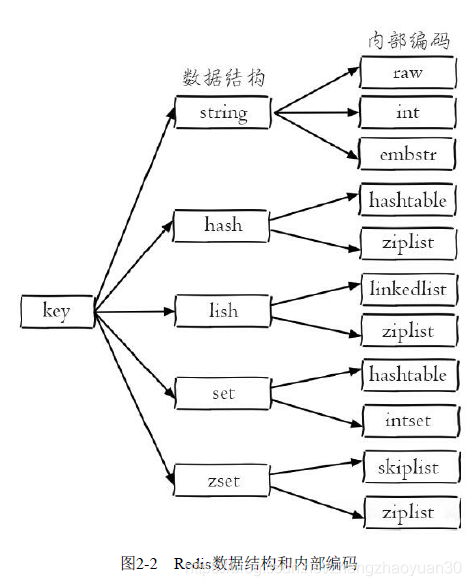
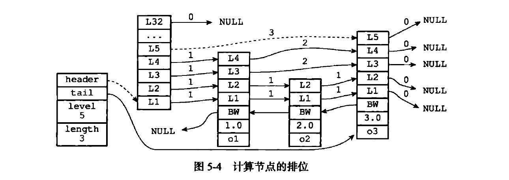
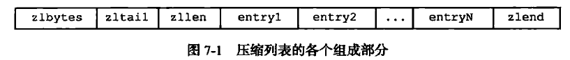
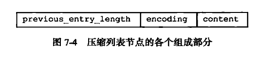
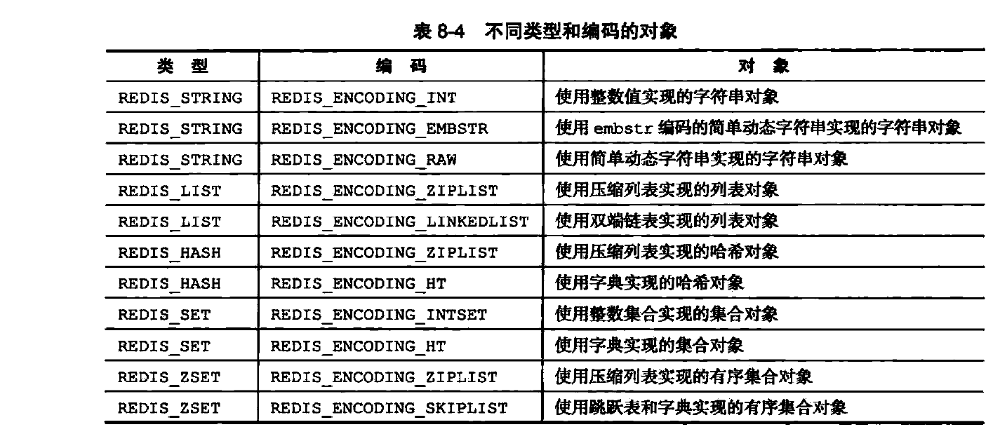

<!-- TOC -->

- [1Redis使用场景？](#1redis使用场景)
- [2API？](#2api)
    - [2.1全局命令](#21全局命令)
    - [2.2**数据结构和内部编码**](#22数据结构和内部编码)
    - [2.3主要命令](#23主要命令)
- [3Redis Pipeline和Redis事务？](#3redis-pipeline和redis事务)
    - [3.1 Redis Pipeline](#31-redis-pipeline)
    - [3.2 Redis事务？](#32-redis事务)
- [4其他功能](#4其他功能)
- [5RDB和AOF](#5rdb和aof)
- [6为什么使用SDS？](#6为什么使用sds)
- [7讲下字典和其rehash过程？](#7讲下字典和其rehash过程)
- [8Redis跳表是怎么实现的？](#8redis跳表是怎么实现的)
- [9整数集合升级？](#9整数集合升级)
- [10压缩列表的连锁更新？](#10压缩列表的连锁更新)
- [11 对象都有哪些？采用什么存储结构？](#11-对象都有哪些采用什么存储结构)
- [13 内存回收和对象共享？](#13-内存回收和对象共享)
- [14 数据库结构？](#14-数据库结构)
- [15 TTL和删除？](#15-ttl和删除)
- [16 分布式锁？](#16-分布式锁)
- [17 IO模型？](#17-io模型)

<!-- /TOC -->
# 1Redis使用场景？
- 缓存、排行榜、计时器、社交网络（赞/踩、粉丝、推送、下拉刷新）、消息队列
- 不适用于大规模数据、冷数据（不频繁改变）
# 2API？
## 2.1全局命令
- keys *
- scan cursor [pattern] [count number]
    - cursor设为0，初始化迭代
    - 每次调用会返回cursor，为0时迭代结束
    - 增量式迭代，保证：从遍历开始到结束一直存在于数据集的元素会被返回，但不保证不会重复
- dbsize O(1)
- exists key
- del key [key ...]
- expire key seconds
- ttl：返回键的剩余过期时间，有三种返回值
    - 大于0：键剩余的过期时间
    - -1：没设置过期时间
    - -2：键不存在    
- type key
## 2.2**数据结构和内部编码**

## 2.3主要命令  
[API理解与使用（二）-字符串、哈希、列表、集合、有序集合、键管理](https://blog.csdn.net/zhangzhaoyuan30/article/details/88570075)
# 3Redis Pipeline和Redis事务？
## 3.1 Redis Pipeline
## 3.2 Redis事务？
- multi
代表事务开始
- exec
代表事务结束
- watch
确保事务中的key没被其他客户端修改过，才执行，否则不执行（乐观锁）
# 4其他功能
- Bitmaps  
实际是字符串结构
- HyperLogLog  
独立总数统计
- GEO  
数据类型为zset
# 5RDB和AOF
[RDB和AOF](https://blog.csdn.net/zhangzhaoyuan30/article/details/88764847)
# 6为什么使用SDS？
- SDS：Redis 只会使用 C 字符串作为字面量，在大多数情况下， Redis 使用SDS ( Simple
Dynamic String，简单动态宇符串）作为字符串表示。
- 优点：
    - 常数复杂度获取字符串长度
    - 杜绝缓冲区溢出：当SDS API 需要对SDS进行修改时，若空间不够，API会自动将SDS的空间扩展至所需的大小
    - 减少修改字符串长度时所需的内存重分配次数
        - 空间预分配：每次多分配一倍（不超过1MB）空间
        - 惰性释放，存在free属性中
    - 二进制安全，可以存图像等二进制数据：可以包含空字符
# 7讲下字典和其rehash过程？
- 字典用途：用于数据库和hashtable，每个字典有两个哈希表，一个用于rehash
- MurmurHash2算法
- 拉链法解决冲突
- rehash条件
    - 扩展：当以下条件中的任意一个被满足时，程序会自动开始对晗希表执行扩展操作：
        1. 服务器目前没有在执行BGSAVE 命令或者BGREWRITEAOF 命令，并且哈希表的load factor（ht[0].used / ht[0].size）>1
        2. 服务器目前正在执行BGSAVE 命令或者BGREWRITEAOF 命令，并且哈希表的负载
因子大于等于5
    - 收缩：哈希表的负载因子小于0.1
- **渐进式rehash**
    1. 为ht[1]分配空间
    2. 令rehashidx=0
    3. 每次对字典执行添加、删除、查找或者更新操作时，还会顺带将ht[0]在rehashidx索引上的所有键值对rehash到ht[l]，当rehash工作完成之后，程序将rehashidx+1。
    4. rehash 操作完成时，rehashidx=-1   
此外，在渐进式rehash执行期间，新添加到字典的键值对**一律会被保存到ht[l]里面**，而ht[0]则不再进行任何添加操作，这一措施保证了ht[0]包含的键值对数量会**只减不增**，并随着rehash 操作的执行而最终变成空表。
# 8Redis跳表是怎么实现的？
[Redis为什么用跳表而不用平衡树？](https://blog.csdn.net/u010412301/article/details/64923131)  

- zskiplist：保存节点数量、指向头结点尾结点的指针
```C
typedef struct zskiplist {
    //表头节点和表尾节点
    structz skiplistNode *header, *tail;
    //表中节点的数量
    unsigned long length;
    //表中层数最大的节点的层数
    int level;
}zskiplist;
```
- zskiplistNode
    - 代码
    ```C
    typedef struct zskiplistNode {
        //层
        struct zskiplistLevel {
            //前进指针
            struct zskiplistNode *forward;
            //跨度
            unsigned int span;
        } level[];
        //后退指针
        struct zskiplistNode *backward;
        //分值
        double score;
        //成员对象
        robj *obj;
    } zskiplistNode;
    ```
    - 有一个头结点不存数据
    - 为了不在每次增删节点时调整结构：每次创建一个新跳跃表节点的时候，程序都根据幂次定律（ **power law** ，越大的数出现的概率越小）随机生成一个介于1 和32 之间的值作为level 数组的大小，这个大小就是层的“高度”。
        ```C
        int zslRandomLevel(void) {
            int level = 1;
            while ((random()&0xFFFF) < (ZSKIPLIST_P * 0xFFFF))
                level += 1;
            return (level<ZSKIPLIST_MAXLEVEL) ? level : ZSKIPLIST_MAXLEVEL;
        }
        #define ZSKIPLIST_MAXLEVEL 32 /* Should be enough for 2^32 elements */
        #define ZSKIPLIST_P 0.25      /* Skiplist P = 1/4 */
        ```
    - 跨度(span)：用来计算排位（ rank ）的：在查找某个节点的过程中，将沿途访问过的所有层的跨度累计起来，得到的结果就是目标节点在跳跃表中的排位
- 时间复杂度：增删查都是O(logn)
- 为什么不使用AVL树？红黑树？（Redis作者自己说的）
    - 内存占用：平衡树每个节点包含2个指针（分别指向左右子树），而skiplist每个节点包含的指针数目平均为1/(1-p)，具体取决于参数**p的大小**。如果像Redis里的实现一样，取p=1/4，那么平均每个节点包含1.33个指针
    - 范围查找：平衡树需要中序遍历，跳表只需对第一层链表遍历
    - 实现简单
# 9整数集合升级？
 - 自动升级为int16_t,32,64，存放任意整数类型不必担心类型错误
 - 节约内存
 - 不会降级
# 10压缩列表的连锁更新？

- 压缩列表是一种为**节约内存**而开发的顺序型数据结构。
- 压缩列表被用作list和hashtable的底层实现之一。
- 压缩列表可以包含多个节点，每个节点可以保存一个**字节数组**或者**整数值**。
- 添加新节点到压缩列表，或者从压缩列表中删除节点，可能会引发连锁更新操作，
但这种操作出现的几率并不高。 
    - entry结构  
    
    - 节点的previous_entry_length 属性记录了前一个节点的长度，所以程序可以通过指针运算，根据当前节点的起始地址来计算出**前一个节点的起始地址**。压缩列表的从表尾向表头遍历操作就是使用这一原理实现的
        - 如果前一节点的长度小于254 字节，那么previus_entry_length 属性需要用1字节长的空间来保存这个长度值。
        - 如果前一节点的长度大于等于254 字节，那么previous_-_entry_length 属性需要用5 字节长的空间来保存这个长度值。
    - 如果之前是1字节保存，然后前面的修改了长度，会导致自己需要重分配，然后可能导致后面的也重分配
# 11 对象都有哪些？采用什么存储结构？

- STRING（可以被其他结构嵌套）
    - int：整数值
    - embstr（只读）： 字符串长度小于等于32字节，调用一次内存分配函数来创建redisObject 结构和sdshdr 结构，内存连续（和内存分配有关）
    - raw：分别调用两次，释放也需要两次释放
- LIST
    - ziplist：保存的所有字符串小于64字节且元素总量小于512
    - linkedlist
- HASH
    - ziplist：按key1,value1,key2,value2...存储
    - hashtable：键和值的字符串长度大于64字节或键值对数量大于512个
- SET
    - intset：整数值且不超512个
    - hashtable
- ZSET
    - ziplist：按照 member1,score1,member2,score2...存储
    - skiplist+dict（O(1)复杂度查找分值）
    - 元素小于128个且成员长度小于64字节用ziplist
 # 12 对象实现？
```C
typedef struct redisObject {
    //类型
    unsigned type:4;
    //编码
    unsigned encoding:4;
    //指向底层实现数据结构的指针
    void *ptr;
    //最后一次被访问时间
    unsigned lru:22
    // ...
} robj;
```
- OBJECT ENCODING KEY
# 13 内存回收和对象共享？
- 引用计数法
- 初始化服务器时创建10000个字符串（0~9999），只对这些进行共享。因为判别是否相等的时间复杂度是O(1)
- 空转时长命令：OBJECT IDLETIME
# 14 数据库结构？
```Java
struct redisServer {
    
    //一个数组，保存着服务器中的所有数据库
    redisDb *db;
    ...
    //服务器的数据库数量
    int dbnum;
}
typedef struct redisDb {

    //数据库键空间，保存着数据库中的所有键值对
    dict *dict;
    //过期字典，保存键的过期时间
    dict *expires;//键指向键空间的键，值存储过期时间戳
    ...
} redisDb;
```
# 15 TTL和删除？
- 设置：EXPIRE、PEXPIRE(毫秒)、EXPIREAT(时间戳)
- 查询：TTL
- 惰性删除和定期删除（定时任务）
# 16 分布式锁？
https://blog.csdn.net/alex_xfboy/article/details/88983770
# 17 IO模型？