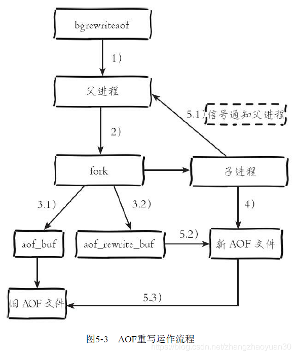

<!-- TOC -->

- [1 Redis使用场景？](#1-redis使用场景)
- [2 API？](#2-api)
    - [2.1 全局命令](#21-全局命令)
    - [2.2 **数据结构和内部编码**](#22-数据结构和内部编码)
    - [2.3 主要命令](#23-主要命令)
- [3 Redis Pipeline和Redis事务？](#3-redis-pipeline和redis事务)
    - [3.1 Redis Pipeline](#31-redis-pipeline)
    - [3.2 Redis事务？](#32-redis事务)
    - [3.2.1 发生错误：](#321-发生错误)
    - [3.2.2 Watch（乐观锁）](#322-watch乐观锁)
    - [3.3 Lua脚本](#33-lua脚本)
- [4 其他功能](#4-其他功能)
- [5 RDB和AOF](#5-rdb和aof)
    - [5.1 RDB](#51-rdb)
    - [5.2 AOF](#52-aof)
    - [5.3 总结](#53-总结)
- [6 复制](#6-复制)
    - [6.1 配置](#61-配置)
    - [6.2 同步](#62-同步)
- [**7 Redis的阻塞**](#7-redis的阻塞)
- [**8 内存管理**](#8-内存管理)
    - [8.1 内存消耗](#81-内存消耗)
    - [8.2 回收策略](#82-回收策略)
- [9 哨兵](#9-哨兵)
    - [9.1 三个定时任务](#91-三个定时任务)
    - [9.2 主观下线和客观下线（raft）](#92-主观下线和客观下线raft)
    - [9.3 故障转移](#93-故障转移)
- [10 集群](#10-集群)
    - [**10.1 一致性哈希和虚拟槽**](#101-一致性哈希和虚拟槽)
    - [10.2 MOVED和ASK](#102-moved和ask)
    - [10.3 故障发现和转移](#103-故障发现和转移)
- [**11 缓存设计**](#11-缓存设计)
    - [11.1 缓存更新](#111-缓存更新)
    - [11.3 缓存穿透](#113-缓存穿透)
    - [11.4 缓存雪崩](#114-缓存雪崩)
    - [11.5 热点key重建（缓存击穿）](#115-热点key重建缓存击穿)
- [12 为什么使用SDS？](#12-为什么使用sds)
- [13 讲下字典和其rehash过程？](#13-讲下字典和其rehash过程)
- [14 Redis跳表是怎么实现的？](#14-redis跳表是怎么实现的)
- [15 整数集合升级？](#15-整数集合升级)
- [16 压缩列表的连锁更新？](#16-压缩列表的连锁更新)
- [17 对象都有哪些？采用什么存储结构？](#17-对象都有哪些采用什么存储结构)
- [13 内存回收和对象共享？](#13-内存回收和对象共享)
- [14 数据库结构？](#14-数据库结构)
- [15 TTL和删除？](#15-ttl和删除)
- [15 TTL和删除？](#15-ttl和删除)
- [16 分布式锁？](#16-分布式锁)
- [17 IO模型？](#17-io模型)
    - [17.1 4.0 之前](#171-40-之前)
    - [17.2 4.0](#172-40)
    - [17.2 6.0](#172-60)
- [18 Redis为什么快？](#18-redis为什么快)
- [19 缓存更新一致性问题](#19-缓存更新一致性问题)
    - [19.1 Cache Aside Pattern](#191-cache-aside-pattern)
    - [19.2 Read/Write Through Pattern（读写穿透）](#192-readwrite-through-pattern读写穿透)
    - [19.3 Write Behind Pattern（异步缓存写入）](#193-write-behind-pattern异步缓存写入)
    - [19.3 延时双删和过期时间解决不一致问题](#193-延时双删和过期时间解决不一致问题)
    - [19.4 最终一致的几种方案](#194-最终一致的几种方案)

<!-- /TOC -->
# 1Redis使用场景？
- 缓存、排行榜、计时器、社交网络（赞/踩、粉丝、推送、下拉刷新）、消息队列
- 不适用于大规模数据、冷数据（不频繁改变）
# 2API？
## 2.1全局命令
- keys *
- scan cursor [pattern] [count number]
    - cursor设为0，初始化迭代
    - 每次调用会返回cursor，**为0时迭代结束**
    - 增量式迭代，保证：从遍历开始到结束一直存在于数据集的元素会被返回，但不保证不会重复
- dbsize O(1)
- exists key
- del key [key ...]
- expire key seconds
- ttl：返回键的剩余过期时间，有三种返回值
    - 大于0：键剩余的过期时间
    - -1：没设置过期时间
    - -2：键不存在    
- type key
## 2.2**数据结构和内部编码**

## 2.3主要命令  
[API理解与使用（二）-字符串、哈希、列表、集合、有序集合、键管理](https://blog.csdn.net/zhangzhaoyuan30/article/details/88570075)
# 3Redis Pipeline和Redis事务？
## 3.1 Redis Pipeline
## 3.2 Redis事务？
- multi
代表事务开始
- exec
代表事务结束
- DISCARD：放弃事务
- watch,UNWATCH
确保事务中的key没被其他客户端修改过，才执行，否则不执行（乐观锁）
- 不支持回滚，需要自己处理

```shell
>MULTI
OK
>INCR foo
QUEUED
>INCR bar
QUEUED
>EXEC
1）（整数）1
2）（整数）1
```
使用MULTI命令显式开启Redis事务。 该命令总是以OK回应。此时用户可以发出多个命令，Redis不会执行这些命令，而是**将它们排队**。EXEC被调用后，所有的命令都会被执行。而调用**DISCARD可以清除事务中的commands队列**并退出事务。
从上面的命令执行中可以看出，EXEC返回一个数组，其中每个元素都是事务中单个命令的返回结果，而且顺序与命令的发出顺序相同。
## 3.2.1 发生错误：
- 在调用EXEC命令之前出现错误（COMMAND排队失败）（比如语法错误）
    ```shell
    >MULTI
    +OK
    >INCR a b c
    -ERR wrong number of arguments for 'incr' command
    ```
    从Redis 2.6.5开始，服务端会记住在累积命令期间发生的错误，当EXEC命令调用时，将拒绝执行事务，并返回这些错误，同时自动清除命令队列
- 在调用EXEC命令之后出现错误：（命令可能处理了错误类型的key，比如将列表命令用在了字符串键上面）  
即使事务中的某些命令执行失败，其他命令仍会被正常执行
- 不支持回滚：性能，错误命令生产环境不应该存在
## 3.2.2 Watch（乐观锁）
被 WATCH 的键会被监视，并会发觉这些键是否被改动过了。 如果有**至少一个**被监视的键在 EXEC 执行之前被修改了， 那么**整个事务都会被取消**， EXEC 返回空多条批量回复（null multi-bulk reply）来表示事务已经失败
## 3.3 Lua脚本
原子性
- SCRIPT LOAD script
- SCRIPT FLUSH
- EVALSHA
# 4其他功能
- Bitmaps  
实际是字符串结构
- HyperLogLog  
也是字符串，独立总数统计
- GEO  
数据类型为zset
# 5RDB和AOF
[RDB和AOF](https://blog.csdn.net/zhangzhaoyuan30/article/details/88764847)
## 5.1 RDB
- 触发
    - 手动触发：save、bgsave
    - 自动触发：
        - save m n：m秒内n次修改
        - 从节点全量复制
        - debug reload
        - shutdown
- 优缺点
    - 二进制文件，加载快，适用于全量复制、备份
    - 无法秒级持久化，因为需要fork
## 5.2 AOF
- AOF缓冲刷盘
    - always：同步
    - everysec：每秒刷盘：可能发生AOF追加阻塞（如果上次fsync执行>2s，阻塞）
        - 
- AOF重写
    - 触发：
        - 手动：bgrewriteaof
        - 自动：根据min_size & 增加percent
    - 流程
    
    - 会发生fork阻塞
## 5.3 总结
- RDB和AOF重写都需要fork
- 2种阻塞
    - fork阻塞
    - 如果aof同步策略是everysec：aof追加阻塞
- 写时复制：见IO

# 6 复制
分为主节点和从节点
## 6.1 配置
- slaveof命令（异步）
- slaveof no one 断开
- 默认情况下从节点只读（如果不是只读会造成不一致）
## 6.2 同步
- psync {runid} {offset}
    
- 全量复制：初次
    
- 部分复制：网络故障重连时，如果主节点的**复制积压缓冲区**内存在这部分数据
- 异步复制：主节点不但会把命令异步发送给从节点，还会保存到复制及压缓冲区
- 心跳：
    - 主节点发送ping
    - 从节点通过心跳ACK offset
# **7 Redis的阻塞**
- 使用不合理
    - 发现慢查询：slowlog get {n}
    - 发现大对象：redis-cli --bigkeys
    - 解决：
        - 避免hgetall、keys命令
        - 避免大对象，拆成小对象
- 持久化阻塞
    - fork阻塞（RDB和AOF重写）
    - AOF追加阻塞（everysec）
# **8 内存管理**
## 8.1 内存消耗

## 8.2 回收策略
- 删除过期键
    - 惰性删除：获取 key 的时候，如果此时 key 已经过期，就删除，不会返回任何东西
    - 定时任务
    
        1. 随机检测20个设置了过期时间的key，发现过期则删除（每秒运行10次）
        2. 如果超过25%键过期，则循环执行，并设置超时时间为25ms
        3. 如果超时，进入快模式：每次事件前触发超时为1ms且2s内只能运行一次
- 溢出控制策略
    - 设置maxmemory
    - 策略  
      
    - volatile-random：随机删除设置了过期属性的key
    - 带volatile的都有可能无法腾出足够空间，会回退到noevication
# 9 哨兵
[哨兵](https://blog.csdn.net/zhangzhaoyuan30/article/details/88829559)
## 9.1 三个定时任务
1. 每隔10秒，每个Sentinel节点会向主节点和从节点发送info命令获取最新的拓扑结构
2. 每隔2秒，每个Sentinel节点会向Redis数据节点的__sentinel__：hello频道上发送该Sentinel节点对于主节点的判断以及当前Sentinel节点的信息，同时每个Sentinel节点也会订阅该频道，来了解其他Sentinel节点以及它们对主节点的判断
3. 每隔1秒，每个Sentinel节点会向主节点、从节点、其余Sentinel节点发送一条ping命令做一次心跳检测，来确认这些节点当前是否可达
## 9.2 主观下线和客观下线（raft）
- 主观下线：心跳检测超时
- 客观下线：（同时也是选举的过程）
    - 从节点、Sentinel节点在主观下线后，没有后续的故障转移操作。
    - 当Sentinel主观下线的节点是主节点时，该Sentinel节点向其他Sentinel节点询问对主节点的判断，当超过\<quorum>个数，Sentinel节点认为主节点确实有问题，这时该Sentinel节点会做出客观下线的决定，并进行故障转移。
## 9.3 故障转移
- 领导者sentinel节点选举（raft算法）
    1. 每个在线的Sentinel节点都有资格成为领导者，当它确认主节点主观下线时候，会向其他Sentinel节点发送sentinel is-master-down-by-addr命令，要求将自己设置为领导者。
    2. 收到命令的Sentinel节点，如果没有同意过其他Sentinel节点的sentinel is-master-down-by-addr命令，将同意该请求，否则拒绝。
    3. 如果该Sentinel节点发现自己的票数已经大于等于max（quorum，num（sentinels）/2+1），那么它将成为领导者。
    4. 如果此过程没有选举出领导者，将进入下一次选举。
- 选择新的主节点：
    1. 过滤：“不健康”（主观下线、断线）、5秒内没有回复过Sentinel节点ping响应、与主节点失联超过down-after-milliseconds*10秒。
    2. 选择slave-priority（从节点优先级）最高的从节点列表，如果存在则返回，不存在则继续。
    3. 选择复制偏移量最大的从节点（复制的最完整），如果存在则返回，不存在则继续。
    4. 选择runid最小的从节点。
# 10 集群
[集群](https://blog.csdn.net/zhangzhaoyuan30/article/details/88841835)
## **10.1 一致性哈希和虚拟槽**
[一致性哈希和哈希槽对比](https://www.jianshu.com/p/4163916a2a8a)
[16 张图解带你掌握一致性哈希算法](https://developer.huawei.com/consumer/cn/forum/topic/0203810951415790238?fid=0101592429757310384)
- 哈希和一致性哈希：一致性哈希算法就很好地解决了分布式系统在扩容或者缩容时，**发生过多的数据迁移**的问题，并且如果增加或者移除一个节点，仅影响该节点在哈希环上顺时针相邻的后继节点，其它数据也不会受到影响。一致哈希算法也用了取模运算，但与哈希算法不同的是，**哈希算法是对节点的数量进行取模运算，而一致哈希算法是对 2^32 进行取模运算，是一个固定的值**。

- 哈希槽：解决了一致性哈希的节点**在哈希环上分布不均**的问题。是将真实节点计算多个哈希形成多个虚拟节点并放置到哈希环上，定位算法不变，只是多了一步虚拟节点到真实节点映射的过程。引入虚拟节点后，可以会提高节点的均衡度，还会提高系统的稳定性。所以，带虚拟节点的一致性哈希方法不仅适合硬件配置不同的节点的场景，而且适合节点规模会发生变化的场景。
## 10.2 MOVED和ASK
- MOVED：傀儡客户端重定向
- ASK：槽迁移过程临时重定向，客户端不会更新slot缓存
- 傀儡客户端和Smart客户端
    - Smart客户端：本地维护slot->node映射
## 10.3 故障发现和转移

和Sentinel 集群 不同的是，在 Redis 集群中，选举的对象是从节点而不是 Sentinel 节点。
- [Redis集群的主从切换研究](https://cloud.tencent.com/developer/article/1403202)
- 发现
    1. 集群内每个节点定期Ping其他节点，接收节点恢复Pong消息，超时则主观下线
    2. ping/pong消息的消息体会携带集群1/10的其他节点状态数据，当接受节点发现消息体中含有主观下线的节点状态时，会在本地找到故障节点的ClusterNode结构，保存到**下线报告链表中**。通过Gossip消息传播，集群内节点不断收集到故障节点的下线报告。
    3. **半数以上主节点判断主观下线**，触发客观下线，向集群广播fail
        - 表示故障节点被标记为客观下线
        - 通知从节点发起故障转移
- 转移
    1. 从节点**复制偏移量大**的优先发起选举（延迟选举时间）
        >DELAY = 500ms + random(0 ~ 500ms) + SLAVE_RANK * 1000ms  
        (SLAVE_RANK表示此slave已经从master复制数据的总量的rank。Rank越小代表已复制的数据越新。这种方式下，持有最新数据的slave将会首先发起选举（理论上）。)
    2. 收集**超半数**持有槽主节点投票可替换主节点
- 手动故障转移
    - cluster failover
        1. 从节点通知主节点**停止处理**客户端请求
        2. 主节点发送从节点延迟复制数据，从节点处理，直到**复制偏移量一致**
        3. 从节点立刻发起投票，选举成功后广播pong消息
        4. 旧主节点变为从节点，发起全量复制。请求被重定向到新主节点
    - cluster failover force：用于主节点宕机无法自动完成故障转移，从节点直接发起选举**不用确认复制偏移量**
    - cluster failover takeover：用于超过一半主节点故障场景，不用进行选举而是直接更新配置纪元替换主节点
# **11 缓存设计**

## 11.1 缓存更新

## 11.3 缓存穿透
不存在的数据每次都要请求DB


- 缓存空对象：为了防止占用过多内存可设置过期时间
- 加布隆过滤器：CBF解决删除问题（Counting bloom filter（CBF）将位数组中的每一位扩展为一个counter，从而支持了元素的删除操作）。误判率：
    - 布隆过滤器中哈希函数的个数：哈希函数的个数越多，误判率越低。
    - 布隆过滤器中位数组的长度：位数组的长度越长，误判率越低。
    - 布隆过滤器中需要存储的元素个数：元素个数越多，误判率越高。
## 11.4 缓存雪崩
缓存宕机或缓存在同一时间大面积的失效，后面的请求都直接落到了数据库上，造成数据库短时间内承受大量请求
- 针对 Redis 服务不可用的情况：
    1. 采用 Redis 集群或哨兵保证高可用
    2. **限流降级**
- 针对热点缓存失效的情况：
    - 均匀设置过期时间：比如失效时间+随机数
    - 双key，备key不过期，更新时同时更新两个
## 11.5 热点key重建（缓存击穿）
存在一个key并发量非常大，重建缓存不能再短时间完成，导致大量线程重建缓存

- 热点数据设置为永不过期。可以利用定时线程**在缓存过期前主动地重新构建缓存**
- 互斥锁
# 12 为什么使用SDS？
- SDS：Redis 只会使用 C 字符串作为字面量，在大多数情况下， Redis 使用SDS ( Simple Dynamic String，简单动态字符串）作为字符串表示。
- 优点：
    - 常数复杂度获取字符串长度
    - 杜绝缓冲区溢出：当SDS API 需要对SDS进行修改时，若空间不够，API会自动将SDS的空间扩展至所需的大小
    - 减少修改字符串长度时所需的**内存重分配次数**
        - **空间预分配**：每次多分配一倍（不超过1MB）空间
        - **惰性释放**，存在free属性中
    - 二进制安全，可以存图像等二进制数据：可以包含空字符
# 13 讲下字典和其rehash过程？
- 字典用途：用于数据库和hashtable，每个字典有两个哈希表，一个用于rehash
- MurmurHash2算法
- 拉链法解决冲突
- rehash条件
    - 扩展：当以下条件中的任意一个被满足时，程序会自动开始对哈希表执行扩展操作：
        1. 服务器目前没有在执行BGSAVE 命令或者BGREWRITEAOF 命令，并且哈希表的load factor（ht[0].used / ht[0].size）>1
        2. 服务器目前正在执行BGSAVE 命令或者BGREWRITEAOF 命令，并且哈希表的负载因子大于等于5
    - 收缩：哈希表的负载因子小于0.1
- **渐进式rehash**
    1. 为ht[1]分配空间
    2. 令rehashidx=0
    3. 每次对字典执行添加、删除、查找或者更新操作时，还会顺带将ht[0]在rehashidx索引上的所有键值对rehash到ht[1]，当rehash工作完成之后，程序将rehashidx+1。
    4. rehash 操作完成时，rehashidx=-1   
    此外，在渐进式rehash执行期间
        - 查找一个键的话， 程序会先在 ht[0] 里面进行查找， 如果没找到的话，就会继续到 ht[1] 找
        - 新添加到字典的键值对**一律会被保存到ht[1]里面**，而ht[0]则不再进行任何添加操作，这一措施保证了ht[0]包含的键值对数量会**只减不增**，并随着rehash 操作的执行而最终变成空表。
# 14 Redis跳表是怎么实现的？
[Redis为什么用跳表而不用平衡树？](https://blog.csdn.net/u010412301/article/details/64923131)  

- zskiplist：保存节点数量、指向头结点尾结点的指针
```C
typedef struct zskiplist {
    //表头节点和表尾节点
    struct skiplistNode *header, *tail;
    //表中节点的数量
    unsigned long length;
    //表中层数最大的节点的层数
    int level;
}zskiplist;
```
- zskiplistNode
    - 代码
    ```C
    typedef struct zskiplistNode {
        //层
        struct zskiplistLevel {
            //前进指针
            struct zskiplistNode *forward;
            //跨度
            unsigned int span;
        } level[];
        //后退指针
        struct zskiplistNode *backward;
        //分值
        double score;
        //成员对象
        robj *obj;
    } zskiplistNode;
    ```
    - 有一个头结点不存数据
    - 为了不在每次增删节点时调整结构：每次创建一个新跳跃表节点的时候，程序都根据幂次定律（ **power law** ，越大的数出现的概率越小）随机生成一个介于1 和32 之间的值作为level 数组的大小，这个大小就是层的“高度”。
        - >按照每一层节点减半生成链表的方式，这样查找过程就非常类似于一个二分查找，使得查找的时间复杂度可以降低到O(log n)。但是，这种方法**新插入一个节点之后，就会打乱上下相邻两层链表上节点个数严格的2:1的对应关系**。如果要维持这种对应关系，就必须把新插入的节点后面的所有节点（也包括新插入的节点）重新进行调整，这会让时间复杂度重新**蜕化成O(n)**，删除数据也有同样的问题。    
        skiplist为了避免这一问题，它不要求上下相邻两层链表之间的节点个数有严格的对应关系，而是为每个节点随机出一个层数(level)。
        - >幂次定律的含义就是[图解|深入理解跳表及其在Redis中的应用](https://z.itpub.net/article/detail/BB33D96F2B43DFC849C825DD410FC590)：如果某件事的发生频率和它的某个属性成幂关系，那么这个频率就可以称之为符合幂次定律。    
        特点是：少数几个事件的发生频率占了整个发生频率的大部分， 而其余的大多数事件只占整个发生频率的一个小部分。    
        映射到Redis中的生成层数就是：一个新插入的节点，生成小数值层数的概率很大，而生成大数值层数的概率很小。（期望层数1.33）  
        

        ```C
        int zslRandomLevel(void) {
            int level = 1;
            while ((random()&0xFFFF) < (ZSKIPLIST_P * 0xFFFF))
                level += 1;
            return (level<ZSKIPLIST_MAXLEVEL) ? level : ZSKIPLIST_MAXLEVEL;
        }
        #define ZSKIPLIST_MAXLEVEL 32 /* Should be enough for 2^32 elements */
        #define ZSKIPLIST_P 0.25      /* Skiplist P = 1/4 */
        ```
    - 跨度(span)：用来计算排位（ rank ）的：在查找某个节点的过程中，将沿途访问过的所有层的跨度累计起来，得到的结果就是目标节点在跳跃表中的排位
- 时间复杂度：增删查都是O(logn)
- 为什么不使用AVL树？红黑树？（Redis作者自己说的）
    - 内存占用：平衡树每个节点包含2个指针（分别指向左右子树），而skiplist每个节点包含的指针数目平均为1/(1-p)，具体取决于参数**p的大小**。如果像Redis里的实现一样，取p=1/4，那么平均每个节点包含1.33个指针
    - 范围查找：平衡树需要中序遍历，跳表只需对第一层链表遍历
    - 实现简单
# 15 整数集合升级？
 - 自动升级为int16_t,32,64，存放任意整数类型不必担心类型错误
 - 节约内存
 - 不会降级
# 16 压缩列表的连锁更新？

- zltail：压缩列表 最后一个 entry 距离起始地址的偏移量，占 4 个字节。这个偏移量使得对表尾的 pop 操作可以在无须遍历整个列表的情况下进行。
- 压缩列表是一种为**节约内存**而开发的顺序型数据结构。
- 压缩列表被用作list和hashtable的底层实现之一。
- 压缩列表可以包含多个节点，每个节点可以保存一个**字节数组**或者**整数值**。
- 添加新节点到压缩列表，或者从压缩列表中删除节点，可能会引发连锁更新操作，
但这种操作出现的几率并不高。 
    - entry结构（encoding和content之间有length，此图有误）  
    
    - 节点的previous_entry_length 属性记录了前一个节点的长度，所以程序可以通过指针运算，根据当前节点的起始地址来计算出**前一个节点的起始地址**。压缩列表的从表尾向表头遍历操作就是使用这一原理实现的（**第一步使用zltail**）。
        - 如果前一节点的长度小于254 字节，那么previus_entry_length 属性需要用1字节长的空间来保存这个长度值。
        - 如果前一节点的长度大于等于254 字节，那么previous_entry_length 属性需要用5 字节长的空间来保存这个长度值。
    - 如果之前是1字节保存，然后前面的修改了长度，会导致自己需要重分配为5字节，然后可能导致后面的也重分配。虽然说，连锁更新的时间复杂度高，但是它造成大的性能影响的概率很低，原因如下：
        1. 压缩列表中需要需要有连续多个长度刚好为 250 ~ 253 的节点，才有可能发生连锁更新。实际上，这种情况并不多见。
        2. 即使有连续多个长度刚好为 250 ~ 253 的节点，连续的个数也不多，不会对性能造成很大影响
# 17 对象都有哪些？采用什么存储结构？

- STRING（可以被其他结构嵌套）
    - int：整数值
    - embstr（只读）： 字符串长度小于等于32字节，调用一次内存分配函数来创建redisObject 结构和sdshdr 结构，内存连续（和内存分配有关）
    - raw：分别调用两次，释放也需要两次释放
- LIST
    - ziplist：保存的所有字符串小于64字节且元素总量小于512
    - linkedlist
- HASH
    - ziplist：按key1,value1,key2,value2...存储
    - hashtable：键和值的字符串长度大于64字节或键值对数量大于512个
- SET
    - intset：整数值且不超512个
    - hashtable
- ZSET
    - ziplist：按照 member1,score1,member2,score2...存储
    - skiplist+dict
        - dict：O(1)复杂度查找分值
        - skiplist用来根据分数查询数据（支持范围），另外span字段用于查询排名
    - 元素小于128个且成员长度小于64字节用ziplist
 # 12 对象实现？
```C
typedef struct redisObject {
    //类型
    unsigned type:4;
    //编码
    unsigned encoding:4;
    //指向底层实现数据结构的指针
    void *ptr;
    //最后一次被访问时间
    unsigned lru:22
    // ...
} robj;
```
- OBJECT ENCODING KEY
# 13 内存回收和对象共享？
- 引用计数法
- 初始化服务器时创建10000个字符串（0~9999），只对这些进行共享。因为判别是否相等的时间复杂度是O(1)
- 空转时长命令：OBJECT IDLETIME
# 14 数据库结构？
```Java
struct redisServer {
    
    //一个数组，保存着服务器中的所有数据库
    redisDb *db;
    ...
    //服务器的数据库数量
    int dbnum;
}
typedef struct redisDb {

    //数据库键空间，保存着数据库中的所有键值对
    dict *dict;
    //过期字典，保存键的过期时间
    dict *expires;//键指向键空间的键，值存储过期时间戳
    ...
} redisDb;
```
# 15 TTL和删除？
- 设置：EXPIRE、PEXPIRE(毫秒)、EXPIREAT(时间戳)
- 查询：TTL
- 惰性删除和定期删除（定时任务）
# 16 分布式锁？
[分布式锁：RedLock 你这锁也不包熟啊！](https://juejin.cn/post/7069041255438630919)  
[Redlock（redis分布式锁）原理分析](https://cloud.tencent.com/developer/article/1431873)  
[Distributed Locks with Redis](https://redis.io/docs/manual/patterns/distributed-locks/)
- 安全性和活性
我们将仅使用三个属性对我们的设计进行建模，从我们的角度来看，这些属性是有效使用分布式锁所需的最低保证。
    - 安全性：互斥。在任何给定时刻，只有一个客户端可以持有锁。
    - 活性 A：无死锁。最终，即使锁定资源的客户端崩溃或被分区，也总是可以获得锁。
    - 活性 B：容错性。只要大多数 Redis 节点都启动，客户端就可以获取和释放锁。
- 单机实现
    - set nx ex
    - 解锁需要判断是否是自己加的锁，用脚本保证原子性
    - 故障转移解决不了安全性问题（包括redlock），因为redis主从复制是异步的，会丢数据
- 集群实现RedLock
    - 集群并不能解决宕机的安全性问题，只是能有一定容错性
    - 解决宕机问题
        - 宕机后等待TTL时间后再重启，保证所有锁强制解锁
    - 时钟漂移：时钟漂移是指时钟与参考时钟运行速率不相同的现象。
        - [分布式系统中时钟的问题](https://juejin.cn/post/6844903788822659086)
            - time-of-day：会提供当前的时间相对 UTC 时间 1970年1月1日0时所经过的秒（或毫秒）数。可以被NTP同步或人为修改(**redis用的这个**)
            - monotonic：当前时间相对一个任意时间点（如开机时间）所经过的纳秒数。不受 NTP 同步影响，更适合用于精确计算同一节点上两个时间点之间所经过的时间。但是，尽管 monotonic 时钟不会受 NTP 同步影响而突然大步向前或向后调整，**NTP 还是会干涉 monotonic 时钟的频率**，即让时钟走得更快或更慢一些。默认 NTP 允许 monotonic 时钟频率被加快或减慢 0.05%。
    - 其它问题（待补充）
        1. 客户端无法感知锁失效。
        2. RedLock过于依赖时钟。
# 17 IO模型？
[Redis 和 I/O 多路复用](https://draveness.me/redis-io-multiplexing/)

## 17.1 4.0 之前
Reactor：单线程模式
- redis是基于内存的，内存的读写速度非常快，性能瓶颈不是 CPU
- 避免了不必要的上下文切换和竞争条件
- 多路I/O复用模型
## 17.2 4.0 
多线程仅限于在后台删除对象
## 17.2 6.0 

- 单线程 Redis 性能瓶颈主要在于网络的 IO 消耗，占用了大部分CPU时间
- 因此，6.0多线程部分只是**用来处理网络数据的读写和协议解析，执行命令仍然是单线程**。之所以这么设计是不想 Redis 因为多线程而变得复杂，需要去控制 key、lua、事务，LPUSH/LPOP 等等的并发问题
- 参考：
    - [Redis6.0多线程](https://cloud.tencent.com/developer/article/1483779)
    - [6.0源码](https://segmentfault.com/a/1190000039223696)

# 18 Redis为什么快？
1. 内存存储：Redis是使用内存(in-memeroy)存储,没有磁盘IO上的开销
2. 单线程实现：Redis使用单个线程处理请求，避免了多个线程之间线程切换和锁资源争用的开销
3. 非阻塞IO：Redis使用多路复用IO技术，在poll，epool，kqueue选择最优IO实现
4. 优化的数据结构：Redis有诸多可以直接应用的优化数据结构的实现，应用层可以直接使用原生的数据结构提升性能

# 19 缓存更新一致性问题
[【原创】分布式之数据库和缓存双写一致性方案解析 ](https://www.cnblogs.com/rjzheng/p/9041659.html)  
[分布式之数据库和缓存双写一致性方案解析](https://zhuanlan.zhihu.com/p/48334686)  
[如何解决数据库与缓存的一致性问题](https://segmentfault.com/a/1190000040976439)  
[缓存更新的套路](https://cloud.tencent.com/developer/article/1458185)
- 先更新缓存，后更新db：如果DB更新失败导致缓存中的数据是错误的，不能容忍
- 先更新DB，后更新缓存：
    - （1）线程A更新了数据库（2）线程B更新了数据库（3）线程B更新了缓存（4）线程A更新了缓存
    - 在写db比较多情况下，频繁更新缓存
- 先删缓存，在更新数据库
    - A删；B先读再更缓存；A写DB。导致不一致
    - 延时双删解决
## 19.1 Cache Aside Pattern


- 适合读请求多，先更DB，再删缓存
    - 写请求：先更新数据库，成功后再失效缓存。
    - 读请求：先查询缓存中是否命中数据，如果命中则直接返回数据，未命中则查询数据库，成功后更新缓存，最后返回数据。
- 不一致情况：在缓存失效情况下，A查；B更DB；B删缓存；A更缓存。从而出现不一致。以上情况很难发生，但也可用双删解决
- 如果删除缓存失败，怎么解决？   
    提供重试机制：
    1. 方案1：  
    存在和业务代码耦合问题
    
    2. 方案2
    
- 缺点：
    1. 首次请求数据一定不在 cache 的问题  
    解决办法：可以将热点数据可以提前放入cache 中。
    2. 写操作比较频繁的话导致cache中的数据会被频繁被删除，这样会影响缓存命中率  
## 19.2 Read/Write Through Pattern（读写穿透）
把更新数据库（Repository）的操作由缓存自己代理
- 流程
    - Write Through（更新操作）：
        - 先查 cache，cache 中不存在，直接更新 DB。
        - cache 中存在，则先更新 cache，然后 cache 服务自己更新 DB（**同步**更新 cache 和 DB）。
    - Read Through（读操作）：
        - 从 cache 中读取数据，读取到就直接返回 。
        - 读取不到的话，cache自己先从 DB 加载，写入到 cache 后返回响应。
## 19.3 Write Behind Pattern（异步缓存写入）
只更新缓存，不直接更新 DB，而是改为异步批量的方式来更新 DB。Write Back模式与Write Through模式的主要区别有两点：
1. Write Through模式是同步写入缓存和数据库，而Write Back模式则是异步的，在写请求中只写入缓存，后续会异步地将数据从缓存再写入底层数据库，而且是批量的。
2. Write Back模式在写请求中发生Cache Miss时，会将数据重新写入到缓存中，这点是与Write Through模式也是不同的。因此，Write Back模式的Read Cache Miss和Write Cache Miss的处理是类似的。


比如MySQL 的 InnoDB Buffer Pool，以及linux Page Cache
## 19.3 延时双删和过期时间解决不一致问题
延时双删主要是用于先删缓存在更新数据库

## 19.4 最终一致的几种方案
[DB缓存一致性解决方案](如何解决db和缓存一致性的问题)

1. 延时双删
2. 扫表：定时任务扫描mysql中最近更新过的数据记录（数据量少全表扫描也行）
针对每一条数据，去检查redis中的数据和mysql中的数据是否一致，不一致的话，删除redis中的缓存
3. 缓存过期
4. 异步消费binlog+setNx（回源时），需要注意binlog的方式延时较高
