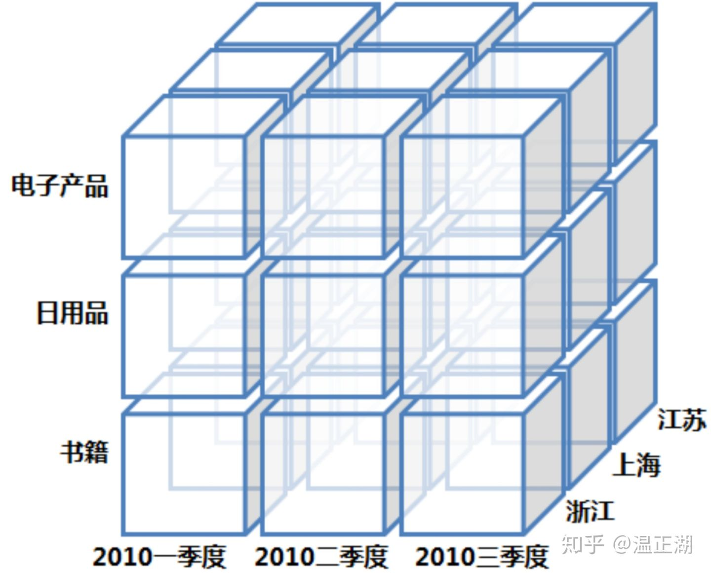
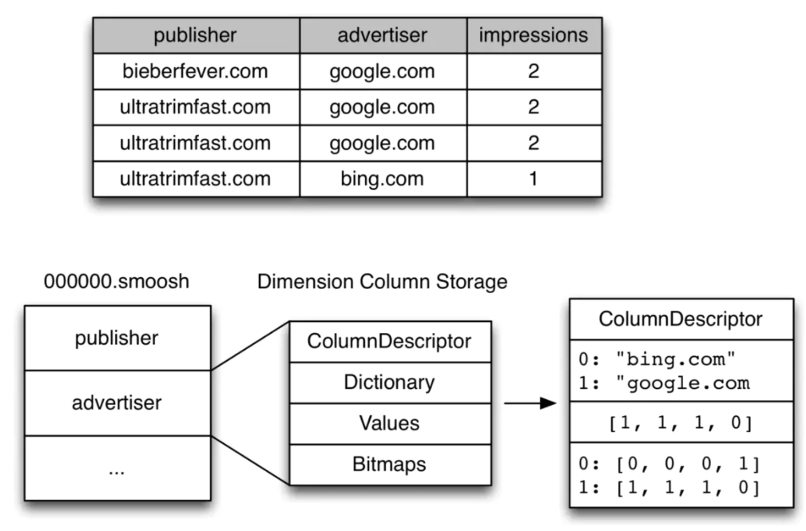
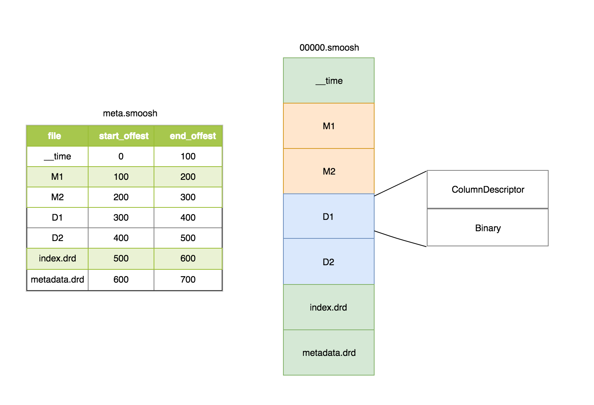

<!-- TOC -->

- [1 OLAP VS OLTP](#1-olap-vs-oltp)
- [2 多维数据模型](#2-多维数据模型)
- [3 列式存储？](#3-列式存储)
    - [3.1 行式存储](#31-行式存储)
    - [3.2 列式存储](#32-列式存储)
- [2 进程与服务](#2-进程与服务)
    - [2.1 Master](#21-master)
    - [2.2 Query](#22-query)
    - [2.3 Data](#23-data)
- [3 外部依赖](#3-外部依赖)
    - [3.1 深度存储](#31-深度存储)
    - [3.2 元数据存储](#32-元数据存储)
    - [3.3 Zookeeper](#33-zookeeper)
- [4 段设计](#4-段设计)
    - [4.1 数据结构](#41-数据结构)
        - [4.1.1 timestamp和metric列](#411-timestamp和metric列)
        - [4.1.2 dimension列](#412-dimension列)
    - [4.2 段名称](#42-段名称)
    - [4.3 段的组成](#43-段的组成)
    - [4.4 列的格式](#44-列的格式)
    - [4.5 段的发布](#45-段的发布)
    - [3.5 查询处理](#35-查询处理)
- [5 数据摄取](#5-数据摄取)
    - [5.1 数据模型](#51-数据模型)
    - [5.2 Rollup](#52-rollup)
- [6 Druid为什么支持实时查询？](#6-druid为什么支持实时查询)

<!-- /TOC -->
# 1 OLAP VS OLTP
||OLTP|OLAP|
|---|---|---|
|功能|日常操作处理|**分析决策**|
|DB 设计|面向应用|面向主题|
|数据|当前的，最新的细节的，二维的分立的|**历史的，聚集的，多维的**|
|存取|读/写数十条记录|读上百万条记录（归因一天1亿）|
|**任务**|**简单的事务**|**复杂的查询**|
|**DB 大小**|GB-TB|TB-PB|
|性能指标|**事务的吞吐量**|**查询QPS（延迟s级别）**|

# 2 多维数据模型
[OLAP数仓入门问答-基础篇](https://zhuanlan.zhihu.com/p/144926830)
- 事实表：记录具体事件
- 维表：每个维度表都是对事实表中的每个列/字段进行展开描述
- 数据立方体

    - 钻取（Drill-down）：从上一个层次到下一层
    - 上卷（Roll-up）：从细粒度数据向上层聚合
    - 切片（Slice）：只选某一个维度的数据
    - 切块（Dice）：选择维中特定区间的数据或者某批特定值进行分析
    - 旋转（Pivot）：维的位置的互换

# 3 列式存储？
## 3.1 行式存储
大多数操作都以实体（entity）为单位，即大多为增删改查一整行记录，显然把一行数据存在物理上相邻的位置是个很好的选择
## 3.2 列式存储
- 列式存储可以满足快速读取特定列的需求，在线分析处理往往需要在**上百列的宽表**中**读取指定列**分析
- 列式存储**就近存储同一列的数据**，使用压缩算法可以得到更高的**压缩率**，减少存储占用的磁盘空间
# 2 进程与服务

## 2.1 Master
**管理数据的摄取和可用性**：
它负责启动新的摄取作业并协调下面描述的"Data服务"上数据的可用性。
- Coordinator：Coordinator会定期（默认一分钟）同步元信息库中所有有效的Segment信息。并**通过ZK通知Historical加载或卸载Segmengt**，确保所有Historical节点间的段均衡
- Overlord：监视Data服务中的MiddleManager进程，并且是Druid数据接收的控制器。它们负责将接收任务分配给MiddleManager，并协调数据段的发布
## 2.2 Query
处理客户端应用程序**请求**，将查询**路由**到Data服务或其他Query服务
- Broker：Broker进程负责接受Client的查询请求，并根据ZK存储的信息，将查询转发到Historical和Middlemanager中。Broker会接受所有子查询的结果，并且将数据进行合并返回给Client
- Router（可选）：为Druid Broker、Overlord和Coordinator提供一个统一的API网关
## 2.3 Data
执行摄取作业并存储所有可查询的数据
- Historical：Historical是用于处理存储和查询历史数据的进程，它会从深层存储中下载段，并且响应这些段的查询
- MiddleManager：处理将新数据**摄取**到集群中的操作, 他们负责读取外部数据源并**发布新的Druid段**，段的元数据写入元数据库
# 3 外部依赖
## 3.1 深度存储
Druid只使用深度存储作为**数据备份**，并作为在后台**Druid进程之间传输数据**的一种方式。为了响应查询，**Historical进程不会从深层存储中读取数据**，而是从本地磁盘读取在执行任何查询之前预缓存的段，这意味着**Druid在查询期间不需要访问深层存储**，这有助于它提供尽可能最好的查询延迟。
## 3.2 元数据存储
元数据存储包含各种共享的系统元数据，如**段的schema、大小以及在深度存储中的位置**，一般存在Mysql中
## 3.3 Zookeeper
用于内部服务发现、协调和领导选举。
1. Coordinator Leader选举
2. Historical 段发布协议
3. Coordinator 和 Historical 之间的**段加载/删除**
4. Overlord Leader选举
5. Overlord和MiddleManager任务管理

# 4 段设计
Druid数据被存储在"datasources"中，类似于传统RDBMS中的**表**。每一个数据源可以根据时间进行分区，可选地还可以进一步根据其他属性进行分区。每一个时间范围称为一个"**块**（chunk）"在一个块中，数据被分为一个或者多个"**段**（segments）"

## 4.1 数据结构
它本质上是列式的：每列的数据在**单独的**数据结构中。通过分别存储每一列，Druid可以通过**只扫描查询实际需要的列来减少查询延迟**。有三种基本列类型：时间戳列、维度列和指标列，如下图所示：

### 4.1.1 timestamp和metric列
timestamp和metric列很简单：在底层，每个列都是用LZ4压缩的整数或浮点值**数组**。一旦查询知道需要选择哪些行，它只需解压缩这些行，提取相关行，然后应用聚合函数。
### 4.1.2 dimension列

dimension列是不同的，因为它们支持**过滤和聚合**操作，所以每一个维度都需要以下三种数据结构：
1. 将值（通常被当做字符串）映射到整数id的字典：便于在（2）和（3）中可以紧凑的表示
2. 一个使用第一步的字典进行编码的**列值的列表**：GroupBy 和 TopN 查询需要（2）中的值列表。
3. 对于列中每一个不同的值，标识哪些**行包含该值的位图**：（也称倒排索引）可以进行快速过滤操作（特别是，位图便于**快速进行AND和OR操作**，同维度用或，不同维度用且）
## 4.2 段名称
段都有一个由四部分组成的标识符，包含以下组件：
- 数据源名称
- 时间间隔（包含段的时间块，这与摄取时指定的 segmentGranularity 有关）
- 版本号（通常是ISO8601时间戳，对应于段集首次启动的时间）
- 分区号（整数，在datasource+interval+version中是唯一的，不一定是连续的）。
## 4.3 段的组成

在底层，一个段由以下**几个文件**组成：
- version.bin  
4个字节，以整数表示当前段版本。 例如，对于v9段，版本为0x0、0x0、0x0、0x9
- meta.smoosh  
一个包含其他 smoosh 文件内容的元数据(**文件名以及偏移量**)文件
- XXXXX.smoosh  
    这些文件中有一些是连续的二进制数据

    smoosh 文件代表 "smooshed" 在一起的多个文件，以减少必须打开用来容纳数据的文件描述符的数量，它们是最大为2GB的文件（以匹配Java中内存映射的ByteBuffer的限制）。smoosh 文件为数据中的**每个列提供单独的文件**，并在 index.drd 文件提供有关该段的额外元数据。

    还有一个称为 __time 的特殊列，它表示该段的时间列。
## 4.4 列的格式
每列存储为两部分：
- Jackson序列化的**列描述符**
- 列二进制文件的其余部分

## 4.5 段的发布
每个段都是在MiddleManager上创建的，但此时段是可变的和未提交的。段构建过程包括以下步骤，旨在生成一个紧凑且支持快速查询的数据文件：
1. 转换为列格式
2. 构建位图索引
3. 使用不同的算法进行压缩
4. 字符串列id存储最小化的字典编码
5. 对位图索引做压缩
6. 所有列的类型感知压缩

段被周期性地提交和发布，此时，它们将被写入到深度存储且变得**不可更改**，同时从MiddleManager**移动到Historical**进程。有关段的信息也写入到**元数据存储中，这个信息是一个自描述的信息，包括段的schema、大小以及在深度存储中的位置**，Coordinator可以根据这些信息来知道集群上应该有哪些数据是可用的
## 3.5 查询处理
MiddleManager结点持有实时数据，Historical结点持有历史数据。两类结点会把结点信息以及持有的segment信息同步到zookeeper。**Broker在查询数据时，先从zookeeper上拿到结点以及segment信息**，生成inventory，然后再根据查询条件找到对应的数据所在的MiddleManager/Historical结点信息，再对结点进行访问
# 5 数据摄取
## 5.1 数据模型
- 主时间戳列  
数据进行**分区和排序**。Druid查询能够快速识别和检索**与主时间戳列的时间范围相对应的数据**。Druid还可以将主时间戳列用于基于时间的数据管理操作，例如删除时间块、覆盖时间块和基于时间的保留规则。
- 维度  
查询时以特殊方式对维度进行group by、过滤
- 指标  
以聚合形式存储的列，需要选择一个**聚合函数**，以便在摄取期间应用于每一行
## 5.2 Rollup
**预聚合**，在接收过程中将数据进行汇总，以最小化需要存储的原始数据量。

任何具有相同维度和时间戳的行（在基于 **queryGranularity** 的截断之后）都可以在Druid中折叠或汇总为一行

# 6 Druid为什么支持实时查询？
- 预聚合
- 列式存储 + 位图倒排索引
- Broker LRU缓存

