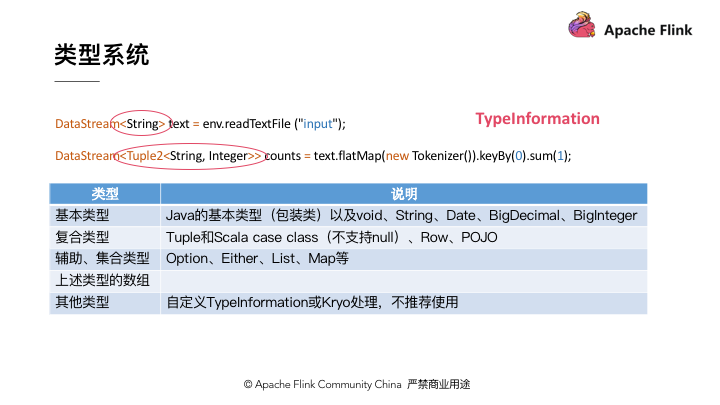

<!-- TOC -->

- [1 特性](#1-特性)
- [2 基本概念](#2-基本概念)
    - [2.1 Parallel](#21-parallel)
    - [2.2 两类进程](#22-两类进程)
- [3 window](#3-window)
    - [3.1 分类](#31-分类)
    - [3.2 组件](#32-组件)
    - [3.3 watermark](#33-watermark)
    - [3.3 窗口应用函数](#33-窗口应用函数)
    - [3.4 晚到事件](#34-晚到事件)
- [4 time](#4-time)
    - [4.1 Processing Time](#41-processing-time)
    - [4.2 Event Time](#42-event-time)
    - [4.3 Ingestion Time](#43-ingestion-time)
- [5 DataStram API](#5-datastram-api)
    - [5.1 物理分组](#51-物理分组)
    - [5.2 TypeInformation](#52-typeinformation)
- [6 State](#6-state)
    - [6.1 应用](#61-应用)
    - [6.2 分类](#62-分类)
- [7 Checkpoint 和 Savepoint](#7-checkpoint-和-savepoint)
    - [7.1 概念](#71-概念)
    - [7.2 存储](#72-存储)
    - [7.3 exactly-once原理](#73-exactly-once原理)
        - [7.3.1 内部](#731-内部)
        - [7.3.2 端到端](#732-端到端)
- [8 Flink Runtime](#8-flink-runtime)
    - [8.1 总体](#81-总体)
    - [8.2 JobManager](#82-jobmanager)
    - [8.2 TaskManager](#82-taskmanager)
    - [8.3 集群](#83-集群)
- [9 Join](#9-join)
    - [9.1 内连接](#91-内连接)
    - [9.1.1 Window Join](#911-window-join)
    - [9.1.2 Interval Join](#912-interval-join)
    - [9.3 coGroup](#93-cogroup)
- [10 反压机制](#10-反压机制)
    - [10.1 Rate Limiter 静态限流](#101-rate-limiter-静态限流)
    - [10.2 动态反馈](#102-动态反馈)
    - [10.3 Flink](#103-flink)
- [11 内存设置](#11-内存设置)
- [12 作业优化](#12-作业优化)

<!-- /TOC -->
# 1 特性
- 有状态计算的**Exactly-once**语义。
- 支持高度灵活的窗口（**window**）操作。支持基于time、count、session，以及data-driven的窗口操作，能很好的对现实环境中的创建的数据进行建模。
- 轻量的**容错处理**（ fault tolerance）。 它使得系统既能保持高的吞吐率又能保证exactly-once的一致性。
- 支持高吞吐、低延迟、高性能的流处理。
- 支持savepoints 机制（一般手动触发）。即可以将应用的运行状态保存下来；在升级应用或者处理历史数据是能够做到无状态丢失和最小停机时间。
- **支持具有Backpressure功能**的持续流模型。
- 支持程序自动优化：避免特定情况下Shuffle、排序等昂贵操作，中间结果有必要进行缓存。
- Flink 的 API 要更“上层”一些。许多研究者在进行实验时，可能会更喜欢自由度高的 Storm，因为它更容易保证实现预想的图结构；而在工业界则更喜欢 Flink 这类高级 API，因为它使用更加简单
# 2 基本概念
## 2.1 Parallel 
- 一个Stream可以被分成多个Stream分区（Stream
Partition），一个Operator的并行度等于Operator Subtask的个数，**一个Stream的并行度总是等于生成它的Operator的并行度**
- **Operator Chain**：多个Operator 串起来组成一个Operator Chain，作为一个task ，会在TaskManager上**一个独立的线程Task slot**中执行
## 2.2 两类进程
- JobManager（又称为 JobMaster）：协调 Task 的分布式执行，包括调度 Task、协调创建 Checkpoint 以及当 Job failover 时协调各个 Task 从 Checkpoint 恢复等。
- TaskManager（又称为 Worker）：执行 Dataflow 中的 Tasks，包括内存 Buffer 的分配、Data Stream 的传递等。
    - Task Slot 是一个 TaskManager 中的最小资源分配单位，一个 TaskManager 中有多少个 Task Slot 就意味着能支持多少并发的 Task 处理。需要注意的是，**一个 Task Slot 中可以执行多个 Operator，一般这些 Operator 是能被 Chain 在一起处理的**
# 3 window
[flink--window、eventTime和watermark原理和使用](https://blog.51cto.com/kinglab/2457255)
## 3.1 分类
窗口可以是
- 时间驱动的（Time Window，例如：每30秒钟）
- 也可以是数据驱动的（Count Window，例如：每一百个元素）。

一种经典的窗口分类可以分成
- 翻滚窗口（Tumbling Window，无重叠）
- 滚动窗口（Sliding Window，有重叠）
- 和会话窗口（Session Window，活动间隙）：消息之间的间隔小于超时阈值（sessionGap）的，则被分配到同一个窗口，间隔大于阈值的，则被分配到不同的窗口

## 3.2 组件
Window 中的三个核心组件：WindowAssigner、Trigger 和 Evictor
- Evictor：应用窗口功能之前和或之后从窗口中删除元素
- Trigger：如果默认触发器不满足需求，可以自定义触发器
## 3.3 watermark
[flink--window、eventTime和watermark原理和使用](https://blog.51cto.com/kinglab/2457255)
- 处理乱序数据，定义何时停止等待较早的事件，Watermark = maxEventTime - 延迟时长t
- **当 (max_eventTime-延迟时长t） >= window_end_time 时**，才会真正触发窗口计算逻辑

产生：
- AssignerWithPeriodicWatermarks：周期性产生（默认200ms）
    - BoundedOutOfOrdernessTimestampExtractor：
    - AscendingTimestampExtractor
- AssignerWithPunctuatedWatermarks：不间断产生

## 3.3 窗口应用函数
- 像批量处理，ProcessWindowFunction 会缓存 Iterable 和窗口内容，供接下来全量计算；
- 或者像流处理，每一次有事件被分配到窗口时，都会调用 ReduceFunction 或者 AggregateFunction 来增量计算；
- 或者结合两者，通过 ReduceFunction 或者 AggregateFunction 预聚合的增量计算结果在触发窗口时， 提供给 ProcessWindowFunction 做全量计算。
## 3.4 晚到事件
- allowedLateness：保留窗口直到watermark=endtime+Lateness，当延迟数据到来时会触发窗口计算。**仅适用于eventTime**
- 既然有了watermark了，为什么还要搞allowedLateness ?
watermark控制窗口激活的时间，解决数据乱序到达的问题。allowedLateness控制窗口的销毁时间，解决窗口触发后数据迟到后的问题
- 旁路输出sideOutputLateData
# 4 time
```java
env.setStreamTimeCharacteristic(TimeCharacteristic.EventTime)
```
## 4.1 Processing Time
事件被处理时机器的系统时间，不需要Watermark机制
- 结果不确定
- 最好的性能和最低的延迟
## 4.2 Event Time
事件发生的时间，一般就是数据本身携带的时间。
如果我们要使用Event Time语义，以下两项配置缺一不可：
- 使用一个时间戳为数据流中每个事件的Event Time赋值
- 生成Watermark
## 4.3 Ingestion Time
事件进入 Flink 的时间，不需要Watermark机制
# 5 DataStram API
## 5.1 物理分组

- Global: 上游算子将所有记录发送给下游算子的第一个实例。
- Broadcast: 上游算子将每一条记录发送给下游算子的所有实例。
- Forward：只适用于上游算子实例数与下游算子相同时，每个上游算子实例将记录发送给下游算子对应的实例。
- Shuffle：上游算子对每条记录随机选择一个下游算子进行发送。
- Rebalance：上游算子通过轮询的方式发送数据。
- Rescale：当上游和下游算子的实例数为 n 或 m 时，如果 n < m，则每个上游实例向ceil(m/n)或floor(m/n)个下游实例轮询发送数据；如果 n > m，则 floor(n/m) 或 ceil(n/m) 个上游实例向下游实例轮询发送数据。
- PartitionCustomer：当上述内置分配方式不满足需求时，用户还可以选择自定义分组方式。
## 5.2 TypeInformation 

POJO：
- 该类是公有且独立的（没有非静态内部类）
- 该类有公有的无参构造函数
- 类（及父类）中所有的所有不被 static、transient 修饰的属性要么是公有的（且不被 final 修饰），要么是包含公有的 getter 和 setter 方法，这些方法遵循 Java bean 命名规范。
# 6 State
## 6.1 应用
- 单条输入仅包含所需的部分信息
- 相同输入可能得到不同输出

比如，去重、窗口计算、访问历史数据
## 6.2 分类


# 7 Checkpoint 和 Savepoint
## 7.1 概念

## 7.2 存储


rocksDB降低性能：保存到磁盘需要序列化
## 7.3 exactly-once原理
Chandy-Lamport algorithm 
### 7.3.1 内部
[一文搞懂 Flink 的 Exactly Once 和 At Least Once](https://ververica.cn/developers/flink-exactly-once-and-at-least-once/)
- Flink 不依赖于 kafka 内置的消费组位移管理，而是在内部自行记录和维护 consumer 的位移
- 一次checkpoint是以下内容的一致性快照：
    - 应用程序的当前状态（统计得到的 pv,uv）
    - 输入流的位置（offset）
- barrier策略
    - barrier 从 Source Task 处生成，一直流到 Sink Task，期间所有的 Task 只要碰到barrier，就会触发自身进行快照
    - CheckPoint 过程中有一个同步做快照的环节不能处理 barrier 之后的数据
    - 一旦 Operator 从输入流接收到 CheckPoint barrier n，它就不能处理来自该流的任何数据记录，直到它从其他所有输入接收到 barrier n 为止。否则就是 At Least Once
- 整个流程
    - JobManager 端的 CheckPointCoordinator 向所有 SourceTask 发送 CheckPointTrigger，Source Task 会在数据流中**安插 CheckPoint barrier**。
    - 当 task 收到所有的 barrier 后，向自己的下游继续传递 barrier，然后自身执行快照，并将自己的状态异步写入到持久化存储中。
        - 增量 CheckPoint 只是把最新的一部分更新写入到外部存储;
        - 为了下游尽快做 CheckPoint，所以**会先发送 barrier 到下游，自身再同步进行快照**; 
    - 当 task 完成备份后，会将备份数据的地址（state handle）通知给 JobManager 的 CheckPointCoordinator。
        - 如果 CheckPoint 的持续时长超过了 CheckPoint 设定的**超时**时间，CheckPointCoordinator 还没有收集完所有的 State Handle，CheckPointCoordinator 就会认为本次 CheckPoint 失败，**会把这次 CheckPoint 产生的所有状态数据全部删除**。
    - 最后 CheckPointCoordinator 会把整个 StateHandle 封装成 completed CheckPoint Meta，写入到 hdfs。
### 7.3.2 端到端
flink提供了TwoPhaseCommitSinkFunction  
[Flink Kafka 端到端 Exactly-Once 分析](https://ververica.cn/developers/flink-kafka-end-to-end-exactly-once-analysis/)
要使数据输出端提供Exactly-Once保证，它必须将所有数据通过一个事务提交给Kafka。**提交捆绑了两个checkpoint之间的所有要写入的数据**。这可确保在发生故障时能回滚写入的数据

当输入源和输出都是 kafka 的时候，Flink 之所以能做到端到端的 Exactly-Once 语义，主要是因为第一阶段 FlinkKafkaConsumer 会将消费的 offset 信息通过checkpoint 保存，**所有 checkpoint 都成功之后，第二阶段 FlinkKafkaProducer 才会提交事务**，结束 producer 的流程。这个过程中很大程度依赖了 kafka producer 事务的机制。

对于flink，Semantic.EXACTLY_ONCE 模式依赖于事务提交的能力。事务提交发生于触发 checkpoint 之前，以及从 checkpoint 恢复之后。如果从 Flink 应用程序崩溃到完全重启的时间超过了 Kafka 的事务超时时间，那么将会有数据丢失（Kafka 会自动丢弃超出超时时间的事务）。考虑到这一点，请根据预期的宕机时间来合理地配置事务超时时间。

步骤如下
- 在checkpoint开始的时候，即两阶段提交协议的“预提交”阶段，将两次checkpoint之间的数据放在一个事务中，一起预提交，在 preCommit 方法中执行flush
- 下一步是通知所有operator，checkpoint已经成功了。这是两阶段提交协议的提交阶段，JobManager为应用程序中的每个operator发出checkpoint已完成的回调。  
数据源和widnow operator没有外部状态，因此在提交阶段，这些operator不必执行任何操作。但是，数据输出端（Data Sink）拥有外部状态，**此时应该提交外部事务**。
# 8 Flink Runtime
## 8.1 总体
- per-job

## 8.2 JobManager
其中，Master 部分又包含了三个组件，即 Dispatcher、ResourceManager 和 JobMaster。
- Dispatcher 负责接收用户提供的作业，并且负责为这个新提交的作业拉起一个新的 JobManager 组件。
- ResourceManager 负责资源的管理，**在整个 Flink 集群中只有一个 ResourceManager**。
- JobMaster 负责管理作业的执行，在一个 Flink 集群中可能有多个作业同时执行，每个作业都有自己的 JobMaster 组件。

这三个组件都包含在 JobManager 进程中。
## 8.2 TaskManager
[Tasks 和算子链](https://ci.apache.org/projects/flink/flink-docs-release-1.12/zh/concepts/flink-architecture.html)
- 在 TaskManager 中资源调度的最小单位是 task slot。TaskManager 中 task slot 的数量表示并发处理 task 的数量（**一般 slot 数量 = 最大并发度**）。请注意一个 task slot 中可以执行多个算子
- 通过调整 TaskManager 中 task slot 的数量，用户可以定义 subtask 如何互相隔离
    - **每个 TaskManager 有一个 slot，这意味着每个 task group 都在单独的 JVM 中运行，小米采用这种方式**（例如，可以在单独的容器中启动）
    - 具有多个 slot 意味着更多 subtask 共享同一 JVM。一 JVM 中的 task 共享 TCP 连接（通过多路复用）和心跳信息。它们还可以共享数据集和数据结构，从而减少了每个 task 的开销。
- 默认情况下，Flink **允许 subtask 共享 Slot，即使它们是不同 task 的 subtask**，只要它们来自相同的 job。这种共享可以有更好的资源利用率。
    - Flink 集群所需的 task slot 和作业中使用的最大并行度恰好一样。无需计算程序总共包含多少个 task（具有不同并行度）
    - 容易获得更好的资源利用。如果没有 slot 共享，非密集 subtask（source/map()）将阻塞和密集型 subtask（window） 一样多的资源。
## 8.3 集群
- Session集群：集群（和 JobManager）长期运行，启动时间短，适用于执行时间短，交互查询，资源不隔离，资源竞争
- Job集群(per-job)：一旦作业完成，Flink Job 集群将被拆除。适用于长期运行，稳定性高，启动时间不敏感

# 9 Join
## 9.1 内连接
## 9.1.1 Window Join 
- Tumbling Window Join
- Sliding Window Join
- Session Window Join
## 9.1.2 Interval Join 
a.timestamp + lowerBound <= b.timestamp <= a.timestamp + upperBound
## 9.3 coGroup
```java
public abstract class RichCoGroupFunction<IN1, IN2, OUT> extends AbstractRichFunction implements CoGroupFunction<IN1, IN2, OUT> {

	private static final long serialVersionUID = 1L;

	@Override
	public abstract void coGroup(Iterable<IN1> first, Iterable<IN2> second, Collector<OUT> out) throws Exception;

}
```

# 10 反压机制

## 10.1 Rate Limiter 静态限流
使Producer 端的发送速率跟 Consumer 端的处理速率匹配，但有两个问题：
- 事先无法预估 Consumer 到底能承受多大的速率
- Consumer 的承受能力通常会动态地波动
## 10.2 动态反馈
Consumer 能够及时的给 Producer 做一个 feedback，即告知 Producer 能够承受的速率是多少。动态反馈分为两种：
- 负反馈：接受速率小于发送速率时发生，告知 Producer 降低发送速率
- 正反馈：发送速率小于接收速率时发生，告知 Producer 可以把发送速率提上来
## 10.3 Flink
- 1.5之前使用TCP拥塞控制：
      
    - 各个Buffer是否满了，如果满了则无法写入/读取导致连锁反应，直至Source端
    - 存在问题
        1. TaskManager 中的Task会复用同一个 Socket 进行传输
        2. 依赖最底层的 TCP 去做流控，会导致反压传播路径太长，导致生效的延迟比较大
- 1.5之后改为credit机制：每次InputGate会告诉ResultPartition自己还有多少的空闲量可以接收，模拟TCP流控
- 反压值代表反压的频率

# 11 内存设置
[Flink 1.10之改进的TaskManager内存模型与配置](https://cloud.tencent.com/developer/article/1630925)


# 12 作业优化
[Flink 作业问题分析和调优实践](https://www.infoq.cn/article/j1ucfxizcridmhtfvwt6)
“一压二查三指标，延迟吞吐是核心。时刻关注资源量，排查首先看 GC。”

- 一压是指背压，遇到问题先看背压的情况。通常**最后一个被压高**的 subTask 的下游就是 job 的瓶颈之一
- 二查就是指 checkpoint ，对齐数据的时间是否很长，state 是否很大，这些都和**系统吞吐密切相关**
- 三指标就是指 Flink UI 资源展示，主要关注点其实就是**延迟和吞吐**，系统资源，还有就是 **GC logs**。