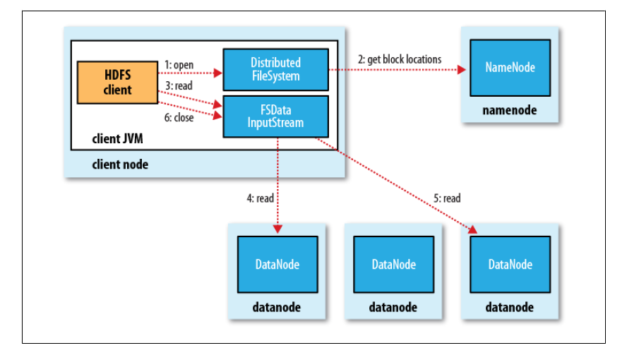
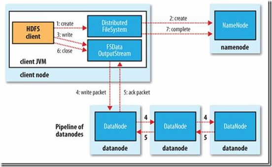

<!-- TOC -->

- [1 特性](#1-特性)
- [2 局限性](#2-局限性)
- [3 DataNode 和 NameNode ?](#3-datanode-和-namenode-)
- [3.1 NameNode](#31-namenode)
    - [3.1.1 小米采用 Federation（联邦）集群](#311-小米采用-federation联邦集群)
- [3.2 DataNode](#32-datanode)
- [3.3 心跳](#33-心跳)
- [4 读写过程？](#4-读写过程)
    - [4.1 读](#41-读)
    - [4.2 写](#42-写)

<!-- /TOC -->
# 1 特性
1. HDFS中的文件在物理上是分块存储（block）
2. 副本存储（默认3个）
3. HDFS的核心设计思想：分散均匀存储 + 备份冗余存储
# 2 局限性
1. 低延时数据访问
2. 大量的小文件：抛出问题：HDFS文件系统为什么不适用于存储小文件？

    任何一个文件不管有多小，**都是一个独立的数据块**，而这些**数据块的信息则是保存在元数据**中的，元数据的信息主要包括以下3部分：  
    1. 抽象目录树  
    2. 文件和数据块的映射关系，一个数据块的元数据大小大约是150byte  
    3. 数据块的多个副本存储地  
    
    而元数据的存储在磁盘（1和2）和内存中（1、2和3），而服务器中的内存是有上限的。存储小文件**占用太多NameNode** 

3. 多用户写入，修改文件。HDFS的文件只能有一个写入者，而且写操作只能在文件结尾以追加的方式进行。它不支持多个写入者，也不支持在文件写入后，对文件的任意位置的修改。
# 3 DataNode 和 NameNode ?
# 3.1 NameNode
1. 负责客户端请求（读写数据请求）的响应 
2. 维护元数据（见上）
## 3.1.1 小米采用 Federation（联邦）集群
1. 普通HDFS集群只有一个NameNode（HA的情况下有两个，一主一备），Federation集群包含横向扩展的多个NameNode，共享所有DataNodes**。
2. 普通HDFS集群通过DistributedFileSystem访问，Federation集群通过接口ViewFileSystem(社区)/FederatedDFSFileSystem(小米)访问，使得多NameNode看起来就像是一个。
3. 普通HDFS集群使用hdfs协议，社区版Federation集群使用viewFs协议，小米版仍使用hdfs协议。
# 3.2 DataNode
1. 存储管理用户的文件块数据
2. 定期向 namenode 汇报自身所持有的 block 信息（通过心跳信息上报）
# 3.3 心跳
最终NameNode判断一个DataNode死亡的时间计算公式：timeout = **10 * dfs.heartbeat.interval  + 2 * heartbeat.recheck.interval**

>heartbeat.recheck.interval：为了保险起见，在10次没有心跳后，NameNode会向DataNode确认2遍，每5分钟确认一次。
# 4 读写过程？
## 4.1 读

## 4.2 写

