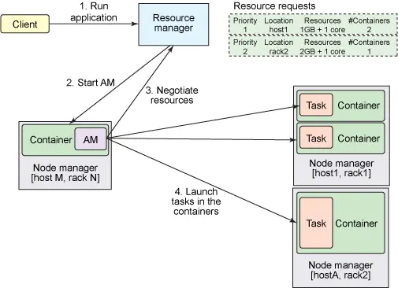

<!-- TOC -->

- [1 作用](#1-作用)
- [2 ResourceManager](#2-resourcemanager)
- [3 ApplicationMaster](#3-applicationmaster)
- [4 NodeManager](#4-nodemanager)
- [5 Container](#5-container)
- [6 应用提交](#6-应用提交)
- [7 调度器](#7-调度器)

<!-- /TOC -->

# 1 作用
资源管理和作业调度

# 2 ResourceManager
RM是一个全局的资源管理器，集群只有一个，负责整个系统的资源管理和分配：
- 处理客户端请求
- 启动/监控 ApplicationMaster
- 监控 NodeManager
- 资源的分配与调度。

它主要由两个组件构成：调度器（Scheduler）和应用程序管理器（Applications Manager，ASM）。
- 调度器
- Applications Manager(ASM)：接收job的提交请求，为应用分配第一个 Container 来运行 ApplicationMaster，监控 ApplicationMaster 运行状态

# 3 ApplicationMaster
管理 YARN 内运行的一个应用程序的每个实例。关于 job 或应用的管理都是由 ApplicationMaster 进程负责的，**Yarn 允许我们以为自己的应用开发 ApplicationMaster**。
- 数据切分
- 为应用程序**申请资源**并进一步**分配给内部任务（TASK）**
- 任务监控与容错
- 负责**协调来自ResourceManager的资源**

**ApplicationMaster 与 ResourceManager 之间的通信**是整个 Yarn 应用从提交到运行的最核心部分，是 Yarn 对整个集群进行动态资源管理的根本步骤，Yarn 的动态性，就是来源于多个Application 的 ApplicationMaster 动态地和 ResourceManager 进行沟通，不断地申请、释放、再申请、再释放资源的过程。

# 4 NodeManager
NodeManager 整个集群有多个，监控本节点上的资源使用情况和各个 Container 的运行状态
- 接收及处理来自 ResourceManager 的命令请求，分配 Container 给应用的某个任务
- 定时地向RM汇报，RM 通过收集每个 NodeManager 的报告信息来追踪整个集群健康状态的
- 管理着所在节点每个 Container 的生命周期
- 管理每个节点上的日志

NodeManager 只负责管理自身的 Container，它**并不知道运行在它上面应用的信息。负责管理应用信息的组件是 ApplicationMaster**

# 5 Container
Container 是 YARN 中的资源抽象，它封装了某个节点上的多维度资源，如内存、CPU。当 AM 向 RM 申请资源时，**RM 为 AM 返回的资源便是用 Container 表示**的。YARN 会为每个任务分配一个 Container。

一个节点会运行多个 Container，ResourceManager 只负责告诉 ApplicationMaster 哪些 Containers **可以用**，ApplicationMaster 还需要去找 NodeManager 请求分配**具体**的 Container。

Container 是一个**动态**资源划分单位，是根据应用程序的需求动态生成的。目前为止，YARN 仅支持 CPU 和内存两种资源。

# 6 应用提交

# 7 调度器
- FIFO
- 容量调度器
- 公平调度器：抢占