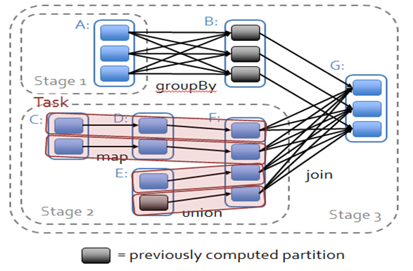
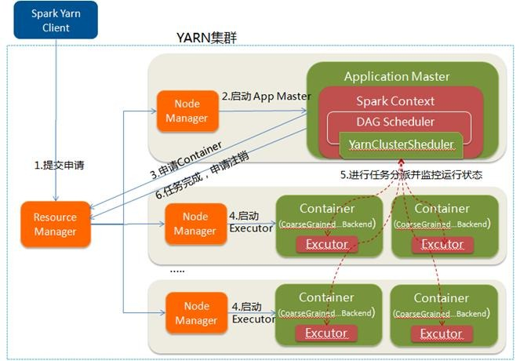

<!-- TOC -->

- [1 RDD](#1-rdd)
    - [1.1 RDD的属性](#11-rdd的属性)
    - [1.2 API](#12-api)
        - [1.2.1 Transformation](#121-transformation)
        - [1.2.2 Action](#122-action)
    - [1.3 宽依赖和窄依赖](#13-宽依赖和窄依赖)
        - [1.3.1 stage 划分](#131-stage-划分)
        - [1.3.2 Task的类型](#132-task的类型)
- [2 广播变量和累加器](#2-广播变量和累加器)
    - [2.1 广播变量](#21-广播变量)
    - [2.2 累加器](#22-累加器)
- [3 运行](#3-运行)
    - [3.1 概念](#31-概念)
    - [3.2 启动](#32-启动)
        - [3.2.1 Spark on YARN运行过程](#321-spark-on-yarn运行过程)
- [4 算子调优](#4-算子调优)
    - [**4.1 持久化**](#41-持久化)
    - [**4.2 避免shuffle**](#42-避免shuffle)
    - [4.3 mapPartition,foreachPartition](#43-mappartitionforeachpartition)
    - [4.4 使用filter之后进行coalesce操作](#44-使用filter之后进行coalesce操作)
    - [4.5 使用repartitionAndSortWithinPartitions替代repartition与sort类操作](#45-使用repartitionandsortwithinpartitions替代repartition与sort类操作)
    - [4.6 使用Kryo优化序列化性能](#46-使用kryo优化序列化性能)
- [5 **数据倾斜调优**](#5-数据倾斜调优)
    - [5.1 发现](#51-发现)
    - [5.2 解决方案](#52-解决方案)
- [6 Shuffle调优](#6-shuffle调优)
    - [6.1 HashShuffleManager运行原理](#61-hashshufflemanager运行原理)
    - [6.2 SortShuffleManager运行原理](#62-sortshufflemanager运行原理)
    - [6.3 参数调优](#63-参数调优)
- [7 内存模型](#7-内存模型)
    - [7.1 堆内内存](#71-堆内内存)
    - [7.2 堆外内存](#72-堆外内存)
    - [7.3 动态占用机制](#73-动态占用机制)
    - [7.4 持久化机制](#74-持久化机制)
- [8 资源参数调优](#8-资源参数调优)
- [9 Spark分区](#9-spark分区)

<!-- /TOC -->

[Spark学习之路](https://www.cnblogs.com/qingyunzong/category/1202252.html?page=1)

# 1 RDD
RDD（Resilient Distributed Dataset）叫做弹性分布式数据集，是Spark中**最基本的数据抽象**，它代表一个**不可变、可分区、里面的元素可并行计算**的集合。RDD具有数据流模型的特点：自动容错、位置感知性调度和可伸缩性。RDD允许用户在执行多个查询时显式地将工作集缓存在内存中，后续的查询能够重用工作集，这极大地提升了查询速度。
## 1.1 RDD的属性
- 一组分片（Partition）：即**数据集的基本组成单位**。对于RDD来说，每个分片都会被一个计算任务处理，并决定并行计算的粒度。用户可以在创建RDD时指定RDD的分片个数，如果没有指定，那么就会采用默认值。默认值就是程序所分配到的CPU Core的数目。
- 一个计算每个分区的函数：Spark中RDD的计算是以分片为单位的，每个RDD都会实现compute函数以达到这个目的。compute函数会对迭代器进行复合，不需要保存每次计算的结果。
- RDD之间的依赖关系：RDD的每次转换都会生成一个新的RDD，所以RDD之间就会形成类似于流水线一样的前后依赖关系。在部分分区数据丢失时，**Spark可以通过这个依赖关系重新计算丢失的分区数据**，而不是对RDD的所有分区进行重新计算。
- 一个Partitioner，即RDD的分片函数。当前Spark中实现了两种类型的分片函数，一个是基于哈希的HashPartitioner，另外一个是基于范围的RangePartitioner。只有对于于key-value的RDD，才会有Partitioner，非key-value的RDD的Parititioner的值是None。Partitioner函数不但决定了RDD本身的分片数量，也决定了parent RDD Shuffle输出时的分片数量。
- 一个列表，存储存取每个Partition的优先位置（preferred location）。对于一个HDFS文件来说，这个列表保存的就是每个Partition所在的块的位置。按照“移动数据不如移动计算”的理念，Spark在进行任务调度的时候，会尽可能地将计算任务分配到其所要处理数据块的存储位置。

## 1.2 API
### 1.2.1 Transformation
待补充
### 1.2.2 Action
待补充
## 1.3 宽依赖和窄依赖
- 窄依赖是指父RDD的每个分区只被子RDD的一个分区所使用，子RDD分区通常对应常数个父RDD分区（O(1)，与数据规模无关）（**即一对一或多对一**）
- 相应的，宽依赖是指父RDD的每个分区都可能被多个子RDD分区所使用，子RDD分区通常对应所有的父RDD分区（O(n)，与数据规模有关）(**一对多**)

在spark中，会根据RDD之间的依赖关系将DAG图（有向无环图）划分为不同的阶段
- 对于窄依赖，由于partition依赖关系的确定性，**partition的转换处理就可以在同一个线程里完成**，窄依赖就被spark划分到同一个stage中
- 而对于宽依赖，只能等父RDD shuffle处理完成后，下一个stage才能开始接下来的计算
### 1.3.1 stage 划分
因此spark划分stage的整体思路是：从后往前推，遇到宽依赖就断开，划分为一个stage；遇到窄依赖就将这个RDD加入该stage中

### 1.3.2 Task的类型
每个Stage里task的数量由Stage最后一个RDD中的分区数决定。
- 如果Stage要生成Result，则该Stage里的Task都是ResultTask（相当于reducer）
- 否则是ShuffleMapTask（相当于mapper）
# 2 广播变量和累加器
## 2.1 广播变量
广播变量会在executor存一份，这个executor上的task会共享，节省资源
## 2.2 累加器
如果一个变量不被声明为一个累加器，那么它将在被改变时不会在driver端进行全局汇总，即在分布式运行时每个 **task运行的只是原始变量的一个副本，并不能改变原始变量的值**。但是当这个变量被声明为累加器后，该变量就会有分布式计数的功能

# 3 运行
## 3.1 概念
- Job：Action算子开启Job
    - Action：reduce
    - Transformation：cache
- Stage：Shuffle依赖是两个stage的分界点
- Task的数量其实就是stage的并行度
- Driver：表示main()函数，**创建SparkContext**。由SparkContext负责与ClusterManager通信，进行资源的申请，任务的分配和监控等。程序执行完毕后关闭SparkContext。
- Executor：某个Application运行在**Worker节点**上的一个进程
## 3.2 启动

### 3.2.1 Spark on YARN运行过程

Driver（SparkContext）运行在ApplicationMaster
# 4 算子调优
## **4.1 持久化**
_useDisk,_useMemory,_useOffHeap,_deserialized,_replication
## **4.2 避免shuffle**
- 利用Broadcast与map代替join
- 使用map-side预聚合的shuffle操作：**尽量**使用reduceByKey或者aggregateByKey算子来替代掉groupByKey算子（aggregateByKey有两个函数，一个是partition中的数据聚合，一个是全局聚合）
## 4.3 mapPartition,foreachPartition
可以对整个partition迭代，假如我们的Function中有数据库、网络TCP等IO连接、文件流等等的创建关闭操作，采用foreachPatition方法，针对每个分区集合进行计算，更能提高我们的性能
## 4.4 使用filter之后进行coalesce操作
因此用coalesce减少partition数量，将RDD中的数据压缩到更少的partition之后，只要使用更少的task即可处理完所有的partition
## 4.5 使用repartitionAndSortWithinPartitions替代repartition与sort类操作
因为该算子可以一边进行重分区的shuffle操作，一边进行排序。shuffle与sort两个操作同时进行
## 4.6 使用Kryo优化序列化性能
性能高但需要注册
- 在算子函数中使用到外部变量时，该变量会被序列化后进行网络传输
- 将自定义的类型作为RDD的泛型类型时
- 使用可序列化的持久化策略时
# 5 **数据倾斜调优**
## 5.1 发现
- Spark Web UI 看 task执行时间
- 定位：countByKey
## 5.2 解决方案
- 过滤少数导致倾斜的key：倾斜的key就少数几个，而且对计算本身的影响并不大的话
- 提高shuffle操作的并行度（优先）：数据有限
- **对于聚合类shuffle：两阶段聚合**
    - 局部聚合，先给每个key都打上一个随机数，执行聚合
    - 然后将各个key的前缀给去掉，再次执行全局聚合
- **对于Join类shuffle**：
    - 小表 join 大表：Broadcast小表
    - 大表 join 大表：使用随机前缀和扩容RDD进行join  
        - 如果只是个别key倾斜，可以对个别key采用此方法然后再和原数据union
        - 将倾斜的RDD的每条数据都打上一个n以内的随机前缀
        - 同时对另外一个正常的RDD进行扩容，将每条数据都扩容成n条数据，扩容出来的每条数据都依次打上一个0~n的前缀

# 6 Shuffle调优
默认SortShuffleManager
## 6.1 HashShuffleManager运行原理
1. 未经优化  
下一个stage的task有多少个，当前stage的每个task就要创建多少份磁盘文件
2. spark.shuffle.consolidateFiles = true  
Executor的 CPU core 执行的第一个task创建一个shuffleFileGroup，下一批task就会复用之前已有的shuffleFileGroup。  
总的文件数=CPU core的数量 * 下一个stage的task数量
## 6.2 SortShuffleManager运行原理
1. 普通  
    - 写磁盘文件之前，会先根据key对内存数据结构中已有的数据**进行排序**。排序过后，会分批将数据写入磁盘文件，**默认的batch数量是10000条**。
    - 最后会将之前所有的临时磁盘文件都进行合并，这就是merge过程。  
    - 由于一个task就只对应一个磁盘文件，也就意味着该task为下游stage的task准备的数据都在这一个文件中，因此还会单独写一份**索引**文件，其中标识了**下游各个task的数据在文件中的start offset与end offset**
2. bypass（不排序）
    - 触发条件
        - shuffle map task数量小于spark.shuffle.sort.bypassMergeThreshold参数的值
        - 不是聚合类的shuffle算子（比如reduceByKey）
    - 和未经优化的HashShuffleManager相比多了一步merge和创建索引

## 6.3 参数调优
- spark.shuffle.file.buffer：shuffle write task的BufferedOutputStream的buffer缓冲大小，**默认32k**
- spark.reducer.maxSizeInFlight：shuffle read task的buffer缓冲大小，而这个buffer缓冲决定了每次能够拉取多少数据，**默认48m**
- **spark.shuffle.io.maxRetries**：shuffle read task重试，默认3，调节该参数可以大幅度提升稳定性，避免由于JVM的full gc或者网络不稳定等因素导致的数据拉取失败
- **spark.shuffle.io.retryWait**：重试等待次数，默认5s，建议加大
- spark.shuffle.sort.**bypass**MergeThreshold：默认200，小于启用bypass

# 7 内存模型
## 7.1 堆内内存
- spark.executor.memory 

## 7.2 堆外内存
- spark.memory.offHeap.enabled
- spark.memory.offHeap.size

## 7.3 动态占用机制
- 设定基本的存储内存和执行内存区域（spark.storage.storageFraction 参数），该设定确定了双方各自拥有的空间的范围
- 双方的空间都不足时，则存储到硬盘；若己方空间不足而对方空余时，可借用对方的空间;（存储空间不足是指不足以放下一个完整的 Block）
- 执行内存的空间被对方占用后，可让对方将占用的部分转存到硬盘，然后"归还"借用的空间
- 存储内存的空间被对方占用后，无法让对方"归还"，因为需要考虑 Shuffle 过程中的很多因素，实现起来较为复杂
## 7.4 持久化机制
- Storage 模块在逻辑上以 Block 为基本存储单位，**RDD 的每个 Partition 经过处理后唯一对应一个 Block**（BlockId 的格式为 rdd_RDD-ID_PARTITION-ID ）
- Master 负责整个 Spark 应用程序的 Block 的元数据信息的管理和维护
- LRU淘汰
# 8 资源参数调优
- num-executors
- executor-memory
- executor-cores：该参数用于设置每个Executor进程的CPU core数量。这个参数决定了每个Executor进程并行执行task线程的能力。
- driver-memory
- spark.default.parallelism：每个stage的默认task数量。不设置默认是一个HDFS block对应一个task
- spark.storage.memoryFraction
- spark.shuffle.memoryFraction

# 9 Spark分区
- RDD本身的Partitioner与groupBy操作时传入的Partitioner相等时, 不需要重新shuffle, 直接map即可。join操作只shuffle小表
- 分区器Partitioner
    - HashPartitioner
    - RangePartitioner
- Spark从HDFS读入文件的分区数默认等于HDFS文件的块数(blocks)
- 如果要减少分区，则coalesce比repartition 更高效，因为coalesce 是窄依赖不用shuffle。但如果coalesce非常小，这时如果将shuffle设置为false，父子RDD是窄依赖关系，他们同处在一个Stage中，而每个Stage里task的数量由Stage最后一个RDD中的分区数决定，就可能造成Spark程序的并行度不够，从而影响性能，如果在M为1的时候，为了使coalesce之前的操作有更好的并行度，可以讲shuffle设置为true，这样就处在两个stage

[MapReduce和Spark的效率之争和Shuffle区别](https://www.huaweicloud.com/articles/551be343399c42a516c9b2eb7b636741.html)