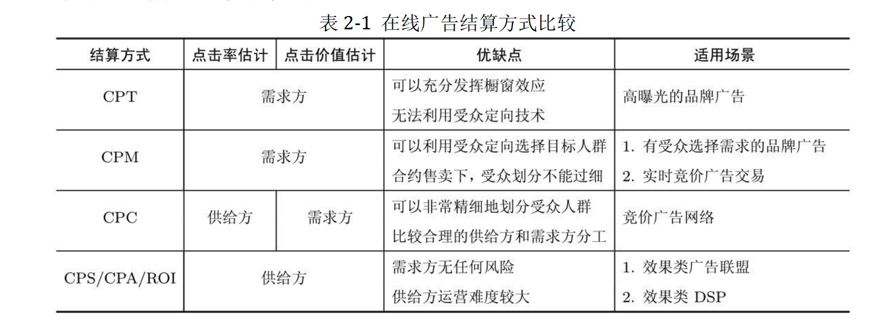
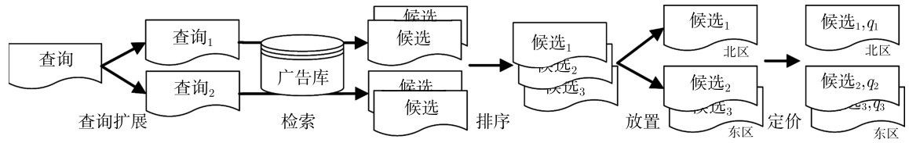

<!-- TOC -->

- [1 品牌和效果](#1-品牌和效果)
- [2 RTB](#2-rtb)
- [3 计费方式](#3-计费方式)
- [4 品牌（合约）广告](#4-品牌合约广告)
- [5 搜索广告](#5-搜索广告)
    - [5.1 决策过程](#51-决策过程)
    - [5.2 SEM](#52-sem)
- [6 二价优点？](#6-二价优点)
- [7 程序化交易](#7-程序化交易)
    - [7.1 RTB](#71-rtb)
- [8 广告数据](#8-广告数据)
- [9 解析RTA与标准直投、程序化的区别](#9-解析rta与标准直投程序化的区别)
- [10 广告关键技术](#10-广告关键技术)
    - [10.1 倒排索引](#101-倒排索引)
    - [10.2 向量空间模型](#102-向量空间模型)
- [11 受众定向](#11-受众定向)
- [12 竞价广告核心技术](#12-竞价广告核心技术)
    - [12.1 搜索广告系统](#121-搜索广告系统)
        - [12.1.1 查询扩展](#1211-查询扩展)
    - [12.2 广告检索](#122-广告检索)
    - [12.3 点击率预测](#123-点击率预测)
        - [12.3.1 动态特征](#1231-动态特征)
        - [12.3.2 位置偏差与CoEC](#1232-位置偏差与coec)
- [14 其他技术](#14-其他技术)
- [15 程序化交易数据安全](#15-程序化交易数据安全)

<!-- /TOC -->
# 1 品牌和效果
- 品牌：望借助媒体的力量来快速接触大量用户，以达到宣传品牌形象、提升中长期购买率与利润空间的目的
- 效果：马上带来大量的购买或其他转

潜在用户和直接转化
# 2 RTB
需求方按自己的人群定义来挑选流量和出价

# 3 计费方式

# 4 品牌（合约）广告
- 广告位合约：CPT
- 展示量合约：CPM  
    - >广告主按广告位采买时，比较容易预估自己拿到的流量，可是按照人群定向的方式采买，流量有诸多不确定的因素。因此，需求方希望在合约中加入对量的保证，才能放心地采买
    - >展示量合约并没有摆脱广告位这一标的物。这是由于在CPM 这种结算方式下，无法将多个差别很大的广告位打包成同一售卖标的，因为这些广告位的曝光有效性可能差别巨大，合理的CPM 也相应地大幅变动。**实践中的展示量合约往往是以一些曝光量很大的广告位为基础，再切分人群售卖**，最典型的例子是视频网站的贴片位置或者门户网站首页的广告位。
# 5 搜索广告
>搜索广告是以**上下文查询词为粒度进行受众定向**，并按照竞价方式售卖和 CPC 结算的广告产品。搜索广告是比较典型的竞价广告产品，其特点是广告主就某标的物（在这里是关键词）的广告展示机会展开拍卖式的竞争，并根据竞争结果依次占据该广告展示的若干位置

>搜索广告的媒体采买和 ROI 优化称为搜索引擎营销（Search EngineMarketing，SEM）。

>搜索广告竞价的标的物是竞价关键词（bid term），用户输入的查询（query）通过与关键词相匹配来确定是否可以触发该条广告。匹配的方式及可以采取简单的精确匹配，也可以有更多的扩展方式，查询扩展也是搜索广告的一项比较关键的产品策略。

搜索广告的产品和技术特点：
1. 搜索广告的变现能力，即eCPM 远远高于一般的展示广告，其市场重要程度也就得以彰显。因此，与搜索广告的一些独特问题和算法的研究，受到了高度的重视。而搜索广告高**变现能力最关键的产品原因就是用户主动输入的查询直接反映了用户的意图**。
2. 搜索广告的受众定向标签，即是上下文的搜索查询。由于搜索词非常强地表征着用户的意图，搜索广告可以进行非常精准的定向。相对这样的上下文信息，**根据用户历史行为得到的兴趣标签的重要性大打折扣**，这一方面是因为其信号远不如搜索词强烈，另一方面是因为用户这样明确意图的任务是决不能被打断的（参见第2 章广告有效性原理部分）。因此，搜索广告里的eCPM 由一般情形下的r（a，u，c）退化成了r（a，c）。
3. 搜索广告的展示形式**与自然结果的展示形式非常接近**，往往仅仅在底色和文字链接中有不太引人注目的提示。这样的产品设计使得它有原生广告的意味，也进一步提高了广告效果。但另一方面，这样的**广告结果对相关性的要求远远超过展示广告**，因此在根据查询匹配广告时需要非常精细的策略和技术。
4. **从搜索广告发展起来的竞价交易模式**已经逐渐发展成为互联网广告**最主流**的交易模式。这一模式从根本上改变了广告的运营方法，并为其效果的快速提高释放出巨大的生产力。

在一些高商业价值的垂直搜索引擎（如电商、房产、汽车、应用下载）之中，利用搜索广告的产品体系进行变现是需要最优先考虑的流量变现方式。
## 5.1 决策过程

1. 查询扩展
    - 精确匹配，即不对广告主提供的关键词做任何形式的扩展，保证忠实按照广告主意图精准执行。精确匹配的执行方式是首先将用户输入的**查询分词**，例如，“英语培训”这个查询，可以分成{英语，培训}这个词集合，**当这个词集合与广告主设定的关键词集合完全一致时，就触发了精确匹配**。以“英语培训”这个关键词为例，在精确匹配方式下，可能触发广告的有“英语培训、培训英语”这两个查询。
    - 短语匹配。当**用户的查询完全包含广告主关键词及关键词（包括关键词的同义
    词）的插入或颠倒形态时**，就认为匹配成功。仍以“英语培训”这个关键词为例，在短语匹配方式下，可能触发广告的搜索有“英语培训、英语培训暑期班、哪个英语培训机构好、英语的培训、英语相关培训、英文培训”等。但像“英语歌曲、电脑培训”这样的词就不会触发。这种方式是用较精细的概念匹配较宽泛的概念，因此一般来说还是比较精准的。
    - 广泛匹配。当用户的查询词与广告主的关键词高度相关时，即使广告主并未提交这些查询词，也可能被匹配。仍以关键词“英语培训”为例，在广泛匹配方式下，可能会触发“外语学习班、四级证书”这样的查询。广泛匹配的逻辑并没有清晰的定义，一般来说，都是用**数据挖掘的算法自动获得**。因此，虽然打开广泛匹配可以获得较多的流量，但是流量的精准性往往会打一定的折扣。
    - 否定匹配。由于短语匹配和广泛匹配都是系统自动完成，难免会出现一些匹配不精准的结果。因此，需要同时向广告主提供否定匹配的功能，即明确**指出哪些词是不能被匹配的**，这样可以灵活地关停一些低效的流量。
2. 广告放置
>当广告候选完成排序以后，需要分别确定北区和东区的广告条数，这个环节称为广告放置（ad placement）

由于这两个区域构成一个统一的竞价队列，实际上是要分别设定进入北区和进入东区的条件，其中最关键的是进入北区的条件

北区是黄金的广告展示位置，对于搜索广告的收入至关重要。一般来说，通用搜索引擎的广告收入中绝大部分都来自于北区，因此北区广告的平均条数与收入直接相关

## 5.2 SEM
搜索引擎进行查询扩展的目的是为了提高自己的营收；而需求方进行关键词选择的目的是为了提高广告主采买流量的ROI

# 6 二价优点？
- 广告主可以按心理预期出价，而不用关心后一位广告主的出价
- 前一位广告主的成本由后一位广告主决定，会导致后一位广告主出价接近前一位（可以尽快耗尽前一位广告主的预算），这样对广告平台更有利
    - 如果是一价，会导致前一位广告主出价会接近后一位广告主

# 7 程序化交易
## 7.1 RTB
媒体至少有四种常用的广告变现选择：担保式投送的合约售卖方式、自营广告网络、托管给其他广告网络、通过RTB 变现

- RTB的优点：
    - 竞价广告网络中会有一些完成不了的场景。例如，某广告主希望对自己的流失用户进行一次广告促销，或某广告主希望**广告平台帮助找到与其用户类似的潜在用户**。很显然，无论怎样选择在广告网络中的人群标签，都不可能直接完成上述的任务。
    - 实际上，这两个任务有一个共同的特点，即我们在加工人群标签的过程中需要**利用到广告主的数据**。这样的标签称为定制化用户标签（customized audience segmentation）。
- RTB的问题：
    1. 每次展示都有ADX 服务器与多个DSP 服务器的参与，这使得服务器与带宽成本大大增加
    2. 在询价过程中，ADX 要等待一个约定好的时间片（一般情况下为100 ms），这使得用户看到的广告延迟增加，对CTR 有负面影响。
    3. 原理上DSP 可以以极低的出价参与竞价，这样虽不能获得流量，却**可以低成本得到在媒体网站上的用户行为数据**，这里存在着潜在的信息泄露风险。

# 8 广告数据
- 用户标识
    - cookie
    - 用户行为
        - 决策行为：转化和预转化  
        在广告主网站发生，对应明确的兴趣，价值高。例如转化对应下单，预转化对应搜索浏览加购
        - 主动行为：广告点击、搜索、搜索点击  
        - 半主动行为：分享和网页浏览  
        可以挖掘兴趣，但是精准度有限，数据量大
        - 被动行为：广告浏览：频次和相应类别广告点击负相关
    - 人口属性
    - 地理位置
    - 社交关系

# 9 解析RTA与标准直投、程序化的区别
腾讯RTA则是结合标准直投和程序化两种投放模式各自的优点，在现有直投模式上推出的创新模式。且RTA功能的开通不会影响线上直投现有所有功能。
- RTA：RTA在现有直投功能不变的基础上，实时下发请求给广告主，目前包含腾讯优量汇、腾讯新闻、腾讯视频、微信及其他腾讯APP（应用宝除外）的请求，广告主利用一方数据返回决策信息，媒体结合广告主决策信息进行优选。
- 标准直投：广告主通过MKT-API或者直接在腾讯广告投放管理平台（ADQ投放端）创建广告进行广告投放，利用媒体侧数据和投放模型进行优选。
- 程序化：即“ADX”，媒体提供流量，广告主利用自有数据及投放模型完成投放。ADX广告无法利用媒体侧投放模型，广告主利用一方数据及自有投放模型完成投放。

# 10 广告关键技术
## 10.1 倒排索引
## 10.2 向量空间模型
首先，我们对每个文档采用词袋（Bag of Words，BoW）假设，即用各个关键词在文档中的强度组成的矢量来表示该文档
$$d=(x_1,x_2,...,x_M)_T$$
- $x_m$：词表中第 m 个词在 d 中对应的TF-IDF（Term Frequency-Inverse
DocumentFrequency，词频–倒数文档频率，是TF和IDF的乘积
- TF：词频（Term Frequency，TF），即某文档中该词出现的次数
- IDF：倒数文档频率（Inverse Document Frequency，IDF），即该词在所有文档中出现的频繁程度的倒数。IDF 的引入是考虑到那些广泛出现在各个文档中的**常用词对主题的鉴别力并不强，因而需要降低其权重**。常用计算方法：
    - $IDF(m) = log(N/DF(M))$
    - DF(m) 为出现 词 m 的文档的总数目，N 为总文档数目
- 如果我们考虑更精细的文档描述，可以进一步加入文档的n-gram 信息，但是也会带来数据的爆炸式增长和模型估计稳健性上极大的挑战。
- 采用BoW 的文档表示方法，在计算两个文档的相似度时，一般是用其对应矢量的余
弦距离：
    - $cos(d_1,d_2) = {d_1^Td_2\over||d1||·||d2||}$
    - 余弦距离的最显著好处是当两个矢量在尺度上没有归一化时，仍然可以得到比较稳健
的结果
    - 虽然VSM 不是实际系统中对检索候选进行排序的常见方法，不过要提醒大家注意，这是一种简单、无需训练的**基线方法**
    - 应用？
# 11 受众定向

# 12 竞价广告核心技术
## 12.1 搜索广告系统
与一般广告网络最主要的区别是上下文信息（query）非常强，用户标签的作用受到很大的限制，它与一般的竞价广告系统架构的主要区别是**没有上下文和用户标签的缓存**，但是其**检索模块由于查询扩展的需求，会比一般的竞价广告系统要复杂**，并且在排序后的收益优化阶段还需要进行北区和东区的广告放置决策。

搜索广告算法上最关键的技术是点击率预测和查询词的扩展。

### 12.1.1 查询扩展
- 基于推荐
    - 如果把用户一个会话（session）内的查询（query）视为目的相同的一组活动，可以在{session，query}矩阵上通过推荐技术产生相关的关键词。这种方法利用的是搜索的日志数据，而基本上个性化推荐领域的各种思路和方法都可以适用。
    - **协同过滤**（CollaborativeFlittering，CF）：通过分析用户或者事物之间的相似性（“协同”），来预测用户可能感兴趣的内容并将此内容推荐给用户。
        - 优点
            - 能够过滤机器难以自动内容分析的信息，如艺术品，音乐等。
            - 共享其他人的经验，避免了内容分析的不完全或不精确，并且能够**基于一些复杂的，难以表述的概念（如信息质量、个人品味）进行过滤**。
            - 有推荐新信息的能力。可以发现内容上完全不相似的信息，用户对推荐信息的内容事先是预料不到的。可以发现用户**潜在的但自己尚未发现的兴趣偏好**。
            - 推荐个性化、自动化程度高。能够有效的利用其他相似用户的反馈信息。加快个性化学习的速度。
        - 缺点：
            - 新用户问题(New User Problem) 系统开始时推荐质量较差
            - 新项目问题(New Item Problem) 质量取决于历史资料集
            - 稀疏性问题（Sparsity）
            - 系统延伸性问题（Scalability）
- 基于文档主题模型
- 基于历史效果:某些关键词对某些**特定广告主的eCPM** 较高，当另一个广告主也选择了其中的某个关键词时，可以根据这些历史记录，自动地扩展出其他效果较好的查询
## 12.2 广告检索
[布尔表达式索引](https://zhuanlan.zhihu.com/p/59658727)

## 12.3 点击率预测
### 12.3.1 动态特征
- 在机器学习问题中，有一项很重要的方法论，即某项模型侧的技术，一般都可以找到特征侧的对偶方案
- 当某个组合特征被触发时，我们不再用1，而是采用这个组合历史上一段时期的点击率作为其特征取值。这样一来，即使是同一个t（a，u，c），在不同的时间点，其所对应的特征取值也是不同的，这样的特征就是动态特征。
- 使用动态特征的另一个好处是可以大大减少模型的参数数目，整体模型的参数个数就由各种维度组合总的实例数目降到了维度组合的种类数
### 12.3.2 位置偏差与CoEC
- 广告位尺寸、广告位类型（如门户首页、频道首页、内容页、客户端）、创意类型（如图片、Flash、富媒体）、操作系统、浏览器、日期和时间
- 用上述特征训练偏差模型，得到归一化点击率

# 14 其他技术
创意优化 流量保护 实验框架  流量保护 广告监测 

# 15 程序化交易数据安全
供给方：恶意DSP一直出低价，收集媒体用户
需求方：如果DSP 希望制造更加激烈的竞价环境，获得更高的利润，那么它实际上可以将这两个广告主的顾客集合合并在一起，并生产一个相应的用户标签吸引双方来对此标签竞价。这种做法的实质是在竞争对手之间倒卖顾客集合。随着竞价激烈程度的增加，原本属于广告主的利润就向市场其他环节发生了转移