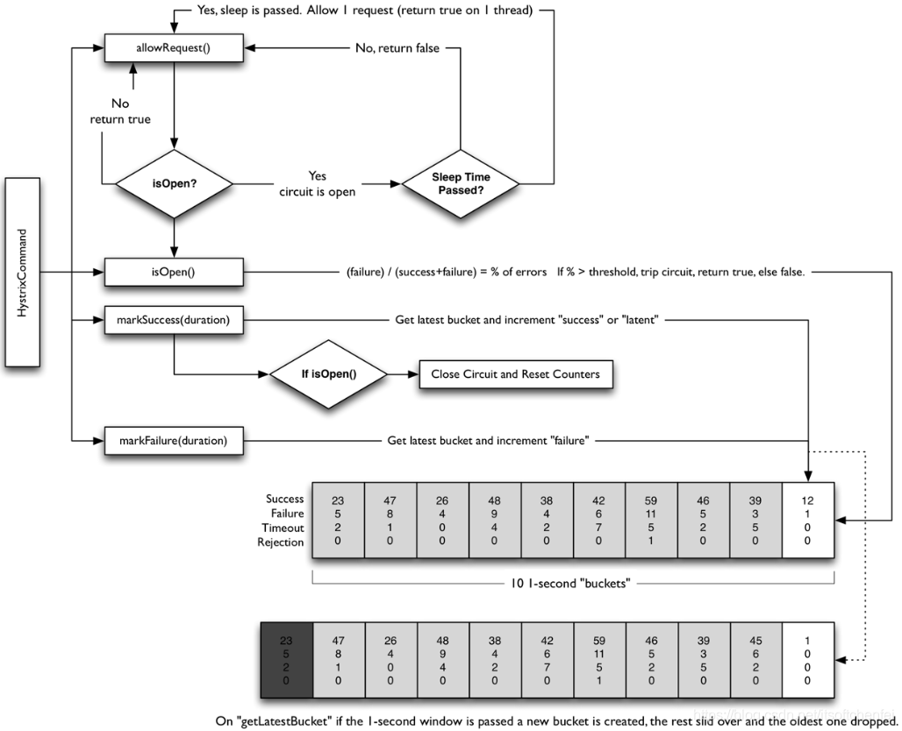

<!-- TOC -->

- [1功能?](#1功能)
- [2为什么要做线程隔离？](#2为什么要做线程隔离)
- [3HystrixCommand vs HystrixObservableCommand](#3hystrixcommand-vs-hystrixobservablecommand)
- [4工作流程？](#4工作流程)
- [5线程隔离和信号量隔离？](#5线程隔离和信号量隔离)
- [6熔断器原理？](#6熔断器原理)
- [7降级注意事项？](#7降级注意事项)
- [8线程池隔离维度，几个key的含义？](#8线程池隔离维度几个key的含义)
- [9Sentinel？](#9sentinel)
- [10 配置](#10-配置)

<!-- /TOC -->

[Hystrix源码](https://blog.csdn.net/alex_xfboy/article/details/89844066)
# 1功能?
- 熔断器（Circuit Breaker）
- 隔离（Isolation），实现了**线程池隔离**和**信号量隔离**
- 降级（fallback），Hystrix会在run()执行过程中出现错误、超时、线程池拒绝、断路器熔断等情况时进行降级处理，有default fallback、单级fallback、多级fallback。
- 请求合并（Request Collapsing）
- 请求缓存（Request Caching）
- 仪表盘
# 2为什么要做线程隔离？
- 分布式系统环境下，服务间类似依赖非常常见，一个业务调用通常依赖多个基础服务。对于同步调用，当下游服务不可用时，上游服务**请求线程被阻塞**，当有大批量请求调用上游服务时，最终可能导致整个上游服务**资源耗尽**，无法继续对外提供服务。并且这种不可用可能**沿请求调用链向上游传递**，这种现象被称为雪崩效应。
- **执行依赖代码的线程与请求线程(比如Tomcat线程)分离**，请求线程可以自由控制离开的时间，这也是我们通常说的异步编程，Hystrix是结合RxJava来实现的异步编程。通过设置线程池大小来控制并发访问量，当线程饱和的时候可以拒绝服务，防止依赖问题扩散。
# 3HystrixCommand vs HystrixObservableCommand
[Hystrix使用入门手册](https://www.jianshu.com/p/b9af028efebb)
- HystrixCommand
    - 一个实例只能向调用程序发送（emit）单条数据
- HystrixObservableCommand
    - 一个实例可以顺序发送多条数据，比如顺序调用多个onNext()，便实现了向调用程序发送多条数据
- 命令执行方法
    - execute()：以同步堵塞方式执行run()
    - queue()：以异步非堵塞方式执行run()，返回Future
    - observe()：返回Obervable对象，他代表了操作的多个结果，它是一个Hot Observable。
        >Hot Observable：不论 “事件源” 是否有“订阅者”都会在创建后对事件进行发布。每一个“订阅者”都有可能从“事件源”的中途开始的，并可能只是看到了整个操作的局部过程
    - toObservable()：同样返回Observable对象，也代表了操作多个结果，但它返回的是一个Cold Observable
        >Cold Observable：在没有 “订阅者” 的时候并不会发布，而是进行等待，知道有 “订阅者” 之后才发布事件
# 4工作流程？

1. 构造一个 HystrixCommand或HystrixObservableCommand对象，用于**封装请求**，并在构造方法配置请求被执行需要的**参数**；
2. 执行命令，Hystrix提供了4种执行命令的方法，后面详述；
3. 判断是否使用**缓存**响应请求，若启用了缓存，且缓存可用，直接使用缓存响应请求。Hystrix支持请求缓存，但需要用户自定义启动；
4. 判断**熔断器**是否打开，如果打开，跳到**第8步**；
5. 判断**线程池/队列/信号量**是否已满，已满则跳到**第8步**；
6. **执行**HystrixObservableCommand.construct()或HystrixCommand.run()，如果执行失败或者超时，**跳到第8步**；否则，跳到第9步；
7. 统计熔断器监控指标；(统计5、6步数据，用于4)
8. 走Fallback备用逻辑
9. 返回请求响应
# 5线程隔离和信号量隔离？
- 线程池隔离和信号量隔离的主要区别：
    - 线程池：业务请求线程和执行依赖的服务的线程**不是同一个**线程；
    - 信号量：业务请求线程和执行依赖服务的线程是**同一个**线程
- 线程池缺点：增加了排队、调度和上下文切换的开销
- 当依赖延迟极低的服务时，**线程池隔离技术引入的开销超过了它所带来的好处**。这时候可以使用信号量隔离技术来代替，通过设置信号量来限制对任何给定依赖的并发调用量
- 总结      

||线程切换|支持异步|支持超时|支持熔断|限流|开销|
|-|-|-|-|-|-|-|
|信号量|否|否|否|是|是|小|
|线程池|是|是|是|是|是|大|
# 6熔断器原理？
- 流程：  
    1. 以秒为单位来统计请求的处理情况(成功请求数量、失败请求数、超时请求数、被拒绝的请求数)，然后每次取最近10秒的数据来进行计算，如果失败率超过50%，就进行熔断，不再处理任何请求。
    2.  熔断后拒绝所有请求一段时间(**sleepWindow**)；然后放一个请求过去(半开状态)，如果请求成功，则关闭熔断器，否则继续打开熔断器。

- 桶：
每个桶代表1秒，桶中的数据就是1秒内各处理结果的请求数量
- 滑动窗口：  
若每次的决策都以**10个Bucket**的数据为依据，10个Bucket就是10秒，这个10秒就是一个滑动窗口(Rolling window)。滑动意味着：在没有熔断时，**每当收集好一个新的Bucket后，就会丢弃掉最旧的一个Bucket**。
# 7降级注意事项？
有时，如果调用依赖服务失败，可以从缓存服务（如redis）中查询旧数据版本。由于又会**发起远程调用**，所以建议重新封装一个Command，使用不同的ThreadPoolKey，与主线程池进行隔离。
# 8线程池隔离维度，几个key的含义？
- HystrixCommandKey：  
[HystrixCommand或者HystrixObservableCommand的具体子类].getClass().getSimpleName();
- HystrixCommandGroupKey：  
用于对Hystrix命令进行分组，分组之后便于统计展示于仪表盘、上传报告和预警等等，也就是说HystrixCommandGroupKey是Hystrix内部进行**度量统计时候的分组标识，数据上报和统计的最小维度就是分组的KEY**。HystrixCommandGroupKey是**必须**配置的，配置方式如下：
```java
HystrixCommandGroupKey.Factory.asKey("Group Key")；

public Command() {
    super(Setter.withGroupKey(HystrixCommandGroupKey.Factory.asKey("Group Key")));
}
```
- HystrixThreadPoolKey；  
一类HystrixCommand总是在同一个HystrixThreadPool实例中执行。如果不显式配置HystrixThreadPoolKey，那么会使用**HystrixCommandGroupKey的值去配置HystrixThreadPoolKey**。HystrixThreadPoolKey的配置方式如下：
```java
HystrixThreadPoolKey.Factory.asKey("ThreadPoolKey")

public Command() {
    super(Setter.withGroupKey(HystrixCommandGroupKey.Factory.asKey("xxx"))
                .andCommandKey(HystrixCommandKey.Factory.asKey("YYY"))
                .andThreadPoolKey(HystrixThreadPoolKey.Factory.asKey("ThreadPoolKey")));
}
```
# 9Sentinel？
https://sentinelguard.io/zh-cn/docs/introduction.html

# 10 配置
[Hystrix 配置内容](https://wiki.n.miui.com/pages/viewpage.action?pageId=34969752)