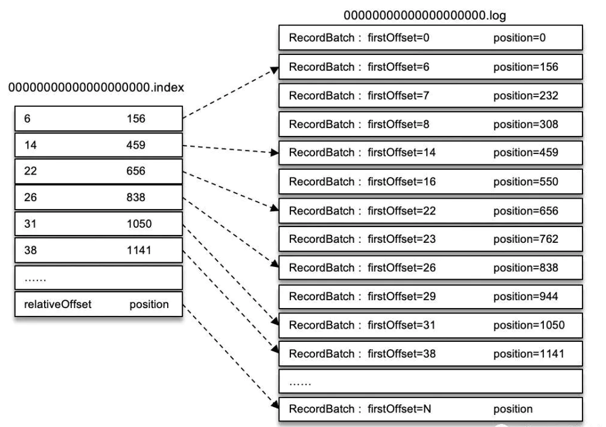

<!-- TOC -->

- [1 生产者使用？](#1-生产者使用)
    - [1.1 发同步or异步、异常重试？](#11-发同步or异步异常重试)
    - [1.2 分区器](#12-分区器)
    - [1.3 **重要参数**](#13-重要参数)
    - [1.4 如何保证发送有序（消息重试对顺序消息的影响，一般不问这个）](#14-如何保证发送有序消息重试对顺序消息的影响一般不问这个)
- [2 消费者](#2-消费者)
    - [2.1 订阅主题和分区](#21-订阅主题和分区)
    - [2.2 位移提交](#22-位移提交)
    - [2.3 指定位移消费](#23-指定位移消费)
    - [2.4 再均衡](#24-再均衡)
    - [2.5 多线程消费](#25-多线程消费)
    - [2.6 消费者参数](#26-消费者参数)
- [3 主题与分区](#3-主题与分区)
    - [3.1 **分区分配算法**](#31-分区分配算法)
    - [3.2 优先副本及其选举（保证了所有分区的leader均衡分布，不会进行数据迁移）](#32-优先副本及其选举保证了所有分区的leader均衡分布不会进行数据迁移)
    - [3.3 分区重分配（分区在**broker**上的重分配）](#33-分区重分配分区在broker上的重分配)
    - [3.4 分区数量确定](#34-分区数量确定)
- [4 日志存储](#4-日志存储)
    - [4.1 目录和文件](#41-目录和文件)
    - [4.2 **日志索引和查询效率**](#42-日志索引和查询效率)
    - [4.2.1 偏移量索引](#421-偏移量索引)
    - [4.2.1 时间戳索引（多一次二分查找）](#421-时间戳索引多一次二分查找)
- [5 **磁盘存储和Kafka吞吐量**](#5-磁盘存储和kafka吞吐量)
    - [5.1 pagecache](#51-pagecache)
    - [5.2 零拷贝](#52-零拷贝)
    - [5.3 **Kafka吞吐量总结**？](#53-kafka吞吐量总结)
- [6 控制器](#6-控制器)
    - [6.1 控制器的选举](#61-控制器的选举)
    - [6.2 功能](#62-功能)
- [7 消费者分区分配？](#7-消费者分区分配)
- [8 Rebalance](#8-rebalance)
    - [8.1 FINDCOORDINATOR](#81-findcoordinator)
    - [8.1 过程](#81-过程)
    - [8.2 HEARTBEAT(避免不必要的rebalance)](#82-heartbeat避免不必要的rebalance)
    - [8.3 协议缺点](#83-协议缺点)
    - [8.4 Cooperative协议流程](#84-cooperative协议流程)
- [9 **消息交付语义**](#9-消息交付语义)
    - [9.1 生产者](#91-生产者)
        - [9.1.1 幂等实现原理](#911-幂等实现原理)
    - [9.2 消费者](#92-消费者)
- [10 Kafka事务？](#10-kafka事务)
    - [10.1 事务性消息传递和flink？](#101-事务性消息传递和flink)
- [11 **Kafka如何保证可靠性？**](#11-kafka如何保证可靠性)
    - [11.1 **副本机制**](#111-副本机制)
        - [11.1.1 leader和follower](#1111-leader和follower)
        - [11.1.2 AR和ISR](#1112-ar和isr)
        - [11.1.3 LEO与HW](#1113-leo与hw)
- [11.2 Kakfa为什么要靠ISR模型实现日志同步机制？](#112-kakfa为什么要靠isr模型实现日志同步机制)
    - [11.2.1 日志同步机制](#1121-日志同步机制)
    - [11.2.2 少数服从多数机制](#1122-少数服从多数机制)
    - [11.2.3 ISR模型](#1123-isr模型)
    - [11.3 **提高可靠性的配置**](#113-提高可靠性的配置)
    - [11.4 Kafka为什么不采用读写分离？](#114-kafka为什么不采用读写分离)
- [12 消息中间件选型？](#12-消息中间件选型)
- [13 **kafka顺序**](#13-kafka顺序)
    - [13.1 producer配置（消息重试对顺序消息的影响）：](#131-producer配置消息重试对顺序消息的影响)
    - [13.2 全局有序](#132-全局有序)
    - [13.3 局部有序](#133-局部有序)

<!-- /TOC -->
# 1 生产者使用？
先后经过拦截器、序列化器、分区器。KatkaProducer线程安全
## 1.1 发同步or异步、异常重试？
- 三种模式
    - 发后即忘：只调用send，不调用get
    - 同步：调用send方法返回的future.get
    - 异步：利用send方法的callback参数，如果是同分区，则callback有序
- 异常
    - 可重试异常：对于**可重试异常**（例如NetworkException、LeaderNotAvailableException），如果配置了**retries**，如果在次数内恢复了就不抛异常
        - *重试和顺序性*：如果设置retries大于0而没有设置max.in.flight.requests.per.connection=1则意味着放弃发送消息的顺序性
    - 不可重试异常：例如RecordTooLargeException
## 1.2 分区器
- 指定Partition字段，就不需要分区器
- 默认hash，若key为null则**轮询**
- 一旦增加分区，无法保证映射关系
## 1.3 **重要参数**
- acks：消息的可靠性和吞吐量的权衡
    - 0：不需要等待服务端响应，此时retries无效
    - 1：leader写入成功(默认)
    - -1：等待ISR写入成功但不一定可靠：因为ISR可能只有leader。需要min.insync.replicas配合
- retries：默认Integer.MAX_VALUE
- linger.ms：ProducerBatch等待时间，增大会提高吞吐量
- uploadLog
    - acks=1
    - retries=0
## 1.4 如何保证发送有序（消息重试对顺序消息的影响，一般不问这个）
- retries=0
- 或acks=0（retries无效）
- 或retries>0 && max.in.flight.requests.per.connection=1  
    > max.in.flight.requests.per.connection设为1：生产者在收到服务器响应之前可以发送多少个
- 或开启幂等
# 2 消费者
每一个分区只能被一个消费组中的一个消费者所消费。
## 2.1 订阅主题和分区
- 订阅主题：**具有再均衡功能**，可注册再均衡监听器
- 分区：assign(TopicPartion)，没有自动再均衡功能
## 2.2 位移提交
消费位移存储起来（持久化）的动作称为“提交”
- 存储位置：旧消费者客户端：zk中，新：kafka的主题_consumer_offsets
- 获取offset
    - position：下次要拉取的位置，也是需要提交的位置（poll的时候更新）
    - committed：lastCousumedOffset+1（提交时更新）
- 提交方式
    - 自动：设置时间默认5s
    - 同步：
        - commitSync()方法会根据poll()方法拉取的最新位移来进行提交（即position位置），只要没有发生不可恢复的错误（Unrecoverable Error），它就会**阻塞消费者线程**直至位移提交完成**且会自动重试**
        - 还可以指定位移提交
        - 有可能重复消费（在提交前崩溃，恢复后从上次位移提交的地方拉取）
    - 异步：回调函数可以接受Exception处理失败，**不会自动重试**，失败需要手动重试
        - 重试提交（避免消费者提前退出导致重复消费）导致的重复消费：
            - 解决重复消费：设置**递增的序号**维护异步提交的顺序，每次位移提交之后就增加序号相对应的值。在遇到位移提交失败需要重试的时候，可以检查所提交的位移和序号的值的大小，如果前者小于后者，则**说明有其他异步提交有更大的位移己经提交**了，不需要再进行本次重试
            - 一般情况**不用重试提交**也没关系，因为后面的提交也会成功
        - **消费者正常退出或再均衡发生，可以执行一次同步提交**
    - 区别？
- 控制或关闭消费：
    - 只关闭某些分区：pause()和resume()
    - 退出循环：wakeup方法，抛出WakeupException
## 2.3 指定位移消费
- latest（默认）,earliest,none（异常）
- seek方法指定分区和offset：分区的分配是在poll()方法的调用过程中实现的，所以在执行seek()方法之前需要**先执行一次poll()方法**分配到分区
    - seekToBeginning（从分区起始位置消费）,seekToEnd,offsetsForTimes（指定时间消费）
## 2.4 再均衡
- 再均衡期间，**消费者组不可用**。且消费者当前状态会丢失（位移未提交），可能造成**重复消费，应该尽量避免**。
- 可以在subscribe()注册再均衡监听器，同步提交位移
## 2.5 多线程消费
KafkaConsumer 非线程安全，实现原理是每个方法调用前执行acquire()，失败抛出并发修改异常  
实现多线程
- 多个consumer实例：和多进程没区别，消耗不同分区
- 业务线程池：
    - CallerRunsPolicy()，这样可以防止线程池的总体消费能力跟不上poll()拉取的能力，从而导致异常现象
    - 有**位移覆盖**问题
## 2.6 消费者参数
- atuo.offset.reset：latest（默认）,earliest,none（异常）
- auto.commit.enable：自动提交
- auto.commit.interval.ms：自动提交位移时间间隔
- partition.assignment.strategy：分区分配策略
- isolation.level：事务隔离级别
    - read_commited：只能消费到LSO
    - read_uncommited：默认HW
- 小米
	- atuo.offset.reset=latest
	- auto.commit.enable=true
	- auto.commit.interval.ms=1000
	- rebalance.backoff.ms=5000：两次再平衡重试之间的退避时间
	- rebalance.max.retries=10
# 3 主题与分区
## 3.1 **分区分配算法**
[Kafka创建Topic时如何将分区放置到不同的Broker中](https://www.iteblog.com/archives/2219.html)
- 第一个分区的第一个副本放置位置是**随机**从 brokerList 选择的，其他分区的第一个副本Round Robin
- 所有分区的第二个副本是相对于第一个副本位置由 nextReplicaShift（也是随机产生） 决定，并且在currentPartitionId等于broker数量时会+1（防止 partition 过多时,其中某些 partition 的分配情况重合）
- 第三个副本及以后是第二个副本+1
## 3.2 优先副本及其选举（保证了所有分区的leader均衡分布，不会进行数据迁移）
只有leader 副本对外提供读写服务，而follower 副本只负责在内部进行消息的同步，因此Leader挂了要选一个新的。
- 优先副本：AR集合中第一个副本（AR集合顺序不改变（**由分区分配算法决定**），ISR可能改变）。Kafka **要确保优先副本**在Kafka 集群中**均匀分布**，这样就保证了所有分区的leader 均衡分布
- 优先副本的选举是指通过一定的方式促使**优先副本选举为leader副本**，也叫**分区平衡**
- 不平衡发生场景：分区leader节点发生故障后恢复
- 分区平衡：
    - 自动：可以配置auto.leader.rebalance.enable=true，根据分区不平衡率leader.imbalance.per.broker.percentage=非优先副本leader个数/分区总数。**不建议在生产环境配置**，因为平衡期间不能提供服务
    - 手动
## 3.3 分区重分配（分区在**broker**上的重分配）
- 场景：集群扩容，broker节点失效时，Kafka并不会将分区副本自动迁移，而是需要手动执行kafka-reassign-partitions.sh
- **分配算法和上面创建主题时的一致**，新副本会从leader副本同步数据，执行完重分配后需要**再执行优先副本选举**
## 3.4 分区数量确定
- 创建一个只有1个分区的topic，然后测试这个topic的producer吞吐量和consumer吞吐量。假设它们的值分别是Tp和Tc，单位可以是MB/s。然后假设总的目标吞吐量是Tt，那么分区数 =  Tt / max(Tp, Tc)
- 吞吐量除了和分区数量有关，还和这些因素相关：消息大小、消息压缩方式、消息发送方式(同步或异步)、消息确认类型acks、副本因子
- 要求消息顺序性：分区数设为1
- 并非越高越好：
    - 在Kafka的broker中，每个partition都会对应磁盘文件系统的一个目录。在Kafka的数据日志文件目录中，每个日志数据段都会分配两个文件，一个索引文件和一个数据文件。当前版本的kafka，每个broker会为每个日志段文件打开一个index文件句柄和一个数据文件句柄。因此，随着partition的增多，所需要保持打开状态的文件句柄数也就越多，最终可能超过底层操作系统配置的文件句柄数量限制。
    - 降低高可用：分区在leader角色切换时不可用，如果集群中的某个**broker 节点宕机**，那么就会有大量的分区需要同时进行leader 选举，耗时长
# 4 日志存储
## 4.1 目录和文件

- 文件夹：\<topic\>-\<partition\>
- .log (LogSegment)：根据基准偏移量（ baseOffset ）命名
## 4.2 **日志索引和查询效率**
- **稀疏索引**：Kafka 中的索引文件以稀疏索引（ sparse index ）的方式构造消息的索引，它**并不保证每个消息在索引文件中都有对应的索引项**。这样可以避免索引文件占用过多的内存，从而可以在内存中保存更多的索引.
    >稀疏索引：每个存储块的每一个键对应的指针都指向每个数据块的第一条记录

    两个索引文件会在写入log.index.interval.bytes时增加索引项
- **内存映射**：稀疏索引通过MappedByteBuffer 将索引文件映射到内存中，以加快索引的查询速度
- **二分查找**
## 4.2.1 偏移量索引

- 存储格式：
    - 相对偏移量relativeOffset：表示相对于baseOffset（文件名）的偏移量
    - 物理地址：position
- 查找过程：
    - 使用**跳表**定位baseOffset：Kafka每个日志对象用ConcurrentSkipListMap保存**日志分段**，每个日志分段的baseOffset作为key
    - 索引中**二分法**查找position
    - 日志分段文件中**顺序查找**
## 4.2.1 时间戳索引（多一次二分查找）
- 存储格式：
    - timestamp：当前日志段最大时间戳
    - relativeOffset：时间戳所对应消息的相对偏移量（相对baseOffset）
- 查找过程
    - 和每个日志段文件的largestTimeStamp 逐一对比，找到不小于targetTimeStamp的日志分段
    - 在时间戳索引文件中二分查找不大于targetTimeStamp 的最大索引项
    - 在偏移量索引文件中使用二分算法查找到不大于上述索引的最大索引项，得到position
    - 在日志文件中从position开始查找不小于targetTimeStamp的消息
# 5 **磁盘存储和Kafka吞吐量**
## 5.1 pagecache
- pagecache
把磁盘中的数据缓存到物理内存中，把对磁盘的访问变为对物理内存的访问
    - 读：当内核读操作会首先检查是否在page cache中，在则直接从内存中读取的行为。否则从磁盘中读取数据
    - 回写：写操作直接写到cache中，后备存储不会立刻直接更新，而是将page cache中被写入的page标记成**dirty**，并且被加入到脏页**链表**中
- 线性写盘
    - 线性写磁盘和随机写内存性能差不多
    - 可以利用read-ahead和write-behind
        - read-ahead：如果你的磁盘使用更倾向于顺序读取，那么 read-ahead 可以有效的使用每次从磁盘中读取到的有用数据预先填充 page cache，便于接下来对该区域进行读取时，不会因缺页（page fault）而阻塞
        - write-behind：数据写入page cache，将多个小型的逻辑写合并成一次大型的物理磁盘写入。
- **Kafka依赖Page Cache**：
    - 不用堆内存来做缓存（进程内缓存）的原因：
        - 空间效率低（对象元数据）
        - GC带来性能问题
        - **程序退出或重启页缓存依旧存在**但进程内缓存会失效
    - **简化了代码**：因为保持 cache 和文件系统之间一致性的逻辑由 OS 保证。Kafka只需要调整刷盘策略
    - **读写空中接力**：如果Kafka producer的生产速率与consumer的消费速率相差不大，那么就能几乎只靠对broker page cache的读写完成整个生产-消费过程（**sendfile系统调用**，将数据从 pagecache 转移到 socket 网络连接中，使用FileChannel.transferTo()）, 所有的数据都在内存中，这是 kafka 的**高吞吐量的保证**
    - 具体使用
        - 写（生产）消息：
            - index文件较小，可以直接用mmap进行内存映射
            - segment文件较大，可以采用普通的write（FileChannel.write），由于是顺序写PageCache，可以达到很高的性能
        - 读（消费）消息：
            - index文件仍然通过mmap读，缺页中断的可能性较小
            - segment可以使用sendfile进行零拷贝的发送给消费者，达到非常高的性能
- 刷盘策略
    - 消息的可靠性应该由**多副本机制保障**而不是同步刷盘：严重影响性能。如果acks=-1，leader刷盘前挂了，数据其他副本还有丢不了
    - 对于大量使用页缓存的Kafka，应该**避免swap**，**vm.swappiness=1**(0表示关闭，最大100。设为1保留了swap 的机制而又最大限度地限制了它对Kafka 性能的影响)
        - >swap是把非活跃进程交换出内存
## 5.2 零拷贝
见[零拷贝](../计算机基础/IO.md#/t4/t零拷贝技术)
## 5.3 **Kafka吞吐量总结**？
- 顺序写
- pagecache、mmap，零拷贝（读写空中接力）
- 分区：Partition 置于不同的磁盘上，从而实现磁盘间的并行处理，充分发挥多磁盘的优势

# 6 控制器
在Broker中选举其中一个作为控制器，负责管理集群中所有分区和副本的状态
## 6.1 控制器的选举
zk中创建/controllers节点
## 6.2 功能
通过监听zk的节点，在老版本没有控制器，每个broker都会监听
- 监听分区变化：**优先副本选举**、ISR集合变更、分区重分配
- 监听主题相关的变化
- 监听broker 相关的变化
# 7 消费者分区分配？
- RangeAssigner（默认）：消费者总数和分区总数进行整除运算获得一个跨度，然后将分区按照跨度进行平均分配
    - 消费者C0：t0p0 、t0p1、t1p0 、t1p1
    - 消费者C1：t0p2、t1p2
- RoundRobinAssignor：消费者及消费者订阅的所有主题的分区按照字典序排序，然后通过轮询
    - 如果同一个消费者组所有消费者订阅得主题相同，那么就是均匀的
        - 消费者C0：t0p0 、t0p2、t1p1
        - 消费者C1：t0p1、t1p0、t1p2
    - 否则
        - 消费者C0：t0p0
        - 消费者C1：t1p0
        - 消费者C2：tlp1、t2p0 、t2p1、t2p2
- StickyAssignor：分区的分配要尽可能均匀，分区的分配**尽可能与上次分配的保持相同**
# 8 Rebalance
[Kafka Rebalance机制分析](https://www.cnblogs.com/yoke/p/11405397.html)
## 8.1 FIND_COORDINATOR
Group Coordinator是一个服务，每个Broker在启动的时候都会启动一个该服务。Group Coordinator的作用是用来存储Group的相关Meta信息，并将对应Partition的Offset信息记录到Kafka内置Topic(__consumer_offsets)中。

Kafka在0.9之前是基于Zookeeper来存储Partition的Offset信息(consumers/{group}/offsets/{topic}/{partition})，**但是ZK并不适用于频繁的写操作**。

每个Group都会选择一个Coordinator来完成自己组内各Partition的Offset信息，选择的流程和规则如下：

流程：
1. 如果消费者还没有和GroupCoordinator建立连接，则向集群中某个节点发送FindCoordinatorRequest
2. 根据groupId找到对应GroupCoordinator：
    ```java
    partition-Id = Math.abs(groupId.hashCode() % groupMetadataTopicPartitionCount)
    ```
    规则： 
    - 计算GroupId对应在__consumer_offsets上的Partition
    - 根据对应的Partition寻找该**Partition的leader所对应的Broker**，该Broker上的GroupCoordinator即就是该Group的Coordinator
    - 其中groupMetadataTopicPartitionCount对应offsets.topic.num.partitions参数值，默认值是50个分区

消费者最终的**分区分配方案**及组内消费者所提交的**消费位移信息**都会发送给此分区leader 副本所在的broker 节点，
让此broker 节点既扮演GroupCoordinator 的角色，又扮演保存分区分配方案和组内消费者位移的角色，这样可以省去很多不必要的中间轮转所带来的开销。
## 8.1 过程
[Kafka 消费者 Rebalance 的性能优化](https://docs.qingque.cn/d/home/eZQDBBa5JXlPIfz5ZRXAQ_AO-?identityId=1vXRL1gK14O)
1. 心跳失败、加入组、离开组。
2. Coordinator 在发送心跳时就会告知每个 Consumer 需要发送一个 JoinGroup 请求来重新加入该 group。
3. Consumer 需要立刻**放弃当前所订阅的所有 Partition**，并向 Coordinator 发送 JoinGroup 请求。从这个时刻开始，该 Consumer Group 中所有 Consumer 就**停止消费**，进入 stop-the-world 状态。
4. Coordinator 端在收到组内所有 Consumer 的 JoinGroup 请求后，会选出一个 Leader Consumer，将组内所有 Consumer 的订阅策略以及一些元数据信息返回给该 Leader Consumer，由该 Leader Consumer 进行具体的分区分配，而不是在 Coordinator 端进行分配  
分配方案的制定是在消费者leader端进行的，这有几个好处：
    - 一个是策略发生变化时，只需要重启消费者即可，不需要重启整个Kafka集群
    - 另外下放权力有利于用户在消费者侧实行一些自定义的分配策略，比如可以给某个消费者分配同一个机架上的分区减少网络延迟

5. 所有的 Consumer 发送 SyncGroup 请求给 Coordinator，其中 Leader Consumer **会将自己分配好的所有分区方案包含在这一次请求中**，其它 Consumer 节点这次请求不包含实质性信息。
6. Coordinator 将每个 Consumer 被分配到的分区元数据作为 SyncGroup 的 Response 返回给 Consumer

## 8.2 HEARTBEAT(避免不必要的rebalance)
- session.timeout.ms：心跳超时时间
- heartbeat.interval.ms：**心跳频率，一般配置为小于超时时间1/3**
- max.poll.interval.ms：两次调用 poll 方法的最大时间间隔，可以设置的大一点
## 8.3 协议缺点
Consumer Group 内所有 Consumer 从 Step2 发送 JoinGroup 请求开始便停止一切消费，直到 Step5 中 Coordinator 返回分区方案后才恢复正常消费。由于在这个过程中 Producer 仍在不断写入，在流量较大的情况下可能会导致严重的消息积压（Lag）。
## 8.4 Cooperative协议流程
两次rebalance

[kafka 重平衡解决方案: cooperative协议和static membership功能详解](https://zhuanlan.zhihu.com/p/337469858)
1. 第一次: 同样地，消费组有新成员加入，触发了rebalance，然后消费者发送JoinGroup给coordinator。但是和之前不同，这个请求里面会携带消费者自己目前负责的分区，并且不会放弃自己的分区，继续消费。coordinator会在给leader的响应中告知各成员的分区信息
2. 第二次: leader接收到消息之后，执行分配方案，并且通知**有变化的消费者**执行相关操作：
    1. 消费者停止消费某些分区后**再触发一次rebalance**
    2. 再把这些分区分配给新消费者
# 9 **消息交付语义**
## 9.1 生产者
- At most once：acks=0（会导致retries参数失效）
- At least once（默认）：
    - Producer 配置：acks=1并且retries=Integer.MAX_VALUE
    - 服务端 Topic 配置
        - topic 副本数量 = 4
        - min.isr = 2
- Exactly once：开启幂等（enable.idempotence设为true），同时，开启幂等不建议配置如下参数：
    - retries：必须大于0，default：Integer.MAX_VALUE
    - acks：必须-1
    - max.in.flight.requests.per.connection：default：5，不能大于5
### 9.1.1 幂等实现原理 
>幂等：任意多次执行所产生的影响均与一次执行的影响相同
 
每个新的生产者实例在初始化的时候都会被分配一个PID ，这个PID 对用户而言是**完全透明**的。broker会为每个\<Producer id,分区\>维护一个序列号，SN_new=SN_old+1时，broker才会接收消息。因此只能保证**单个producer单分区**的幂等

解决了0.11.0.0之前版本中的两个问题：
- Broker保存消息后，发送ACK前宕机，Producer认为消息未发送成功并重试，造成数据重复
- 前一条消息发送失败，后一条消息发送成功，前一条消息重试后成功，造成数据乱序
## 9.2 消费者
- At most once：先提交位移再处理消息
- At least once：先处理消息再提交位移
- exactly-once
    - 对于两个topic的场景，可以用kafka事务
    - 写入外部系统，需要在位移和输出下游数据之间进行协调，比如两阶段提交，或者更好的方式是把消费位移和下游输出数据存在同一位置
# 10 Kafka事务？
[Kafka 事务机制与 Exactly Once 语义实现原理](https://www.infoq.cn/article/kafka-analysis-part-8)  
[Kafka 0.11.0.0 是如何实现 Exactly-once 语义的](https://www.jianshu.com/p/5d889a67dcd3)

幂等性并不能跨多个分区运作，而事务可以弥补这个缺陷。事务可以保证对多个分区写入操作的**原子性**。这种语义的主要应用场景就是 **Kafka topic 之间**的 exactly-once 的数据传递

对于流式应用，为保证exactly-once，Kafka 需要保证对 **Consumer Offset 的 Commit 与 Producer 对发送消息的 Commit 包含在同一个事务中**
- 开启方式：设置 transactionals.id（自动会开启幂等，一个生产者一个）
- 使用场景
    1. 生产者发送多条消息可以封装在一个事务中，形成一个原子操作。 多条消息要么都发送成功，要么都发送失败。
    2. 将消息消费和生产封装在一个事务中，形成一个原子操作。在一个流式处理的应用中，常常一个服务需要从上游接收消息，然后经过处理后送达到下游，这就对应着消息的消费和生成。
- 作用
    - 生产者角度
        - 保证跨生产者会话的消息幕等发送：具有相同transactionalld 的新生产者实例被创建且工作时，旧的且拥有相同transactionalld 的生产者实例将不再工作。
        - 跨生产者会话的事务恢复：某个生产者实例宕机后，新的生产者实例可以保证任何未完成的旧事务要么被提交（Commit ），要么被中止（ Abo时），如此可以使新的生产者实例从一个正常的状态开始工作。
    - 消费者角度会弱：
        - 对于压缩的 Topic 而言，同一事务的某些消息可能被其它版本覆盖
        - 事务包含的消息可能分布在多个 Segment 中（即使在同一个 Partition 内），当老的 Segment 被删除时，该事务的部分数据可能会丢失
        - Consumer 在一个事务内可能通过 seek 方法访问任意 Offset 的消息，从而可能丢失部分消息
        - Consumer 可能并不需要消费某一事务内的所有 Partition，因此它将永远不会读取组成该事务的所有消息
- 隔离级别：消费端应用是否可以看到（消费到）未提交的事务
    - read uncommitted(flink 默认)
    - read committed
## 10.1 事务性消息传递和flink？

# 11 **Kafka如何保证可靠性？**
## 11.1 **副本机制**
### 11.1.1 leader和follower
只有leader 副本对外提供服务，follower 副本只负责数据同步。只有位列ISR中的副本（ unclean.leader.election.enable 配置为false ）才有资格被选为新的leader。写入消息时只有等到所有**ISR 集合中的副本都确认收到之后才能被认为已经提交**，**消费者只能拉取到HW 之前的消息**。
- Leader Epoch：解决Leader切换导致的消息不一致
### 11.1.2 AR和ISR
- AR：分区的所有副本
- ISR：保持同步状态的副本
- 失效副本：当前时间-lastCaughtUpTimeMs是否大于设置值，lastCaughtUpTimeMs表示follower副本**追上leader副本LogEndOffset**
- ISR的伸缩：
    - 收缩：定时任务检测到有失效副本，会收缩ISR
    - 扩充：如果follower副本追上HW，有资格进入ISR
### 11.1.3 LEO与HW
- LEO：标识每个分区中最后一条消息的下一个位置，分区的每个副本都有自己的LEO
- HW：**ISR 中最小的LEO 即为HW**，俗称高水位，**消费者只能拉取到HW 之前的消息**
- HW的确定：leader 副本收到来自follower 副本的FetchRequest 请求，其中带有LEO 的相关信息，选取其中的最小值作为新的HW，并返回给follower
# 11.2 Kakfa为什么要靠ISR模型实现日志同步机制？
## 11.2.1 日志同步机制
- 分布式系统要保证数据的一致性和顺序性，最简单的方式是从集群中选举出一个leader处理写入的顺序性
- 日志同步机制基本原则：如果告知客户端**已经成功提交**了某条消息，那么即使leader宕机，也要保证**新选举出来的leader 中能够包含这条消息**
## 11.2.2 少数服从多数机制
- 优势：**延迟取决于最快的几个节点**
- 缺点：必须有大量副本，导致**大数据量**下性能急剧下降（所以不适合Kafka）
- 适用于共享集群配置：Zab、Raft
## 11.2.3 ISR模型
同样是能容忍最大f个节点失败：
- 少数服从多数：需要2f+1个副本，f+1个确认
- 采用ISR模型：使用f+1个副本数，f+1个确认。副本数少，带来的开销低，选举简单
## 11.3 **提高可靠性的配置**
- 副本数：一般设为3。银行可能设为5
- acks
	- min.insync.replicas：ISR 集合中最小的副本数，配合acks=-1，避免同步速度慢导致没有follower跟上leader，acks=-1蜕变为acks=1
	- unclean.leader.election.enable：当leader 下线时候可以从非ISR 集合中选举出新的leader，**默认值已经变为false（提高可靠性）**
- retries：可重试异常。默认的max.inflight.requests.per.connection 参数值为5 ，这样可能会影响消息的顺序
- 开启同步刷盘：不建议
- 消费端
    - enable.auto.commit：为了不影响整体消费的进度，可以将一些一直不能成功消费的消息暂存到死信队列
    - 回溯消费
## 11.4 Kafka为什么不采用读写分离？
1. 需要解决数据不一致问题
2. 主从复制延时：Kafka相比于Redis等多了写磁盘阶段
3. **Kafka利用分区进行负载均衡**
4. 简化代码
# 12 消息中间件选型？
- 功能维度：
    - 优先级队列、延时队列、死信队列、重试队列
    - 推拉模式：Kafka拉
    - 回溯消费、消息堆积、持久化
    - 消息顺序性、幂等、事务
- 性能：
    - Kafka支持十万甚至百万QPS，Rabbit小一两个数量级
- 可靠性
- 用途
    - Talos/Kafka 生态
        - 服务埋点
        - 日志文件、容器日志收集
        - BinLog 实时通道
        - 数据集成与数据同步
        - 流式/实时计算
    - RocketMQ
        - 分布式事务最终一致
        - 订单超时取消、保单观察期后生效
        - 分布式缓存同步
        - 异步调用通知
        - 死信管理、消息重试、延时消息
- 参考：  
    - [消息中间件选型方法论](./消息中间件选型方法论.pdf)
    - [消息中间件产品与选型简介](./消息中间件产品与选型简介.pdf)

# 13 **kafka顺序**
## 13.1 producer配置（消息重试对顺序消息的影响）：
- retries>0 && max.in.flight.requests.per.connection=1  
    > max.in.flight.requests.per.connection设为1：生产者在收到服务器响应之前可以发送多少个
- 或开启幂等

## 13.2 全局有序
- 一个topic一个partition

## 13.3 局部有序
- 只需要在发消息的时候指定Partition Key，Kafka对其进行Hash计算，根据计算结果决定放入哪个Partition。这样Partition Key相同的消息会放在同一个Partition
- 在不增加partition数量的情况下想提高消费速度，可以考虑**再次hash唯一标识（例如订单orderId）到不同的线程**上，多个消费者线程并发处理消息（依旧可以保证局部有序）。**（总结：把需要有序的数据hash到同一个内存队列）**