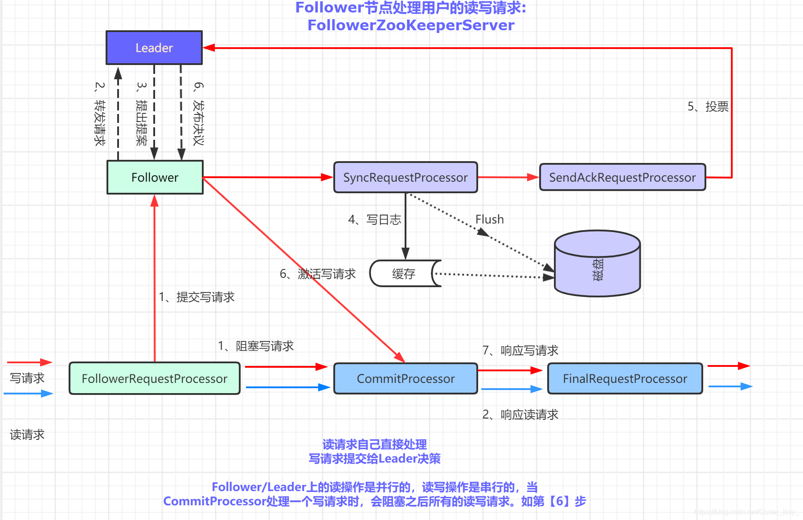

<!-- TOC -->

- [0 线性一致性与顺序一致性](#0-线性一致性与顺序一致性)
- [1 CAP和BASE](#1-cap和base)
- [2 2PC、3PC](#2-2pc3pc)
    - [2.1 2PC](#21-2pc)
    - [2.2 3PC](#22-3pc)
    - [2.3 参考](#23-参考)
    - [2.4 2PC和paxos的关系](#24-2pc和paxos的关系)
- [3 **paxos**](#3-paxos)
- [4 ZK的基本概念、设计目标？](#4-zk的基本概念设计目标)
- [5 **ZK的分布式一致性特性**？](#5-zk的分布式一致性特性)
    - [5.1 单一视图如何保证？](#51-单一视图如何保证)
- [6 **ZAB(ZK Atomic Broadcast ZK原子消息广播协议)协议和Leader选举**](#6-zabzk-atomic-broadcast-zk原子消息广播协议协议和leader选举)
    - [6.0 ZXID](#60-zxid)
    - [6.1 Leader选举](#61-leader选举)
    - [6.2 ZAB协议的任务？](#62-zab协议的任务)
    - [6.3 ZAB两种基本模式](#63-zab两种基本模式)
    - [6.4 理论算法（实际不是这么实现的）](#64-理论算法实际不是这么实现的)
    - [6.4.1 实际实现](#641-实际实现)
    - [6.5 所以ZAB和paxos区别？](#65-所以zab和paxos区别)
- [7 原生客户端和ZKClient区别](#7-原生客户端和zkclient区别)
- [8 ZK的应用？](#8-zk的应用)
    - [8.1 数据发布订阅](#81-数据发布订阅)
    - [8.2 命名服务](#82-命名服务)
    - [8.3 分布式协调通知](#83-分布式协调通知)
        - [8.3.1 Master选举和分布式锁](#831-master选举和分布式锁)
    - [8.4 分布式队列和barrier](#84-分布式队列和barrier)
- [9 ZK的stat对象和版本号？](#9-zk的stat对象和版本号)
- [10 Watcher机制？](#10-watcher机制)
    - [10.1 工作机制](#101-工作机制)
    - [10.2 特性](#102-特性)
- [11 ACL？](#11-acl)
- [12 客户端原理？](#12-客户端原理)
- [13 ZK如何进行会话管理？](#13-zk如何进行会话管理)
- [14 **Leader、Follower、Observer的请求处理过程？**](#14-leaderfollowerobserver的请求处理过程)
    - [14.1 Leader](#141-leader)
    - [14.2 Follower](#142-follower)
    - [14.3 Observer](#143-observer)
- [15 ZK的数据与存储，及数据初始化和同步（启动过程）？](#15-zk的数据与存储及数据初始化和同步启动过程)
    - [15.1 数据与存储](#151-数据与存储)
    - [16.2 初始化和同步](#162-初始化和同步)
    - [16.3 启动过程](#163-启动过程)
- [17 ZK运维（了解）](#17-zk运维了解)
    - [17.1 配置](#171-配置)
    - [17.2 四字命令](#172-四字命令)
    - [17.3 集群高可用](#173-集群高可用)
- [18 raft](#18-raft)
    - [18.1 选举](#181-选举)
    - [18.2 日志同步](#182-日志同步)
    - [18.3 安全性](#183-安全性)
    - [18.4 线性一致性读](#184-线性一致性读)
    - [18.5 和zab的区别](#185-和zab的区别)
- [19 zk恢复的一个问题](#19-zk恢复的一个问题)
- [20 如果没收到过半follower ack，会怎么样？](#20-如果没收到过半follower-ack会怎么样)

<!-- /TOC -->
只要求超过半数，是为了提升可用性，容忍一部分节点异常。

而之所以可以这么做，是由于大多数的性质：两个大多数一定有交集

# 0 线性一致性与顺序一致性
[共识、线性一致性与顺序一致性](https://segmentfault.com/a/1190000022248118)
- 线性一致性（Linearizability）或严格一致性（Strict consistency）：任何对一个内存位置X的读操作，将返回最近一次对该内存位置的写操作所写入的值。
- 顺序一致性（Sequential consistency ）:（并发程序在多处理器上的）任何一次执行结果都相同，就像所有处理器的操作按照某个顺序执行，各个微处理器的操作按照其程序指定的顺序进行。换句话说，**所有的处理器以相同的顺序看到所有的修改**。读操作未必能及时得到此前其他处理器对同一数据的写更新。但是各处理器读到的该数据的不同值的顺序是一致的。
# 1 CAP和BASE

- 强一致性：任意时刻，所有节点中的数据是一样，一个集群如果需要对外部提供强一致性，则只要集群内部某一台服务器的数据发生了改变，那么就需要等待集群内其他服务器的**数据同步完成后**，才能正常的对外提供服务
- 一致性：每次读取都会收到最新的写入或错误响应
- 可用性：每个请求都会收到一个（非错误）响应，但**不能保证它包含最新的写操作**
- 分区容忍：尽管节点之间的网络丢弃（或延迟）了任意数量的消息，但系统仍继续运行
# 2 2PC、3PC
目的：为了保证分布式事务ACID特性的一致性算法

[分布式一致性之两阶段提交协议、三阶提交协议](https://zhuanlan.zhihu.com/p/35616810)
## 2.1 2PC
- 阶段
    - 阶段一：提交事务请求
    - 阶段二：执行事务提交
    ```
            协调者                                              参与者
                                QUERY TO COMMIT
                    -------------------------------->
                                VOTE YES/NO           prepare*/abort*
                    <-------------------------------
    commit*/abort*                COMMIT/ROLLBACK
                    -------------------------------->
                                ACKNOWLEDGMENT        commit*/abort*
                    <--------------------------------  
    end

    "*" 所标记的操作意味着此类操作必须记录在稳固存储上
    ```
- 存在问题：
    - **同步阻塞**：执行过程中，所有参与节点都是事务阻塞型的。当参与者占有公共资源时，其他第三方节点访问公共资源不得不处于阻塞状态。也就是说从投票阶段到提交阶段完成这段时间，资源是被锁住的。
    - 保守：没有容错机制，只能依赖超时，任意一个节点是失败都会导致整个事务的失败回滚
    - 单点故障：由于协调者的重要性，一旦协调者发生故障。参与者会一直阻塞下去。
尤其在第二阶段，协调者发生故障，那么所有的参与者还都处于锁定事务资源的状态中，而无法继续完成事务操作。
    - 数据不一致：在二阶段提交的阶段二中，当协调者向参与者发送commit请求之后，发生了局部网络异常或者在发送commit请求过程中协调者发生了故障，这回导致只有一部分参与者接受到了commit请求。而在这部分参与者接到commit请求之后就会执行commit操作。但是其他部分未接到commit请求的机器则无法执行事务提交。于是整个分布式系统便出现了数据不一致性的现象。
    - 极端情况下事务状态不确定：协调者和唯一接收commit的参与者都挂了，重启后不确定处于什么状态
## 2.2 3PC
- 改善：
    - 引入canCommit阶段主要是为了在预执行之前，保证所有参与者都具备可执行条件，从而**减少锁定时间、资源浪费，避免preCommit做无用功**。
        >假设有1个协调者，9个参与者。其中有一个参与者不具备执行该事务的能力。协调者发出prepare消息之后，其余参与者都将资源锁住，执行事务，写入undo和redo日志。协调者收到相应之后，发现有一个参与者不能参与。所以，又出一个roolback消息。其余8个参与者，又对消息进行回滚。这样子，是不是做了很多无用功？
    - 引入阶段三**参与者**无法接收来自协调者的doCommit或abort请求会等待**超时提交**：减少2PC阻塞问题，并能**在单点故障后继续达成一致**（改善阻塞问题、单点问题、保守问题）
    - （能解决协调者和参与者都挂掉的情况：因为加了canCommit，所以如果在doCommit阶段协调者和一个参与者挂掉，其他参与者会已经知道第一阶段大家都已经决定要通过了，此时便可以直接通过）
- 尚未解决：
    - 参与者超时提交，协调者重新回到网络，带来新的数据不一致问题(协调者收到abort宕机)
    - 阻塞问题、单点问题、数据不一致依然存在
## 2.3 参考
[2PC和3PC中故障情况分析](https://blog.csdn.net/Lnho2015/article/details/78685503)  
## 2.4 2PC和paxos的关系
Paxos协议与分布式事务并不是同一层面的东西：
- Paxos用于解决多个副本之间的一致性问题，比如日志同步，保证各个节点的日志一致性，选主的唯一性。
- 2PC用于保证多个数据分片上事务的原子性
- 两者可以是互补的关系，不是替代关系。对于2PC协调者单点问题，可以利用Paxos协议解决，当协调者出问题时，选一个新的协调者继续提供服务
# 3 **paxos**
- 概念：paxos是一个共识算法（区别于一致性算法）：在一个可能发生异常的分布式系统中，对某个数据的值达成一致  
[Paxos算法详解](https://zhuanlan.zhihu.com/p/31780743)
- 角色：Proposer、Acceptor、Leaner。一个进程可能充当不止一种角色
- 安全性
    - 只有被提出的提案，才能被选定
    - 只能有一个被选定
    - learners 只能获得被选定（chosen）的 value
- 算法内容
    - 通过加强上述约束（主要是第二个）获得了两个约束
    - P1：Acceptor必须接受（Accept）它所收到的第一个Proposal。（为了保证正常运行（必须有值被接受））
        - P1a（包含P1）：Acceptor可以接受（Accept）编号为 n 的提案(Proposal)当且仅当它没有回复过一个具有更大编号的Prepare消息。
    - P2：如果值为v的Proposal被选定（Chosen），则任何被选定（Chosen）的具有更高编号的Proposal值也一定为v
        - P2c（满足P2）：如果[n,v]被提出，那么存在一个由半数以上Acceptor组成的集合S，满足
            - S中不存在 accept 过小于编号n的Acceptor
            - 或S中所有 Acceptor accept 的编号小于n的提案，其中编号最大的值是v
- 提案产生
    - prepare 阶段
        - Proposer：选择一个提案编号n，并将Prepare请求发送给Acceptors中的一个多数派
        - Acceptor：收到Prepare消息后
            - 承诺不再回复小于n的提案
            - 如果n大于它已经回复的所有prepare消息，则Acceptor将**已经accept过的最大编号的提案**回复给Proposer
    - Accept 阶段
        - Proposer：在收到的超过一半Acceptors（另一小半形不成决议）中取编号最大的Proposal的值，发出Accept请求。如果没有这样的值就任意选择
        - Acceptor：P1a：若未对编号大于n的Prepare请求做响应，则接受Proposal
- 活锁  
两个Proposer依次提出编号相互递增的提案
    - 解决方法：主Proposer
- Multi-Paxos
    - Basic Paxos的问题
        - 原始的Paxos算法（Basic Paxos）只能对**一个值**形成决议
        - 决议的形成至少需要**两次网络来回**，在高并发情况下可能需要更多的网络来回，极端情况下甚至可能形成活锁。
        - 因此Basic Paxos几乎只是用来做理论研究，并不直接应用在实际工程中。
    - 改进
        - 在所有Proposers中**执行一次Basic Paxos选举一个Leader**，由Leader唯一地提交Proposal给Acceptors进行表决。这样没有Proposer竞争，**解决了活锁问题**。
        - 在系统中仅有一个Leader进行Value提交的情况下，**Prepare阶段就可以跳过**，从而将两阶段变为一阶段，提高效率。 
    - 如何解决Leader崩溃？
- Fast-Paxos?
- 参考
[2PC到3PC到Paxos到Raft到ISR](https://segmentfault.com/a/1190000004474543)
# 4 ZK的基本概念、设计目标？
- 设计目标
    - **高性能**、高可用、写操作严格顺序性的分布式协调服务
    - 以读操作为主，3台读请求QPS12-13W
- 基本概念
    - 角色：Observer不参与选举和过半写
    - 会话：客户端和服务器之间的TCP长连接
        - 心跳检测
        - 发送请求，接收响应
        - 接受Watch事件通知
    - 节点
        - 持久
        - 临时：会话绑定
    - 版本：ZNode会维护一个Stat
        - version：ZNode版本
        - cversion：子节点版本
        - aversion：ACL版本
    - ACL：CREATE和DELETE针对子节点
    - ZXID：高32位是epoch，低32位自增
# 5 **ZK的分布式一致性特性**？
- **顺序一致性**：见[并发顺序一致性](../Java/并发.md#54-顺序一致性)客户端更新请求按顺序应用
    - 读顺序一致性：读操作不一定能读到最新的数据，但一定是按顺序的。
    - 写线性一致性：写操作是在最新的数据上进行写
- 原子性：更新操作要么成功要么失败，没有中间结果
- 单一视图：无论客户端连接的是哪个服务器，看到的数据一致，不会看到旧的视图
- 可靠性：保证一旦客户端接收到successful return code，则事务变更永久生效；对于返回失败的不保证事务的状态（可能成功或失败）
- 实时性：一定时间后能读到最新的视图，**客户端可以调用sync方法获取最新视图**
## 5.1 单一视图如何保证？
- 客户端每次请求响应，服务端都会将**最新的zxid作为消息头发送**给客户端，客户端会进行保存
- 客户端与服务器断开重连时会**发送本地保存的zxid**，服务端判断如果客户端lastZxid大于服务端zxid（说明服务端数据较老）则拒绝连接
# 6 **ZAB(ZK Atomic Broadcast ZK原子消息广播协议)协议和Leader选举**
## 6.0 ZXID
- 高 32 位是： epoch（纪元），代表着周期，每当选举产生一个新的 Leader 服务器时就会取出其本地日志中最大事务的 ZXID ，解析出 epoch（纪元）值操作加 1作为新的 epoch ，并将低 32 位置零。**可以防止旧Leader活过来后以为自己还是leader，继续广播之前旧提议造成状态不一致问题**，只有当前Leader的提议才会被Follower处理。Leader没有进行选举期间，epoch是一致不会变化的。
- 低 32 位是： counter（计数器），它是一个简单的单调递增的计数器，针对客户端的每个事务请求都会进行加 1 操作。

## 6.1 Leader选举
- 状态变更：选举时非Observer机器为LOOKING状态
- 步骤：
    1. 自增选举轮次
    2. 每个Server 生成(myid,ZXID)投票投自己，并发给集群中所有机器
    3. 每台机器接收其他机器的选票，检验是否是本轮、是否来自LOOKING
    4. 进行选票PK，先比ZXID，再比myid。**如果需要变更**，则更新选票，再向所有机器发送。另外将收到的票及自己更新后的票放入自己的票箱。如果票箱内已存在相同的选票，则直接覆盖
    5. 每次投票后，每台机器会进行计票，判断**是否已有一台机器接收到过半选票**。然后更新状态
- 总结：ZXID越新越有可能成为Leader
## 6.2 ZAB协议的任务？
1. 单一主进程接收并处理所有事务请求，并广播到Follower上
2. 保证顺序一致性：一个全局的变更序列被顺序应用
3. 处理崩溃恢复
## 6.3 ZAB两种基本模式 
消息广播过程类似于一个两阶段提交，但没有中断逻辑，而是加入崩溃恢复过程
- 消息广播：
    - 类似于两阶段提交，但没有中断逻辑，并且采用过半提交
    - 基于具有FIFO特性的TCP协议进行网络通信，保证消息广播过程中消息接收与发送的顺序性。Leader服务器会为每一个Follower服务器分配一个单独队列，并将事务Proposal根据FIFO发送
- 崩溃恢复：**Leader崩溃或者Leader失去和过半Follower联系，进入崩溃恢复**
    - 需要一个高效Leader选举算法
    - 并确保
        1. ZAB协议需要确保那些已经在Leader服务器上commit的事务最终被所有服务器都commit
        2. ZAB协议需要确保丢弃那些只在Leader服务器上被提出的事务
        - 综上Leader选举算法需要选举出拥有最大ZXID的Leader——一定拥有所有已提交的提案
    - 同步过程
        - 将Follower上未提交的事务发送给Follower
        - 对于Follower上应该丢弃的事务：采用ZXID(epoch,计数器)，当一个包含上个周期未提交事务的服务器启动时（没有正在运行的，因为leader是最新zxid的），其epoch不是最新，Leader会要求其回退
## 6.4 理论算法（实际不是这么实现的）
[Zookeeper学习之Zab一致性协议](https://www.cnblogs.com/jing99/p/12723817.html)

主进程周期：启动或者崩溃恢复之后进入
- 选举
- 发现
    - 选定epoch：Follower发送epoch给准Leader，准Leader在过半里面取最大的e'发送给Follower
    - Follower将epoch改为e'，并向准Leader返回ACK，并包含e'和历史事务集合Ie'
    - 选定最新历史事务集合：准Leader接收Ie'后选ZXID最大的（补齐相比Follower多数派缺失的事务）
- 同步
    - 准Leader将e'和Ie'发给Follower（各Follower再补齐相比准Leader缺失的状态）
    - 过半ACK则准Leader提交事务，成为Leader
- 广播：
    - 类似2PC的过程，但只需过半ACK就可以提交
## 6.4.1 实际实现
- 选举：Fast Leader Election（见[6.1 Leader选举](#61-leader选举)）
- 同步：
- 广播
    1. Leader 服务器接收到请求后在进行广播事务 Proposal 之前会为这个事务分配一个 ZXID，再进行广播。
    2. Leader 服务器会为每个 Follower 服务器都各自分配一个单独的队列，然后将需要广播的事务 Proposal 依次放入这些队列中去，并根据 FIFO 策略进行消息的发送。
    3. 每个Follower 服务器在接收到后都会将其以事务日志的形式写入到本地磁盘中，并且在成功写入后返回 Leader 服务器一个 ACK 响应。
    4. 当有超过半数的服务器 ACK 响应后，Leader 就会广播一个 Commit 消息给所有的 Follower 服务器，Follower 接收到后就完成对事务的提交操作。

## 6.5 所以ZAB和paxos区别？
- 为了**加快收敛速度避免活锁**引发的竞争引入了Leader角色，在正常情况下最多只有一个参与者扮演Proposer角色，其他参与者扮演Acceptor，类似multi paxos：在第一轮选举出Leader，在之后选定提案时就可以跳过Prepare阶段
- 崩溃恢复
# 7 原生客户端和ZKClient区别
1. 原生不支持递归创建
2. 原生节点内容只支持字节数组(byte[])
3. 构造时或get时不传入watcher，而是以API级别支持Watcher注册，通过注册事件监听方式进行。且**不是一次性**的，注册一次一直生效。
    - subscribeChildChanges(path,listener)：子节点新增、删除，本节点删除
    - subscribeDataChanges(path,listener)：节点数据变化、删除节点
# 8ZK的应用？
## 8.1 数据发布订阅
- 举例：机器列表、数据库配置
- 适用于：数据量小，运行时动态变化，集群中机器共享、配置一致
## 8.2 命名服务
使用顺序节点生成分布式环境下的全局唯一ID
## 8.3 分布式协调通知
- 热备：通过每台机器创建临时顺序节点，取序号最小。待命状态客户端注册子节点变更Watcher
- 冷备：也是创建临时顺序节点，如果自己不是最小删除节点，遍历下一个任务
- 心跳检测（创建临时节点）、工作进度汇报（创建临时节点并把任务进度写进去）
### 8.3.1 Master选举和分布式锁
- 排它锁：创建临时节点，没获取到锁的注册子节点变更Watcher
- 共享锁
    - 获取锁：
        - 读请求创建临时顺序节点：/shard_lock/R-seq（seq是自带的，并且由父节点维护）
        - 写请求创建临时顺序节点：/shard_lock/W-seq
    - 判断读写顺序
        1. 获取所有节点
        2. 确认自己的顺序
            - 对于读请求：前面的节点都是读，则请求获取锁，否则等待
            - 对于写请求：不是最小序号就等待
        3. 注册Watcher
            - 读请求：向比自己序号小的最后一个写请求节点注册
            - 写请求：向比自己序号小的最后一个节点注册
        4. 接到通知重复1步骤
## 8.4 分布式队列和barrier
- FIFO：创建临时顺序节点，判断自己是否是最小节点，是则执行否则等待，同时向比自己序号小的注册Watcher
- barrier：节点内容赋为目标值，客户端在节点下创建子节点并判断子节点数量是否达到目标值，同时注册子节点变更Watcher
# 9 ZK的stat对象和版本号？

version属性在setData时作为乐观锁实现机制：setData会传入version，不要求传入-1
# 10 Watcher机制？
## 10.1 工作机制
- 客户端注册  
对客户端请求request进行标记为*使用Watcher监听*，保存路径和Watcher映射到ZKWatcherManager.xxxWatches(Map\<String,Set\<Watcher\>>)。发送消息中**不含watcher对象（包含process方法）**，ZK只会把**request和requestHeader**两个属性序列化
- 服务器处理  
    - 存储：在WatcherManager中保存watchTable和watch2Paths两个结构。
    - Watcher触发：先封装为WatchedEvent（KeeperState、EventType、Path），从watchTable中找到Watcher，并从watchTable和watch2Paths中删除（**一次性**），向客户端返回。
- 客户端回调  
EventThread从WatcherManager中取出放到waitting Events队列，再取出进行**串行同步处理**
## 10.2 特性
一次性、客户端串行执行、轻量（没有传递Watcher对象开销低）
# 11 ACL？
- 格式：scheme:id:permission
- 不同scheme格式
	- ip:{ip}:cdrwa
	- digest:username:password(sha-1+BASE64):cdrwa
	- world:anymore:cdrwa
	Super:需要启动是配置属性支持，使用和digest一样
- Permission：CDRWA(admin：ACL设置权限)
# 12 客户端原理？

- 流程：建立TCP连接、建立会话  
- 服务器地址列表先随机再Round-robin
- ClientCnxn：网络I/O
    - Packet：协议层的封装
    - SendThread：维护客户端和服务端会话生命周期，定期心跳ping，如果TCP断开会自动重连
    - EventThread处理Watcher
    - ClientCnxnSocket：通信层
# 13 ZK如何进行会话管理？
会话状态有CONNECTING、CONNECTED、RECONNECTING、RECONNECTED、CLOSE    
- 会话激活：客户端发送请求就会触发一次会话激活，如果**超时时间1/3**内没进行通信，则会发送PING，触发会话激活
- 会话清理：服务端超时检查线程会对已过期会话进行清楚、删除临时节点
- 自动重连：自动从地址列表中选取地址重新连接，但是如果连上后服务端发现已超时会返回SESSION——EXPIRED
# 14 **Leader、Follower、Observer的请求处理过程？**
采用责任链模式
## 14.1 Leader

- PreRequestProcessor：生成事务请求头（**包含ZXID**）
- ProposalRequestProcessor
    - 交给CommitProcessor
    - 对于**事务请求**：创建Proposal提议，发给所有followler，事务投票，交给SyncRequestProcessor进行事务日志记录
- SyncRequestProcessor
    - 记录事务日志
    - 记录快照
- CommitProcessor：对于事务请求：等待Proposal投票直到可提交
- FinalRequestProcessor：创建客户端请求的响应，将事务应用到**内存数据库**，并放入**commitProposal**（保存最近被提交的事务请求，便于进行数据同步）
- LearnerHandler：是ZooKeeper集群中Learner服务器的管理器，主要负责Follower/Observer服务器和Leader服务器之间的一系列**网络通信，包括数据同步、请求转发和Proposal提议的投票**等。Leader服务器中保存了**所有Follower/Observer对应的LearnerHandler**
## 14.2 Follower
- 处理非事务请求；转发事务请求给Leader，并继续走Commit流程
- 参与事务请求投票
- 参与Leader选举投票
  
[Zookeeper核心之 实现细节【Follower的请求处理流程】](https://blog.csdn.net/Coder_Boy_/article/details/109971650)
## 14.3 Observer
处理非事务请求，转发事务请求给Leader。  
- 不同于Leader和Follower之间的**PROPOSAL,ACK,COMMIT**消息，Leader会采用**Inform**消息通知Observer进行事务提交，其中携带了事务请求的内容。
# 15 ZK的数据与存储，及数据初始化和同步（启动过程）？
## 15.1 数据与存储
- ZKDatabase：ZooKeeper 的**内存数据库**，负责管理ZooKeeper 的所有会话、DataTree 存储和事务日志。ZKDatabase 会定时向磁盘dump 快照数据，同时在ZooKeeper 服务器启动的时候，会通过磁盘上的事务日志和快照数据文件恢复成一个完整的内存数据库。
    - DataTree
	    - **nodes**：ConcurrentHashMap<String,DataNode>
            - DataNode
                - data[]
                - acl
                - stat
                - parent引用
	            - children列表
	    - dataWatches
	    - childWatches
	    - ephemerals：ConcurrentHashMap<String,DataNode>
- 事务日志
- snapshot：在配置次事务日志记录后进行一次数据快照
## 16.2 初始化和同步
- 初始化：从快照文件中加载快照数据，并根据事务日志进行数据订正
- **过半**同步：完成Leader选举后，Learner向Leader注册后进行数据同步  
    - 主要依赖上文提到的**commitProposals**，根据Learner的ZXID是否处于commitProposals队列中，进行DIFF,TRUNC+DIFF,TRUNC,SNAP 4种方式的同步
## 16.3 启动过程
先创建ZkDataBase，然后恢复本地数据（**初始化**），然后**Leader选举**，最后**同步**
# 17 ZK运维（了解）
## 17.1 配置
- 基本配置
	**clientPort**、dataDir、tickTime（最小时间单元）
- 高级配置
	- dataLogdir：最好单独硬盘
	- server.id=host:**port:port**
		- 和leader通信和数据同步
		- leader选举
	- forceSync：事务提交强制刷盘
	- leaderServes：不接受客户端连接
## 17.2 四字命令
- 使用方式：nc、telnet  

## 17.3 集群高可用
奇数台容灾能力和多一台一样（过半存活即可用）。搭建一个允许F台机器宕掉的集群，需要部署2F+1台。


https://juejin.cn/post/6844904002962849799

# 18 raft
[Raft](https://zh.wikipedia.org/wiki/Raft)  
[一文搞懂Raft算法](https://www.cnblogs.com/xybaby/p/10124083.html)  
[Raft算法详解](https://zhuanlan.zhihu.com/p/32052223)
[raft算法与paxos算法相比有什么优势，使用场景有什么差异？](https://www.zhihu.com/question/36648084)

Raft是一种用于替代Paxos的共识算法。相比于Paxos，Raft的目标是提供更清晰的逻辑分工使得算法本身能被更好地理解，同时它安全性更高，并能提供一些额外的特性。Raft能为在计算机集**群之间部署有限状态机**提供一种通用方法，并确保集群内的任意节点在某种状态转换上保持一致。Raft这一名字来源于"Reliable, Replicated, Redundant, And Fault-Tolerant"（“可靠、可复制、可冗余、可容错”）的首字母缩写。
- 角色
    - Leader：接受客户端请求，并向Follower同步请求日志，当日志同步到大多数节点上后告诉Follower提交日志。
    - Follower：接受并持久化Leader同步的日志，在Leader告之日志可以提交之后，提交日志。
    - Candidate：Leader选举过程中的临时角色。
- Raft将问题拆成数个子问题分开解决
    - Leader选举（Leader election）
    - 日志同步（Log replication）
    - 安全性（Safety）
    - 日志压缩（Log compaction）
    - 成员变更（Membership change）等。同时，Raft算法使用了更强的假设来减少了需要考虑的状态，使之变的易于理解和实现。
## 18.1 选举
1. 在启动或leader断线的时候，就需要选举出新的领袖。
2. 增加节点本地的 current term ，切换到candidate状态
3. 投自己一票
4. 并行给其他节点发送 RequestVote RPCs
5. 等待其他节点的回复

在这个过程中，根据来自其他节点的消息，可能出现三种结果
1. 收到majority的投票（含自己的一票），则赢得选举，成为leader，给所有节点发消息，避免其余节点触发新的选举
2. 被告知别人已当选，那么自行切换到follower
3. 一段时间内没有收到majority投票，则保持candidate状态，重新发出下一任期选举

在这里，先回到投票者的视角，投票者如何决定是否给一个选举请求投票呢，有以下约束：
1. 在任一任期内，单个节点最多只能投一票
2. 候选人知道的信息不能比自己的少，比较term，log index
3. first-come-first-served 先来先得
## 18.2 日志同步
1. leader 记录 log entry
2. leader issue AppendEntries **RPC** in parallel
3. leader 等待 **多数回复**
4. leader 应用日志 entry 到状态机
5. leader 回复 client
6. leader 通知 follower 应用日志到状态机

某些Followers可能没有成功的复制日志，Leader会无限的重试 AppendEntries RPC直到所有的Followers最终存储了所有的日志条目。

日志上有index和term


当领袖死机时，领袖的某些新指令可能还没复写到集群整体，造成集群的记录处于不一致的状态。新领袖会担起重返一致的责任，让每个追随者的记录都和它的一致，做法是：和每个追随者比对记录，**找出两者一致的最后一笔指令**，删除追随者之后的指令，把自己之后的指令拷贝给追随者。这个机制完成时，每个服务器的记录就会一致。
## 18.3 安全性
- 选举安全性(Election safety)：每个任期最多只能选出一个领袖。
    - 一个节点某一任期内最多只能投一票；
    - 只有获得majority投票的节点才会成为leader。
- 领袖附加性(Leader append-only)：领袖只会把新指令附加（append）在记录尾端，不会改写或删除已有指令。
- **记录符合性**(Log matching)：如果某个指令在两个记录中的任期和指令序号一样，则保证序号较小的指令也完全一样。
    1. 如果不同日志中的两个条目有着相同的索引和任期号，则它们所存储的命令是相同的。
        -  第一条特性源于Leader在一个term内在给定的一个log index最多创建一条日志条目，且是append-only。
    2. 如果不同日志中的两个条目有着相同的索引和任期号，则它们之前的所有条目都是完全一样的。
        - 第二条特性源于 AppendEntries 的一个简单的**一致性检查**（consistency check）。当发送一个 AppendEntries RPC 时，Leader在AppendEntries中包含**最新log entry之前的一个log 的term和index**。如果Follower没有在它的日志中找到log index和term都相同的日志，它就会拒绝新的日志条目。
- 领袖完整性(Leader completeness)：如果一个log entry在某个任期被提交（committed），那么这条日志一定会出现在所有更高term的leader的日志里面。
    - 通过多数当选leader和日志多数提交保证
- **状态机安全性**(State machine safety)：如果某服务器在其状态机上执行了某个指令，其他服务器保证不会在同个状态上执行不同的指令。
    - Leader只能推进commit index来提交当前term的已经复制到大多数服务器上的日志，旧term日志的提交要等到提交当前term的日志来间接提交（log index 小于 commit index的日志被间接提交）。
        
        > 在阶段a，term为2，S1是Leader，且S1写入日志（term, index）为(2, 2)，并且日志被同步写入了S2
        
        > 在阶段b，S1离线，触发一次新的选主，此时S5被选为新的Leader，此时系统term为3，且写入了日志（term, index）为（3， 2）
        
        > S5尚未将日志推送到Followers就离线了，进而触发了一次新的选主，而之前离线的S1经过重新上线后被选中变成Leader，此时系统term为4，此时S1会将自己的日志同步到Followers，按照上图就是将日志（2， 2）同步到了S3，而此时由于该日志已经被同步到了多数节点（S1, S2, S3），因此，此时日志（2，2）可以被提交了。 
        
        > 在阶段d，S1又下线了，触发一次选主，而S5有可能被选为新的Leader（这是因为S5可以满足作为主的一切条件：1. term = 5 > 4，2. 最新的日志为（3，2），比大多数节点（如S2/S3/S4的日志都新），然后S5会将自己的日志更新到Followers，于是S2、S3中已经被提交的日志（2，2）被截断了。  
        
        > 增加上述限制后，即使日志（2，2）已经被大多数节点（S1、S2、S3）确认了，但是它不能被提交，因为它是来自之前term（2）的日志，直到S1在当前term（4）产生的日志（4， 4）被大多数Followers确认，S1方可提交日志（4，4）这条日志，当然，根据Raft定义，（4，4）之前的所有日志也会被提交。此时即使S1再下线，重新选主时S5不可能成为Leader，因为它没有包含大多数节点已经拥有的日志（4，4）。
## 18.4 线性一致性读
[用人话讲解Raft算法](https://kstack.corp.kuaishou.com/article/6126)
在发生网络分区时，上一轮的leader可能读不到最新数据
- leader需要check自己是否过时了，办法就是与大多数节点通信一次，这个可能会出现效率问题。
- 另一种方式是使用lease，但这就会依赖物理时钟。leader使用一个比心跳超时小的时间作为租期，在心跳得到多数follower响应后刷新租期。只要租期没有到，那它可以认为自己还是leader

## 18.5 和zab的区别
[Raft 对比 ZAB 协议](https://my.oschina.net/pingpangkuangmo/blog/782702)
1. zab选举时会更新选票再投出去，raft是一张选票、先到先得
2. ZAB通过TCP来保证操作的顺序性。Raft协议通过Log Entry 加自己的校验来实现日志的连续性。
3. 上一轮次的 leader 的残留的数据怎么处理？  
    首先看下上一轮次的 leader 在挂或者失去 leader 位置之前，会有哪些数据？
    - 已过半复制的日志
    - 未过半复制的日志
    
    一个日志是否被过半复制，是否被提交，**这些信息是由 leader 才能知晓的**，那么下一个 leader 该如何来判定这些日志呢？  
    下面分别来看看 Raft 和 ZooKeeper 的处理策略：
    - Raft：对于之前 term 的过半或未过半复制的日志采取的是保守的策略，全部判定为未提交，只有当当前 term 的日志过半了，才会顺便将之前 term 的日志进行提交。（要么不提交，要么一起提交？）
    - ZooKeeper：采取激进的策略，**对于所有过半还是未过半的日志都判定为提交，都将其应用到状态机中**
    
    Raft 的保守策略更多是因为 Raft 在 leader 选举完成之后，没有同步更新过程来保持和 leader 一致（在可以对外处理请求之前的这一同步过程）。而 ZooKeeper 是有该过程的
4. 原始raft的follower读请求也会转发到leader，所以是强一致

# 19 zk恢复的一个问题
[zk切主时的事务恢复](https://wangjunfei.com/2020/02/26/%E4%B8%80%E8%87%B4%E6%80%A7%E7%AE%97%E6%B3%95%E7%A0%94%E7%A9%B6-%E4%BA%8C-ZooKeeper-ZAB%E5%8D%8F%E8%AE%AE/)
如果事务在leader宕机前，proposal没有广播到达具有法定人数的servers上，那么这个条事务**有可能最终被提交，也有可能被丢失**，取决于广播到的server是否会参与新的leader选举。但这条事务因为没有达到法定人数的ack，所以leader还是**返回给客户端请求处理失败的**。

[zookeeper，崩溃恢复协议的疑问?](https://www.zhihu.com/question/62623970)

假设leader发出了proposal并有一个follower接收到了这个proposal，但这时leader挂掉了，其他follower没有收到这个proposal（这个时候仍有一半以上机器正常工作），那么这个follower可以用这个proposal选举leader吗？
- 场景1：仅Leader服务器挂了，则接受到Proposal的Follower服务器可以正常参选，且在其成为新Leader后，会将未完成的Proposal继续完成。
- 场景2：Leader服务器和接受到的Follower都挂了。则该Proposal则会被抛弃。即使在其恢复后重新加了集群，仍然会被丢弃，因其ZXID小于当前新Leader发出的ZXID，在数据恢复阶段，已经被回退。

# 20 如果没收到过半follower ack，会怎么样？
[zookeeper 发出的proposal后没有接受到超过一半的ack会怎么样？](https://www.zhihu.com/question/376354635)
如果是因为follower拒绝，那leader自己就会step down，说明该leader不是有效的leader了，需要重新选主。

两种可能
1. 废弃：新的leader上没有这个proposal的日志，那么自然也不会提交
2. 提交：新的leader如果有该proposal的日志，就会努力提交。