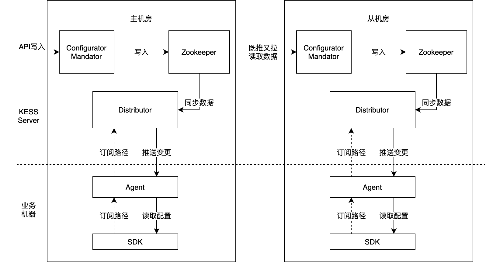
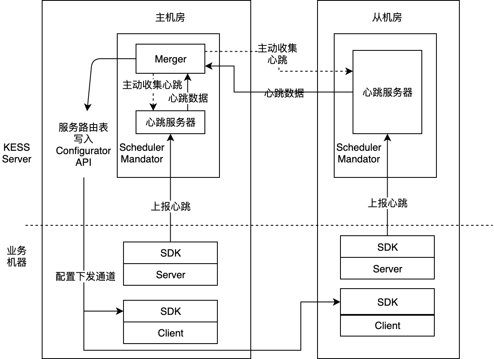
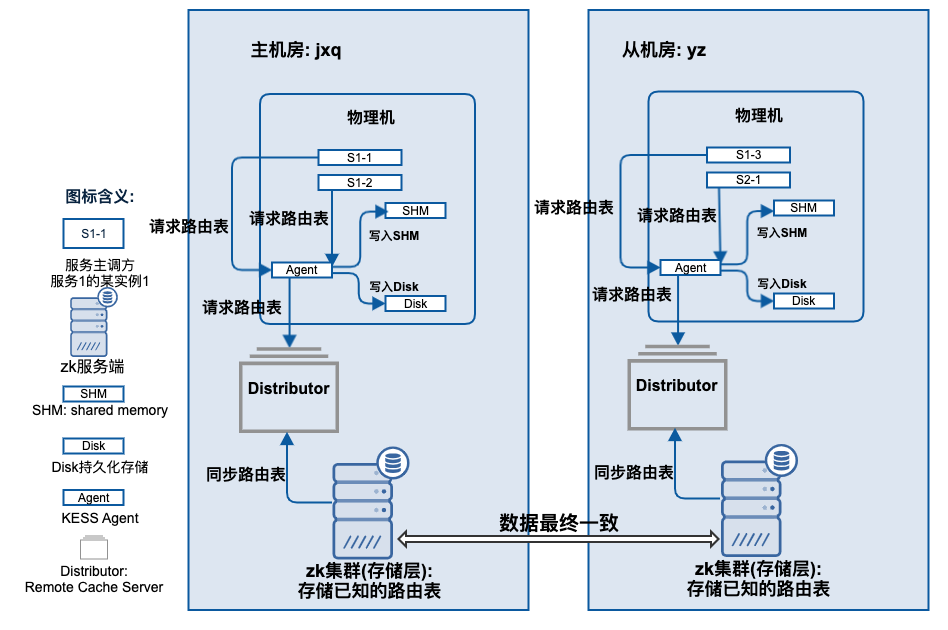
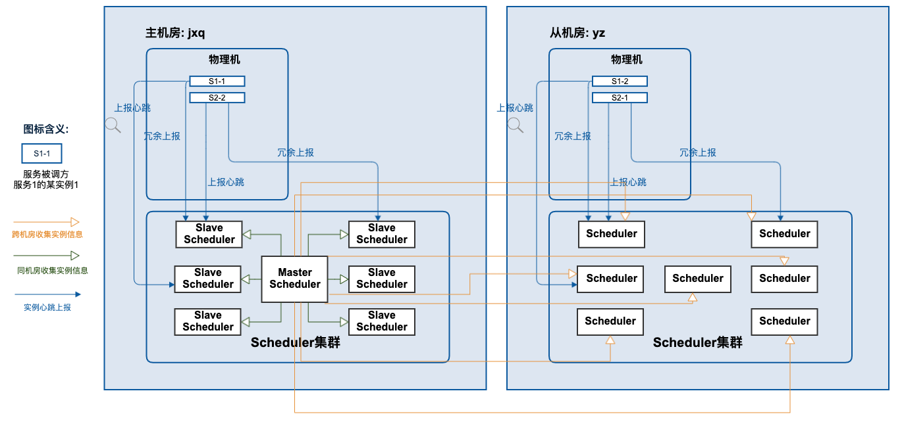
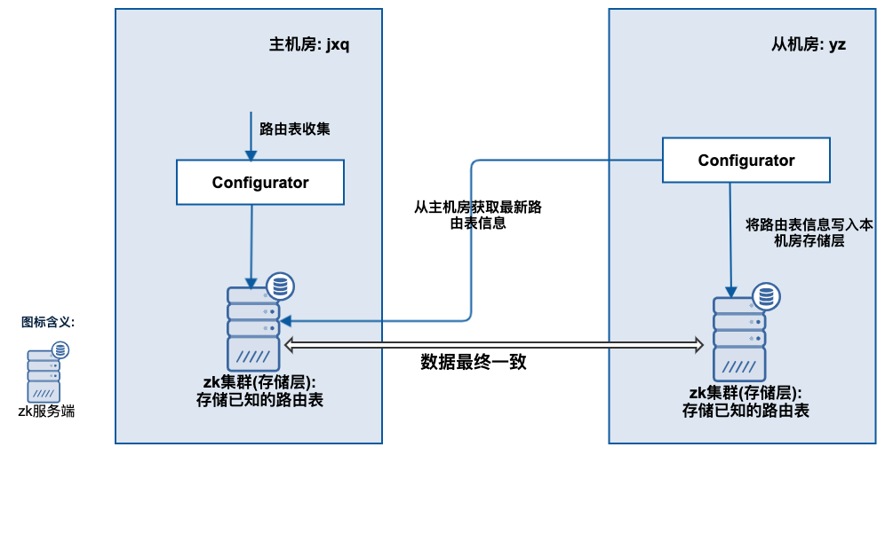

kess
服务发现系统，最好是AP（不一致可以通过主调方fail-over解决）
<!-- TOC -->

- [1 整体架构](#1-整体架构)
    - [1.1 整体架构](#11-整体架构)
    - [1.2 配置下发架构](#12-配置下发架构)
    - [1.3 服务发现架构](#13-服务发现架构)
- [2 下发：快速、准确、稳定的收集下发路由表](#2-下发快速准确稳定的收集下发路由表)
- [3 收集](#3-收集)
- [4 同步](#4-同步)
- [10 负载均衡](#10-负载均衡)
    - [10.1 权重随机](#101-权重随机)
    - [10.2 HRW](#102-hrw)
    - [10.2 HRW](#102-hrw)
    - [10.3 本地优先](#103-本地优先)

<!-- /TOC -->
# 1 整体架构
## 1.1 整体架构
- 服务发现层：服务发现层（Scheduler）包含在每个机房部署的一组Scheduler Mandator和运行在业务进程中的SDK
- 配置下发层：配置下发层（Configurator）包含在每个机房部署的一组Configurator Mandator 和 Distributor，运行在业务机器上的Agent，以及SDK
- 
## 1.2 配置下发架构
- 主机房：KESS定义的中心机房，配置总是从主机房写入。
- 从机房：从机房从主机房同步数据。
- Configurator Mandator：配置分发的核心组件。主机房Mandator，处理API的写入；从机房Mandator从Zookeeper中既推又拉地读取配置，将变更写入自己机房的ZK集群。
- Zookeeper：每个机房部署一个独立集群，用于配置的存储、变更时发送机房间推送事件。每个机房都存有全量配置数据。
- Distributor：ZK数据的内存Cache。
- Agent：运行在每台业务机器上，从Distributor订阅数据，将配置写入文件系统缓存下来。
- SDK：向Agent订阅需要的数据，用轮询的方式从文件系统缓存中获取需要的配置。
- 
## 1.3 服务发现架构
- 
- Scheduler Mandator：服务发现的核心组件。它作为心跳服务器收集服务端SDK上报的心跳。对于主机房的mandator，还会收集各机房的心跳数据，整合成一个完整的路由表。这个路由表写入配置下发层进行下发。
# 2 下发：快速、准确、稳定的收集下发路由表
- 存储层：zk（zk集群扩容不方便）
- 降低请求量：
    - agent（每个物理机一个）
    - distribution（每个机房7个，为了方便扩容，zk不好扩容：单集群规模上限不超过300（实际只能达到250左右，这与ZooKeeper内部的myid等机制有关），否则同步性能会急剧恶化。参考 [美团命名服务的挑战与演进](https://tech.meituan.com/2020/05/14/octo-mns-2.0.html)）
- 快速：agent和distribution既推又拉
- 准确：物理机memory和disk原子更新
- 稳定：
    - 容量冗余：目前五万个物理机仅需要两个Distributor就可以抗住下发压力，Distributor总数是7个，因此distributor是冗余的。
    - 自动切换：另外Agent和Distributor有心跳检测。当Agent判断当前Distributor无法正常工作（机器挂掉/进程死掉等），Agent会自动切换到下一个可用的distributor上。
- 
# 3 收集
- sdk上报给scheduler，每个机房7个，所以每个scheduler只有局部信息。scheduler集群定义一个主scheduler，去收集其他scheduler，生成一个全局路由表
    - 稳定：每个sdk上报两个scheduler，双保险
    - 准确：**如果sdk和scheduler心跳不通，判断agent和scheduler心跳**，如果也不通，摘掉服务，否则不处理，避免kess故障导致大面积下线，由主调方fail-over降低已下线服务权重解决。另外还有主动反注册摘除
    - 快速生成路由表：5*3000？
        - 5s超时：防止大路由表同步失败
        - 3次超时熔断超时设置为100ms：防止出现网络问题或者scheduler故障导致故障扩散
        - 10次成功调回5s：自动恢复
- 
# 4 同步
- scheduler将路由表通过Configurator写入主机房zk
- 从机房Configurator采用既推又拉的方式从存储层内不断的获取主机房的路由表
- 每个机房7个configurator，zk选主
- 

为啥要用zk呢？只是作为存储用还是有用zk的通知、临时节点这些功能
(为什么scheduler直接和服务交互而不是agent)？
服务从注册、反注册，必须生成新的全局路由表才会被发现吗，这个过程多久？
网络分区怎么选主？
存储的是啥？全局路由表是唯一的吗？

# 10 负载均衡
## 10.1 权重随机
```java
protected ProviderInfo doSelect(KrpcRequest request, List<ProviderInfo> providerInfos) throws KrpcRequestException {

    int totalWeight = providerInfos.stream()
            .mapToInt(ProviderInfo::getWeight)
            .sum();

    int size = providerInfos.size();

    int random = ThreadLocalRandom.current().nextInt(totalWeight);
    for (int i = 0; i < size; i++) {
        ProviderInfo providerInfo = providerInfos.get(i);
        int weight = getWeight(providerInfo);
        random -= weight;
        if (random < 0) {
            return providerInfo;
        }
    }
    return null;
}

```
## 10.2 HRW
## 10.3 本地优先
