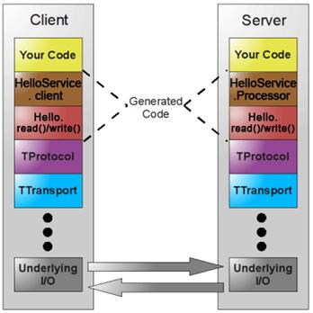

<!-- TOC -->

- [1Thrift架构](#1thrift架构)
- [2Thrift Hello World!](#2thrift-hello-world)
    - [2.1客户端](#21客户端)
    - [2.2服务端](#22服务端)
- [3 传输层](#3-传输层)
- [4协议层](#4协议层)
- [5处理层（IDL生成）](#5处理层idl生成)
    - [5.1Client](#51client)
    - [5.2Processor](#52processor)
    - [5.3方法名_args和方法名_result](#53方法名_args和方法名_result)
- [6服务层](#6服务层)
    - [6.1阻塞](#61阻塞)
    - [6.2非阻塞](#62非阻塞)
    - [6.3FrameBuffer](#63framebuffer)
- [7IDL文件](#7idl文件)
- [8在公司的使用](#8在公司的使用)
    - [8.1 服务端](#81-服务端)
    - [8.2 客户端](#82-客户端)

<!-- /TOC -->
# 1Thrift架构
[Thrift network stack](https://thrift.apache.org/docs/concepts.html)  
  
由下到上：
底下两层下是Thrift框架的源码
- 传输层(Transport Layer)：传输层负责直接从网络中读取和写入数据，封装了Java Socket
- 协议层(Protocol Layer)：协议层定义了各种数据如何进行编解码，序列化和反序列化；比如说JSON、XML、二进制数据等
---
IDL生成
- 处理层(Processor Layer)：处理层是由具体的IDL生成的，封装了具体的底层网络传输和序列化方式，并委托给用户实现的Handler进行处理
    - IDL生成对象的序列化和反序列化write/read方法，read()负责根据协议从字节流中解析调用的函数名，参数等，比如方法HelloService.helloString_args#read,write()则相反  
    - Cilent：编码，通过网络发送；接收返回结果，解码
    - Processor：封装了从输入流读取数据和向输出流写入数据的能力。输入和输出流由TProtocol对象表示。  
    本质上从网络读取数据(使用输入协议)，将处理委托给处理程序(由用户实现)，并通过网络写入响应(使用输出协议)
---
- 服务层(Server Layer)：整合上述组件：
    - 创建transport
    - 为transport创建input/output protocols 
    - 基于protocols 创建processor 
    - 等待传入的连接并将它们交给processor
- 业务层：HelloService实现类
# 2Thrift Hello World!
## 2.1客户端
```java
TSocket socket = new TSocket("127.0.0.1", 9090);
socket.setTimeout(3000);
TTransport transport = new TFramedTransport(socket);
TProtocol protocol = new TCompactProtocol(transport);
transport.open();
System.out.println("Connected to Thrfit Server");

DemoService.Client client = new DemoService.Client.Factory()
        .getClient(protocol);
String result = client.sayHi("ITer_ZC");
System.out.println(result);
```
## 2.2服务端
```JAVA
TNonblockingServerSocket socket;
try {
    socket = new TNonblockingServerSocket(9090);
    TNonblockingServer.Args options = new TNonblockingServer.Args(socket);
    TProcessor processor = new DemoService.Processor<Iface>(new DemoServiceImpl());
    options.processor(processor);
    options.protocolFactory(new TCompactProtocol.Factory());
    TServer server = new TNonblockingServer(options);
    System.out.println("Thrift Server is running at 9090 port");
    server.serve();
} catch (Exception e) {
}
```
# 3 传输层
传输层负责直接从网络中读取和写入数据，封装了Java Socket  
- 节点流
    - 网络相关封装：简化使用
        - TSocket：封装了Socket，继承自TIOStreamTransport
        - TNonblockingSocket：封装了SocketChannel
        - TServerSocket
        - TNonblockingServerSocket
- 处理流
    - **TFramedTransport：**
        - 封装了**TMemoryInputTransport**做输入流，封装了**TByteArrayOutputStream**做输出流
        - TFramedTransport的flush方法，会先写**4个字节的输出流的长度**作为消息头，然后写消息体。和FrameBuffer的读消息对应起来。FrameBuffer读消息时，先读4个字节的长度，再读消息体
        - **持有网络流**
    - TFastFramedTransport：内存利用率更高的一个内存读写缓存区，它使用自动增长的byte，而不是每次都new一个byte[]，提高了内存的使用率  
    - 这两个Transport在写完消息flush的时候，会加上4字节表示长度的消息头，读消息是会先读4字节表示长度的消息头
# 4协议层
协议层定义了各种数据如何进行编解码，序列化和反序列化；比如说JSON、XML、二进制数据等
- TProtocol接口
    - 聚合TTransport对象
    - 定义一系列读写消息的编解码接口，包括两类
        - 一类是复杂数据结构比如readMessageBegin,readMessageEnd, writeMessageBegin, writMessageEnd...Struct,Field...
        - 还有一类是基本数据结构，比如readI32,writeI32, readString, writeString
- writeMessageBegin：
    - TMessage
        - name
        - type：CALL,REPLY,EXCEPTION,ONEWAY
        - seqid
- 服务器端如何知道客户端发送过来的数据是怎么组合？  
IDL生成生成的客户端写参数的方法和服务端读参数的方法一一对应
- 实现
    - **TBinaryProtocol**：二进制编码格式进行数据传输
    - TCompactProtocol：高效率的、密集的二进制编码格式进行数据传输
    - TJSONProtocol：使用JSON文本的数据编码协议进行数据传输
# 5处理层（IDL生成）
## 5.1Client
- 提供工厂方法创建Client对象，传入TProtocol
- 生成的调用代码：
    ```java
    public com.xiaomi.miui.ad.thrift.model.AdResultInfo getGameAds(com.xiaomi.miui.ad.thrift.model.ClientInfoV3 clientInfoV3) throws TException {
        send_getGameAds(clientInfoV3);
        return recv_getGameAds();
    }

    public void send_getGameAds(com.xiaomi.miui.ad.thrift.model.ClientInfoV3 clientInfoV3) throws TException {
        oprot_.writeMessageBegin(new TMessage("getGameAds", TMessageType.CALL, ++seqid_));

        getGameAds_args args = new getGameAds_args();
        args.setClientInfoV3(clientInfoV3);
        args.write(oprot_);

        oprot_.writeMessageEnd();
        oprot_.getTransport().flush();
    }
    ```
## 5.2Processor
封装了从输入流读取数据和向输出流写入数据的能力。输入和输出流由TProtocol对象表示。  
本质上从网络读取数据(使用输入协议)，将处理委托给处理程序(由用户实现)，并通过网络写入响应(使用输出协议)
- 构造函数内，接受Iface对象为成员变量（个性化逻辑），创建processMap（方法名称和方法对象ProcessFunction的映射）
    ```Java
    public Processor(Iface iface)
    {
        super(iface);
        iface_ = iface;
        processMap_.put("getGameAds", new getGameAds());
    }
    ```
- 继承TBaseProcessor（通用逻辑）
    - 实现TProcessor，有process方法，参数是输入流和输出流
    - 提供process方法默认实现：
        - 读消息头，得到**方法名**
        - 从processMap中根据**方法名**取**ProcessFunction**对象
        - 调用process方法
- 内部类getGameAds实现ProcessFunction（个性化逻辑）：
    - process方法
        - 调用args.read
        - iface_.getGameAds(args.clientInfoV3);
        - result.write
## 5.3方法名_args和方法名_result
- 实现TBase接口，定义read(TProtocol)、write(TProtocol)编解码方法
    ```java
    public void read(TProtocol iprot) throws TException {
        TField field;
        iprot.readStructBegin();
        while (true){
            field = iprot.readFieldBegin();
            if (field.type == TType.STOP) { 
                break;
            }
            switch (field.id) {
                case 1: // CLIENT_INFO_V3
                if (field.type == TType.STRUCT) {
                    this.clientInfoV3 = new com.xiaomi.miui.ad.thrift.model.ClientInfoV3();
                    this.clientInfoV3.read(iprot);
                } else { 
                    TProtocolUtil.skip(iprot, field.type);
                }
                break;
                default:
                TProtocolUtil.skip(iprot, field.type);
            }
            iprot.readFieldEnd();
        }
        iprot.readStructEnd();
        validate();
    }
    ```
- 定义每个参数的元数据
    - 参数类型：TType
    - 顺序号：TField.id
    ```java
    private static final TField CLIENT_INFO_V3_FIELD_DESC = new TField("clientInfoV3", TType.STRUCT, (short)1);
    ```
# 6服务层
- 构造
    ```java
    protected TServer(TProcessorFactory processorFactory,
                        TServerTransport serverTransport,
                        TTransportFactory inputTransportFactory,
                        TTransportFactory outputTransportFactory,
                        TProtocolFactory inputProtocolFactory,
                        TProtocolFactory outputProtocolFactory) {
        processorFactory_ = processorFactory;
        serverTransport_ = serverTransport;
        inputTransportFactory_ = inputTransportFactory;
        outputTransportFactory_ = outputTransportFactory;
        inputProtocolFactory_ = inputProtocolFactory;
        outputProtocolFactory_ = outputProtocolFactory;
    }
    ```
## 6.1阻塞
- TThreadPoolServer：关联一个TServerSocket，采用阻塞IO的方式来Accept，然后交给一个线程池来处理后续动作
- TSimpleServer：单线程阻塞式I/O 
## 6.2非阻塞
- TNonblockingServer  
单Reactor单线程
- THsHaServer  
单Reactor多线程，IO事件都在主线程进行，方法调用在线程池中进行  
- TThreadSelectorServer  
多Reactor多线程：
    - 采用了一个**AcceptorThread**来Accept，将SocketChannel放到**SelectorThread**的阻塞队列**acceptedQueue**中
    - 每个SelectorThread绑定一个Selector，循从acceptedQueue中拿新创建好的SocketChannel，来处理读写事件和方法调用
## 6.3FrameBuffer
- 通过SelectionKey.attachment()与key绑定，并将key作为成员变量
- 维护了一个FrameBufferState表示读写和方法调用的状态，并且根据此状态修改SelectionKey的读写状态
- 拥有read()和write()进行真正的IO读写，写入一个自身维护的buffer
- invoke()方法中会调用processor的process方法，在read()方法读完时会进行调用
# 7IDL文件
- namespace　定义包名
- struct　定义服务接口的**参数、返回值使用到的类结构**。如果接口的参数都是基本类型，则不需要定义struct
- service　定义接口
    ```thrift
    namespace java com.thrift.test

    struct Parameter{
        1: required i32 id;
        2: required string name;
    }

    service DemoService{
        i32 demoMethod(1:string param1, 2:Parameter param2, 3:map<string,string> param3);
    }
    ```
- 数据类型
    - bool 
    - byte 8位整数
    - i16  16位整数
    - i32  32位整数
    - i64  64位整数
    - double 双精度浮点数
    - string 字符串
    - binary 字节数组
    - list\<i16\> List集合，必须指明泛型
    - map\<string, string\> Map类型，必须指明泛型
    - set\<i32\> Set集合，必须指明泛型
    - exception
# 8在公司的使用
## 8.1 服务端
- 对processor进行动态代理，增加了counter功能
- 工作线程数量：workerThreads=1000
- 工作线程池：CustomizeThreadPoolExecutor(增加监控)
- THsHaServer：0.8版本才支持TThreadedSelectorServer
- 关闭钩子：删除zk node、关闭服务、socket
- 注册zk
    - 同步方法
    - 创建临时节点，并由定时任务每隔一段时间创建一次
    - 注册关闭钩子：
        - 关闭上一步创建的定时任务
        - 删除临时节点
## 8.2 客户端
[Thrift RPC优化](https://wiki.n.miui.com/pages/viewpage.action?pageId=31638391)  
- 每个服务有一个client 对象池
    - 第一次调用时，会创建一个EndpointPool：获取ZK上该服务的所有节点的endpoint信息（node, host, port, weight, startTime, version, group, partitionGroup），生成EndpointPool。
        - 注册pool节点和子节点的监听
        - 并定时拉取pool节点防止ZK通知丢失
    - 每次调用会根据endpoint从对象池中borrowObject（如果没有创建）
    - 负载均衡
        - random
        - least active算法：
            - 解决random算法的问题：下游一台机器出问题，因为到这台机器上的请求量并不会少，最终就是pool中的所有连接都会被这台机器抢占的问题
            - 记录每个Endpoint的实时请求数(使用PerfCounter.count，底层使用AtomicLong，请求开始+1，结束-1)
            - 找到实时请求数最小的Endpoint
            - 如果实时请求数相等根据权重取一个
            - 权重相等随机取一个
            ```java
            protected Endpoint chooseEndpoint(List<Endpoint> endpoints) {
                int size = endpoints.size();
                long leastActive = -1;
                int leastCount = 0;
                int[] leastIndexs = new int[size];
                int totalWeight = 0;
                int firstWeight = 0;
                boolean sameWeight = true;
                for (int i = 0; i < size; i++) {
                    Endpoint endpoint = endpoints.get(i);
                    long active = EndpointPerfCounter.getNumRequests(endpoint);
                    int weight = endpoint.getWeight();
                    if (leastActive == -1 || active < leastActive) { // find the least active
                        leastActive = active;
                        leastCount = 1;
                        leastIndexs[0] = i;
                        totalWeight = weight;
                        firstWeight = weight;
                        sameWeight = true;
                    } else if (active == leastActive) { // if have the same active
                        leastIndexs[leastCount++] = i; // record the index
                        totalWeight += weight;
                        if (sameWeight && i > 0 && weight != firstWeight) { // check if they are the same weight
                            sameWeight = false;
                        }
                    }
                }
                if (leastCount == 1) { // only one least active endpoint
                    return endpoints.get(leastIndexs[0]);
                }
                if (!sameWeight && totalWeight > 0) { // if they do not have same weight
                    int offsetWeight = RandomUtils.nextInt(totalWeight);
                    for (int i = 0; i < leastCount; i++) {
                        int leastIndex = leastIndexs[i];
                        offsetWeight -= endpoints.get(leastIndex).getWeight();
                        if (offsetWeight < 0) {
                            return endpoints.get(leastIndex);
                        }
                    }
                }
                return endpoints.get(leastIndexs[RandomUtils.nextInt(leastCount)]); // if they have the same weight
            }
            ```
    - 慢启动预热JVM
- 每一次调用都会通过被套上一个HystrixCommand