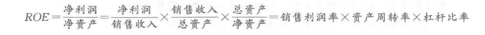
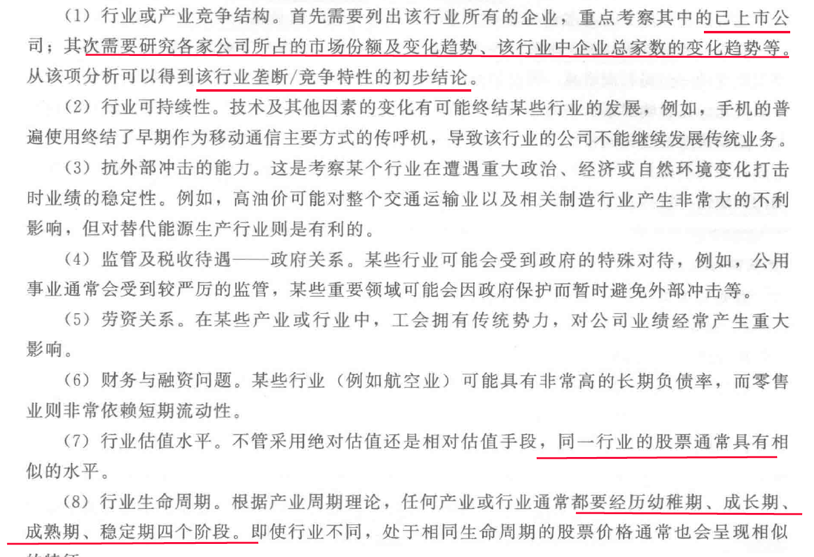
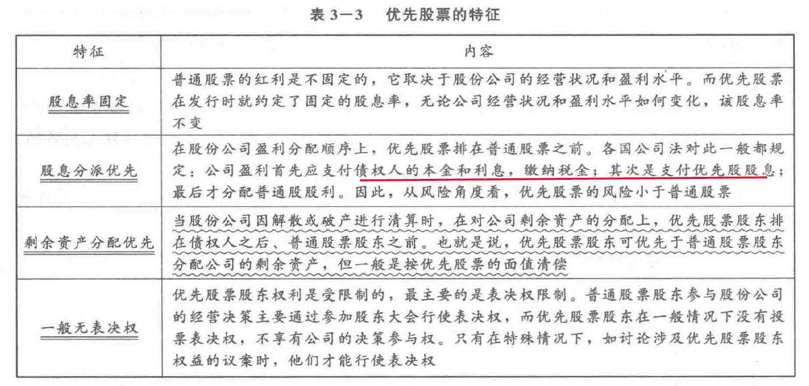

# 1 股票价格
## 1.1 股票的理论价格
股票理论价格是指从理论上来说股票的价格，股票价格应由其价值决定，但**股票本身没有价值**，它之所以有价格是因为它代表着收益的价值，所以股票的价格就是对未来收益的评定，因此，**未来收益的大小决定了股票的价值**。股票的**未来股息收入、资本利得收入是期值**，将期值按市场利率和有效期折算成今天的价值就是股票的现值。股票的现值就是未来收益的当前价值，也是人们为了得到股票的未来收益愿意付出的代价。

>股票理论价格=预期股息率／银行存款利率（[公式推导](https://www.wendangwang.com/doc/2c4642fc270ec6040e93db97)）
## 1.2 影响市场价格变动的因素
1. 公司经营状况
- 公司竞争力：SWOT
- 财务状况
    - 盈利性：每股收益/净资产收益率？
    - 安全性：杠杆比率
    - 流动性：流动比率、速动比率、应收账款平均回收周期、销售周转率
    - 公司改组与合并
    > ROE（净资产收益率）
2. 行业与部门因素

3. 宏观经济与政策因素
- 经济周期循环：高涨、衰退、萧条、复苏
- 货币政策
- 财政政策
    - 通过调整财政支出，改变经济发展状况，改变企业外部环境
    - 调节税率影响企业利润和股息
    - 干预资本市场交易税率：利息税、资本利得税、印花税
    - 国债发行量
- 市场利率：利率是资本的价格，市场利率提高，股票价格下降
    - 利率调高，公司债务利息负担加重，利润和股息减少
    - 资金流向储蓄债券
- 汇率：汇率变化对本国经济发展有利，则股价上升

# 2 普通股和优先股

# 3 IPO
- 公司
    1. 3年持续盈利
    2. 三年财务会计无虚假，无重大违法行为
    3. 所募集资金必须按照招股说明书所列用途使用
- 发行人
    1. 股份有限公司持续经营3年以上，包含由有限责任公司变更前的时间
    2.最近三年主营业务和董事、高级管理人员无重大变化，实际控制人无变更
