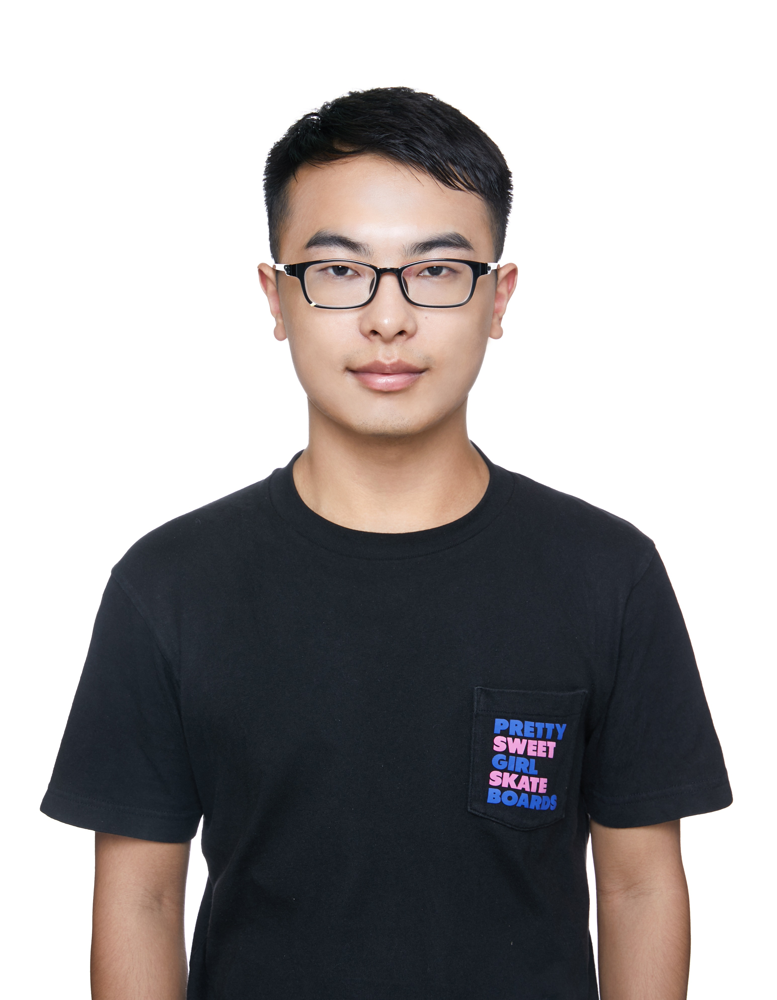

# 个人信息
- 张钊辕/男/1996
- 工作年限：3年
- 期望职位：Java后台开发
- 手机/微信：15600603715
- Email：zhangzhaoyuan123@foxmail.com

# 教育经历
2014.9-2018.7&emsp;&emsp;&emsp;&emsp;本科&emsp;&emsp;&emsp;&emsp;哈尔滨工业大学&emsp;&emsp;&emsp;&emsp;土木工程

# 技术栈
- 熟悉：Java/Spring/SpringBoot/Mysql/Redis/Zookeeper/Thrift/Kafka
- 了解：Spark/Flink

# 工作经历
2019.8-2021.4&emsp;&emsp;&emsp;&emsp;小米商业平台部&emsp;&emsp;&emsp;&emsp;&emsp;&emsp;&emsp;Java工程师

2019.8-2019.8&emsp;&emsp;&emsp;&emsp;跟谁学高途课堂&emsp;&emsp;&emsp;&emsp;&emsp;&emsp;&emsp;Java工程师

2018.7-2019.8&emsp;&emsp;&emsp;&emsp;北京数码视讯&emsp;&emsp;&emsp;&emsp;&emsp;&emsp;&emsp;&emsp;Java工程师

# 项目经历
##  oCPX 广告投放系统开发
- **背景**：
游戏广告需要提升广告收入，而广告主对付费回收考核严格，因此搭建整套oCPX系统，采用oCPX手段进行游戏广告效果的优化
- **承担角色**：
初期参与开发，后期作为游戏oCPX功能Owner
- **解决难点**：
    1. 搭建广告实时归因服务：归因结果用于OLAP和cvr模型训练，形成投放效果优化闭环 (SpringBoot/Kafka/Pegasus/MySql/Druid/Pivot)
    2. 游戏 oCPX 广告 DSP 服务搭建 (Spring/Thrift)
    3. 使用 PID 控制算法稳定广告成本(Redis/Flink)
    4. 先后支持多种广告出价方式，使用策略模式重构出价模块
    5. 搭建策略服务，模型实验和策略实验分层，便于策略组优化 (SpringBoot/Thrift)
## EVE 广告诊断平台
- **背景**：
依托于广告平台的数据能力，提供收入波动根因分析、广告出价诊断、广告素材诊断等功能，集前端、后端、数据处理一体的平台。目的是降低广告销售、运营排查问题的门槛。
- **承担角色**：
负责收入诊断功能数据侧和后台开发
- **解决难点**：
    1. 引入多维度分层下钻分析算法完成广告收入根因分析功能
    2. 解决 Spark 任务数据倾斜问题，保证数据实时性
    3. 解决竞价数据 Flink 作业消费堆积问题
