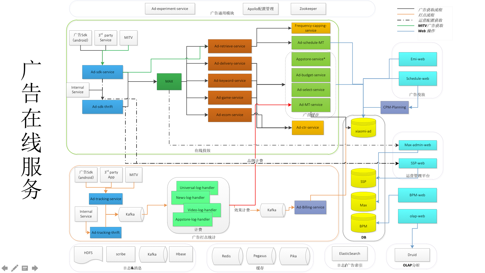
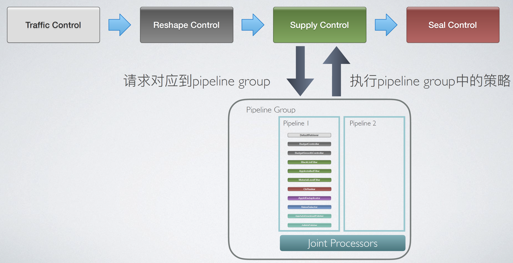
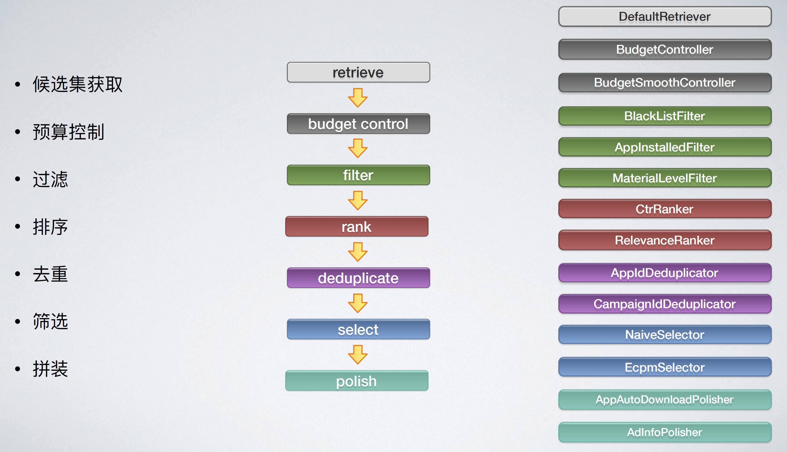

# 1 oCPX 广告投放系统开发
- **背景**：
游戏广告需要提升广告收入，而广告主对付费回收考核严格，因此搭建整套oCPX系统，采用oCPX手段进行游戏广告效果的优化
- **承担角色**：
初期参与开发，后期作为游戏oCPX功能Owner
- **解决难点**：
    1. 搭建实时归因服务：归因结果用于OLAP和cvr模型训练，形成投放效果优化闭环 (SpringBoot/Kafka/Pegasus/MySql/Druid/Pivot)(?QPS?)
    2. 游戏 oCPX 广告 DSP 服务搭建 (Spring/Thrift)(?QPS?)
    3. 使用 PID 控制算法稳定广告成本(Redis/Flink)
    4. 先后支持多种广告出价方式，使用策略模式重构出价模块
    5. 搭建策略服务，模型实验和策略实验分层，便于策略组优化 (SpringBoot/Thrift)（QPS）

---
---
---------
---
---
---
---
---
---
---
---
---


- **成绩**：
    1. 游戏各项实时指标一目了然
    1. 游戏广告先后支持激活、注册、付费、双出价等转化类型的oCPX投放功能，占比从0达到70%，追齐业内领先水平
    2. 

# 1 广告系统架构

- SDK是干啥的？
- 打点线
- 
## 1.1 名词
- MAX: mi ad exchange
- DSP：Demand-Side Platform：广告主通过竞价的方式，购买到产品在互联网“可控的曝光”的机会，广告主可以在这个平台上完成**广告出价、目标受众选定、投放地域设置**等操作
- RTB：RealTime Bidding
- DMP：Data Management Platform：用户画像。DSP在做广告投放的时候，需要用数据来优化投放效果，数据有些自己的，**也可以从DMP获取**。最简单的方式就是DMP对于每一个设备打上标签，DSP在获取从AdExchange来的广告展示请求的时候，同时获取了设备信息和DMP的标签信息，然后通过自己的算法模型来决定出价。
## 1.2 DE设计
### 1.2.1 请求生命周期


都采用策略模式：
```java
Map<MediaType, BaseReshaper> mediaType2ReshaperMap = new HashMap<>();
```
- Traffic：**限流**、请求校验
- Rashape：修改请求：一个广告位变多个广告位；补充请求信息
- Seal：记录log
- Supply：
    ```java
    BrowserRequestContext requestContext = new BrowserRequestContext(serviceContext, clientInfoV3, resourceAccessor);
        PipelineGroup<BrowserRequestContext> pipelineGroup = browserStrategyManager.getPipelineGroup(requestContext);
        List<CommonAd> commonAds = PipelineEngine.getAds(pipelineGroup);
        List<AdInfo> adInfoList = commonAds.stream().map(CommonAd::getAdInfo).collect(Collectors.toList());
    ```
    - BrowserStrategyManager中维护tagId2PipelineCreators，根据请求TagId查找pipelineCreator，构建pipeline，组合成PipelineGroup
### 1.2.2 PipelineEngine
- 线程池
    ```java
    @Slf4j
    @NoArgsConstructor(access = AccessLevel.PRIVATE)
    public class CommonThreadPoolUtil {
        private static final ExecutorService PIPELINE_EXECUTOR_SERVICE = new ThreadPoolExecutor(500, 500, 0L,
                TimeUnit.MILLISECONDS,
                new LinkedBlockingQueue<>(10000),
                new LogRejectPolicy(PipelineEngine.class.getSimpleName()));

        public static void execute(Runnable runnable) {
            PIPELINE_EXECUTOR_SERVICE.execute(runnable);
        }

        public static void execute(Collection<DeliveryRunnable> runnableList, CountDownLatch countDownLatch) {
            runnableList.forEach(PIPELINE_EXECUTOR_SERVICE::execute);
            try {
                countDownLatch.await();
            } catch (InterruptedException e) {
                log.error("pipeline thread interrupted", e);
                // Restore interrupted state.
                Thread.currentThread().interrupt();
            }
        }
    }

    ```
### 1.2.3 SupplyControl

## 1.3 GameOcpa
### 1.3.1 @Conditional
```java
class OnServiceConfigIfAnyCondition implements Condition {
    @Override
    public boolean matches(ConditionContext conditionContext, AnnotatedTypeMetadata annotatedTypeMetadata) {
        Map<String, Object> attributes = annotatedTypeMetadata.getAnnotationAttributes(ConditionalIfAny.class.getName());
        if (attributes == null) {
            throw new IllegalStateException("ConditionalIfAny annotation should be defined");
        }

        ServiceConfig[] serviceConfigs = (ServiceConfig[]) attributes.get("value");
        for (ServiceConfig serviceConfig : serviceConfigs) {
            if (DspDependentUtil.activeServiceConfig() == serviceConfig) {
                return true;
            }
        }

        return false;
    }
}
```
### 1.3.2 改动
- Rannker
- GameOcpaTransferFilter：只过滤出游戏oCPX广告
- GuyuGroup
# 2 oCPX优点？
eCPM：effective cost per mile
把广告推送给了更容易转化的用户，而不仅仅是更容易点击的用户。oCPX的本质就是广告交易市场中的一种**流量分配机制**。这个分配机制**把流量分配给能够让这部分流量价值变高**的用户，使得交易过程涉及到的多方利益得到一个平衡

广告主和平台获得双赢：
- 对于客户，广告曝光给了**更高转化率**人群
- 对于流量方，高转化人群的eCPM更高，从而**流量单价变贵**，广告收入提升

# 3 归因
https://wiki.n.miui.com/pages/viewpage.action?pageId=284448719
## 3.1 服务指标
- miuiads_miui_ad_emi_billing(4 台)
    - 64 Partition
    - QPS 4W
- bid522(激活)(1 台)
    - 8 Partition
    - QPS 1000
- gamesdk_ods_sdk_s_login(登录)
    - 8 Partition
    - QPS 250
- tranquility 1台
## 3.2 可用性保证
## 3.2.1  处理失败重试
- 重试队列等待一小时：点击数据堆积
- 关闭时@PreDestroy、钩子函数，jakson序列化到HDFS
- 失败pivot
## 3.2.2 归因成功率如何提升
- 推动加入OAID，**策略模式**引入OAID，归因成功率提升到98%
- ？？？
## 3.2.3 Talos
- 自动提交：在单线程情况下是at least once
- 转化归因
    - 登录归因：本来就要去重（重复登录算一次）
    - 注册归因：可能重复
    - 激活：每日只算一次
    - 付费：orderId+date去重
- 手动同步提交会耗费性能，一条提交一次性能最差
- 上游数据会重复
- 调用 shutdown 方法会把最后一次拉取的都处理完
## 3.2 设计模式
- 责任链模式
- 策略模式
## 3.4 **pegasus**
- hashkey：imei
- sortkey：prefix+appid 字节序
## 3.6 druid
- 为什么要消耗talos
## 3.7 难点是什么？

# 4 风控PID？
## 4.1 PID原理
[经典的自动控制算法 PID](http://www.woshipm.com/pd/4206858.html)
- 公式：
    
- 离散形式：
    
- 小米
    - P(t) = (targetCpa - realCpa) / targetCpa
    - PID(t) = kp * P(t) + ki * I(t) + kd * D(t) 
        - 其中I(t) = I(t-1) + P(t)
        - D(t) = P(t) - P(t-1)
    - cpaBid(t) = cpaBid(t-1) * e^PID(t) 
    - cpaBid(t) = Math.min(cpaBid(t),  2 * targetCpa)
    - cpaBid(t) = Math.max(cpaBid(t), 0.3 * targetCpa);
## 4.2 Flink任务？
1. 过滤
2. 分组
3. 聚合
    - keyBy
    - window：TumblingProcessingTimeWindows.of(Time.days(1), Time.hours(-8))
    - trigger：ContinuousProcessingTimeTrigger.of(Time.seconds(30))
    - reduce
## 5 出价模块
策略模式：GameBidPriceCalculatorManager
## 6 策略分层
StrategyExecutorManager持有expId2ExecutorMap
StrategyPipelineManager持有pipelines
https://xiaomi.f.mioffice.cn/docs/doccnYYzq1Yyeo3ennu2JXwNfkK#NPgeXr
https://xiaomi.f.mioffice.cn/docs/dock4uWI5NQYKtnsaUzkxLP9vRd
成绩
- 不给广告下发过程增加耗时，99th 耗时5ms
- qps支持8.4w, 七日sla高达100%
难点
- 不新增广告下发时长
  - 选择延迟低的解决方案接入
  - 多层级缓存并且新增并行执行策略
  - 跟上游服务混布
- 支持**不同的实验层和不同的策略逻辑**
  - 灵活使用builder，享元设计模式，为每个请求定制策略逻辑
  - 构建多层次上下文满足不同的策略需求

