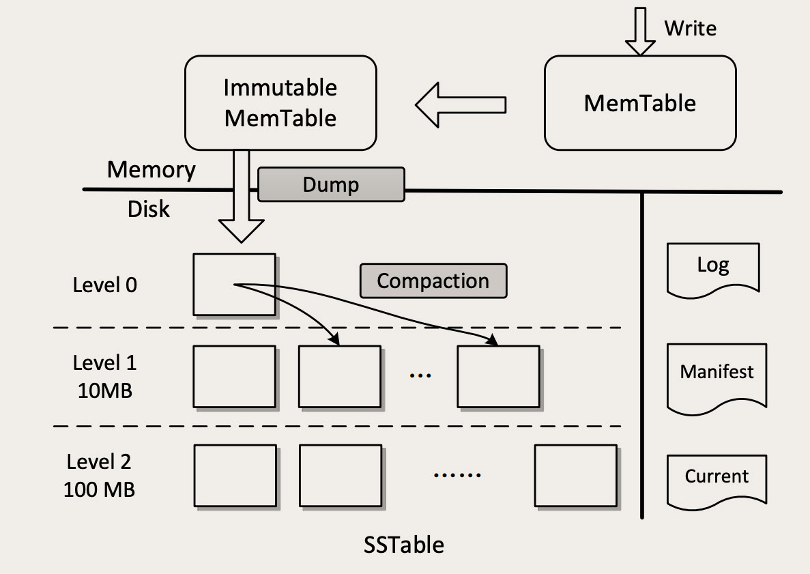
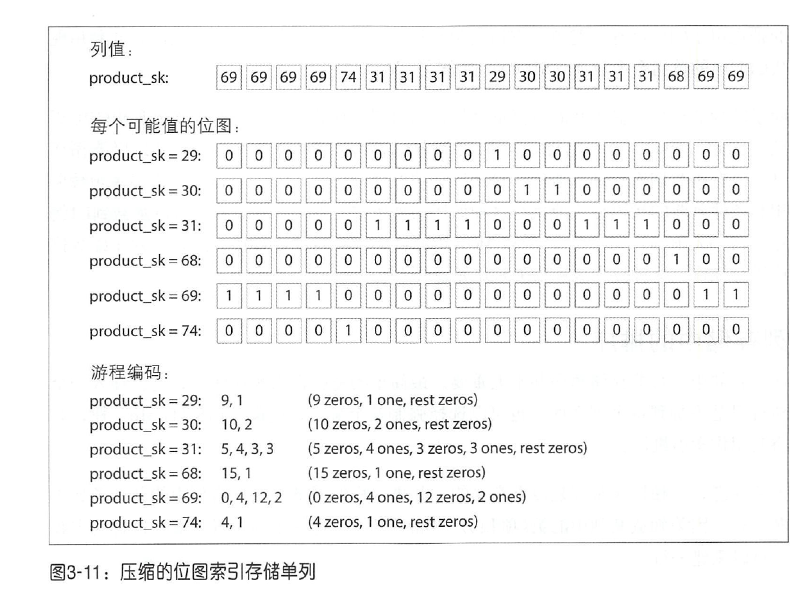

<!-- TOC -->

- [1 软件系统的目标](#1-软件系统的目标)
    - [1.1 可靠性](#11-可靠性)
    - [1.2 可扩展性](#12-可扩展性)
        - [1.2.1 描述负载](#121-描述负载)
        - [1.2.2 描述性能](#122-描述性能)
    - [1.3 可维护性](#13-可维护性)
- [2 twitter 设计](#2-twitter-设计)
- [3 关系模型和文档模型、层状模型、网状模型](#3-关系模型和文档模型层状模型网状模型)
    - [4 数据存储：日志段：哈希索引、SSTable、LSM-Tree、RocksDB](#4-数据存储日志段哈希索引sstablelsm-treerocksdb)
    - [4.1 哈希索引](#41-哈希索引)
    - [4.2 LSM](#42-lsm)
        - [4.2.1 LSM写入：](#421-lsm写入)
        - [4.2.2 LSM查找：](#422-lsm查找)
    - [4.3 RocksDB](#43-rocksdb)
    - [4.4 对比 B-tree 和 LSM-Tree](#44-对比-b-tree-和-lsm-tree)
    - [4.5 内存数据库](#45-内存数据库)
- [5 OLTP和OLAP](#5-oltp和olap)
- [6 编码](#6-编码)
    - 

<!-- /TOC -->
# 1 软件系统的目标
## 1.1 可靠性
## 1.2 可扩展性
### 1.2.1 描述负载
QPS、同时在线数、缓存命中率等
### 1.2.2 描述性能
- 在线服务：
    - 响应时间（response time）：客户端从发送请求到接收响应之间的间隔。包括延迟、网络、**排队**
    - 延迟（latency）：请求花费在处理的时间
        - 随机延迟抖动：上下文切换h和进程调度、网络数据包丢失和TCP重传、GC停顿、缺页中断和磁盘IO
        - 通常用百分位数来定义服务质量目标（Service Leve Objectives，SLO）和服务质量协议（Servie Level Agreements，SLA）
            - > 服务级别协议（英语：service-level agreement，缩写SLA）也称服务等级协议、服务水平协议，是服务提供商与客户之间定义的正式承诺。服务提供商与受服务用户之间具体达成了承诺的服务指标——质量、可用性，责任。  
            SLA最常见的组成部分是以合同约定向客户提供的服务。例如，互联网服务供应商（ISP）和电信公司通常在与客户的合同条款内包含简单定义的服务级别协议。在此事例下，SLA通常定义有平均故障间隔（MTBF）或平均修复时间（MTTR）；哪一方负责报告错误与支付费用；吞吐量；抖动；或类似的可衡量细节。
            - 种简单的实现方案是在时间窗口内保留所有请求的响应时间列在，每分钟做一次排序。如果这种方式效率太低，可以采用一些近似算法（如正向表减，t-digest 或 HdrHistogram
        - **排队延迟往往在高百分数响应时间中影响很大**。由于服务器井行处理的请求有限（例如，CPU 内核数的限制），正在处理的少数请求可能会阻挡后续请求，这种情况有时被称为*队头阻塞*。即使后续请求可能处理很简单，但它阻塞在等待先前请求的完成，客户端将会观察到极慢的响应时间。因此，很重要的一点是要在客户端来测量响应时间。
- 批处理系统：吞吐量
## 1.3 可维护性
消除意外复杂性最好手段之一是抽象
# 2 twitter 设计
[Feed流系统](./系统设计.md#1-feed流系统)

# 3 关系模型和文档模型、层状模型、网状模型
文档数据库是某种方式的层次模型：即在其父记录中保存了嵌套记录（一对多关系），而不是存储在单独的表中。

但是，在表示**多对一和多对多**的关系时，关系数据库和文档数据库并没有根本的不同：在这两种情况下，相关项都由唯一的标识符引用，该标识符**在关系模型中被称为外键，在文档模型中被称为文档引用**。标识符可以查询时通过联结操作或相关后续查询来解析。迄今为止，文档数据库井未遵循CODASYL标准。

历史上，数据最初被表示为一棵大树（层次模型），但是这不利于表示多对多关系，
所以发明了关系模型来解决这个问题

> 关系模型：

## 4 数据存储：日志段：哈希索引、SSTable、LSM-Tree、RocksDB
## 4.1 哈希索引
- 追加和覆盖的区别
    - 追加和分段合并主要是顺序写，它通常比随机写入快得多，特别是在旋转式磁性硬盘上。在某种程度上，顺序写入在基于闪存的固态硬盘上也是适合的。我们将在本章后面的“比较B-tree和LSM-Trees”部分进一步讨论此问题。
    - 如果段文件是追加的或不可变的，则并发和崩溃恢复要简单得多。例如，不必担心在重写值时发生崩溃的情况，留下一个包含部分旧值和部分新值混杂在一起的
    文件。
    - 合并旧段可以避免随着时间的推移数据文件出现碎片化的问题。
- 哈希索引的局限性：
    - 哈希表必须全部放入内存，因为磁盘上的哈希表性能差，因为需要大量随机I/O。
    - 需要处理哈希冲突
    - 区间查询效率低
## 4.2 LSM
- [RocksDB](https://zq99299.github.io/note-book/back-end-storage/03/10.html)
- [RocksDB 笔记](http://alexstocks.github.io/html/rocksdb.html)
> LSM-Tree 的全称是：The Log-Structured Merge-Tree，是一种非常复杂的复合数据结构，它包含了 WAL（Write Ahead Log）、跳表（SkipList）和一个分层的有序表（SSTable，Sorted String Table）。下面这张图就是 LSM-Tree 的结构图  

> SSTable：key-value对的顺序按键排序，每个键在每个合并的段文件中只能出现一次，这种格式称为**排序字符串表(SSTable，Sorted String Table)**
- 相比于哈希索引的日志段：  
    1. 合并段采用归并排序，更加高效
    2. 在文件中查找特定键时，不再需要在**内存中保存所有键的索引**，可以采用稀疏索引(如果键和值大小固定，可以采用二分查找)
    3. 由于读请求往往需要扫描请求范围内的多个key value 对，可以考虑将这些记录保存到一个块中并在写磁盘之前将其压缩。**然后稀疏内存索引的每个条目指向压缩块的开头**。除了节省磁盘空间，压缩还减少了I/O带宽的占用。
### 4.2.1 LSM写入：
1. 首先，数据会被写入到磁盘的 WAL 日志中（图中右侧的 Log），这是一个顺序写磁盘的操作，性能很好。这个日志的唯一作用就是用于故障恢复，一旦系统宕机，可以从日志中把内存中还没有来得及写入磁盘的数据恢复出来。这个地方用的还是之前我们多次讲过的**复制状态机理论**
2. 然后数据会被写入到内存中的 MemTable 中，这个 MemTable 就是一个按照 Key 组织的跳表（SkipList）。数据写入到 MemTable 之后，就可以返回写入成功了。LSM-Tree 在处理写入的过程中，直接往 MemTable 里写，并不去查找这个 Key 是不是已经存在了
3. MemTable 有一个固定的上限大小，一般是 32M。MemTable 写满之后，就被转换成 Immutable MemTable，然后再创建一个空的 MemTable 继续写。这个Immutable MemTable和 MemTable 的数据结构完全一样，唯一的区别就是不允许再写入了
4. 后台线程，不停地把 Immutable MemTable 复制到磁盘文件中，然后释放内存空间。每个 Immutable MemTable 对应一个磁盘文件，MemTable 的数据结构跳表本身就是一个有序表，写入的文件也是一个按照 Key 排序的结构，这些文件就是SSTable。把 MemTable 写入 SSTable 这个写操作，因为它是把整块内存写入到整个文件中，这同样是一个 顺序写操作。
5. 虽然每个文件中的 Key 是有序的，但是文件之间是完全无序的，还是没法查找。这里 SSTable 采用了一个很巧妙的**分层合并机制**，来解决乱序的问题。
    - SSTable 被分为很多层，越往底层，文件越多。每一层的容量都有一个固定的上限，一般来说，下一层的容量是上一层的 10 倍。
    - 当某一层写满了，就会触发后台线程往下一层合并，数据合并到下一层之后，本层的 SSTable 文件就可以删除掉了。
    - 合并的过程也是排序的过程，除了 Level 0（第 0 层，也就是 MemTable 直接 dump 出来的磁盘文件所在的那一层。）以外，每一层内的文件都是有序的，文件内的 KV 也是有序的，这样就比较便于查找了。
### 4.2.2 LSM查找：
- 查找的过程也是分层查找，先去内存中的 MemTable 和 Immutable MemTable 中找，然后再按照顺序依次在磁盘的每一层 SSTable 文件中去找，只要找到了就直接返回。
- 这样的查找方式其实是很低效的，有可能需要多次查找内存和多个文件才能找到一个 Key，但实际的效果也没那么差，因为这样一个分层的结构，它会天然形成一个非常有利于查找的情况：**越是被经常读写的热数据，它在这个分层结构中就越靠上**，对这样的 Key 查找就越快。比如说，最经常读写的 Key 很大概率会在内存中，即使内存中查不到，真正能穿透很多层 SStable 一直查到最底层的请求还是很少的。
- 另外，在工程上还会对查找做很多的优化，比如说，在内存中缓存 SSTable 文件的 Key，用**布隆过滤器**避免无谓的查找等来加速查找过程。这样综合优化下来，可以获得相对还不错的查找性能。
## 4.3 RocksDB  
- RocksDB 是一个高性能持久化的 KV 存储，被很多新生代的数据库作为存储引擎。RocksDB 在保证不错的读性能的前提下，大幅地提升了写入性能，这主要得益于它的数据结构：LSM-Tree。
- LSM-Tree **通过混合内存和磁盘内的多种数据结构，将随机写转换为顺序写来提升写性能，通过异步向下合并分层 SSTable 文件的方式，让热数据的查找更高效，从而获得还不错的综合查找性能**。
- 通过分析 LSM-Tree 的数据结构可以看出来，这种数据结构还是偏向于写入性能的优化，更适合在线交易类场景，因为在这类场景下，需要频繁写入数据。

## 4.4 对比 B-tree 和 LSM-Tree
LSM-tree写入更快，而B-tree读取更快
- LSM优点：
    - B-Tree即使该页中只有几个字节更改，也必须承受写整个页的开销。一些存储引擎甚至覆盖相同的页两次，以避免在电源故障的情况下最终出现部分更新的页
    - 以顺序方式写入紧凑的SSTable文件， 而不必重写树中的多个页
    - LSM-tree可以支持更好地压缩，因此通常磁盘上的文件比B-tree小很多。另外B-tree会产生碎片
- LSM缺点：
    - 因为磁盘资源有限，执行昂贵的**压缩操作时容易发生读写请求等待**，虽然对吞吐量和平均响应时间影响较小，但响应时间的较高的百分位数有时会很高
    - B-tree的优点则是**每个键都恰好唯一对应于索引中的某个位置**，而日志结构的存储引擎可能在不同的段中具有相同键的多个副本。如果数据库希望提供强大的事务语义，这方面B-tree显得更具有吸引力：在许多关系数据库中，事务隔离是通过键范围上的锁来实现的，井且在B-tree索引中，这些锁可以直接定义到树中
- b+树缺点：**插入的新数据需要随机写入磁盘**。如果是一个日志系统，每秒钟要写入上千条甚至上万条数据，这样的**磁盘性能急剧下降**，甚至无法使用。

## 4.5 内存数据库
冷知识：内存数据库的性能优势并不是因为它们不需要从磁盘读取。如果有足够的内存，即使是基于磁盘的存储引擎，也可能永远不需要从磁盘读取，因为操作系统将最近使用的磁盘块缓存在内存中。相反，内存数据库可以更快，是因为它们**避免使用写磁盘的格式对内存数据结构编码**的开销

# 5 OLTP和OLAP
- ETL：将数据导入数据仓库的过程称为提取－转换－加载（Extract-Transform-Load, ETL）
- 星型模型（维度建模）：是一种多维的数据关系，它由一个事实表（Fact Table）和一组维表（Dimension Table）组成。**每个维表都有一个维作为主键，所有这些维的主键组合成事实表的主键**。事实表的**非主键属性称为事实**（Fact），它们一般都是**数值或其他可以进行计算的数据**
    - 星型架构是一种非正规化的结构，多维数据集的每一个维度都**直接与事实表相连接，所以数据有一定的冗余**
- 雪花模型：当有**一个或多个维表没有直接连接到事实表上**，而是通过其他维表连接到事实表上时，其图解就像多个雪花连接在一起，故称雪花模型。雪花模型是对星型模型的扩展。它对星型模型的维表进一步层次化，原有的各维表可能被扩展为小的事实表，形成一些局部的 "层次 " 区域，这些被分解的表都连接到主维度表而不是事实表。
- 列式存储

- 聚合：数据立方体与物化视图

# 6 编码
## 

