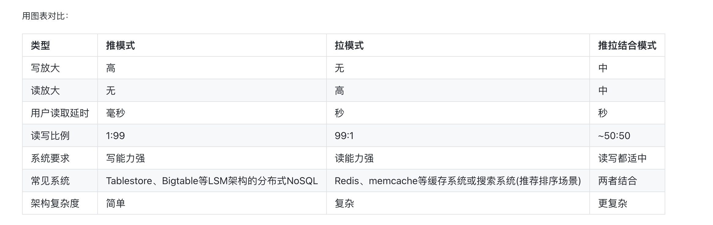
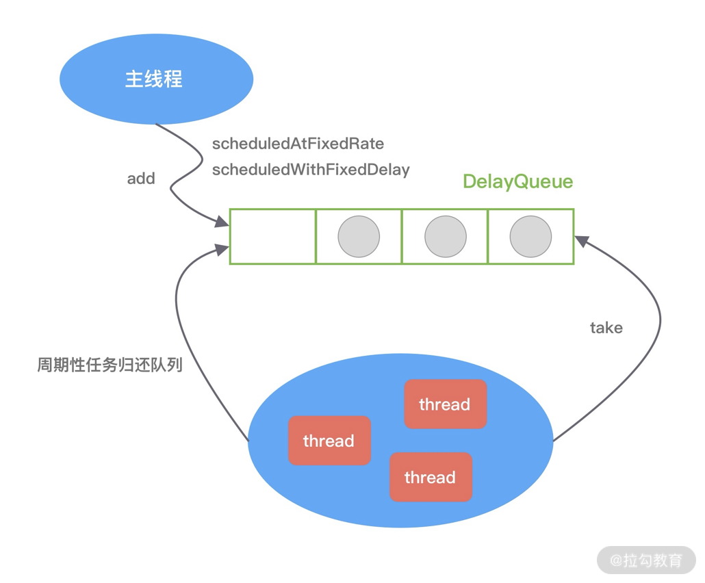
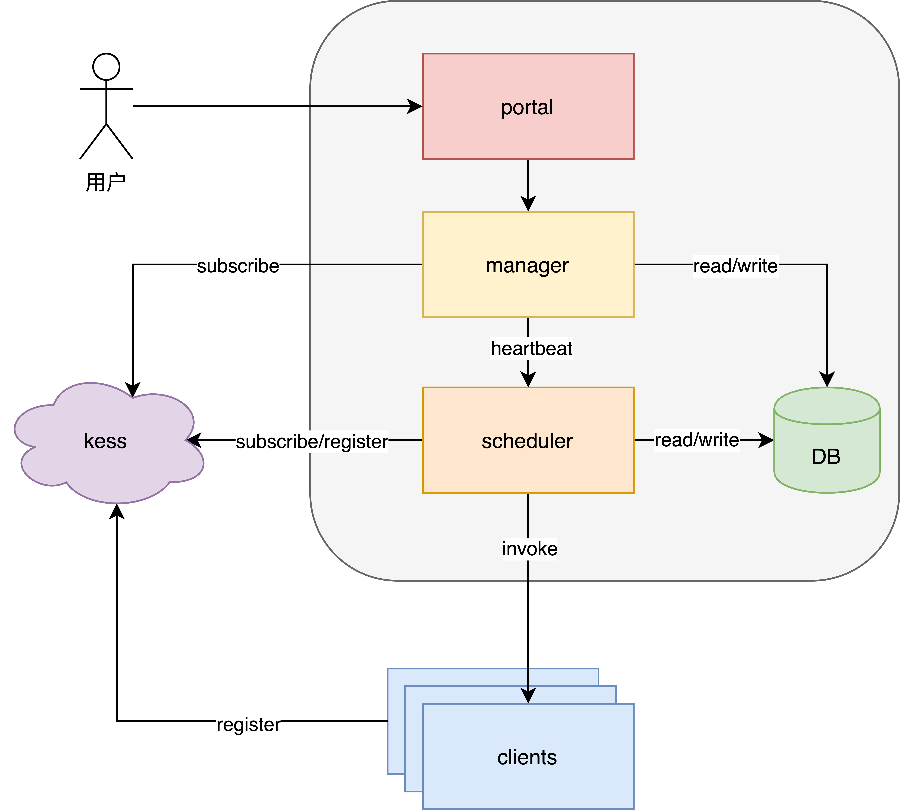
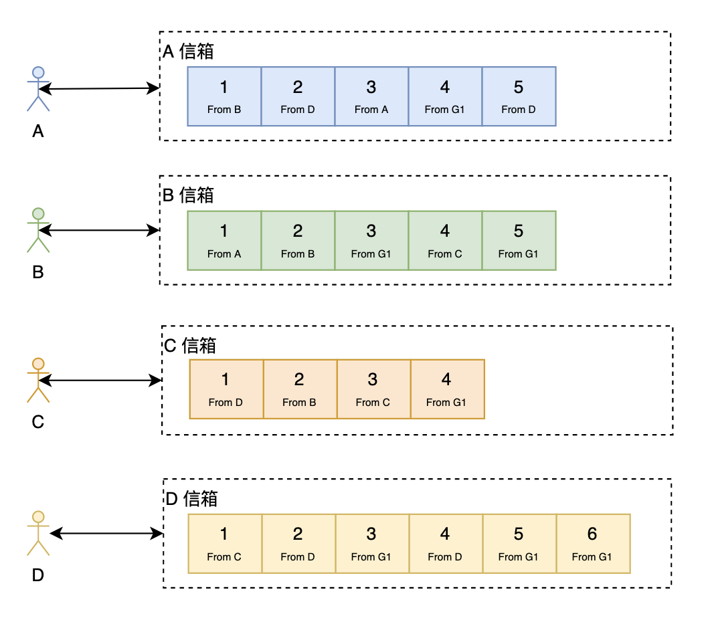
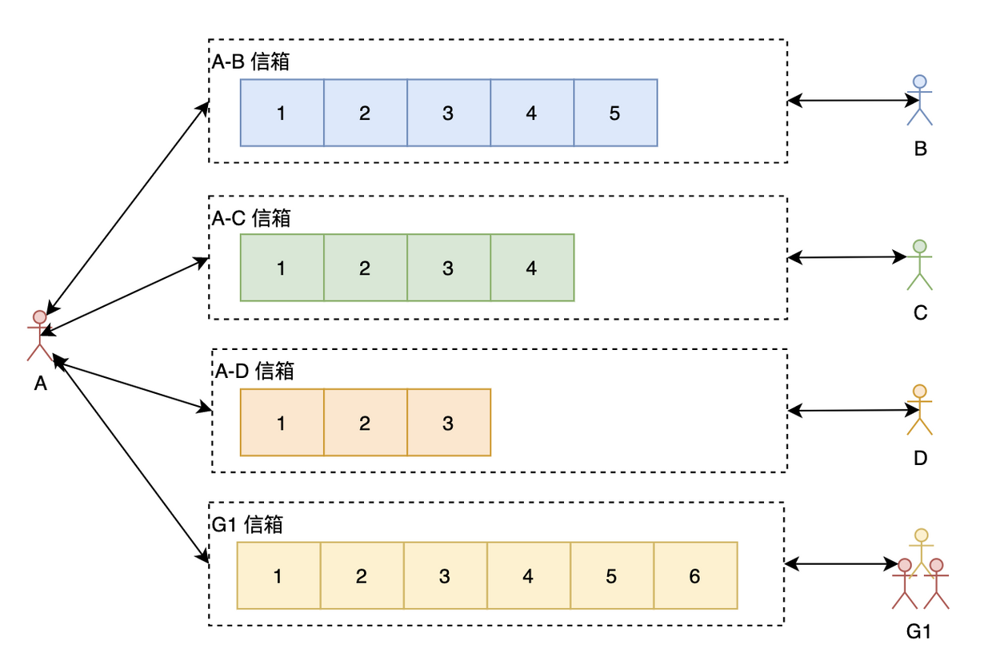

<!-- TOC -->

- [0 参考](#0-参考)
- [1 Feed流系统](#1-feed流系统)
    - [1.1 推模式和拉模式](#11-推模式和拉模式)
    - [1.2 关注关系](#12-关注关系)
- [2 大文件问题](#2-大文件问题)
- [3 秒杀](#3-秒杀)
- [4 红包](#4-红包)
- [5 分布式ID](#5-分布式id)
- [6 定时任务](#6-定时任务)
    - [6.1 ScheduledThreadPoolExecutor](#61-scheduledthreadpoolexecutor)
    - [6.2 时间轮](#62-时间轮)
    - [6.2 ？](#62-)
    - [6.3 分布式任务调度](#63-分布式任务调度)
    - [6.4 xxl-job和快手任务调度平台](#64-xxl-job和快手任务调度平台)
- [7 短URL](#7-短url)
- [8 分布式限流](#8-分布式限流)
- [9 大数据问题](#9-大数据问题)
- [10 大文件排序](#10-大文件排序)
- [11 负载均衡](#11-负载均衡)
- [12 爬虫](#12-爬虫)
- [13 PageRank](#13-pagerank)
- [16 IM](#16-im)
    - [16.0 读扩散还是写扩散](#160-读扩散还是写扩散)
    - [16.1 写扩散（微信）](#161-写扩散微信)
    - [16.2 读扩散](#162-读扩散)
    - [16.3 自增消息ID](#163-自增消息id)
- [14 基数估计](#14-基数估计)
    - [14.1 Linear Counting（线性计数）](#141-linear-counting线性计数)
    - [14.2 hyperLogLog](#142-hyperloglog)
- [15 频率估计](#15-频率估计)
    - [15.1 Count-Min Sketch](#151-count-min-sketch)
    - [15.2 Count-Mean-Min Sketch](#152-count-mean-min-sketch)
- [16 Top k](#16-top-k)
- [17 范围查询](#17-范围查询)
- [18 成员查询（布隆过滤器）](#18-成员查询布隆过滤器)

<!-- /TOC -->
# 0 参考
- [史上最全 Java 面试题](https://www.cnblogs.com/crazymakercircle/p/14367907.html)
- [advanced](https://doocs.github.io/advanced-java)
- [soulmachine](https://soulmachine.gitbooks.io/system-design/content/cn/bigdata/cardinality-estimation.html)
- [系统设计面试步骤指引](https://github.com/summerjava/system-design-interview/blob/main/%E5%A4%A7%E5%8E%82%E7%B3%BB%E7%BB%9F%E8%AE%BE%E8%AE%A1%E9%9D%A2%E8%AF%95%E7%9C%9F%E9%A2%98/%E7%B3%BB%E7%BB%9F%E8%AE%BE%E8%AE%A1%E9%9D%A2%E8%AF%95%E6%AD%A5%E9%AA%A4%E6%8C%87%E5%BC%95.md)
# 1 Feed流系统
[Feed流系统设计-总纲](https://developer.aliyun.com/article/706808)  
[微信朋友圈数据库模式如何设计的](https://www.zhihu.com/question/21909660)  
[如何打造千万级Feed流系统](https://developer.aliyun.com/article/224132)  
[类似微博等社交软件中用户关注关系的存储实现方案遐想](https://cloud.tencent.com/developer/article/1451238)

## 1.1 推模式和拉模式
- 推模式（写扩散）
    - 优点
        - 读性能高
        - 无需复杂sql查询
        - **读写比小适合lsm架构的分布式NoSql**
    - 缺点
        - 大V写入非常耗时
        - 用户关系变更需要更新队列
        - 僵尸用户的队列会占用大量存储空间
- 拉模式（读扩散）
    - 优点：
        - 实现简单
        - 用户关系变更，feed中内容动态变化，易于维护
        - 没有冗余数据，占用存储空间少
    - 缺点：
        - 查询时对feed表压力大，性能低，耗时高
        - 需要维护上次读到的每个关注者的消息位置，数量和关注者成正比

- 推拉结合：大部分用户的消息都是写扩散，只有大V是读扩散
- 冷热分离：用户关系在缓存里面可以设置一个过期时间，比如七天。七天没上线的可能就很少用这个 APP  
- 存储选 NoSql，数据量大，关系简单，比如hbase（hbase 有gc问题）

## 1.2 关注关系
[类似微博等社交软件中用户关注关系的存储实现方案遐想](https://cloud.tencent.com/developer/article/1451238)
- 分库分表：以 fromuid 为 hash key 存一份，以 touid 为 hash key 再存一份
- Redis：[微博关系服务与 Redis 的故事](https://www.infoq.cn/article/weibo-relation-service-with-redis)

# 2 大文件问题


# 3 秒杀
- 请求尽量拦截在系统上游
    - CDN缓存静态页面
    - 前端禁止用户重复提交请求
    - 后端针对id限制访问次数
    - 限流
    - 请求排队
- 控制超卖(原子性)
    - mysql
        - 数据库设置字段为无符号型：当并发超卖时为负数直接报异常
        - update goods set num = num - 1 WHERE id = 1001 and num > 0
    - redis 
        - redis list/decr：只能扣一个
        - lua脚本
    - 过程
        1. 在系统初始化时，将商品的库存数量加载到Redis缓存中
        2. 接收到秒杀请求时，在Redis中进行预减库存，当Redis中的库存不足时，直接返回秒杀失败，减少对数据库的访问。否则继续进行第3步；
        3. 将请求放入异步队列中，立即给前端返回一个值，表示正在排队中。
        4. 服务端异步队列将请求出队，出队成功的请求可以然后进行秒杀逻辑，减库存–>下订单–>写入秒杀订单，成功了就返回成功。
        5. 当后台订单创建成功之后可以通过websocket向用户发送一个秒杀成功通知。前端以此来判断是否秒杀成功，秒杀成功则进入秒杀订单详情，否则秒杀失败。
# 4 红包
- 垂直切分：根据红包ID，发红包、抢红包、拆红包、查详情等等都在同一台机器上处理，互不影响
- 请求进行排队
# 5 分布式ID
[Leaf——美团点评分布式ID生成系统](https://tech.meituan.com/2017/04/21/mt-leaf.html)
- mysql：
    - 优点：
        - 非常简单，利用现有数据库系统的功能实现，成本小，有DBA专业维护。
        - ID号单调自增，可以实现一些对ID有特殊要求的业务。
    - 缺点：
        - 强依赖DB，当DB异常时整个系统不可用，属于致命问题。配置主从复制可以尽可能的增加可用性，但是数据一致性在特殊情况下难以保证。主从切换时的不一致可能会导致重复发号。
        - ID发号性能瓶颈限制在单台MySQL的读写性能。
        - 有个缺点是通过id可以计算订单量，不够保密
    - 解决性能问题：
        - 假设用8台MySQL服务器协同工作，第一台MySQL初始值是1，每次自增8，第二台MySQL初始值是2，每次自增8，依次类推。前面用一个 round-robin load balancer 挡着，每来一个请求，由 round-robin balancer 随机地将请求发给8台MySQL中的任意一个，然后返回一个ID。缺点是ID是不是严格递增的。
        - 上述方案问题
            1. mysql性能问题：改为利用proxy server批量获取，每次获取一个segment(step决定大小)号段的值。用完之后再去数据库获取新的号段，可以大大的减轻数据库的压力。 
            2. 是不好水平扩展，可以考虑增加一个biz_tag字段来分库分表，相互隔离
- redis
- snowflake：最高位不用，永远为0，其余三组bit占位均可浮动，看具体的业务需求而定。默认情况下41bit的时间戳可以支持该算法使用到2082年，10bit的工作机器id可以支持1023台机器（手动或zk持久顺序节点），序列号支持1毫秒产生4095个自增序列id。
    - 优点：
        - 毫秒数在高位，自增序列在低位，整个ID都是趋势递增的。
        - 不依赖数据库等第三方系统，以服务的方式部署，稳定性更高，生成ID的性能也是非常高的。
        - 可以根据自身业务特性分配bit位，非常灵活。
    - 缺点：**强依赖机器时钟**，如果机器上时钟回拨，会导致发号重复或者服务会处于不可用状态。
        - 关闭NTP同步
        - 检测是否回拨，如果回拨等待重新追上
# 6 定时任务 
## 6.1 ScheduledThreadPoolExecutor

借助DelayQueue：DelayedQueue 是 JDK 中一种可以延迟获取对象的阻塞队列，其内部是采用优先级队列 PriorityQueue 存储对象。DelayQueue 中的每个对象都必须实现 Delayed 接口，并重写 compareTo 和 getDelay 方法。
## 6.2 时间轮
[时间轮](https://learn.lianglianglee.com/%E4%B8%93%E6%A0%8F/Netty%20%E6%A0%B8%E5%BF%83%E5%8E%9F%E7%90%86%E5%89%96%E6%9E%90%E4%B8%8E%20RPC%20%E5%AE%9E%E8%B7%B5-%E5%AE%8C/21%20%20%E6%8A%80%E5%B7%A7%E7%AF%87%EF%BC%9A%E5%BB%B6%E8%BF%9F%E4%BB%BB%E5%8A%A1%E5%A4%84%E7%90%86%E7%A5%9E%E5%99%A8%E4%B9%8B%E6%97%B6%E9%97%B4%E8%BD%AE%20HashedWheelTimer.md)


每个 slot 代表一个时间段，每个 slot 中可以存放多个任务，使用的是链表结构保存该时间段到期的所有任务。时间轮通过一个时针随着时间一个个 slot 转动，并执行 slot 中的所有到期任务。

任务是如何添加到时间轮当中的呢？可以根据任务的到期时间进行取模，然后将任务分布到不同的 slot 中。如上图所示，时间轮被划分为 8 个 slot，每个 slot 代表 1s，当前时针指向 2。假如现在需要调度一个 3s 后执行的任务，应该加入 2+3=5 的 slot 中；如果需要调度一个 12s 以后的任务，需要等待时针完整走完一圈 round 零 4 个 slot，需要放入第 (2+12)%8=6 个 slot。

- work线程：时间轮启动的时候初始化startTime，每次轮轮询时：
    ```java
    private long waitForNextTick() {
        long deadline = tickDuration * (tick + 1);
        for (;;) {
            final long currentTime = System.nanoTime() - startTime;
            long sleepTimeMs = (deadline - currentTime + 999999) / 1000000;
            //...
            try {
                Thread.sleep(sleepTimeMs);
            } catch (InterruptedException ignored) {
                //...
            }

        }

    }
    ```
- 优点：添加删除任务是O(1)，不像优先队列是O(logn)
- 缺点：
    - 如果长时间没有到期任务，那么会存在时间轮空推进的现象。（为了解决空推进的问题，Kafka 借助 JDK 的 DelayQueue 来负责推进时间轮。DelayQueue 保存了时间轮中的每个 Bucket，并且根据 Bucket 的到期时间进行排序，最近的到期时间被放在 DelayQueue 的队头。Kafka 中会有一个线程来读取 DelayQueue 中的任务列表，如果时间没有到，那么 DelayQueue 会一直处于阻塞状态，从而解决空推进的问题）
    - 只适用于处理耗时较短的任务，由于 Worker 是单线程的，如果一个任务执行的时间过长，会造成 Worker 线程阻塞。
    - 相比传统定时器的实现方式，内存占用较大。
- 避免刻度过多：加round，或者分层
## 6.2 ？
任务轮询或任务轮询+抢占排队方案
- 每个服务器首次启动时加入队列；
- 每次任务运行首先判断自己是否是当前可运行任务，如果是便运行；
- 如果不是当前运行的任务，检查自己是否在队列中，如果在，便退出，如果不在队列中，进入队列。
## 6.3 分布式任务调度
- 简单的业务可以用zk锁+定时线程池（快手ScheduledTask）
- 也可以借助zset的优先级存储下次触发时间，redis有单点问题
## 6.4 xxl-job和快手任务调度平台

拆分为调度器和执行器，调度器控制执行时间，调度器通过rpc调用执行器，执行器只执行任务。好处是对定时任务的控制更强，协调逻辑可以随时更新，用户可以通过平台动态的调整任务属性
- 调度器
- 执行器
- 分片解决单点问题：快手采用一致性哈希[如何设计一个分布式任务调度系统](https://kstack.corp.kuaishou.com/article/1314)

# 7 短URL
[系统设计系列之如何设计一个短链服务](https://xie.infoq.cn/article/483fcfbe3f942cb1fa9d9ce20)
1. 分布式ID生成器产生ID
2. ID转62进制字符串
3. 记录数据库，根据业务要求确定过期时间，可以保留部分永久链接
# 8 分布式限流
Redis+Lua 脚本实现令牌桶

[限流](./限流.md)
# 9 大数据问题
包括找相同URL，找高频词，统计最多IP
- 通过hash分为小文件，小文件hash统计
- 每个小文件再用堆
    - 求解最大的 TopN 个，用小顶堆；
    - 求解最小的 TopN 个，用大顶堆。
# 10 大文件排序
[面试题热个身：5 亿整数的大文件，来排个序？](https://cloud.tencent.com/developer/article/1592913)
- 外归并排序按如下方法操作：
    1. 读入100 MB的数据至内存中，用某种常规方式（如快速排序、堆排序、归并排序等方法）在内存中完成排序。
    2. 将排序完成的数据写入磁盘。
    3. 重复步骤1和2直到所有的数据都存入了不同的100 MB的块（临时文件）中。在这个例子中，有900 MB数据，单个临时文件大小为100 MB，所以会产生9个临时文件。
    4. 读入每个临时文件（顺串）的前10 MB（ = 100 MB / (9块 + 1)）的数据放入内存中的输入缓冲区，最后的10 MB作为输出缓冲区。（实践中，将输入缓冲适当调小，而适当增大输出缓冲区能获得更好的效果。）
    5. 执行九路归并算法，将结果输出到输出缓冲区。一旦输出缓冲区满，将缓冲区中的数据写出至目标文件，清空缓冲区。一旦9个输入缓冲区中的一个变空，就从这个缓冲区关联的文件，读入下一个10M数据，除非这个文件已读完。
    - [486 · 合并k个排序数组](https://www.lintcode.com/problem/486/)
- 位图法
1MB=1024*1024*8 个数

# 11 负载均衡
- 权重随机：见kess
- 轮询
- 最小活跃数(最小响应时间)：见thrift
- 一致性哈希

# 12 爬虫


# 13 PageRank
[PageRank| 图论 与推荐系统](https://www.cnblogs.com/shengyang17/p/17471494.html)

# 16 IM
- [如何设计一个亿级消息量的 IM 系统](https://xie.infoq.cn/article/19e95a78e2f5389588debfb1c)
- [从0到1：微信后台系统的演进之路](https://mp.weixin.qq.com/s/fMF_FjcdLiXc_JVmf4fl0w)
- [现代IM系统中的消息系统](https://help.aliyun.com/zh/tablestore/use-cases/message-system-architecture-in-the-modern-im-system?spm=a2c4g.11186623.0.0.3ed476deRZ3EVc)
- [企业微信的IM架构设计揭秘：消息模型、万人群、已读回执、消息撤回等](http://www.52im.net/thread-3631-1-1.html)
## 16.0 读扩散还是写扩散
针对IM这种应用场景，消息系统通常会选择写扩散这种消息同步模式。IM场景下，一条消息只会产生一次，但是会被读取多次，是典型的**读多写少**的场景，消息的读写比例大概是10:1。若使用读扩散同步模式，整个系统的读写比例会被放大到100:1。

一个优化的好的系统，必须从设计上去平衡这种读写压力，避免读或写任意一维触碰到天花板。**所以IM系统这类场景下，通常会应用写扩散这种同步模式，来平衡读和写**，将100:1的读写比例平衡到30:30。

当然写扩散这种同步模式，还需要处理一些极端场景，例如万人大群。针对这种极端写扩散的场景，会退化到使用读扩散。一个简单的IM系统，通常会在产品层面限制这种大群的存在，而对于一个高级的IM系统，会采用读写扩散混合的同步模式，来满足这类产品的需求。采用混合模式，会根据数据的不同类型和不同的读写负载，来决定用写扩散还是读扩散。
## 16.1 写扩散（微信）

每个人都只从自己的信箱里读取消息，但写（发消息）的时候，对于单聊跟群聊处理如下：
- 单聊：往自己的信箱跟对方的信箱都写一份消息
- 群聊：需要往所有的群成员的信箱都写一份消息
- 同时，如果需要查看两个人的聊天历史记录的话还需要**再写一份**（当然，如果从个人信箱也能回溯出两个人的所有聊天记录，但这样效率会很低）。(这个应该相当于读扩散，再存一份会话级别数据)

写扩散优点：
1. 读操作性能好，速度快
2. 只需要通过一个序列号就可以增量同步所有消息，收消息协议简单
3. 满足更多ToB的业务场景：回执消息、云端删除。**同一条消息，在每个人的视角会有不同的表现**。例如：回执消息，发送方能看到已读未读列表，接受方只能看到是否已读的状态。云端删除某条群消息，在自己的消息列表消失，其他人还是可见。

写扩散缺点：
1. 写操作很重，尤其是对于群聊来说，所以群聊有人数限制

## 16.2 读扩散

**每条消息只存一份，群聊成员都读取同一份数据。** 如上图所示，A 与每个聊天的人跟群都有一个信箱（有些博文会叫 Timeline），A 在查看聊天信息的时候需要读取所有有新消息的信箱。

读扩散的优点：
1. 写操作（发消息）很轻量，不管是单聊还是群聊，只需要往相应的信箱写一次就好了
2. 每一个信箱天然就是两个人的聊天记录，可以方便查看聊天记录跟进行聊天记录的搜索
3. 节省存储

读扩散的缺点：
- 接收端需要对每个会话都拉取一次才能同步全部消息，**读被大大的放大，并且会产生很多无效的读**，因为并不是每个会话都会有新消息产生
- 每个会话都需要增量同步消息，则每个会话都需要维护一个序列号。

## 16.3 自增消息ID
- 写扩散：信箱时间线 ID 使用用户级别递增，消息 ID 全局递增，此时只要保证单调递增就可以了
- 读扩散：消息 ID 可以使用会话级别递增并且最好是连续递增
    - >QQ 的消息 ID 就是在会话级别使用的连续递增，这样的好处是，如果丢失了消息，当下一条消息来的时候发现 ID 不连续就会去请求服务器，避免丢失消息。此时，可能有人会想，我不能用定时拉的方式看有没有消息丢失吗？当然不能，因为消息 ID 只在会话级别连续递增的话那如果一个人有上千个会话，服务器肯定是抗不住的。


# 14 基数估计
如何计算数据流中不同元素的个数？

哈希、位图就不说了
## 14.1 Linear Counting（线性计数）
[基数估计探秘：Linear Counting与Flajolet-Martin算法](https://blog.csdn.net/nazeniwaresakini/article/details/104220243)
1. 创建一个有m个bit的位数组，初始状态是0填充的。
2. 设定一个哈希函数H，它的结果空间正好落在上述位数组中，尽量服从均匀分布，并且按每bit分桶。
3. 将集合C的元素依次输入H，散列到位数组中，将其散列到的bit置为1。
4. 所有元素输入完成后，设n=|C|，且位数组中仍然为0的bit（即空桶）共有u个，那么基数n的一个估计为：ñ = -m·ln(u/m)。

由上一节的表中可以看出，当n达到比较大的规模时，Linear Counting算法的空间复杂度为O(n/C)，C是个常数。
但是，这个算法只能保证空间占用有常数级别的降低，因此仍然主要用于小数据量的场景，仍然不适用于大数据。

## 14.2 hyperLogLog
[HyperLogLog 算法的原理讲解以及 Redis 是如何应用它的](https://juejin.cn/post/6844903785744056333#heading-0)
- 原理
    - 对于n次抛到正面的伯努利实验，第i次抛到正面的抛掷次数为ki，n次中会有一个最大的抛掷次数kmax，而通过最大似然估计，n和k_max中存在关联：n = 2^(k_max)
    - 进行m轮上述过程，并对m次kmax取调和平均
- redis中
    - 命令
        - pfadd key value，将 key 对应的一个 value 存入
        - pfcount key，统计 key 的 value 有多少个
    - 实现
        - 在存入时，value 会被 hash 成 64 位，前 14 位用来分桶（**共16384个桶，每个桶有6位**），前 14 位的二进制转为 10 进制就是桶标号。
        - 64 位形式，减去 14 后，剩下 50 位。假设极端情况，出现 1 的位置，是在第 50 位，即位置是 50。此时 index = 50。此时先将 index 转为 2 进制，它是：110010 。存入桶中
        - 如果出现了在同一个桶的，即前 14 位值是一样的，但是后面出现 1 的位置不一样。那么比较原来的 index 是否比新 index 大。是，则替换。
    - value 被转为 64 位的比特串，最终被按照上面的做法记录到每个桶中去。64 位转为十进制就是：2^64，HyperLogLog 仅用了：16384 * 6 /8 / 1024 K = 12k 存储空间就能统计多达 2^64 个数。
- 时间复杂度为什么是O(log(log(Nmax)))？
    - Nmax是最大基数
    - 因为首先n = 2^(k_max)，然后k_max占用的空间是log(kmax)
# 15 频率估计
如何计算数据流中任意元素的频率？
## 15.1 Count-Min Sketch
1. 选定d个hash函数，开一个 dxm 的二维整数数组作为哈希表
2. 对于每个元素，分别使用d个hash函数计算相应的哈希值，并对m取余，然后在对应的位置上增1，二维数组中的每个整数称为sketch
3. 要查询某个元素的频率时，只需要取出d个sketch, 返回最小的那一个(最小的那个冲突最少)

只对重度重复的数据集有比较好的效果
## 15.2 Count-Mean-Min Sketch
Count-Min Sketch算法对于低频的元素，结果不太准确，主要是因为hash冲突比较严重，产生了噪音，例如当m=20时，有1000个数hash到这个20桶，平均每个桶会收到50个数，这50个数的频率重叠在一块了。Count-Mean-Min Sketch 算法做了如下改进：
1. 来了一个查询，按照 Count-Min Sketch的正常流程，取出它的d个sketch
2. 对于每个hash函数，估算出一个噪音，噪音等于该行所有整数(除了被查询的这个元素)的平均值(50)
3. 用该行的sketch 减去该行的噪音，作为真正的sketch
4. 返回d个sketch的中位数

# 16 Top k
Count-Min Sketch + Heap
1. 在数据流不断流入的过程中，维护一个标准的Count-Min Sketch 二维数组
2. 维护一个小根堆，容量为k
3. 每次来一个新元素，
    - 将相应的sketch增1
    - 在堆中查找该元素，如果找到，把堆里的计数器也增1，并调整堆；如果没有找到，把这个元素的sketch作为该元素的频率的近似值，跟堆顶元素比较，如果大于堆顶元素的频率，则把堆顶元素替换为该元素，并调整堆

# 17 范围查询
没看懂
# 18 成员查询（布隆过滤器） 
[Redis进阶：布隆过滤器（Bloom Filter）及误判率数学推导](https://blog.csdn.net/Xin_101/article/details/129066363)