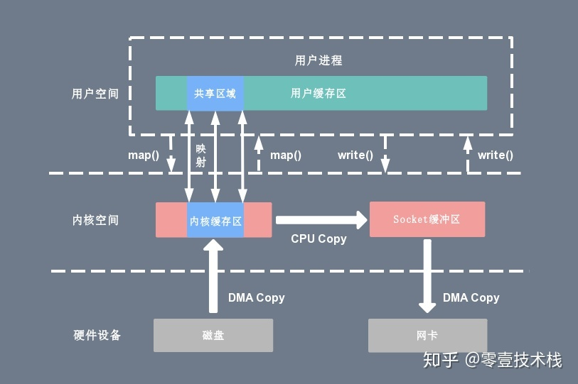
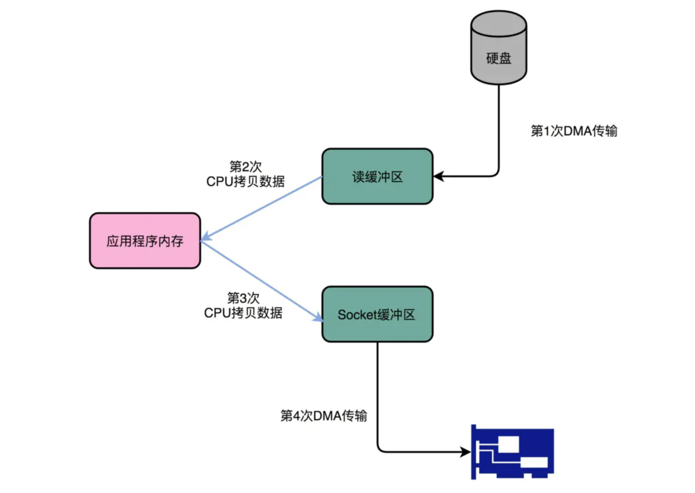
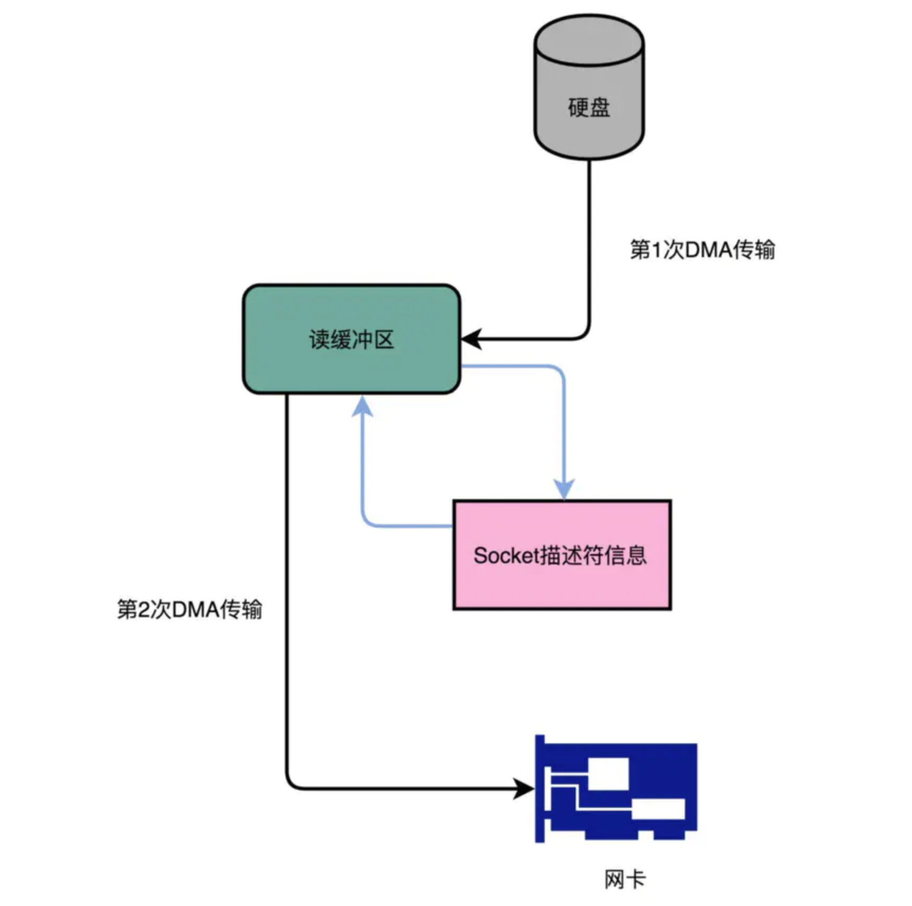
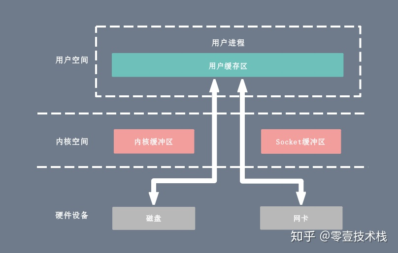

<!-- TOC -->

- [1 节点流和处理流](#1-节点流和处理流)
- [2 I/O模型](#2-io模型)
    - [2.1 阻塞和非阻塞？ 同步和异步？](#21-阻塞和非阻塞-同步和异步)
- [3 select、poll、epoll](#3-selectpollepoll)
- [4 零拷贝技术](#4-零拷贝技术)
    - [4.1 MMAP](#41-mmap)
    - [4.2 sendfile（Kafka）](#42-sendfilekafka)
    - [4.3 写时复制（Redis）](#43-写时复制redis)
    - [4.4 直接IO](#44-直接io)
- [5 Reactor模式](#5-reactor模式)
- [6 AIO](#6-aio)
- [7 磁盘I/O](#7-磁盘io)

<!-- /TOC -->
# 1 节点流和处理流  
[节点流和处理流](https://blog.csdn.net/zhangzhaoyuan30/article/details/90730314)
# 2 I/O模型
[常见I/O模型对比](https://blog.csdn.net/zhangzhaoyuan30/article/details/92067996)
## 2.1 阻塞和非阻塞？ 同步和异步？  
- 首先一个IO操作(read/write系统调用)其实分成了两个步骤：
    1. 发起IO请求
    2. 实际的IO读写(内核态与用户态的数据拷贝)
- 阻塞IO和非阻塞IO的区别在于第一步：**发起IO请求的进程是否会被阻塞**，如果阻塞直到IO操作完成才返回那么就是传统的阻塞IO，如果不阻塞，那么就是非阻塞IO。
- 同步IO和异步IO的区别就在于第二步：**实际的IO读写(内核态与用户态的数据拷贝)是否需要进程参与**，如果需要进程参与则是同步IO，如果不需要进程参与就是异步IO。
# 3 select、poll、epoll
[select、poll、epoll](https://www.cnblogs.com/aspirant/p/9166944.html)  
[Linux IO模式及 select、poll、epoll详解](https://www.cnblogs.com/aspirant/p/9166944.html)  
- select：数组存储fd，轮询，打开FD数量有限1024
- poll：链表存储，轮询。**没有最大文件描述符数量的限制**
- select和poll缺点：
    - 每次调用select，都需要把**fd集合从用户态拷贝到内核态**，开销大
    - 同时每次调用select都需要在内核**遍历**传递进来的所有fd
- epoll：
    - select和poll都只提供了一个函数——select或者poll函数。而epoll提供了三个函数，epoll_create，epoll_ctl和epoll_wait。epoll_create是创建一个epoll句柄；epoll_ctl是注册要监听的事件类型；epoll_wait则是等待事件的产生。
    - 对于第一个缺点，epoll的解决方案在epoll_ctl函数中。每次注册新的事件到epoll句柄中时（在epoll_ctl中指定EPOLL_CTL_ADD），**会把所有的fd拷贝进内核，而不是在epoll_wait的时候重复拷贝**。epoll保证了每个fd在整个过程中只会拷贝一次。
    - 对于第二个缺点，epoll的解决方案不像select或poll一样每次都把current进程轮流加入fd对应的设备等待队列中，而只在epoll_ctl时把current挂一遍（这一遍必不可少）**并为每个fd指定一个回调函数**，当设备就绪，唤醒等待队列上的等待者时，就会调用这个回调函数，**而这个回调函数会把就绪的fd加入一个就绪链表**）。epoll_wait的工作实际上就是在这个就绪链表中查看有没有就绪的fd（利用schedule_timeout()实现睡一会，判断一会的效果，和select实现中的第7步是类似的）。
- 总结：
    1. select，poll实现需要自己不断轮询所有fd集合，直到设备就绪，期间可能要睡眠和唤醒多次交替。而epoll其实也需要调用epoll_wait不断轮询就绪链表，期间也可能多次睡眠和唤醒交替，但是它是**设备就绪时，调用回调函数，把就绪fd放入就绪链表**中，并唤醒在epoll_wait中进入睡眠的进程。虽然都要睡眠和交替，**但是select和poll在“醒着”的时候要遍历整个fd集合，而epoll在“醒着”的时候只要判断一下就绪链表是否为空就行了**，这节省了大量的CPU时间。这就是回调机制带来的性能提升。**伪AIO**
    2. select，poll每次调用都要把fd集合从用户态往内核态拷贝一次，并且要把current往设备等待队列中挂一次，而epoll只要一次拷贝，而且把current往等待队列上挂也只挂一次（在epoll_wait的开始，注意这里的等待队列并不是设备等待队列，只是一个epoll内部定义的等待队列）。这也能节省不少的开销。 
# 4 零拷贝技术
[深入剖析Linux IO原理和几种零拷贝机制的实现](https://zhuanlan.zhihu.com/p/83398714)
## 4.1 MMAP

- 使用 mmap 的目的是将**内核中读缓冲区**（read buffer）的地址与**用户空间**的缓冲区（user buffer）进行映射，省去了将数据从内核拷贝到用户缓冲区的过程
- 然而内核读缓冲区（read buffer）仍需将数据到内核写缓冲区（socket buffer）
## 4.2 sendfile（Kafka）
总结：不经过用户空间，适用于不需要修改数据的情况
- 传统数据从文件到网络

    1. 操作系统从磁盘读取数据到内核空间的 pagecache(DMA)
    2. 应用程序读取内核空间的pagecache到用户空间的缓冲区(CPU)
    3. 应用程序将数据从用户空间的缓冲区写回到socket buffer(内核空间)(CPU)
    4. 操作系统将数据从socket buffer复制到通过网络发送的 NIC 缓冲区(DMA)
    >DMA 的全称叫直接内存存取（Direct Memory Access），是一种允许**外围设备（硬件子系统）直接访问系统主内存**的机制。也就是说，基于 DMA 访问方式，系统主内存与硬盘或网卡之间的数据传输可以绕开 CPU 的全程调度。目前大多数的硬件设备，包括磁盘控制器、网卡、显卡以及声卡等都支持 DMA 技术。（跟零拷贝本身没关系，负责磁盘到内核page cache的拷贝）
- sendifle：

- 从 pagecache 将数据由DMA直接复制到 NIC 缓冲区
- 它将内核空间（kernel space）的读缓冲区（read buffer）中对应的**数据描述信息**（内存地址、地址偏移量）记录到相应的网络缓冲区（ socket buffer）中，由 **DMA** 根据内存地址、地址偏移量将数据批量地从读缓冲区（read buffer）拷贝到网卡设备中（在Linux2.4之前还需要将数据通过CPU拷贝到socket）
## 4.3 写时复制（Redis）
1. fork()之后，kernel把父进程中所有的内存页的权限都设为read-only，然后**子进程的物理地址空间指向父进程**。当父子进程都只读内存时，相安无事
2. 当其中某个进程写内存时，CPU硬件检测到内存页是read-only的，于是触发缺页异常（page-fault），陷入kernel的一个中断例程。中断例程中，kernel就会把**触发的异常的页复制一份**，于是父子进程各自持有独立的一份

- 优点
    - 减少分配和复制大量资源时带来的瞬间延时（Redis）
    - 减少不必要的资源分配：有的子进程并不需要共享父进程数据
- 缺点：
    - 如果在fork()之后，父子进程都还需要继续进行写操作，那么会产生大量的分页错误(页异常中断page-fault)
## 4.4 直接IO

- 用户态直接访问硬件设备，数据直接跨过内核进行传输
- 场景：
    - 适用于随机IO比较多的场景
    - 适用于**不需要内核缓冲区**处理的应用程序，这些应用程序通常在进程地址空间**有自己的数据缓存机制**，称为自缓存应用程序，如数据库管理系统就是一个代表。
    - 由于 CPU 和磁盘 I/O 之间的执行时间差距，会造成大量资源的浪费，解决方案是**配合异步 I/O 使用**
# 5 Reactor模式
- 概念：是一种事件处理模式，用于处理**并发服务请求**。有一个Service Handler，有多个Request Handlers，service handler会将传入的请求进行解复用(demultiplex)，并分发到关联的Request Handler。
- 优点：业务处理代码和请求处理分离，从而使业务代码模块化、可复用
- 代码  
[Reactor I/O模型](https://www.xncoding.com/2018/04/05/java/reactor.html)
- 总结：
reactor多线程和主从reactor多线程的主要区别是：从reacor是一个select线程，有自己的selector
# 6 AIO
AsynchronousServerSocketChannel
- windows：IOCP
- linux

# 7 磁盘I/O
[磁盘I/O那些事](https://tech.meituan.com/2017/05/19/about-desk-io.html)
系统将文件存储到磁盘上时，按柱面、磁头、扇区的方式进行，即最先是第1磁道的第一磁头下（也就是第1盘面的第一磁道）的所有扇区，然后，是同一柱面的下一磁头，……，一个柱面存储满后就推进到下一个柱面，直到把文件内容全部写入磁盘