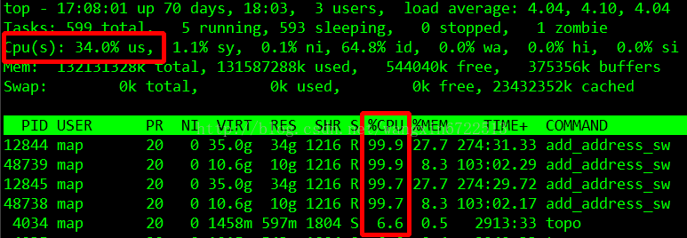

# 1 TOP 和 load average

- Cpu(s)
    - us：用户态使用的cpu时间比
    - sy：系统态使用的cpu时间比
    - ni：用做nice加权的进程分配的用户态cpu时间比
    - id：空闲的cpu时间比
    - wa：cpu等待磁盘写入完成时间
    - hi：硬中断消耗时间
    - si：软中断消耗时间
- Mem
    - total：物理内存总量
    - used：使用中的内存总量
    - free：空闲内存总量
    - buffers：缓存的内存量
- swap
    - total：交换区总量
    - used：使用的交换区总量
    - free：空闲交换区总量
    - cached：缓冲的交换区总量
- 注意：
    - Mem（used）指的是现在系统内核控制的内存数，（free）是内核还未纳入其管控范围的数量。纳入内核管理的内存不见得都在使用中，还包括过去使用过的现在可以被重复利用的内存，内核并不把这些可被重新使用的内存交还到free中去，因此在linux上free内存会越来越少，但不用为此担心
    - 如果出于习惯去计算可用内存数，这里有个近似的计算公式：第四行的free + 第四行的buffers + 第五行的cached
    - 对于内存监控，在top里我们要时刻监控**第五行swap交换分区的used**，如果这个数值在不断的变化，**说明内核在不断进行内存和swap的数据交换，这是真正的内存不够用了**。
- 进程
    - PID — 进程id
    - USER — 进程所有者
    - PR — 进程优先级
    - NI — nice值。负值表示高优先级，正值表示低优先级
    - VIRT — 进程使用的虚拟内存总量，单位kb。VIRT=SWAP+RES
    - RES — 进程使用的、未被换出的物理内存大小，单位kb。RES=CODE+DATA
    - SHR — 共享内存大小，单位kb
    - S — 进程状态。D=不可中断的睡眠状态 R=运行 S=睡眠 T=跟踪/停止 Z=僵尸进程
    - %CPU — 上次更新到现在的CPU使用率
    - %MEM — 进程使用的物理内存百分比
    - TIME+ — 进程使用的CPU时间总计，单位1/100秒
    - COMMAND — 进程名称（命令名/命令行）
- 参考
    - [linux下top命令参数解释](https://www.cnblogs.com/taobataoma/archive/2007/12/26/1015167.html) 
    - [CPU 使用率低高负载的原因](https://segmentfault.com/a/1190000020459073)
    - [Linux top命令里面%CPU和cpu(s)的差别](https://blog.csdn.net/q2519008/article/details/79985673)
# 2 load average
load average表示的是系统的平均负荷，即CPU的Load。
它所包含的信息不是CPU的使用率状况，而是在一段时间内**CPU正在处理以及等待CPU处理的进程数之和（任务队列长度）**
# 3 wiki
[查看消耗资源最多的线程](https://wiki.n.miui.com/pages/viewpage.action?pageId=30224855)  
[性能优化](https://wiki.n.miui.com/pages/viewpage.action?pageId=30224808)