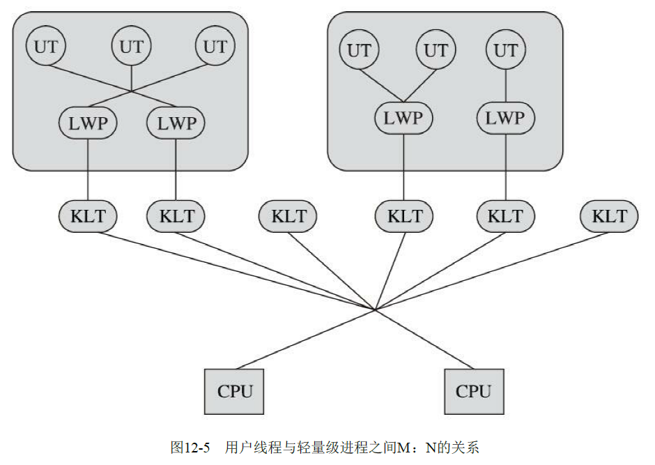
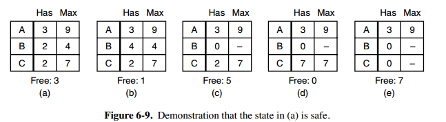
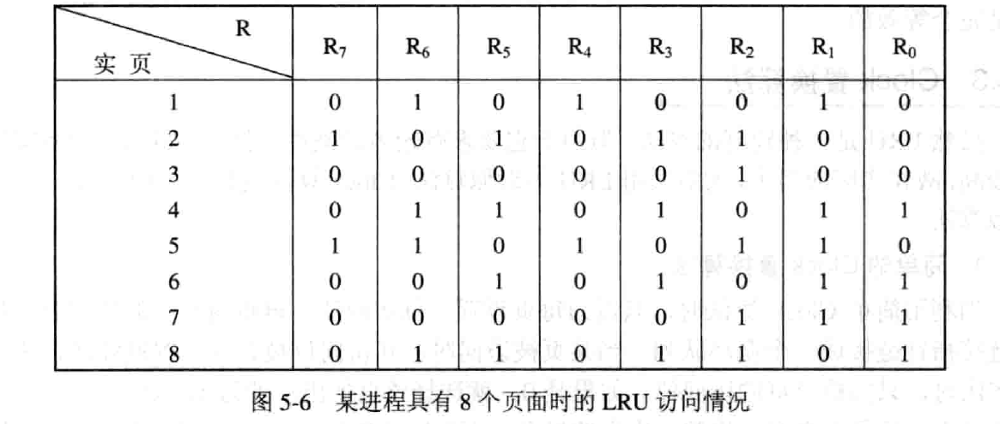

<!-- TOC -->

- [1 进程](#1-进程)
    - [1.1 概念](#11-概念)
    - [1.2 进程通信：](#12-进程通信)
    - [1.3 线程](#13-线程)
        - [1.3.1 线程和进程的比较：](#131-线程和进程的比较)
        - [1.3.2 线程实现方式](#132-线程实现方式)
    - [1.4 进程调度](#14-进程调度)
    - [1.5 死锁](#15-死锁)
        - [1.5.1 死锁定义](#151-死锁定义)
        - [1.5.2 死锁产生的必要条件](#152-死锁产生的必要条件)
        - [1.5.3 预防](#153-预防)
        - [1.5.4 避免](#154-避免)
        - [1.5.5 死锁检测和消除](#155-死锁检测和消除)
- [2 程序运行步骤：](#2-程序运行步骤)
- [3 内核态和用户态](#3-内核态和用户态)
- [4 分页存储](#4-分页存储)
    - [4.1 分段解决的问题](#41-分段解决的问题)
    - [4.1 概念](#41-概念)
    - [4.2 页表](#42-页表)
    - [4.3 地址变换](#43-地址变换)
- [5 虚拟内存](#5-虚拟内存)
    - [5.1 局部性原理](#51-局部性原理)
    - [5.2 虚拟内存概念](#52-虚拟内存概念)
    - [5.3 硬件支持](#53-硬件支持)
    - [5.4 页面置换算法](#54-页面置换算法)

<!-- /TOC -->
# 1 进程
## 1.1 概念
- 进程实体：由程序段、相关数据段、PCB(Process Control Block 进程控制块)三部分构成
- 进程：是进程实体的运行过程，是系统进行**资源分配和调度的独立单位**
- 三种状态：就绪、执行、阻塞
- PCB：
    - 保存现场，恢复执行
    - 记录进程的数据在内存或外存的起始指针
    - 提供进程调度所需信息
    - 实现与其他进程同步和通信
## 1.2 进程通信：
- 共享内存
- 匿名管道：利用pipe文件，以字符流传送
    - 单工
    - 同步：写入一定数据或读空pipe时，需要等待唤醒
    - 用于父子进程，子进程相互
- 命名管道：任何进程
- 消息队列
- 信号
    >执行kill -9 <PID>，进程是怎么知道自己被发送了一个信号的？  
    >1. 根据pid找到进程的task_struct（这个是Linux下表示进程/线程的结构），然后在其成员变量里记下这个信号。此时信号产生了但还没有被特定的进程处理，叫做Pending signal。  
    >2. 等到下一次CPU调度到这个进程的时候，内核会保证先执行do_signal这个函数看看有没有需要被处理的信号，若有，则处理；若没有，那么就直接继续执行该进程。所以我们看到，在Linux下，信号并不像中断那样有异步行为，而是每次调度到这个进程都是检查一下有没有未处理的信号
- socket

## 1.3 线程
### 1.3.1 线程和进程的比较：
[Linux内核初探:进程与线程](https://juejin.cn/post/6844904003508109326)
- 进程是操作系统资源分配的基本单位，而线程是处理器任务调度和执行的基本单位
- **拥有资源**：线程不拥有系统资源，只拥有TCB（控制线程运行）：用于程序计数器、保存局部变量、状态参数、返回地址的寄存器和栈。
- **独立性**：进程有独立的地址空间和其他资源，线程共享进程的内存地址空间和资源
- **系统开销**：**创建**进程和进程**切换**比线程代价高得多
### 1.3.2 线程实现方式
- KST(Kernel Supported Threads) 内核线程 (1:1)  
程序一般不会直接使用内核线程，而是使用 LWP(**轻量级进程，和内核线程一对一**)。 
    - 缺点：
        - 内核级线程的**创建、销毁和切换需要系统调用**，这会导致一定的开销。
        - 内核级线程的调度是由操作系统内核控制的，因此调度决策可能会受到内核调度算法的限制。
        - 内核级线程之间的**上下文切换需要保存和恢复内核状态**，这也会带来一定的开销。
- ULT(User Level Threads) 用户级线程 (1:N)：  
用户空间实现，与内核无关，线程的创建、销毁、切换、调度由用户负责
    - 优点：
        - 用户级线程的创建、销毁和切换不需要系统调用，因此开销比较小
        - 用户级线程可以使用应用程序自己实现的调度算法，因此可以提供更灵活的调度策略
    - 缺点：
        - 调度以进程为单位，同一个进程所有线程共享时间片。不公平且无法利用多处理器并行处理能力
        - 用户级线程不能使用操作系统提供的同步和通信机制，必须通过应用程序自己实现这些机制。
- 组合方式（多对多）：

仅当用户线程需要访问内核，才映射到内核线程
## 1.4 进程调度
[操作系统中常用的进程调度算法](https://blog.csdn.net/fuzhongmin05/article/details/55802925)
- 先来先服务调度算法
- 短作业(进程)优先调度算法
- 时间片轮转法
- 多级反馈队列调度算法：优先权越高的队列，执行时间片越小
- 优先权调度算法
## 1.5 死锁
[​死锁的产生、防止、避免、检测和解除](https://zhuanlan.zhihu.com/p/61221667)
### 1.5.1 死锁定义
互相等待对方持有的资源
### 1.5.2 死锁产生的必要条件
- 互斥：占用的资源具有排他性
- 请求和保持条件：进程已经保持了一个资源，又提出了新的资源请求，而该资源已被占有
- 不可抢占：资源在释放前不可抢占
- 循环等待
### 1.5.3 预防
- 破坏“请求和保持”
    - 进程开始运行前一次性申请所需全部资源
        - 资源被严重浪费，某些资源可能持有很长时间后才被使用
        - 饥饿现象：资源长期被占用导致无法运行
    - 进程开始运行前获取运行初期所需的资源，然后逐步释放全部资源后，再申请
- 破坏“循环等待”：
对所有资源排序编号，每个进程只能按序号递增顺序申请资源。要申请序号低的，必须先释放所有>=所需资源序号的资源。  
这样形成的资源分配图不可能出现环路
### 1.5.4 避免
- 安全状态：如果没有死锁发生，并且即使所有进程突然请求对资源的最大需求，也仍然存在某种调度次序能够使得每一个进程运行完毕，则称该状态是安全的  

- 银行家算法  
判断对请求的满足是否会进入不安全状态，如果是，就拒绝请求；否则予以分配
### 1.5.5 死锁检测和消除
- 检测：
    - 如果每种资源只有一个：资源分配图是否存在环
    - 多个：死锁定理：资源分配图是否可简化：
        - [资源分配图化简法-操作系统·死锁](https://blog.csdn.net/nima1994/article/details/65657250)
        - 消除不阻塞的边，释放资源，再继续消除。最后还有边，则死锁
- 消除：
    - 资源剥夺
    - 终止进程：优先级、执行时间、还需时间、使用资源

# 2 程序运行步骤：
- 编译：目标模块
- 链接：目标模块+库函数->装入模块 
- 装入：将装入模块装入内存
    - 动态运行时装入：执行时逻辑地址替换成物理地址
# 3 内核态和用户态
- 内核态：
    - 处理器处于特权级最高的（0级）
    - 可以执行任何cpu指令，也可以引用任何内存地址，包括外围设备, 例如硬盘, 网卡
    - 占有的处理器不能被抢占
- 用户态：
    - 处理器在特权级最低的（3级）
    - 只能执行非特权指令，不能访问外部设备
    - 占有的处理器可以被抢占
- 切换方式
    - 系统调用（主动）
    - 异常：比如缺页
    - 外围设备中断：比如硬盘读写

- https://segmentfault.com/a/1190000011899638
- https://www.cnblogs.com/gizing/p/10925286.html
# 4 分页存储
## 4.1 分段解决的问题
- 物理地址空间不隔离
- 程序运行时地址不确定

但是，内存使用效率仍较低，可用分页解决
## 4.1 概念
将用户程序地址空间分为若干个固定大小区域，称为页。相应的把内存分为若干个块。

为进程分配内存时，把页分别装入多个可以不相邻的块，最后一页经常装不满称为页面碎片。页面小碎片少但是页表大。
## 4.2 页表
- 地址结构：页号+页内位移
- 页表：页号->块号，存在内存
- 页表寄存器（PTR Page-Table Register）存放**页表起始位置和长度**。进程未执行时存在PCB上，调度到该进程时，移到PTR
- 页表项地址=页表起始地址+页号*页表项长度
- 页内地址不用转换
- 快表：高速缓存寄存器，缓存当前访问的页表项
- 两级页表：外层页号+外层页内地址+页内地址
## 4.3 地址变换
1. 程序执行时，从PCB中取出页表始址和页表长度，装入页表寄存器PTR。
2. 由分页地址变换机构将逻辑地址自动分成页号和页内地址。
3. 将页号与页表长度进行比较，若页号大于或等于页表长度，则表示本次访问的地址已超越进程的地址空间，产生越界中断。
4. 将页表始址与页号和页表项长度的乘积相加，便得到该页表项在页表中的位置。
5. 取出页描述子得到该页的物理块号。
6. 对该页的存取控制进行检查。
7. 将物理块号送入物理地址寄存器中，再将有效地址寄存器中的页内地址直接送入物理地址寄存器的块内地址字段中，拼接得到实际的物理地址。
# 5 虚拟内存
## 5.1  局部性原理
局部性原理：较短时间内程序的执行仅局限于某个部分
## 5.2 虚拟内存概念
虚拟内存：具有请求调入功能和置换功能，能从**逻辑上对内存容量加以扩充**的一种存储系统，其逻辑容量由内存容量和外存容量之和决定
## 5.3 硬件支持
- 请求分页的页表机制
- 缺页中断机构
- 地址变换机构
## 5.4 页面置换算法
缺页需要调入内存时，内存无空闲空间，系统必须从内存中调出一页到交换区
- 最佳（Optimal）置换算法：被淘汰页以后永不使用或未来最长时间不在被访问，可保证最低缺页率，但其无法预测，因此无法实现，但可用于评价其他算法
- 先进先出：淘汰在内存中最久的，但与进程实际运行规律不符
- LRU(least recently used)最近最少使用：记录自上次访问以来的时间t，选最大的淘汰
- LFU(Least Frequently Used)最不经常使用：最近时期使用次数最少的页面
LRU 和 LFU都可使用寄存器实现
  
LRU还可使用栈实现
- Clock：LRU近似算法，又称为NRU(Not Recently Used **最近未用算法**)，所有页形成一个循环队列，每页设置一个访问位，页被访问时置1。选择淘汰时检查访问位，0就换出，1就重新置为0
    - 改进：对于**修改过的页**换出开销大，所以把**置换代价**考虑进去

- 页面缓冲（PBA Page Buffering Algorithm）：页面换出写入磁盘前进行缓存，仅当换出一定数值再写回磁盘，减少I/O，同时也能减少页面换进的开销。设置两个链表：
    - 空闲页面链表：由系统掌握，分配给频繁缺页进程。当有未修改页面换出时可挂在空闲链表末尾而非换出。
    - 修改页面链表：减少以修改页面换出次数
