<!-- TOC -->

- [1 五层模型](#1-五层模型)
    - [1.1 物理层](#11-物理层)
    - [1.4 传输层（TCP）](#14-传输层tcp)
    - [1.5 应用层](#15-应用层)
- [2 数据链路层](#2-数据链路层)
    - [2.1 PPP](#21-ppp)
    - [2.2 以太网（局域网标准）](#22-以太网局域网标准)
- [3 网络层](#3-网络层)
    - [3.1 IP（网际协议）](#31-ip网际协议)
        - [3.1.1 ARP协议（同一局域网）](#311-arp协议同一局域网)
        - [3.1.2 转发分组（路由表）](#312-转发分组路由表)
        - [3.1.3 子网掩码](#313-子网掩码)
    - [3.2 ICMP](#32-icmp)
    - [3.3 路由选择协议](#33-路由选择协议)
    - [3.4 路由器的构成](#34-路由器的构成)
    - [3.5 IP多播](#35-ip多播)
- [3 UDP](#3-udp)
    - [2.1 UDP功能？](#21-udp功能)
    - [2.2 主要特点？](#22-主要特点)
    - [2.3 场景](#23-场景)
    - [2.4 首部（各2字节）？](#24-首部各2字节)
- [3 TCP](#3-tcp)
    - [3.1 特点](#31-特点)
    - [3.2 可靠传输的原理（理论）](#32-可靠传输的原理理论)
        - [3.2.1 停止等待ARQ(Automatic Repeat Request)协议](#321-停止等待arqautomatic-repeat-request协议)
        - [3.2.2 连续ARQ协议](#322-连续arq协议)
    - [3.3 TCP报文](#33-tcp报文)
    - [3.4 可靠传输的实现](#34-可靠传输的实现)
        - [3.4.1 以字节为单位的滑动窗口](#341-以字节为单位的滑动窗口)
        - [3.4.2 超时重传时间选择](#342-超时重传时间选择)
        - [3.4.3 SACK(Selective ACK)](#343-sackselective-ack)
    - [3.5 流量控制（抑制发送端速率）](#35-流量控制抑制发送端速率)
    - [3.6 拥塞控制（防止过多数据进入网络导致过载）](#36-拥塞控制防止过多数据进入网络导致过载)
        - [3.6.1 慢开始](#361-慢开始)
        - [3.6.2 拥塞避免](#362-拥塞避免)
        - [3.6.3 快重传和快恢复](#363-快重传和快恢复)
    - [3.7 主动队列管理AQM](#37-主动队列管理aqm)
    - [3.8 TCP建立和释放](#38-tcp建立和释放)
        - [3.8.1 3次握手](#381-3次握手)
        - [3.8.2 4次挥手](#382-4次挥手)
        - [3.8.3 **为什么A要发送ACK，为什么三次握手**？](#383-为什么a要发送ack为什么三次握手)
    - [3.9 粘包](#39-粘包)
    - [3.10 TIMEWAIT过多？](#310-timewait过多)
- [4 DNS工作流程？](#4-dns工作流程)
- [4 IP地址和MAC地址](#4-ip地址和mac地址)
- [6 HTTP](#6-http)
    - [6.1 特点？](#61-特点)
    - [6.2 HTTP/1.1和2.0？](#62-http11和20)
        - [6.2.1 HTTP/1.1](#621-http11)
        - [6.2.2 HTTP/2.0](#622-http20)
    - [6.3 报文？](#63-报文)
        - [6.3.1 方法](#631-方法)
        - [6.3.2 状态码](#632-状态码)
    - [6.4 session和cookie？](#64-session和cookie)
        - [6.4.1 cookie](#641-cookie)
        - [6.4.2 session](#642-session)
        - [6.4.4 跨域](#644-跨域)
    - [6.5 HTTPS](#65-https)
- [7 在浏览器中输入url地址?](#7-在浏览器中输入url地址)
- [8 http2](#8-http2)
    - [8.0 1.1存在有哪些问题：](#80-11存在有哪些问题)
    - [8.1 数据流、消息、二进制分帧](#81-数据流消息二进制分帧)
    - [8.2 请求与响应多路复用](#82-请求与响应多路复用)
    - [3.3 标头压缩](#33-标头压缩)
    - [8.4 数据流优先级](#84-数据流优先级)
    - [8.5 流控制](#85-流控制)
    - [3.6 服务器推送](#36-服务器推送)

<!-- /TOC -->
# 1五层模型


## 1.1 物理层
透明地传送比特流
## 1.4 传输层（TCP）
面向通信部分的最高层，应用进程（端口间）互相通信，把传输表头（TH）（含端口号）加至数据以形成数据包

路由器的协议栈不包含传输层
## 1.5 应用层
提供为应用软件而设计的接口，以设置与另一应用软件之间的通信

# 2 数据链路层
- 数据链路层的三个基本问题：
    - **封装成帧**（包含了地址段和数据段）
    - 透明传输：数据中出现的**控制字符**不被解释为控制字符
    - 差错检测（将物理层提供的可能出错的物理连接改造成逻辑上无差错的数据链路）
- 传输单位为帧
- MAC地址：或称为物理地址、硬件地址，用来定义网络设备的位置。地址是识别某个系统的重要标识符，“名字指出我们所要寻找的资源，地址指出资源所在的地方，路由告诉我们如何到达该处”。
## 2.1 PPP
和ISP通信采用PPP协议
## 2.2 以太网（局域网标准）
- CSMA/CD协议：半双工
    - 集线器：代替总线，但依然是总线网
- MAC地址：网卡地址
- 扩展以太网
    - 采用集线器构成树（物理层）：
        - 碰撞域合并
        - 速率只能向下兼容
    - 交换机（数据链路层）
        - 多接口网桥
        - **同时连接多对接口**：全双工，不再使用CSMA/CD协议（类似电话交换机）
        - 缓存帧
        - 交换表
# 3 网络层
- 网络层向上只提供简单灵活的，无连接的，尽最大努力交付的数据报服务，**网络层不提供服务质量的承诺**（因为计算机有差错处理能力，不像电话）
- 包含：IP,ARP,ICMP（网际控制报文协议）,IGMP（网际组管理协议）
- 转发器、网桥、仅仅是扩大网络，仍然属于一个网络。而网络层的路由器则是**网络互联**，路由器相当于一个专用计算机，具有两个以上IP地址
## 3.1 IP（网际协议）
- 决定数据的路径选择和转寄，将网络表头（NH）加至数据包，以形成分组
- 引入IP地址可以区分主机是否在同一子网
- IP数据报中间经过的IP地址不出现在IP数据报首部，只会变更MAC源地址和目的地址。路由器只根据目的IP地址网络号进行路由选择
### 3.1.1 ARP协议（同一局域网）
地址解析协议 ARP：把 **IP 地址解析为MAC地址**。ARP 的高速缓存可以大大减少网络上的通信量，因为不需要再去**广播**方式发送 ARP 请求分组
### 3.1.2 转发分组（路由表）
### 3.1.3 子网掩码
和子网掩码（全1）做与运算，求子网网络地址
- A类：255.0.0.0
- B类：255.255.0.0
- C类：255.255.255.0
## 3.2 ICMP
- ICMP报文装在IP中
- 分类
    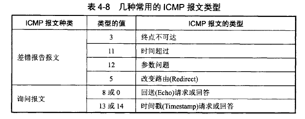
- 应用
    - PING
    - traceroute：
        1. 向目的主机发送一连串无法交付的UDP（非法端口）
        2. 第一个数据报TTL设为1，到达第一个路由器R1时，TTL=0，R1会丢弃报文并返回ICMP **时间超过**报文
        3. 以此类推，最后到达目的主机时因为UDP无法交付，因此返回 ICMP **终点不可达**报文
## 3.3 路由选择协议
待补充
## 3.4 路由器的构成
根据路由表转发分组（待补充）
## 3.5 IP多播
- 服务器只发送一次，路由器转发分组时进行复制，局域网有硬件多播功能，不需要复制分组
- IP多播地址：D类
- MAC多播地址：第一字节最低位为1
- IGMP：待补充
- 网络直播采用CDN，不采用组播（可能导致网络攻击）。IPTV采用组播
# 3 UDP
## 2.1 UDP功能？
只在IP数据报服务上加了两个功能：
- 复用和分用
    > 复用：应用层所有进程都可以通过运输层传到IP层  
    > 分用：运输层从IP层收到数据交付给各个应用进程
- 差错检测
## 2.2 主要特点？
- 无连接：开销小、时延低
- 尽最大努力交付，不保证可靠
- 面向报文
    - 对应用程序报文直接加上首部发送，一次交付一个完整报文
    - 因此报文大小要合适，过大导致IP层分片，过小导致IP层首部过大，都会影响效率
- 无拥塞控制
- 支持一对一、多对多、多对一、多对多
- 首部8字节开销小
## 2.3 场景
- 无连接：时延低，游戏、DNS、DHCP
- 无拥塞控制：实时应用：通话、视频
## 2.4 首部（各2字节）？
- 源端口：需要回信时填，可不填
- 目的端口
- 长度
- 检验和
-（伪首部12字节）：计算检验和用，不传输。

# 3 TCP
## 3.1 特点
- 面向连接
- 点对点（一对一）
- 可靠交付：**无差错、不丢失、不重复，按序到达**
- 全双工
- 面向字节流：TCP不保证接收方收到的数据块和发送发发出的数据块大小和数量相等，但保证字节流内容一致
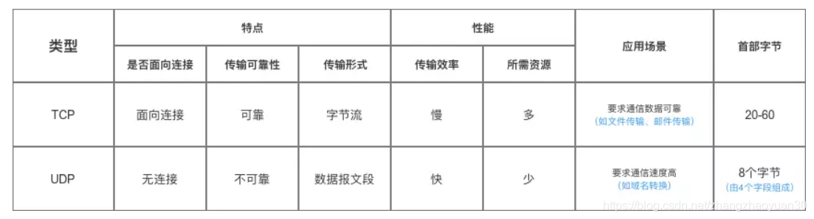
## 3.2 可靠传输的原理（理论）
理想传输条件有两个特点：
- 传输信道不产生差错
- 不管发送方发送速度多快，接收方能及时处理
>自动重传请求（Automatic Repeat-reQuest，ARQ）是OSI模型中数据链路层和传输层的错误纠正协议之一。它通过使用**确认和超时**这两个机制，在不可靠服务的基础上实现可靠的信息传输。如果发送方在发送后一段时间之内没有收到确认帧，它通常会重新发送
### 3.2.1 停止等待ARQ(Automatic Repeat Request)协议
- 每发送一个分组就停止发送，等待确认
- 每一个分组设置一个超时计时器
- 发送一个分组后需要暂时保留，直到确认
- **分组和确认必须进行编号**
- 超时计时器重传时间要比传输的平均时间更长一些
### 3.2.2  连续ARQ协议
停止等待协议效率太低，因此发送方维持一个滑动窗口，发送窗口中的数据可以不待确认都发送（节省通信时间提高吞吐），未收到确认的暂时保留以便超时重传使用，每收到一个确认，滑动窗口向前滑动
- 回退N重传(Go-Back-N)  
    - 累积确认：不必对收到的分组逐个确认，**对按序到达的最后一个分组确认**，就表示之前的分组**都已经正确收到**，以**减少开销**
    - 接收点丢弃从第一个没有收到的数据包开始的所有数据包。发送点收到NACK后，从NACK中指明的数据包开始重新发送。
- 选择重传(Selective Repeat)
    - 发送点连续发送数据包但对每个数据包都设有个一个计时器。
    - 当在一定时间内没有收到某个数据包的ACK时，发送点只重新发送那个没有ACK的数据包。
## 3.3 TCP报文
首部最小20字节
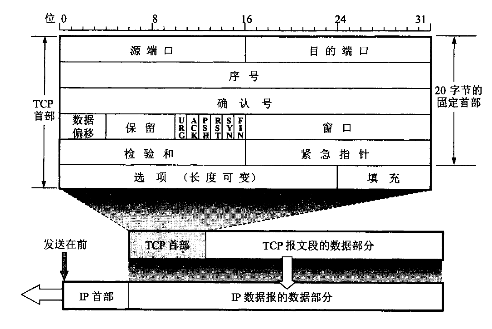
- 序号：按字节编号
- URG：紧急插入发送最前面
- PSH(push)：接收方不用等待缓存满再交付
- RST(reset)：表示出现错误，必须释放连接并重新建立，也用来拒绝一个报文段或连接
- 窗口：**指接收窗口，根据接收方缓存空间设置，发送方以此为依据调整发送窗口**
- 选项
    - MSS(Maximum Segment Size)：
        - MSS长度=TCP报文长度-TCP首部长度。
        - 长度不能大（避免IP分片）也不能小（网络利用率低）
        - 默认536字节，因此TCP报文=556字节
    - 窗口扩大
    - 时间戳：计算RTT，防止序号绕回
## 3.4 可靠传输的实现
### 3.4.1 以字节为单位的滑动窗口
和理论一致  
接收方可以在自己有数据要发送时把确认信息**捎带**上，**减少开销**。TCP标准规定确认推迟的时间**不超过0.5秒**
### 3.4.2 超时重传时间选择
超时重传时间RTO=RTTs+4*RTTd
- RTTs：加权平均往返时间
- RTTd：RTT偏差的加权平均
- 每重传一次，RTO\*=2
### 3.4.3 SACK(Selective ACK)
目前未使用，还是重传所有未被确认的数据块
## 3.5 流量控制（抑制发送端速率）
- **利用滑动窗口大小控制**
    - 发送窗口上限值=MIN \[ rwnd , cwnd \]
        >rwnd：接收方窗口，发给发送方以此控制流量
    - 异常情况：
        - 接收方发送0窗口报文段后不久，缓冲区又有空间了，于是发送非零窗口通知，但是传送途中丢失，导致无限法继续通信。
        - 为此：TCP设有**持续计数器**，若一方收到0窗口就启动。到期时发送**零窗口探测报文段**，对方在确认中给出目前窗口值，若还是0则重置计数器
- 从缓存中发送报文段的时机
    - Nagle算法：
        - 提高了网络吞吐量，但是实时性却降低了，在一些交互性很强的应用程序来说是不允许的
        - Nagle算法主要是避免发送小的数据包，要求TCP连接上最多只能有一个未被确认的小分组，在该分组的确认到达之前不能发送其他的小分组
    ```python
    if there is new data to send #有数据要发送
        # 发送窗口缓冲区和队列数据 >=mss，队列数据（available data）为原有的队列数据加上新到来的数据
        # 也就是说缓冲区数据超过mss大小，nagle算法尽可能发送足够大的数据包
        if the window size >= MSS and available data is >= MSS 
            send complete MSS segment now # 立即发送
        else
            if there is unconfirmed data still in the pipe # 前一次发送的包没有收到ack
                # 将该包数据放入队列中，直到收到一个ack再发送缓冲区数据
                enqueue data in the buffer until an acknowledge is received 
            else
                send data immediately # 立即发送
            end if
        end if
    end if　
    ```
## 3.6 拥塞控制（防止过多数据进入网络导致过载）
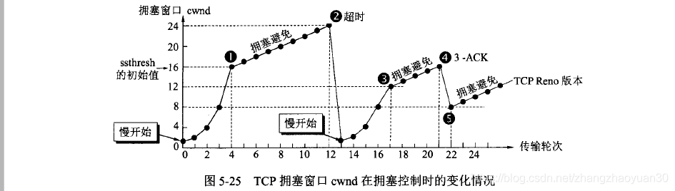
### 3.6.1 慢开始
从初始拥塞窗口开始，每收到一个确认，拥塞窗口增加min(N,SMSS)，意味着每经过一个传输轮次，**拥塞窗口cwnd加倍**
- 初始拥塞窗口：2至4个SMSS，由SMSS大小决定
- N：刚收到的确认字节数
- SMSS：发送方最大报文段
### 3.6.2 拥塞避免
- 慢开始门限ssthresh
- AIMD算法
    - 加法增大（Additive Increase）：cwnd > ssthresh时，**每经过一个传输轮次（cwnd中所有报文发送并收到最后一个字节的确认）**把发送方 **cwnd+1**（实际每收到一个确认增加(MSS * MSS / cwnd）个字节）
    - 乘法减小（Multiplicative Decrease）：一旦出现超时或3个重复确认，**ssthresh = cwnd/2**，并大大减小cwnd
### 3.6.3 快重传和快恢复
有时个别报文段在网络中丢失，实际上网络并未发生拥塞，发送方收不到确认，产生超时，导致将cwnd设为1，慢启动开始，降低传输效率  

快重传可以让发送方**尽早知道发生了个别报文段丢失**
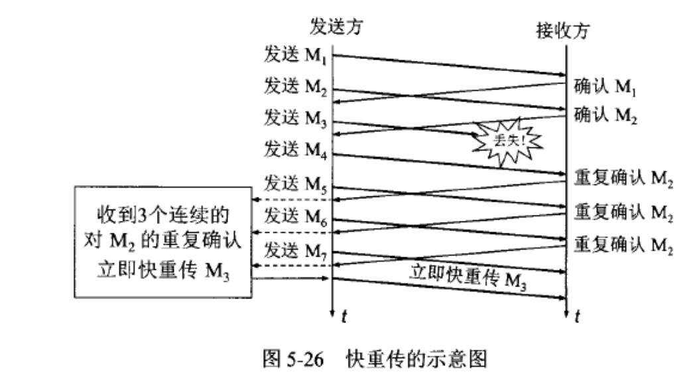
- 要求接收方**不要捎带确认**，而要立即确认
- 即使收到失序报文段，也要立即**对已收到的报文段重复确认**
- 发送方连续收到3个重复确认
    - 就立即进行重传（即快重传），防止超时出现，从而避免慢开始，吞吐量提高20%
    - 同时进行快恢复：
        - ssthresh = cwnd/2
        - cwnd = ssthresh
## 3.7 主动队列管理AQM
防止尾部丢弃策略导致全局同步（经过此路由器的TCP连接同一时间进入慢开始）

方法是在队列长度达到最大值之前主动丢弃分组
## 3.8 TCP建立和释放
**TCP对有数据的TCP segment 必须确认**
### 3.8.1 3次握手
TCP连接建立要解决三个问题：
1. 使一方能够确认对方存在
2. 允许双方协商一些参数（最大窗口值、是否使用窗口扩大选项、时间戳选项、服务质量等）
3. 对运输实体资源（如缓存大小、连接表的项目）进行分配
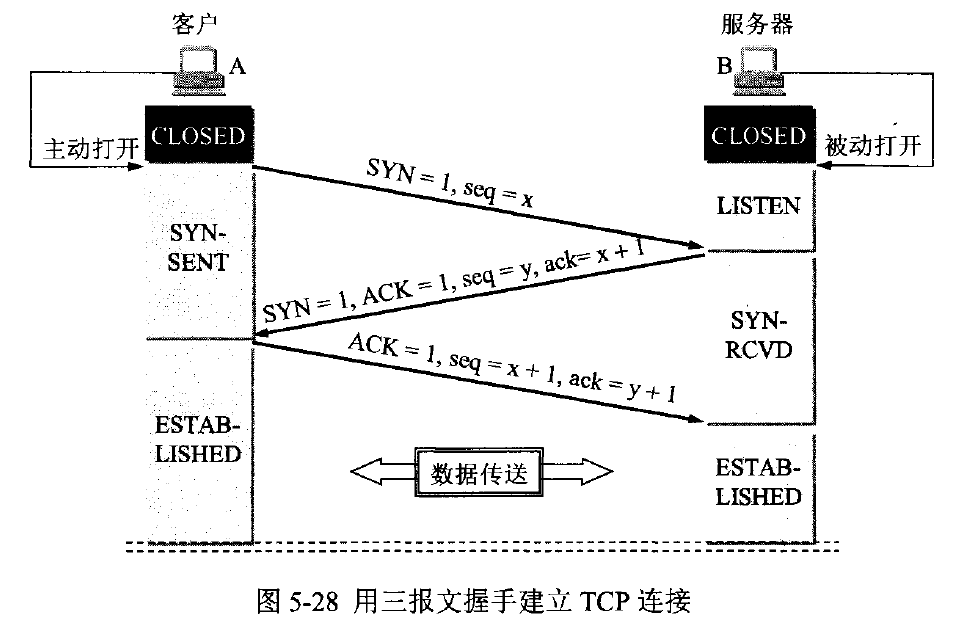
- SYN：选择一个初始序号，不携带数据，需要消耗1个序号 
- ACK：可以携带数据，若不携带不消耗序号
### 3.8.2 4次挥手
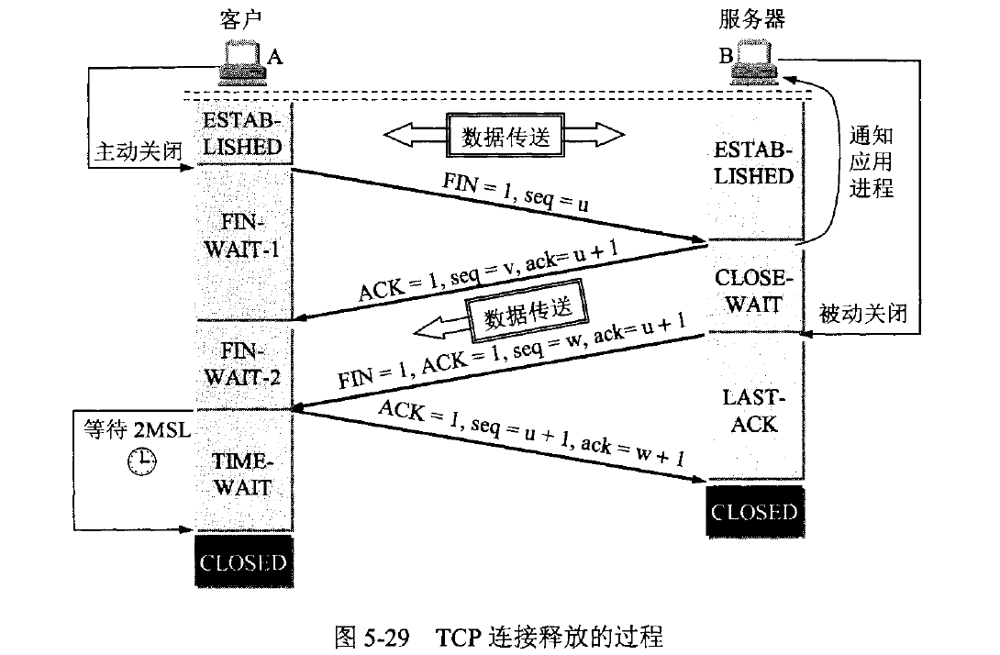
- u = 数据最后一个字节+1
- FIN：不携带数据，消耗序号
- MSL：最长报文段寿命（Maximum Segment Lifetime）
    - 保证A发送的最后一个ACK能到B：若没收到，A可以在期间重传，若过了这段时间还没有重传，则可以确认ACK被服务端收到了。防止B不能CLOSE
    - 经过2MSL，可以使本次连接持续时间内产生的所有报文在网络中消失，使下一个新的连接不会出现旧的连接请求报文段
- keepalive timer（保活计数器）：每收到一次数据重置，通常是2小时，若两小时没收到数据就每隔75秒发一次，10次无响应则关闭连接
### 3.8.3 **为什么A要发送ACK，为什么三次握手**？
- 首要原因是防止旧的重复连接初始化造成混乱
    >The principle reason for the three-way handshake is to prevent old duplicate connection initiations from causing confusion.

    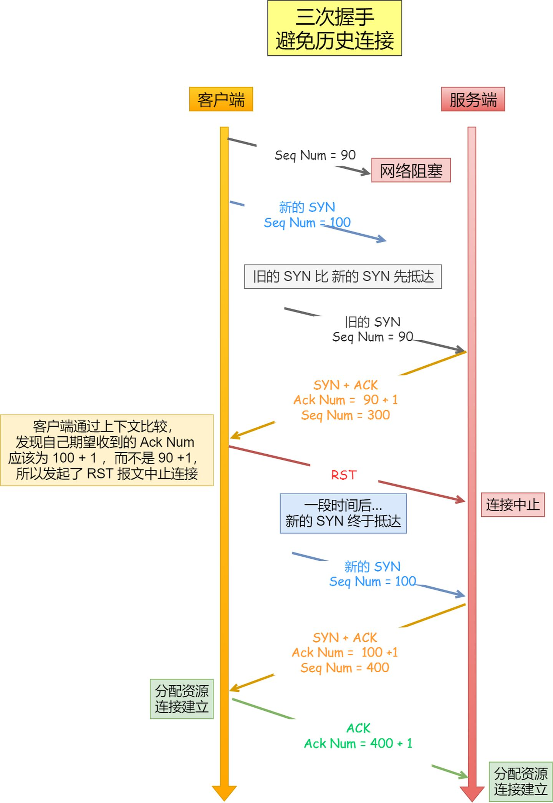
- 保证双方初始序列号都被同步
    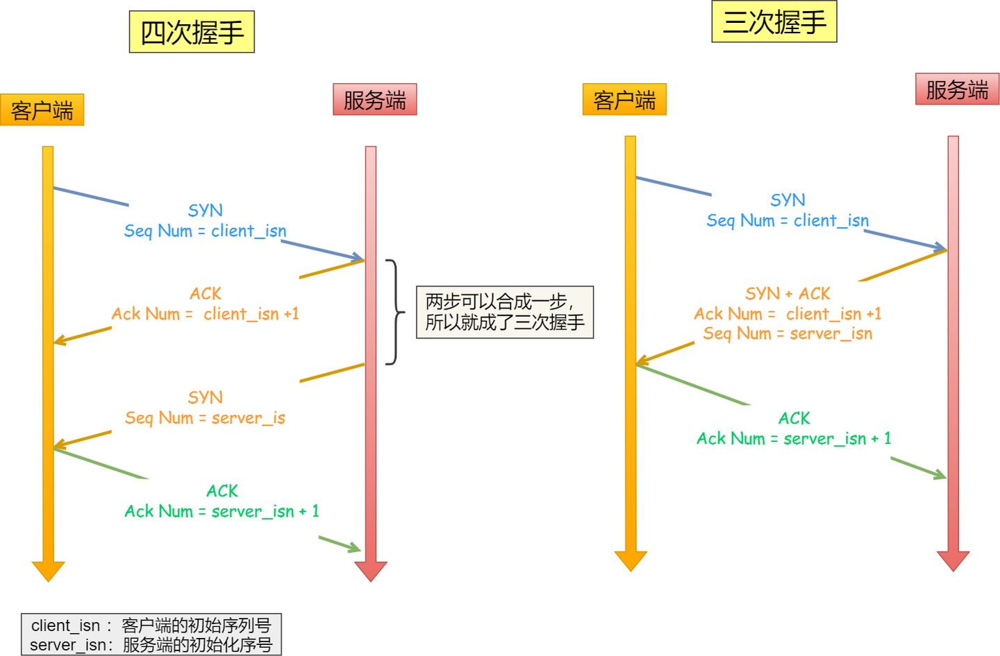
- 防止失效报文又传送到B，会浪费B的资源
    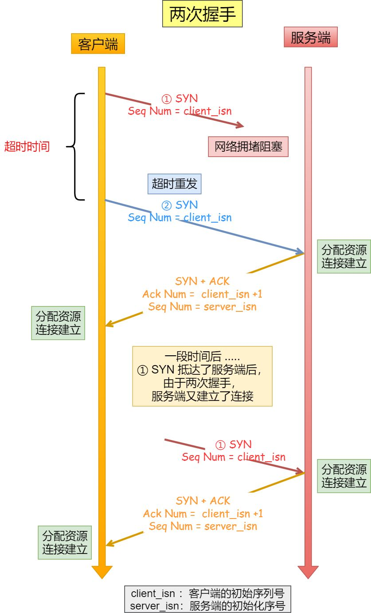
## 3.9 粘包
[什么是TCP粘包？怎么解决这个问题](https://www.cnblogs.com/cangqinglang/p/11503057.html)

[tcp为什么粘包](https://segmentfault.com/a/1190000039691657)

发送端为了将多个发往接收端的包，更加高效的的发给接收端，于是采用了优化算法（[Nagle算法](#35-流量控制抑制发送端速率)），将多次间隔较小、数据量较小的数据，合并成一个数据量大的数据块，然后进行封包。

解决方式：
1. 发送方
使用TCP_NODELAY选项关闭Nagle算法
2. 消息边界
    - 基于长度
        - 固定长度
        - 增加长度字段
    - 基于终结符
## 3.10 TIME_WAIT过多？
- 原因：
    - 大量短连接（业务处理+传输数据的时间远远小于 TIMEWAIT 超时的时间）
    - HTTP 请求中，如果 connection 头部取值被设置为 close 时，则由服务端发起主动关闭连接
- 解决方式
    - net.ipv4.tcp_tw_reuse = 1：允许将TIME-WAIT sockets重新用于新的TCP连接，默认为0，表示关闭
    - net.ipv4.tcp_tw_recycle =1：表示开启TCP连接中TIME-WAIT sockets的快速回收，默认为0，表示关闭
    - tcp_timestamps：TCP有一种行为，可以缓存每个连接最新的时间戳，后续请求中如果时间戳小于缓存的时间戳，即视为无效，相应的数据包会被丢弃
    - net.ipv4.ip_local_port_range = 1024 65000：表示用于向外连接的端口范围。缺省情况下很小：32768到61000，改为1024到65000。
    - net.ipv4.tcp_max_syn_backlog = 8192：表示SYN队列的长度，默认为1024，加大队列长度为8192，可以容纳更多等待连接的网络连接数。

# 4 DNS工作流程？
主机向本地域名服务器的查询一般是采用递归查询，而本地域名服务器向根域名的查询一般是采用迭代查询
1. 在浏览器中输入www.baidu.com域名，先查浏览器缓存，操作系统会先检查自己本地的hosts文件是否有这个域名的映射关系，如果有，就先调用这个IP地址映射，完成域名解析。
2. 如果hosts文件中没有，则去查找本地DNS服务器，如果查到，完成解析。
3. 如果没有，则本地服务器会向根域名服务器发起查询请求。根域名服务器会告诉本地域名服务器去查询哪个顶级域名服务器。
5. 本地域名服务器向顶级域名服务器发起查询请求，顶级域名服务器会告诉本地域名服务器去查找哪个权限域名服务器。
5. 本地域名服务器向权限域名服务器发起查询请求，权限域名服务器告诉本地域名服务器www.baidu.com所对应的IP地址。
6. 本地域名服务器告诉主机www.baidu.com所对应的IP地址。

# 4 IP地址和MAC地址
- 为什么要用IP地址?  
    - IP地址是和地域相关的，对于同一个子网上的设备，IP地址的前缀都是一样的，这样路由器通过IP地址的前缀就知道设备在在哪个子网上了。
    - 而只用MAC地址的话，**路由器则需要记住每个MAC地址在哪个子网**，这需要路由器有极大的存储空间，是无法实现的
- 为什么要用MAC地址？
    - MAC地址先出现
    - IP地址本质上是终点地址，它在跳过路由器（hop）的时候不会改变，而MAC地址则是**下一跳的地址**，每跳过一次路由器都会改变
# 6 HTTP
## 6.1 特点？
- 无连接
- 无状态：服务器不记录客户端请求
## 6.2 HTTP/1.1和2.0？
### 6.2.1 HTTP/1.1
- 长连接
- 流水线请求：客户端在收到HTTP的响应报文之前可以先发送新的请求报文
- HOST字段
- range字段：和206配合，支持请求资源的某一部分，用于下载
### 6.2.2 HTTP/2.0
待补充
## 6.3 报文？
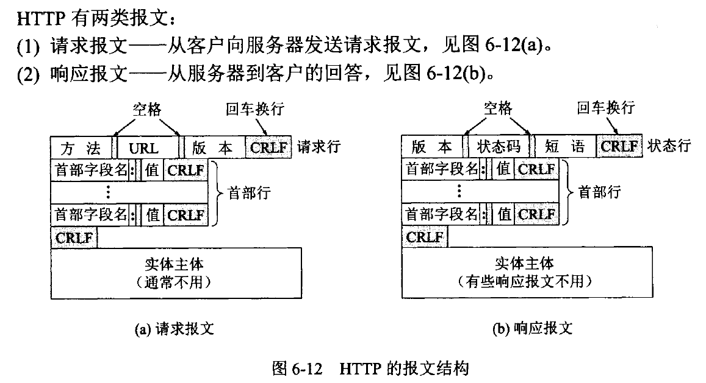
- 开始行：区分是请求还是响应
    - 请求行
    - 状态行
- 首部行：后面有一个空行
- 实体主体
### 6.3.1 方法
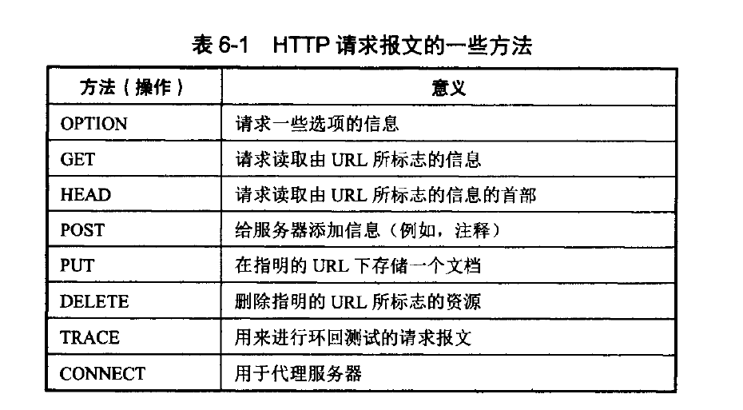
- POST和PUT
    - POST：非幂等，并不知道操作对象，有服务器产生一个URI。部分修改文档
    - PUT：幂等，必须指明操作对象，整个替换文档
- GET和POST
    - 参数在body还是URL
- 幂等的方法：GET/HEAD/DELETE/PUT
### 6.3.2 状态码
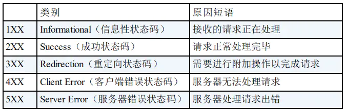
- 2xx
    - 200 OK：成功
    - 204 No Content：服务器成功处理了请求，但不需要返回任何实体内容
    - 206 Partial Content: 该状态码表示客户端进行了**范围请求**，而服务器成功执行了这部分的GET 请求。响应报文中包含由 Content-Range 指定范围的实体内。用于下载工具
- 3xx
    - 300 Multiple Choices：被请求的资源有一系列可供选择的回馈信息，每个都有自己特定的地址和浏览器驱动的商议信息。用户或浏览器能够自行选择一个首选的地址进行重定向
    - **301 Moved Permanently**：该状态码表示请求的资源已被分配了新的 URI，以后应使用资源现在所指的 URI
    - **302 Found**：临时重定向
    - 303 See Other：应该用GET访问另一个资源
- 4xx
    - 400 Bad Request：语义有误，当前请求无法被服务器理解。请求参数有误
    - 401 Unauthorized：需要验证或验证失败。这个状态码会与 WWW-Authenticate 首部一起发送，其中包含有如何进行验证的信息
    - 403 Forbidden：服务器已经理解请求，但是拒绝执行
    - 404 Not Found：请求的资源未被在服务器上发现
    - 405 Method Not Allowed：请求方法不能被用于请求相应的资源。该响应必须返回一个Allow 头信息用以表示出当前资源能够接受的请求方法的列表
- 5xx 
    - 500 Internal Server Error：可能是 Web应用存在的 bug 或某些临时的故障。
    - 501 Not Implemented：请求的方法不被服务器支持。GET 和 HEAD不会返回此错误
    - 502 Bad Gateway：作为网关或代理角色的服务器，从上游服务器（如tomcat、php-fpm）中接收到的响应是无效的
    - 503 Service Unavailable：服务器维护或超载
    - 504 Gateway Timeout：当服务器作为网关，不能及时得到响应时返回此错误代码
    - 505 HTTP Version Not Supported：服务器不支持请求中所使用的HTTP协议版本
## 6.4 session和cookie？
### 6.4.1 cookie
- 概念：  
    **服务器发送到用户浏览器**并保存在本地的一小块数据，它会在浏览器下次向同一服务器再发起请求时被携带并发送到服务器上。

    通常，它用于告知服务端两个请求是否来自同一浏览器，如保持用户的登录状态。Cookie 使基于无状态的 HTTP 协议记录稳定的状态信息成为了可能
- 功能：
    - 会话状态管理（如用户登录状态、购物车、游戏分数或其它需要记录的信息）
    - 个性化设置（如用户自定义设置、主题等）
    - 浏览器行为跟踪（如跟踪分析用户行为等）
- http：
    - 响应头中有set-cookie，请求头中有cookie
    - 如果未设置过期时间，浏览器关闭会失效
### 6.4.2 session
Session 代表着服务器和客户端一次会话的过程。Session 对象存储特定用户会话所需的属性及配置信息。

这样，当用户在应用程序的 Web 页之间跳转时，存储在 Session 对象中的变量将不会丢失，而是在整个用户会话中一直存在下去。当客户端关闭会话，或者 Session 超时失效时会话结束。

默认过期时间30min(tomcat)
### 6.4.4 跨域
- 同源策略：在Web浏览器中，允许某个网页**脚本**访问另一个网页的数据，前提是协议+域名+端口相同。防止恶意脚本通过该页面的文档对象模型访问另一网页上的敏感数据。
- 跨域：
    - CORS
    [跨域资源共享 CORS 详解](https://www.ruanyifeng.com/blog/2016/04/cors.html)
        - 简单请求：
            1. 浏览器给**首部加Origin字段**，用来说明本次请求来自哪个源（协议 + 域名 + 端口）
            2. 如果服务器拒绝，则响应的头部没有Access-Control-Allow-Origin
            3. 否则返回3个字段
        - 非简单请求预检，除了Origin字段，还包含：
            - Access-Control-Request-Method
            - Access-Control-Request-Headers
        - SpringMVC:@CrossOrigin
    - jsonp
        1. 本站脚本创建一个\<script\>元素，地址指向第三方的API网址，形如：
            ```html
            <script src="http://www.example.net/api?param1=1&param2=2"/>
            ```
        2. 第三方产生的响应为json数据的包装（故称之为jsonp，即json padding），形如：
            ```js
            callback({"name":"hax","gender":"Male"})
            ```
        3. 这样浏览器会调用callback函数，并传递解析后json对象作为参数
    - 代理：
        - nginx：将请求地址映射为api真正地址
## 6.5 HTTPS
[HTTPS](https://blog.csdn.net/zhangzhaoyuan30/article/details/92614106)
1. 协商决定加密组件
2. 服务端发送证书（数字证书认证机构用私钥进行签名，确保证书内容是可信的，进而确认服务端不是伪造的）
3. 客户端使用认证机构的公钥解密，**拿到服务端的公钥**。使用公钥加密，服务端用私钥解密。利用非对称加密发送对称加密的秘钥
4. 使用上步传输的秘钥对称加密
# 7 在浏览器中输入url地址?
zhihu.com/question/34873227

# 8 http2
[http2详解](https://juejin.cn/post/6844903667569541133)

[HTTP/2 简介](https://developers.google.com/web/fundamentals/performance/http2?hl=zh-cn)

HTTP/2 的主要目标是通过支持完整的**请求与响应复用**来减少延迟，通过有效**压缩 HTTP 标头字段**将协议开销降至最低，同时增加对**请求优先级和服务器推送**的支持。

HTTP/2 没有改动 HTTP 的应用语义。 **HTTP 方法、状态代码、URI 和标头字段**等核心概念一如往常。 不过，HTTP/2 修改了数据格式化（分帧）以及在客户端与服务器间传输的方式。这两点统帅全局，通过新的分帧层向我们的应用隐藏了所有复杂性。 因此，所有现有的应用都可以不必修改而在新协议下运行。
## 8.0 1.1存在有哪些问题：
- HTTP1半双工的，发送和接受只能同时做一个
- pipeline模式批量发送请求和响应请求和响应顺序必须完全相同。而且请求和响应都还是单向串行的。
- 造成队头阻塞有两个场景，第一个场景，服务器处理一个请求太慢或者第一个请求太大了
- 所以要想第二个请求不被第一个请求阻塞，最好的办法就是来两个TCP连接。传统上浏览器也是这么干的。但是TCP要握手，效率低，所以HTTP2把多个这种请求流塞到一个TCP连接里面，这样的连接复用方式就提高了效率，又节省了连接握手。
- 需要注意HTTP2没有完全解决队头阻塞问题，因为实际中TCP的连接buffer有限，一个响应又慢，又大的请求会把链接buffer完全占满，导致buffer阻塞，从而导致跟队头阻塞一样的效果。
## 8.1 数据流、消息、二进制分帧
HTTP/2 所有性能增强的核心在于新的二进制分帧层
- 数据流Stream: 已建立的连接内的双向字节流，可以承载一条或多条消息。
- 消息: 与逻辑请求或响应消息对应的完整的一系列帧。
- 帧: HTTP/2 通信的最小单位，每个帧都包含帧头，至少也会标识出当前帧所属的数据流。[帧定义](https://halfrost.com/http2-http-frames-definitions/)

这些概念的关系总结如下:

- 所有通信都在一个 TCP 连接上完成，此连接可以承载**任意数量的双向**数据流。
- 每个数据流Stream都有一个唯一的**标识符**和可选的**优先级**信息，用于承载双向消息。
- 每条消息都是一条逻辑 HTTP 消息（例如请求或响应），包含一个或多个帧。
- 帧是最小的通信单位，承载着特定类型的数据，例如 HTTP 标头、消息负载等等。 来自不同数据流的帧可以**交错发送**，然后再根据每个**帧头的数据流标识符重新组装**。有了新的分帧机制后，HTTP/2 不再依赖多个 TCP 连接去并行复用数据流；每个数据流都拆分成很多帧，而这些帧可以交错，还可以分别设定优先级。
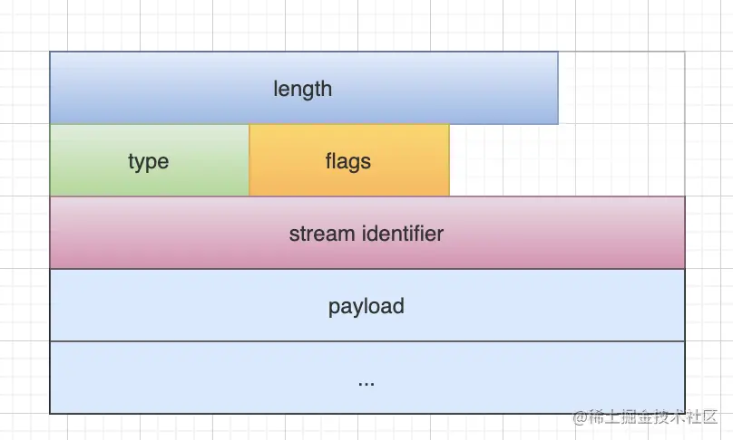

|帧类型|编码类型|用途|
|-|-|-|
|DATA|0x0|传递HTTP包体|
|HEADERS|0x1|传递HTTP包头|
|PRIORITY|0x2|指定Stream|流的优先级|
|RST_STREAM|0x3|终止Stream流|
|SETTINGS|0x4|修改连接或者Stream流的配置|
|PUSH_PROMISE|0x5|服务端推送资源时描述请求的帧|
|PING|0x6|心跳监测兼具测量RTT的功能|
|GOAWAY|0x7|优雅的终止错误或通知错误|
|WINDOW_UPDATE|0x8|实现流量控制|
|CONTINUATION|0x9|传递较大HTTP头部时的持续帧|

## 8.2 请求与响应多路复用
在 HTTP/1.x 中，如果客户端要想发起多个并行请求以提升性能，则必须使用多个 TCP 连接。 这是 HTTP/1.x 交付模型的直接结果，该模型可以保证每个连接每次只交付一个响应（响应排队）。 更糟糕的是，这种模型也会导致**队首阻塞**，从而造成底层 TCP 连接的效率低下。

HTTP/2 中新的二进制分帧层突破了这些限制，实现了完整的请求和响应复用: 客户端和服务器可以将 HTTP 消息分解为互不依赖的帧，然后交错发送，最后再在另一端把它们重新组装起来。
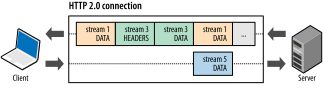
- 并行交错地发送多个请求，请求之间互不影响。
- 并行交错地发送多个响应，响应之间互不干扰。
- 使用一个连接并行发送多个请求和响应。

优点：
- 不必再为绕过 HTTP/1.x 限制而做很多工作（请参阅针对 HTTP/1.x 进行优化，例如级联文件、image sprites 和域名分片。
- 消除不必要的延迟和提高现有网络容量的利用率，从而减少页面加载时间。
- 每个来源一个连接：
    - 有了新的分帧机制后，HTTP/2 不再依赖多个 TCP 连接去并行复用数据流；每个数据流都拆分成很多帧，而这些**帧可以交错**，还可以分别设定优先级。
    - 大多数 HTTP 传输都是短暂且急促的，而 TCP 则针对长时间的批量数据传输进行了优化。 
## 3.3 标头压缩
HTTP 1.1请求的大小变得越来越大，有时甚至会大于TCP窗口的初始大小，因为它们需要等待带着ACK的响应回来以后才能继续被发送。HTTP/2 使用 HPACK 压缩格式压缩请求和响应标头元数据，这种格式采用两种简单但是强大的技术:
- 通过静态霍夫曼代码对传输的标头字段进行编码，从而减小了各个传输的大小。
- 客户端和服务器同时维护和更新一个包含**之前见过的标头字段的索引列表**（换句话说，它可以建立一个共享的压缩上下文），此列表随后会用作参考，对之前传输的值进行有效编码。

HPACK 压缩上下文包含一个静态表和一个动态表: 
- 静态表在规范中定义，并提供了一个包含所有连接都可能使用的常用 HTTP 标头字段（例如，有效标头名称）的列表；
- 动态表最初为空，将根据在特定连接内交换的值进行更新。之前未见过的值采用静态 Huffman 编码，并替换每一侧静态表或动态表中已存在值的索引，可以减小每个请求的大小。

例如：下图中的两个请求， 请求一发送了所有的头部字段，第二个请求则只需要发送差异数据，这样可以减少冗余数据，降低开销。


> 哈弗曼编码：霍夫曼编码使用变长编码表对源符号（如文件中的一个字母）进行编码，其中变长编码表是通过一种评估来源符号出现概率的方法得到的，出现概率高的字母使用较短的编码，反之出现概率低的则使用较长的编码，这便使编码之后的字符串的平均长度、期望值降低，从而达到无损压缩数据的目的。
## 8.4 数据流优先级
HTTP/2 标准允许每个数据流都有一个关联的权重和依赖关系:
- 可以向每个数据流分配一个介于 1 至 256 之间的整数。
- 每个数据流与其他数据流之间可以存在显式依赖关系。
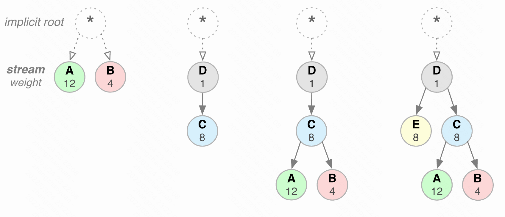

## 8.5 流控制

## 3.6 服务器推送


