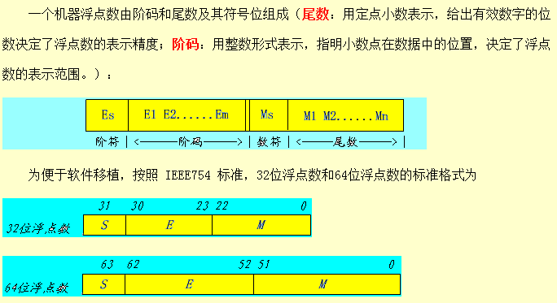

<!-- TOC -->

- [1浮点数是怎么存的？](#1浮点数是怎么存的)

<!-- /TOC -->
# 1浮点数是怎么存的？
[浮点数的二进制表示](https://www.ruanyifeng.com/blog/2010/06/ieee_floating-point_representation.html)  
二进制浮点数可以表示为：  
V = (-1)s &times; 1.M &times; 2E 

- 符号解释
    - S：符号位
    - M：尾数
    - E：阶码，用移码表示正负指数，便于比较大小
        - 指数真值e=E-127
- 阶码特殊情况和取值范围（[Java中float/double取值范围与精度](https://blog.csdn.net/a327369238/article/details/52354811)）
    - E全为0。这时，浮点数的指数e等于**1-127（或者1-1023）**，**有效数字M不再加上第一位的1**，而是还原为0.xxxxxx的小数。这样做是为了表示±0，以及接近于0的很小的数字。
        - 因此：最小正非零值为 2-149
            - E为全0，e=1-127=-126
            - M=2-23
    - E全为1。这时，**如果有效数字M全为0**，表示±无穷大（正负取决于符号位s）；**如果有效数字M不全为0**，表示这个数不是一个数(NaN)
        - 因此：最大正有限值为 (2-2-23)·2127。
            - 此时E=254，e=254-127=127
            - M为全1，所以M=2-2-23
- 精度  
[为什么 0.1 + 0.2 = 0.300000004](https://draveness.me/whys-the-design-floating-point-arithmetic/)  
因为单精度浮点数的小数位为 23，双精度的小数位为 52，同时都隐式地包含首位的 1，所以它们的精度在十进制中分别是 log10(224)≈7.22 和 log10(253)≈15.95 位