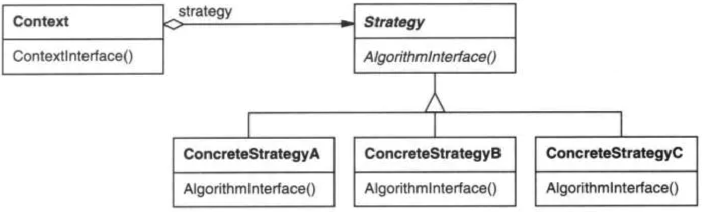

<!-- TOC -->

- [1 分类](#1-分类)
- [2 模板模式](#2-模板模式)
- [3 工厂模式](#3-工厂模式)
    - [3.1 简单工厂模式](#31-简单工厂模式)
    - [3.2 工厂方法模式](#32-工厂方法模式)
    - [3.3 抽象工厂模式](#33-抽象工厂模式)
- [4 策略模式](#4-策略模式)
- [5 建造者模式](#5-建造者模式)
- [5 建造者模式](#5-建造者模式)
- [6 命令模式](#6-命令模式)
- [7 观察者模式](#7-观察者模式)
- [7 装饰模式&代理模式](#7-装饰模式代理模式)
    - [7.1 JDK动态代理原理？](#71-jdk动态代理原理)
- [8 责任链模式](#8-责任链模式)
- [8 责任链模式](#8-责任链模式)
- [9 单例模式](#9-单例模式)
- [10 建造者模式](#10-建造者模式)

<!-- /TOC -->
# 1分类
1. 创建型模式：用于描述“怎样创建对象”，它的主要特点是“将对象的创建与使用分离”。  
单例模式、抽象工厂模式、建造者模式、工厂模式、原型模式。
2. 结构型模式：用于描述如何将类或对象按某种布局组成更大的结构。和类有关的结构型模式设计如何合理地使用**继承**机制；和对象有关的结构型模式涉及如何合理地使用对象**组合**机制。   
适配器模式、桥接模式、装饰模式、组合模式、外观模式、享元模式、代理模式。
3. 行为型模式：用于描述类或对象之间怎样**交互通信**，共同完成单个对象都无法单独完成的任务，以及怎样**分配职责**。   
模版方法模式、命令模式、迭代器模式、观察者模式、中介者模式、备忘录模式、解释器模式、状态模式、策略模式、职责链模式、访问者模式。
# 2 模板模式
- 概念  
一个抽象类公开定义了执行它的方法的方式/模板。它的子类可以按需要重写方法实现，但**调用将以抽象类中定义的方式进行**。这种类型的设计模式属于行为型模式
- 解决问题  
一些方法通用，却在每一个子类都重新写了这一方法
- 关键代码  
在抽象类实现，其他步骤在子类实现
- 注意事项
为防止恶意操作，一般模板方法都加上 final 关键词
- 应用
AQS
# 3 工厂模式
生成复杂对象
## 3.1 简单工厂模式
简单工厂模式(Simple Factory Pattern)：定义一个工厂类，它可以根据参数的不同返回不同类的实例，被创建的实例通常都具有共同的父类。且可以解决**创建对象过程复杂**的问题
- 代码
    ```java
    public class ShapeFactory {
        
    //使用 getShape 方法获取形状类型的对象
    public Shape getShape(String shapeType){
        if(shapeType == null){
            return null;
        }        
        if(shapeType.equalsIgnoreCase("CIRCLE")){
            return new Circle();
        } else if(shapeType.equalsIgnoreCase("RECTANGLE")){
            return new Rectangle();
        } else if(shapeType.equalsIgnoreCase("SQUARE")){
            return new Square();
        }
        return null;
    }
    }
    ```
- 优点
    - 客户端可以免除直接创建产品对象的职责，而仅仅“消费”产品，简单工厂模式实现了**对象创建和使用的分离**
    - 客户端无需关心对象如何创建
    - 工厂方法可以隐藏创建产品的细节，且不一定每次都会真正创建产品，完全可以返回缓存的产品
    - 总是引用接口而非实现类，能允许变换子类而不影响调用方，即尽可能面向抽象编程
- 缺点
    - **违背“开放 - 关闭原则”**，一旦添加新产品就不得不修改工厂类的逻辑，这样就会造成工厂逻辑过于复杂。
    - 简单工厂模式由于使用了**静态工厂方法**，造成工厂角色**无法形成基于继承**的等级结构。
- 举例
出价策略、DateFormat.getDateInstance(int style,Locale
locale)、KeyGenerator.getInstance("DESede")
## 3.2 工厂方法模式
一个具体工厂只能创建一种具体产品。在工厂方法模式中，核心的工厂类不再负责所有产品的创建，而是将具体**创建工作交给子类去做**。这个核心类仅仅负责给出具体工厂必须实现的接口，而不负责哪一个产品类被实例化这种细节，这使得**工厂方法模式可以允许系统在不修改工厂角色的情况下引进新产品**。
- 克服了简单工厂模式的缺点
    - 符合**开闭原则**
    - 符合单一职能原则
    - 可以形成基于继承的等级结构
## 3.3 抽象工厂模式
提供一个创建一系列相关或相互依赖对象的接口，而无须指定它们具体的类  
抽象工厂模式把产品子类进行分组，同组中的不同产品由同一个工厂子类的不同方法负责创建，从而减少了工厂子类的数量。
- 个人理解：一个工厂可以创建一组产品，而不是一个产品。系统中有多于一个的产品族，而每次只使用其中某一产品族。
- 举例：装修时有不同的装修风格，但是需要创建的家具种类是一样的。每个工厂创建不同风格的多个家具
# 4 策略模式

```java
public class Context {
   private Strategy strategy;
 
   public Context(Strategy strategy){
      this.strategy = strategy;
   }
 
   public int executeStrategy(int num1, int num2){
      return strategy.doOperation(num1, num2);
   }
}
```
# 5 建造者模式
# 6 命令模式
# 7 观察者模式
[观察者模式](https://www.runoob.com/design-pattern/observer-pattern.html) 
- 目的：当一个对象被修改时，则会自动通知依赖它的对象
- 关键代码：被观察者（主题）Subject持有观察者Observer引用的集合，通过notifyAllObservers()方法遍历Observer并调用Observer的方法。
# 7 装饰模式&代理模式
- 目的：
    - 装饰模式：动态的给对象增加一些职责，即增加其额外的功能，在**不想增加很多子类的情况下扩展类**
    - 代理模式：为其他对象提供一种代理以控制对这个对象的访问
- 关键代码：实现同样的接口，持有被装饰类引用
- 和装饰器模式的区别：
    - 装饰器模式为了增强功能，而代理模式是为了加以控制。
    - 代码区别：装饰器模式的被装饰类对象是通过参数传入的，代理模式的被代理类对象是自己new出来的。
## 7.1 JDK动态代理原理？
生成的代理类每个方法调用使用者实现的InvocationHandler.invoke方法，传入proxy对象(this)、method对象、和方法参数
```java
public final void addProduct(String var1) throws  {
    try {
        // super.h 对应的是父类的h变量，他就是Proxy.nexInstance方法中的InvocationHandler参数
        // 所以这里实际上就是使用了我们自己写的InvocationHandler实现类的invoke方法
        super.h.invoke(this, m3, new Object[]{var1});
    } catch (RuntimeException | Error var3) {
        throw var3;
    } catch (Throwable var4) {
        throw new UndeclaredThrowableException(var4);
    }
}
```
# 8 责任链模式
- 目的：
    - 让**多个对象都有可能接收请求**，将这些对象连接成一条链，并且沿着这条链传递请求，直到有对象处理它为止。
    - 避免请求发送者与接收者**耦合**在一起，客户只需要将请求发送到职责链上即可，无须关心请求的处理细节和请求的传递
- 关键代码：Handler 里面聚合它自己，在 HandlerRequest 方法里判断是否合适，如果没达到条件则向下传递，向谁传递之前 set 进去
- 举例：ZK请求处理（Leader、Follower、Observer的Processor还有差别）
# 9 单例模式
在序列化的时候Java仅仅是将枚举对象的name属性输出到结果中，反序列化的时候则是通过java.lang.Enum的valueOf方法来根据名字查找枚举对象。同时，编译器是不允许任何对这种序列化机制的定制的，因此禁用了writeObject、readObject、readObjectNoData、writeReplace和readResolve等方法。 我们看一下这个valueOf方法：
```java
public static <T extends Enum<T>> T valueOf(Class<T> enumType,String name) {  
    T result = enumType.enumConstantDirectory().get(name);  
    if (result != null)  
        return result;  
    if (name == null)  
        throw new NullPointerException("Name is null");  
    throw new IllegalArgumentException(  
        "No enum const " + enumType +"." + name);  
}  
```

普通的Java类的反序列化过程中，会通过反射调用类的默认构造函数来初始化对象。所以，即使单例中构造函数是私有的，也会被反射给破坏掉。由于反序列化后的对象是重新new出来的，所以这就破坏了单例。但可以通过readResolve解决

# 10 建造者模式
对象的属性与构建的分离