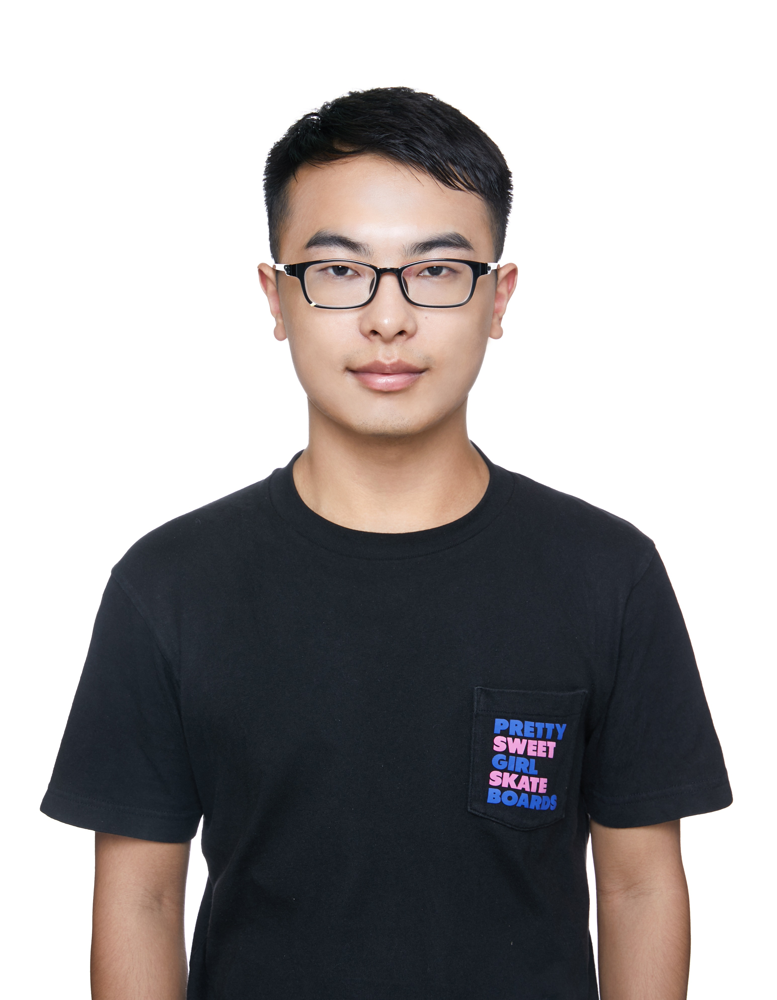

# 个人信息
- 张钊辕/男/1996.10
- 工作年限：5年
- 期望职位：后台开发
- 手机/微信：15600603715
- Email：zhangzhaoyuan123@foxmail.com

# 教育经历
- 2014.9-2018.7&emsp;&emsp;&emsp;&emsp;本科&emsp;&emsp;&emsp;&emsp;哈尔滨工业大学&emsp;&emsp;&emsp;&emsp;土木工程

# 技术栈
- Java基础扎实，了解 JVM
- 熟练使用 Spring/SpringBoot 等常用框架，了解其原理
- 熟悉 Mysql/redis
- 熟悉 Kafka，Zookeeper，Thrift等分布式中间件的使用，了解其原理
- 有 Spark/Flink 等大数据处理经验

# 工作经历
- 2021.6-至今&emsp;&emsp;&emsp;&emsp;&emsp;&emsp;&emsp;&emsp;&emsp;&emsp;&emsp;快手用户增长&emsp;&emsp;&emsp;&emsp;&emsp;&emsp;
- 2019.8-2021.6&emsp; &emsp;&emsp;&emsp;&emsp;&emsp;&emsp;&emsp;&emsp;&emsp;小米商业化&emsp;&emsp;&emsp;&emsp;&emsp;&emsp;&emsp;
- 2018.7-2019.8&emsp;&emsp;&emsp;&emsp;&emsp;&emsp;&emsp;&emsp;&emsp;&emsp;&emsp;数码视讯&emsp;&emsp;&emsp;&emsp;&emsp;&emsp;&emsp;

# 项目经历
## RTB
- **背景**：
搭建DSP全链路，包括接入层、引擎、监测上报、预算控制等服务，联合算法策略，充分利用快手站内行为和深度转化数据，实现在垂类业务场景下投放效果提升
- **主要工作**：
    1. 搭建接入层服务：解析不同ADX请求，流量筛选（50wqps，12c 12g  300台。单台1700 qps，平响30ms(一个线程30qps，60线程 1800qps。100%使用率2500 qps，80线程。)，p99 100ms）
    2. 利用快手通用策略 DSL 框架构建竞价引擎，为策略算法提供方便的迭代环境，维护服务稳定优化耗时（40w qps，300c机器，平响25ms，p99 80ms）
    3. 搭建监测上报服务利用flink搭建预算控制、预算平滑服务
## RTA
- **背景**：在实时广告投放时，基于快手内部数据包括活跃状态、点击频次、人群包等进行流量筛选，满足“拉新”、“拉活”等个性化增长需求（130+wqps，单机1000，avg18ms,p99 38ms）（活跃天数、活跃频次、沉默天数）
- **主要工作**：
    1. 搭建RTA API服务，对接各大媒体
    2. 设计规则表达式实现复杂的定向逻辑
    3. 利用规则优先级优化耗时
## Deeplink中台
- **背景**：使用延迟Deeplink技术，利用新回用户站外行为进行冷启承接，克服新回用户缺少站内行为的痛点
- **主要工作**：
    1. 搭建点击消费服务，解析、校验Deeplink并存储(消费点击5亿，存储点击数6亿
)
    2. 搭建匹配服务，接入多种数据源提升匹配率
    3. 记录各阶段匹配明细日志，快速定位匹配失败原因，推动上下游埋点，建立漏斗数据洞察
    4. 利用Deeplink携带投放信息（定向、创意id）优化新回推荐
## 小米 oCPX 广告引擎
- **背景**：
游戏广告需要提升广告收入，而广告主对付费回收考核严格，因此搭建整套oCPX系统，采用oCPX手段进行游戏广告效果的优化
- **主要工作**：
    1. 游戏 oCPX 广告引擎服务搭建
    2. 搭建广告实时归因服务：归因结果用于OLAP和cvr模型训练，形成投放效果优化闭环
    3. 使用 PID 控制算法稳定广告成本
